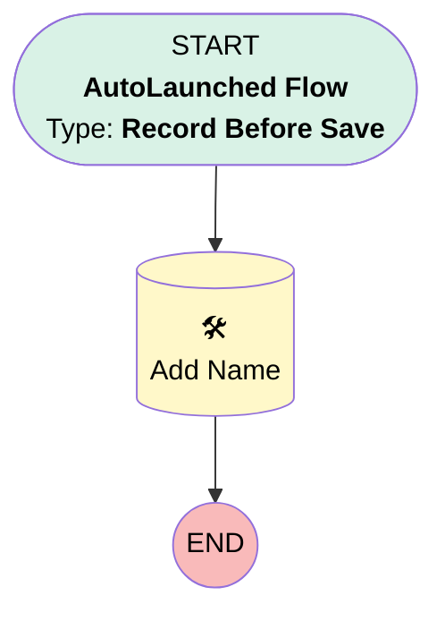

# [ATAK Project][Before-Save][Record-Triggered] Set Naming Convention

## Flow Diagram

## General Information

|<!-- -->|<!-- -->|
|:---|:---|
|Object|ATAK_Project__c|
|Process Type| Auto Launched Flow|
|Trigger Type| Record Before Save|
|Record Trigger Type| Create|
|Label|[ATAK Project][Before-Save][Record-Triggered] Set Naming Convention|
|Status|Active|
|Description|Flow that gives an automatic name to ATAK projects that do not receive their name from ATAK|
|Environments|Default|
|Interview Label|[ATAK Project][Before-Save][Record-Triggered] Set Naming Convention {!$Flow.CurrentDateTime}|
| Builder Type (PM)|LightningFlowBuilder|
| Canvas Mode (PM)|AUTO_LAYOUT_CANVAS|
| Origin Builder Type (PM)|LightningFlowBuilder|
|Connector|[Add_Name](#add_name)|
|Next Node|[Add_Name](#add_name)|

#### Filters (logic: **and**)

|Filter Id|Field|Operator|Value|
|:-- |:-- |:--:|:--: |
|1|Subproject_Name__c| Is Null|<!-- -->|

## Flow Nodes Details

### Add_Name

|<!-- -->|<!-- -->|
|:---|:---|
|Type|Record Update|
|Label|Add Name|
|Description|Adds the pre-formatted name to the deelproject if no name is entered (via ATAK)|
|Input Reference|$Record|

#### Input Assignments

|Field|Value|
|:-- |:--: |
|Subproject_Name__c|formATAKProjectName|

___

_Documentation generated from branch monitoring_krinkelsgreencare__upeodev_sandbox by [sfdx-hardis](https://sfdx-hardis.cloudity.com), featuring [salesforce-flow-visualiser](https://github.com/toddhalfpenny/salesforce-flow-visualiser)_