# [Account][Screen-Flow] Add Extra Work

## Flow Diagram

```mermaid
%% If you read this, your Markdown visualizer does not handle MermaidJS syntax.
%% - If you are in VsCode, install extension `Markdown Preview Mermaid Support` at https://marketplace.visualstudio.com/items?itemName=bierner.markdown-mermaid
%% - If you are using sfdx-hardis, try to define env variable `MERMAID_MODES=cli,docker` ,then run again the command to regenerate markdown with SVG images.
%% - If you are within mkdocs-material, define mermaid plugin in `mkdocs.yml` as described in https://squidfunk.github.io/mkdocs-material/extensions/mermaid/
%% - At last resort, you can copy-paste this MermaidJS code in https://mermaid.live/ to see the Flow Diagram

flowchart TB
START(["START<br/><b>Screen Flow</b>"]):::startClass
click START "#general-information" "3354280388"

ATAK_Project_Needed{"🔀 <em></em><br/>ATAK Project Needed"}:::decisions
click ATAK_Project_Needed "#atak_project_needed" "1021156515"

Pricing{"🔀 <em></em><br/>Pricing"}:::decisions
click Pricing "#pricing" "897206153"

Pricing_Request_Needed{"🔀 <em></em><br/>Pricing Request Needed"}:::decisions
click Pricing_Request_Needed "#pricing_request_needed" "1199015834"

Create_Empty_Quote_Product[("➕ <em></em><br/>Create Empty Quote Product")]:::recordCreates
click Create_Empty_Quote_Product "#create_empty_quote_product" "1069075530"

Create_Opportunity[("➕ <em></em><br/>Create Opportunity")]:::recordCreates
click Create_Opportunity "#create_opportunity" "1138322838"

Create_Opportunity_Pricing[("➕ <em></em><br/>Create Opportunity Pricing Request")]:::recordCreates
click Create_Opportunity_Pricing "#create_opportunity_pricing" "814792322"

Create_Quote[("➕ <em></em><br/>Create Quote")]:::recordCreates
click Create_Quote "#create_quote" "1558405254"

Create_Quote_Products[("➕ <em></em><br/>Create Quote Products")]:::recordCreates
click Create_Quote_Products "#create_quote_products" "2152442002"

Get_Account_Details[("🔍 <em></em><br/>Get Account Details")]:::recordLookups
click Get_Account_Details "#get_account_details" "2074714055"

Get_Price_Book[("🔍 <em></em><br/>Get Price Book")]:::recordLookups
click Get_Price_Book "#get_price_book" "2689493689"

Get_Price_Book_Entry[("🔍 <em></em><br/>Get Price Book Entry")]:::recordLookups
click Get_Price_Book_Entry "#get_price_book_entry" "3888028995"

Get_Product[("🔍 <em></em><br/>Get Product")]:::recordLookups
click Get_Product "#get_product" "1550029501"

Get_Record_Type[("🔍 <em></em><br/>Get Record Type")]:::recordLookups
click Get_Record_Type "#get_record_type" "2687488839"

Get_Service_Contracts[("🔍 <em></em><br/>Get Service Contracts")]:::recordLookups
click Get_Service_Contracts "#get_service_contracts" "2318674667"

Set_ATAK_Project[("🛠️ <em></em><br/>Set ATAK Project")]:::recordUpdates
click Set_ATAK_Project "#set_atak_project" "1225614173"

Set_ATAK_Project_Requested[("🛠️ <em></em><br/>Set ATAK Project Requested")]:::recordUpdates
click Set_ATAK_Project_Requested "#set_atak_project_requested" "2913384462"

Update_Opportunity_with_Sync_Quote[("🛠️ <em></em><br/>Update Opportunity with Sync Quote")]:::recordUpdates
click Update_Opportunity_with_Sync_Quote "#update_opportunity_with_sync_quote" "3282998306"

Add_Extra_Work(["💻 <em></em><br/>Add Extra Work"]):::screens
click Add_Extra_Work "#add_extra_work" "3509726432"

Atak_Project(["💻 <em></em><br/>Atak Project"]):::screens
click Atak_Project "#atak_project" "3246555534"

PricingScreen(["💻 <em></em><br/>Pricing"]):::screens
click PricingScreen "#pricingscreen" "411734992"

ATAK_Project_Needed --> |"Project Selected"| Set_ATAK_Project
ATAK_Project_Needed --> |"Project Requested"| Set_ATAK_Project_Requested
ATAK_Project_Needed --> |"Default Outcome"| Create_Quote
Pricing --> |"Defined"| Create_Quote_Products
Pricing --> |"Requested"| Create_Empty_Quote_Product
Pricing --> |"Default Outcome"| Update_Opportunity_with_Sync_Quote
Pricing_Request_Needed --> |"Yes"| Create_Opportunity_Pricing
Pricing_Request_Needed --> |"No"| Create_Opportunity
Pricing_Request_Needed --> |"Default Outcome"| ATAK_Project_Needed
Create_Empty_Quote_Product --> Update_Opportunity_with_Sync_Quote
Create_Opportunity --> ATAK_Project_Needed
Create_Opportunity_Pricing --> ATAK_Project_Needed
Create_Quote --> Pricing
Create_Quote_Products --> Update_Opportunity_with_Sync_Quote
Get_Account_Details --> Get_Service_Contracts
Get_Price_Book --> Get_Price_Book_Entry
Get_Price_Book_Entry --> PricingScreen
Get_Product --> Get_Price_Book
Get_Record_Type --> Get_Account_Details
Get_Service_Contracts --> Add_Extra_Work
Set_ATAK_Project --> Create_Quote
Set_ATAK_Project_Requested --> Create_Quote
Update_Opportunity_with_Sync_Quote --> END_Update_Opportunity_with_Sync_Quote
Add_Extra_Work --> Get_Product
Atak_Project --> Pricing_Request_Needed
PricingScreen --> Atak_Project
START -->  Get_Record_Type
END_Update_Opportunity_with_Sync_Quote(( END )):::endClass


classDef actionCalls fill:#D4E4FC,color:black,max-height:100px
classDef assignments fill:#FBEED7,color:black,max-height:100px
classDef collectionProcessors fill:#F0E3FA,color:black,max-height:100px
classDef customErrors fill:#FFE9E9,color:black,max-height:100px
classDef decisions fill:#FDEAF6,color:black,max-height:100px
classDef loops fill:#FDEAF6,color:black,max-height:100px
classDef recordCreates fill:#FFF8C9,color:black,max-height:100px
classDef recordDeletes fill:#FFF8C9,color:black,max-height:100px
classDef recordLookups fill:#EDEAFF,color:black,max-height:100px
classDef recordUpdates fill:#FFF8C9,color:black,max-height:100px
classDef screens fill:#DFF6FF,color:black,max-height:100px
classDef subflows fill:#D4E4FC,color:black,max-height:100px
classDef startClass fill:#D9F2E6,color:black,max-height:100px
classDef endClass fill:#F9BABA,color:black,max-height:100px


```

## General Information

|<!-- -->|<!-- -->|
|:---|:---|
|Process Type| Flow|
|Label|[Account][Screen-Flow] Add Extra Work|
|Status|Active|
|Environments|Default|
|Interview Label|[Account][Screen-Flow] Add Extra Work {!$Flow.CurrentDateTime}|
| Builder Type (PM)|LightningFlowBuilder|
| Canvas Mode (PM)|AUTO_LAYOUT_CANVAS|
| Origin Builder Type (PM)|LightningFlowBuilder|
|Connector|[Get_Record_Type](#get_record_type)|
|Next Node|[Get_Record_Type](#get_record_type)|

## Variables

|Name|Data Type|Is Collection|Is Input|Is Output|Object Type|
|:-- |:--:|:--:|:--:|:--:|:--: |
|CreatedOpportunityId|String|⬜|✅|⬜|<!-- -->|
|CreatedQuoteId|String|⬜|✅|⬜|<!-- -->|
|recordId|String|⬜|✅|⬜|<!-- -->|

## Formulas

|Name|Data Type|Expression|
|:-- |:--:|:--  |
|OpportunityNameCalculation|String|{!Get_Account_Details.Name} &' - Extra Work'&' - '&TEXT({!Expected_Work_Date})|
|PricingRequestStatus|String|IF({!Request_Pricing_to_Business_Support_Choice}='Yes', 'Requested', '')|

## Flow Nodes Details

### ATAK_Project_Needed

|<!-- -->|<!-- -->|
|:---|:---|
|Type|Decision|
|Label|ATAK Project Needed|
|Default Connector|[Create_Quote](#create_quote)|
|Default Connector Label|Default Outcome|

#### Rule Project_Selected (Project Selected)

|<!-- -->|<!-- -->|
|:---|:---|
|Connector|[Set_ATAK_Project](#set_atak_project)|
|Condition Logic|and|

|Condition Id|Left Value Reference|Operator|Right Value|
|:-- |:-- |:--:|:--: |
|1|Existing_ATAK_Project.recordId| Is Null|⬜|

#### Rule Project_Requested (Project Requested)

|<!-- -->|<!-- -->|
|:---|:---|
|Connector|[Set_ATAK_Project_Requested](#set_atak_project_requested)|
|Condition Logic|and|

|Condition Id|Left Value Reference|Operator|Right Value|
|:-- |:-- |:--:|:--: |
|1|Existing_ATAK_Project.recordId| Is Null|✅|

### Pricing

|<!-- -->|<!-- -->|
|:---|:---|
|Type|Decision|
|Label|[Pricing](#pricing)|
|Default Connector|[Update_Opportunity_with_Sync_Quote](#update_opportunity_with_sync_quote)|
|Default Connector Label|Default Outcome|

#### Rule Defined (Defined)

|<!-- -->|<!-- -->|
|:---|:---|
|Connector|[Create_Quote_Products](#create_quote_products)|
|Condition Logic|and|

|Condition Id|Left Value Reference|Operator|Right Value|
|:-- |:-- |:--:|:--: |
|1|Request_Pricing_to_Business_Support_Choice| Equal To|No|

#### Rule Requested (Requested)

|<!-- -->|<!-- -->|
|:---|:---|
|Connector|[Create_Empty_Quote_Product](#create_empty_quote_product)|
|Condition Logic|and|

|Condition Id|Left Value Reference|Operator|Right Value|
|:-- |:-- |:--:|:--: |
|1|Request_Pricing_to_Business_Support_Choice| Equal To|Yes|

### Pricing_Request_Needed

|<!-- -->|<!-- -->|
|:---|:---|
|Type|Decision|
|Label|Pricing Request Needed|
|Default Connector|[ATAK_Project_Needed](#atak_project_needed)|
|Default Connector Label|Default Outcome|

#### Rule yesPricingNeeded (Yes)

|<!-- -->|<!-- -->|
|:---|:---|
|Connector|[Create_Opportunity_Pricing](#create_opportunity_pricing)|
|Condition Logic|and|

|Condition Id|Left Value Reference|Operator|Right Value|
|:-- |:-- |:--:|:--: |
|1|Request_Pricing_to_Business_Support_Choice| Equal To|Yes|

#### Rule NoPricingNotNeeded (No)

|<!-- -->|<!-- -->|
|:---|:---|
|Connector|[Create_Opportunity](#create_opportunity)|
|Condition Logic|and|

|Condition Id|Left Value Reference|Operator|Right Value|
|:-- |:-- |:--:|:--: |
|1|Request_Pricing_to_Business_Support_Choice| Equal To|No|

### Create_Empty_Quote_Product

|<!-- -->|<!-- -->|
|:---|:---|
|Type|Record Create|
|Object|QuoteLineItem|
|Label|Create Empty Quote Product|
|Store Output Automatically|✅|
|Connector|[Update_Opportunity_with_Sync_Quote](#update_opportunity_with_sync_quote)|

#### Input Assignments

|Field|Value|
|:-- |:--: |
|PricebookEntryId|Get_Price_Book_Entry.Id|
|Product2Id|Get_Product.Id|
|Quantity|1|
|QuoteId|CreatedQuoteId|
|UnitPrice|numberValue: 0 |

### Create_Opportunity

|<!-- -->|<!-- -->|
|:---|:---|
|Type|Record Create|
|Object|Opportunity|
|Label|Create Opportunity|
|Assign Record Id To Reference|CreatedOpportunityId|
|Connector|[ATAK_Project_Needed](#atak_project_needed)|

#### Input Assignments

|Field|Value|
|:-- |:--: |
|AccountId|recordId|
|Amount__c|Unit_Price|
|CloseDate|Expected_Work_Date|
|Description|Please_provide_a_description_of_the_extra_work|
|Name|OpportunityNameCalculation|
|Pricebook2Id|Get_Price_Book.Id|
|RecordTypeId|Get_Record_Type.Id|
|Service_Contract__c|ServiceContractTable.firstSelectedRow.Id|
|StageName|[Pricing](#pricing)|
|Type|Extra Work|

### Create_Opportunity_Pricing

|<!-- -->|<!-- -->|
|:---|:---|
|Type|Record Create|
|Object|Opportunity|
|Label|Create Opportunity Pricing Request|
|Assign Record Id To Reference|CreatedOpportunityId|
|Connector|[ATAK_Project_Needed](#atak_project_needed)|

#### Input Assignments

|Field|Value|
|:-- |:--: |
|AccountId|recordId|
|Amount__c|Unit_Price|
|CloseDate|Expected_Work_Date|
|Description|Please_provide_a_description_of_the_extra_work|
|Name|OpportunityNameCalculation|
|Price_Request_Demand_Comments__c|Pricing_Request_Comment|
|Price_Request_Priority__c|Pricing_Request_Priority|
|Price_Request_Status__c|Requested|
|Pricebook2Id|Get_Price_Book.Id|
|Pricing_Request_Needed__c|✅|
|RecordTypeId|Get_Record_Type.Id|
|Service_Contract__c|ServiceContractTable.firstSelectedRow.Id|
|StageName|[Pricing](#pricing)|
|Type|Extra Work|

### Create_Quote

|<!-- -->|<!-- -->|
|:---|:---|
|Type|Record Create|
|Object|Quote|
|Label|Create Quote|
|Assign Record Id To Reference|CreatedQuoteId|
|Connector|[Pricing](#pricing)|

#### Input Assignments

|Field|Value|
|:-- |:--: |
|Amount__c|Unit_Price|
|Name|OpportunityNameCalculation|
|OpportunityId|CreatedOpportunityId|
|Pricebook2Id|Get_Price_Book.Id|
|QuoteAccountId|recordId|

### Create_Quote_Products

|<!-- -->|<!-- -->|
|:---|:---|
|Type|Record Create|
|Object|QuoteLineItem|
|Label|Create Quote Products|
|Store Output Automatically|✅|
|Connector|[Update_Opportunity_with_Sync_Quote](#update_opportunity_with_sync_quote)|

#### Input Assignments

|Field|Value|
|:-- |:--: |
|Description|Any_additional_comments|
|PricebookEntryId|Get_Price_Book_Entry.Id|
|Product2Id|Get_Product.Id|
|Quantity|1|
|QuoteId|CreatedQuoteId|
|UnitPrice|numberValue: 0 |

### Get_Account_Details

|<!-- -->|<!-- -->|
|:---|:---|
|Type|Record Lookup|
|Object|Account|
|Label|Get Account Details|
|Assign Null Values If No Records Found|⬜|
|Get First Record Only|✅|
|Store Output Automatically|✅|
|Connector|[Get_Service_Contracts](#get_service_contracts)|

#### Filters (logic: **and**)

|Filter Id|Field|Operator|Value|
|:-- |:-- |:--:|:--: |
|1|Id| Equal To|recordId|

### Get_Price_Book

|<!-- -->|<!-- -->|
|:---|:---|
|Type|Record Lookup|
|Object|Pricebook2|
|Label|Get Price Book|
|Assign Null Values If No Records Found|⬜|
|Get First Record Only|✅|
|Store Output Automatically|✅|
|Connector|[Get_Price_Book_Entry](#get_price_book_entry)|

#### Filters (logic: **and**)

|Filter Id|Field|Operator|Value|
|:-- |:-- |:--:|:--: |
|1|Name| Equal To|Extra Work|

### Get_Price_Book_Entry

|<!-- -->|<!-- -->|
|:---|:---|
|Type|Record Lookup|
|Object|PricebookEntry|
|Label|Get Price Book Entry|
|Assign Null Values If No Records Found|⬜|
|Get First Record Only|✅|
|Store Output Automatically|✅|
|Connector|[PricingScreen](#pricingscreen)|

#### Filters (logic: **and**)

|Filter Id|Field|Operator|Value|
|:-- |:-- |:--:|:--: |
|1|Product2Id| Equal To|Get_Product.Id|
|2|Pricebook2Id| Equal To|Get_Price_Book.Id|

### Get_Product

|<!-- -->|<!-- -->|
|:---|:---|
|Type|Record Lookup|
|Object|Product2|
|Label|Get Product|
|Assign Null Values If No Records Found|⬜|
|Get First Record Only|✅|
|Store Output Automatically|✅|
|Connector|[Get_Price_Book](#get_price_book)|

#### Filters (logic: **and**)

|Filter Id|Field|Operator|Value|
|:-- |:-- |:--:|:--: |
|1|ProductCode| Equal To|XTRA|

### Get_Record_Type

|<!-- -->|<!-- -->|
|:---|:---|
|Type|Record Lookup|
|Object|RecordType|
|Label|Get Record Type|
|Assign Null Values If No Records Found|⬜|
|Get First Record Only|✅|
|Store Output Automatically|✅|
|Connector|[Get_Account_Details](#get_account_details)|

#### Filters (logic: **and**)

|Filter Id|Field|Operator|Value|
|:-- |:-- |:--:|:--: |
|1|DeveloperName| Equal To|Quick_Quote|

### Get_Service_Contracts

|<!-- -->|<!-- -->|
|:---|:---|
|Type|Record Lookup|
|Object|ServiceContract|
|Label|Get Service Contracts|
|Assign Null Values If No Records Found|⬜|
|Get First Record Only|⬜|
|Store Output Automatically|✅|
|Connector|[Add_Extra_Work](#add_extra_work)|

#### Filters (logic: **and**)

|Filter Id|Field|Operator|Value|
|:-- |:-- |:--:|:--: |
|1|AccountId| Equal To|Get_Account_Details.ParentId|

### Set_ATAK_Project

|<!-- -->|<!-- -->|
|:---|:---|
|Type|Record Update|
|Object|Opportunity|
|Label|Set ATAK Project|
|Connector|[Create_Quote](#create_quote)|

#### Filters (logic: **and**)

|Filter Id|Field|Operator|Value|
|:-- |:-- |:--:|:--: |
|1|Id| Equal To|CreatedOpportunityId|

#### Input Assignments

|Field|Value|
|:-- |:--: |
|ATAK_Projectx__c|Existing_ATAK_Project.recordId|

### Set_ATAK_Project_Requested

|<!-- -->|<!-- -->|
|:---|:---|
|Type|Record Update|
|Object|Opportunity|
|Label|Set ATAK Project Requested|
|Connector|[Create_Quote](#create_quote)|

#### Filters (logic: **and**)

|Filter Id|Field|Operator|Value|
|:-- |:-- |:--:|:--: |
|1|Id| Equal To|CreatedOpportunityId|

#### Input Assignments

|Field|Value|
|:-- |:--: |
|ATAK_Project_Needed__c|✅|
|ATAK_Project_Request_Comment__c|Any_specific_comments_for_this_project_request|
|ATAK_Project_Request_Priority__c|Priority|
|ATAK_Project_Request_Status__c|Requested|
|Service_Package__c|Service_Package_Type|

### Update_Opportunity_with_Sync_Quote

|<!-- -->|<!-- -->|
|:---|:---|
|Type|Record Update|
|Object|Opportunity|
|Label|Update Opportunity with Sync Quote|

#### Filters (logic: **and**)

|Filter Id|Field|Operator|Value|
|:-- |:-- |:--:|:--: |
|1|Id| Equal To|CreatedOpportunityId|

#### Input Assignments

|Field|Value|
|:-- |:--: |
|SyncedQuoteId|CreatedQuoteId|

### Add_Extra_Work

|<!-- -->|<!-- -->|
|:---|:---|
|Type|Screen|
|Label|Add Extra Work|
|Allow Back|⬜|
|Allow Finish|✅|
|Allow Pause|⬜|
|Show Footer|✅|
|Show Header|⬜|
|Connector|[Get_Product](#get_product)|

#### ExtraWorkTitle

|<!-- -->|<!-- -->|
|:---|:---|
|Field Text|
<strong style="font-size: 18px;">Add Extra Work</strong>

 

Create a fast-track Opportunity and Quote for your smaller extra work.
|
|Field Type| Display Text|

#### Expected_Work_Date

|<!-- -->|<!-- -->|
|:---|:---|
|Data Type|Date|
|Default Value|$Flow.CurrentDate|
|Field Text|Expected Work Date|
|Field Type| Input Field|
|Inputs On Next Nav To Assoc Scrn| Use Stored Values|
|Is Required|✅|
|Parent Field|[Add_Extra_Work_Section1_Column1](#add_extra_work_section1_column1)|

#### Add_Extra_Work_Section1_Column1

|<!-- -->|<!-- -->|
|:---|:---|
|Field Type| Region|
|Is Required|⬜|
|Parent Field|[Add_Extra_Work_Section1](#add_extra_work_section1)|
|Width (input)|6|

#### Please_provide_a_description_of_the_extra_work

|<!-- -->|<!-- -->|
|:---|:---|
|Field Text|Please provide a description of the extra work|
|Field Type| Large Text Area|
|Inputs On Next Nav To Assoc Scrn| Use Stored Values|
|Is Required|✅|
|Parent Field|[Add_Extra_Work_Section1_Column2](#add_extra_work_section1_column2)|

#### Add_Extra_Work_Section1_Column2

|<!-- -->|<!-- -->|
|:---|:---|
|Field Type| Region|
|Is Required|⬜|
|Parent Field|[Add_Extra_Work_Section1](#add_extra_work_section1)|
|Width (input)|6|

#### Add_Extra_Work_Section1

|<!-- -->|<!-- -->|
|:---|:---|
|Field Type| Region Container|
|Is Required|⬜|
|Region Container Type| Section Without Header|

#### Link_this_Extra_Work_to_a_Service_Contract

|<!-- -->|<!-- -->|
|:---|:---|
|Data Type|Boolean|
|Field Text|Link this Extra Work to a Service Contract|
|Field Type| Input Field|
|Inputs On Next Nav To Assoc Scrn| Use Stored Values|
|Is Required|✅|

#### ServiceContractTable

|<!-- -->|<!-- -->|
|:---|:---|
|Data Type Mappings|typeName: T typeValue: ServiceContract |
|Extension Name|flowruntime:datatable|
|Field Type| Component Instance|
|Inputs On Next Nav To Assoc Scrn| Use Stored Values|
|Is Required|✅|
|Store Output Automatically|✅|
|Visibility Rule|conditionLogic: and conditions: &nbsp;&nbsp;leftValueReference: Link_this_Extra_Work_to_a_Service_Contract &nbsp;&nbsp;operator: EqualTo &nbsp;&nbsp;rightValue: &nbsp;&nbsp;&nbsp;&nbsp;booleanValue: true |
|Label (input)|Data Table|
|Selection Mode (input)|SINGLE_SELECT|
|Min Row Selection (input)|1|
|Table Data (input)|[Get_Service_Contracts](#get_service_contracts)|
|Columns (input)|[{"apiName":"Name","guid":"column-5617","editable":false,"hasCustomHeaderLabel":false,"customHeaderLabel":"","wrapText":true,"order":0,"label":"Contract Name","type":"text"},{"apiName":"Type__c","guid":"column-996f","editable":false,"hasCustomHeaderLabel":false,"customHeaderLabel":"","wrapText":true,"order":1,"label":"Type","type":"text"},{"apiName":"Contract_type__c","guid":"column-efcd","editable":false,"hasCustomHeaderLabel":false,"customHeaderLabel":"","wrapText":true,"order":2,"label":"Contract type","type":"text"},{"apiName":"Status","guid":"column-d462","editable":false,"hasCustomHeaderLabel":false,"customHeaderLabel":"","wrapText":true,"order":3,"label":"Status","type":"text"},{"apiName":"EndDate","guid":"column-e2a7","editable":false,"hasCustomHeaderLabel":false,"customHeaderLabel":"","wrapText":true,"order":4,"label":"End Date","type":"date-local"},{"apiName":"","guid":"column-e54f","editable":false,"hasCustomHeaderLabel":false,"customHeaderLabel":"","wrapText":true,"order":4}]|
|Max Row Selection (input)|1|

### Atak_Project

|<!-- -->|<!-- -->|
|:---|:---|
|Type|Screen|
|Label|Atak Project|
|Allow Back|⬜|
|Allow Finish|✅|
|Allow Pause|⬜|
|Next Or Finish Button Label|Create Extra Work|
|Show Footer|✅|
|Show Header|⬜|
|Connector|[Pricing_Request_Needed](#pricing_request_needed)|

#### Copy_1_of_ExtraWorkTitleScreen2

|<!-- -->|<!-- -->|
|:---|:---|
|Field Text|
<strong style="font-size: 18px;">Add Extra Work</strong>

 

Select an existing ATAK Project or request a new ATAK Project creation
|
|Field Type| Display Text|

#### Existing_ATAK_Project

|<!-- -->|<!-- -->|
|:---|:---|
|Extension Name|flowruntime:lookup|
|Field Type| Component Instance|
|Inputs On Next Nav To Assoc Scrn| Use Stored Values|
|Is Required|✅|
|Store Output Automatically|✅|
|Parent Field|[Atak_Project_Section1_Column1](#atak_project_section1_column1)|
|Field Api Name (input)|ATAK_Projectx__c|
|Label (input)|Existing ATAK Project|
|Object Api Name (input)|Opportunity|
|Disabled (input)|New_ATAK_Toggle.value|

#### New_ATAK_Toggle

|<!-- -->|<!-- -->|
|:---|:---|
|Extension Name|flowruntime:toggle|
|Field Type| Component Instance|
|Inputs On Next Nav To Assoc Scrn| Use Stored Values|
|Is Required|✅|
|Store Output Automatically|✅|
|Parent Field|[Atak_Project_Section1_Column1](#atak_project_section1_column1)|
|Label (input)|Request New Project|
|Message Toggle Active (input)|Yes|
|Message Toggle Inactive (input)|No|

#### Atak_Project_Section1_Column1

|<!-- -->|<!-- -->|
|:---|:---|
|Field Type| Region|
|Is Required|⬜|
|Parent Field|[Atak_Project_Section1](#atak_project_section1)|
|Width (input)|6|

#### Atak_Project_Section1_Column2

|<!-- -->|<!-- -->|
|:---|:---|
|Field Type| Region|
|Is Required|⬜|
|Parent Field|[Atak_Project_Section1](#atak_project_section1)|
|Width (input)|6|

#### Atak_Project_Section1

|<!-- -->|<!-- -->|
|:---|:---|
|Field Type| Region Container|
|Is Required|⬜|
|Region Container Type| Section Without Header|

#### Priority

|<!-- -->|<!-- -->|
|:---|:---|
|Data Type|String|
|Choice References|- Low - Medium - High |
|Field Text|Priority|
|Field Type| Dropdown Box|
|Inputs On Next Nav To Assoc Scrn| Use Stored Values|
|Is Required|⬜|
|Parent Field|[Atak_Project_Section2_Column1](#atak_project_section2_column1)|

#### Any_specific_comments_for_this_project_request

|<!-- -->|<!-- -->|
|:---|:---|
|Data Type|String|
|Field Text|Any specific comments for this project request?|
|Field Type| Input Field|
|Inputs On Next Nav To Assoc Scrn| Use Stored Values|
|Is Required|⬜|
|Parent Field|[Atak_Project_Section2_Column1](#atak_project_section2_column1)|

#### Atak_Project_Section2_Column1

|<!-- -->|<!-- -->|
|:---|:---|
|Field Type| Region|
|Is Required|⬜|
|Parent Field|[Atak_Project_Section2](#atak_project_section2)|
|Width (input)|6|

#### Service_Package_Type

|<!-- -->|<!-- -->|
|:---|:---|
|Data Type|String|
|Choice References|servicePackageType|
|Field Text|Service Package Type|
|Field Type| Dropdown Box|
|Help Text|
Used to generate a suggested project name
|
|Inputs On Next Nav To Assoc Scrn| Use Stored Values|
|Is Required|⬜|
|Parent Field|[Atak_Project_Section2_Column2](#atak_project_section2_column2)|

#### Atak_Project_Section2_Column2

|<!-- -->|<!-- -->|
|:---|:---|
|Field Type| Region|
|Is Required|⬜|
|Parent Field|[Atak_Project_Section2](#atak_project_section2)|
|Width (input)|6|

#### Atak_Project_Section2

|<!-- -->|<!-- -->|
|:---|:---|
|Field Type| Region Container|
|Is Required|⬜|
|Region Container Type| Section Without Header|
|Visibility Rule|conditionLogic: and conditions: &nbsp;&nbsp;leftValueReference: New_ATAK_Toggle.value &nbsp;&nbsp;operator: EqualTo &nbsp;&nbsp;rightValue: &nbsp;&nbsp;&nbsp;&nbsp;booleanValue: true |

### PricingScreen

|<!-- -->|<!-- -->|
|:---|:---|
|Type|Screen|
|Label|[Pricing](#pricing)|
|Allow Back|⬜|
|Allow Finish|✅|
|Allow Pause|⬜|
|Next Or Finish Button Label|Next|
|Show Footer|✅|
|Show Header|⬜|
|Connector|[Atak_Project](#atak_project)|

#### ExtraWorkTitleScreen2

|<!-- -->|<!-- -->|
|:---|:---|
|Field Text|
<strong style="font-size: 18px;">Add Extra Work</strong>

 

Define the pricing or pricing request need.
|
|Field Type| Display Text|

#### Request_Pricing_to_Business_Support_Choice

|<!-- -->|<!-- -->|
|:---|:---|
|Data Type|String|
|Choice References|- 'Yes' - 'No' |
|Field Text|Request Pricing to Business Support|
|Field Type| Dropdown Box|
|Inputs On Next Nav To Assoc Scrn| Use Stored Values|
|Is Required|✅|
|Parent Field|[PricingScreen_Section1_Column1](#pricingscreen_section1_column1)|

#### PricingScreen_Section1_Column1

|<!-- -->|<!-- -->|
|:---|:---|
|Field Type| Region|
|Is Required|⬜|
|Parent Field|[PricingScreen_Section1](#pricingscreen_section1)|
|Width (input)|6|

#### Pricing_Request_Priority

|<!-- -->|<!-- -->|
|:---|:---|
|Data Type|String|
|Choice References|PricingRequestPriority|
|Field Text|Pricing Request Priority|
|Field Type| Dropdown Box|
|Inputs On Next Nav To Assoc Scrn| Use Stored Values|
|Is Required|⬜|
|Visibility Rule|conditionLogic: and conditions: &nbsp;&nbsp;leftValueReference: Request_Pricing_to_Business_Support_Choice &nbsp;&nbsp;operator: EqualTo &nbsp;&nbsp;rightValue: &nbsp;&nbsp;&nbsp;&nbsp;elementReference: 'Yes' |
|Parent Field|[PricingScreen_Section1_Column2](#pricingscreen_section1_column2)|

#### Pricing_Request_Comment

|<!-- -->|<!-- -->|
|:---|:---|
|Data Type|String|
|Field Text|Pricing Request Comment|
|Field Type| Input Field|
|Inputs On Next Nav To Assoc Scrn| Use Stored Values|
|Is Required|⬜|
|Visibility Rule|conditionLogic: and conditions: &nbsp;&nbsp;leftValueReference: Request_Pricing_to_Business_Support_Choice &nbsp;&nbsp;operator: EqualTo &nbsp;&nbsp;rightValue: &nbsp;&nbsp;&nbsp;&nbsp;elementReference: 'Yes' |
|Parent Field|[PricingScreen_Section1_Column2](#pricingscreen_section1_column2)|

#### PricingScreen_Section1_Column2

|<!-- -->|<!-- -->|
|:---|:---|
|Field Type| Region|
|Is Required|⬜|
|Parent Field|[PricingScreen_Section1](#pricingscreen_section1)|
|Width (input)|6|

#### PricingScreen_Section1

|<!-- -->|<!-- -->|
|:---|:---|
|Field Type| Region Container|
|Is Required|⬜|
|Region Container Type| Section Without Header|

#### Unit_Price

|<!-- -->|<!-- -->|
|:---|:---|
|Data Type|Currency|
|Field Text|Sales Price|
|Field Type| Input Field|
|Inputs On Next Nav To Assoc Scrn| Use Stored Values|
|Is Required|✅|
|Scale|0|
|Parent Field|[PricingScreen_Section2_Column1](#pricingscreen_section2_column1)|

#### PricingScreen_Section2_Column1

|<!-- -->|<!-- -->|
|:---|:---|
|Field Type| Region|
|Is Required|⬜|
|Parent Field|[PricingScreen_Section2](#pricingscreen_section2)|
|Width (input)|6|

#### Any_additional_comments

|<!-- -->|<!-- -->|
|:---|:---|
|Data Type|String|
|Field Text|Any additional comments?|
|Field Type| Input Field|
|Inputs On Next Nav To Assoc Scrn| Use Stored Values|
|Is Required|⬜|
|Visibility Rule|conditionLogic: and conditions: &nbsp;&nbsp;leftValueReference: Request_Pricing_to_Business_Support_Choice &nbsp;&nbsp;operator: EqualTo &nbsp;&nbsp;rightValue: &nbsp;&nbsp;&nbsp;&nbsp;elementReference: 'No' |
|Parent Field|[PricingScreen_Section2_Column2](#pricingscreen_section2_column2)|

#### PricingScreen_Section2_Column2

|<!-- -->|<!-- -->|
|:---|:---|
|Field Type| Region|
|Is Required|⬜|
|Parent Field|[PricingScreen_Section2](#pricingscreen_section2)|
|Width (input)|6|

#### PricingScreen_Section2

|<!-- -->|<!-- -->|
|:---|:---|
|Field Type| Region Container|
|Is Required|⬜|
|Region Container Type| Section Without Header|
|Visibility Rule|conditionLogic: and conditions: &nbsp;&nbsp;leftValueReference: Request_Pricing_to_Business_Support_Choice &nbsp;&nbsp;operator: EqualTo &nbsp;&nbsp;rightValue: &nbsp;&nbsp;&nbsp;&nbsp;elementReference: 'No' |

___

_Documentation generated from branch monitoring_krinkelsgreencare__upeodev_sandbox by [sfdx-hardis](https://sfdx-hardis.cloudity.com), featuring [salesforce-flow-visualiser](https://github.com/toddhalfpenny/salesforce-flow-visualiser)_