# [Account][Screen-Flow] Add Extra Work Quote

## Flow Diagram

```mermaid
%% If you read this, your Markdown visualizer does not handle MermaidJS syntax.
%% - If you are in VsCode, install extension `Markdown Preview Mermaid Support` at https://marketplace.visualstudio.com/items?itemName=bierner.markdown-mermaid
%% - If you are using sfdx-hardis, try to define env variable `MERMAID_MODES=cli,docker` ,then run again the command to regenerate markdown with SVG images.
%% - If you are within mkdocs-material, define mermaid plugin in `mkdocs.yml` as described in https://squidfunk.github.io/mkdocs-material/extensions/mermaid/
%% - At last resort, you can copy-paste this MermaidJS code in https://mermaid.live/ to see the Flow Diagram

flowchart TB
START(["START<br/><b>Screen Flow</b>"]):::startClass
click START "#general-information" "3544876864"

Open_Quote("⚡ <em></em><br/>Open Quote"):::actionCalls
click Open_Quote "#open_quote" "3190499939"

Set_Quote_Values_for_ATAK_Project_Req[\"🟰 <em></em><br/>Set Quote Values for ATAK Project Req"/]:::assignments
click Set_Quote_Values_for_ATAK_Project_Req "#set_quote_values_for_atak_project_req" "140031958"

Set_Quote_Values_no_Pricing_Req[\"🟰 <em></em><br/>Set Quote Values no Pricing Req"/]:::assignments
click Set_Quote_Values_no_Pricing_Req "#set_quote_values_no_pricing_req" "1716476897"

Stamp_ATAK_Project[\"🟰 <em></em><br/>Stamp ATAK Project"/]:::assignments
click Stamp_ATAK_Project "#stamp_atak_project" "1019008470"

ATAK_Project_Needed{"🔀 <em></em><br/>ATAK Project Needed"}:::decisions
click ATAK_Project_Needed "#atak_project_needed" "144185189"

Create_Quote[("➕ <em></em><br/>Create Quote")]:::recordCreates
click Create_Quote "#create_quote" "715331569"

Create_Quote_Products[("➕ <em></em><br/>Create Quote Products")]:::recordCreates
click Create_Quote_Products "#create_quote_products" "3681851260"

Get_Account_Details[("🔍 <em></em><br/>Get Account Details")]:::recordLookups
click Get_Account_Details "#get_account_details" "2074714055"

Get_Price_Book[("🔍 <em></em><br/>Get Price Book")]:::recordLookups
click Get_Price_Book "#get_price_book" "2689493689"

Get_Price_Book_Entry[("🔍 <em></em><br/>Get Price Book Entry")]:::recordLookups
click Get_Price_Book_Entry "#get_price_book_entry" "3888028995"

Get_Product[("🔍 <em></em><br/>Get Product")]:::recordLookups
click Get_Product "#get_product" "1550029501"

Get_Record_Type[("🔍 <em></em><br/>Get Record Type")]:::recordLookups
click Get_Record_Type "#get_record_type" "4243362384"

Get_Service_Contracts[("🔍 <em></em><br/>Get Service Contracts")]:::recordLookups
click Get_Service_Contracts "#get_service_contracts" "579979614"

Add_Extra_Work(["💻 <em></em><br/>Add Extra Work"]):::screens
click Add_Extra_Work "#add_extra_work" "263695779"

Atak_Project(["💻 <em></em><br/>Atak Project"]):::screens
click Atak_Project "#atak_project" "1492966344"

PricingScreen(["💻 <em></em><br/>Pricing"]):::screens
click PricingScreen "#pricingscreen" "4253704221"

Quote_PDF_Administrion(["💻 <em></em><br/>Quote PDF Administrion"]):::screens
click Quote_PDF_Administrion "#quote_pdf_administrion" "3861525952"

Open_Quote --> END_Open_Quote
Set_Quote_Values_for_ATAK_Project_Req --> Create_Quote
Set_Quote_Values_no_Pricing_Req --> ATAK_Project_Needed
Stamp_ATAK_Project --> Create_Quote
ATAK_Project_Needed --> |"Project Selected"| Stamp_ATAK_Project
ATAK_Project_Needed --> |"Project Requested"| Set_Quote_Values_for_ATAK_Project_Req
ATAK_Project_Needed --> |"Default Outcome"| Create_Quote
Create_Quote --> Create_Quote_Products
Create_Quote_Products --> Open_Quote
Get_Account_Details --> Get_Service_Contracts
Get_Price_Book --> Get_Price_Book_Entry
Get_Price_Book_Entry --> PricingScreen
Get_Product --> Get_Price_Book
Get_Record_Type --> Get_Account_Details
Get_Service_Contracts --> Add_Extra_Work
Add_Extra_Work --> Get_Product
Atak_Project --> Set_Quote_Values_no_Pricing_Req
PricingScreen --> Quote_PDF_Administrion
Quote_PDF_Administrion --> Atak_Project
START -->  Get_Record_Type
END_Open_Quote(( END )):::endClass


classDef actionCalls fill:#D4E4FC,color:black,max-height:100px
classDef assignments fill:#FBEED7,color:black,max-height:100px
classDef collectionProcessors fill:#F0E3FA,color:black,max-height:100px
classDef customErrors fill:#FFE9E9,color:black,max-height:100px
classDef decisions fill:#FDEAF6,color:black,max-height:100px
classDef loops fill:#FDEAF6,color:black,max-height:100px
classDef recordCreates fill:#FFF8C9,color:black,max-height:100px
classDef recordDeletes fill:#FFF8C9,color:black,max-height:100px
classDef recordLookups fill:#EDEAFF,color:black,max-height:100px
classDef recordUpdates fill:#FFF8C9,color:black,max-height:100px
classDef screens fill:#DFF6FF,color:black,max-height:100px
classDef subflows fill:#D4E4FC,color:black,max-height:100px
classDef startClass fill:#D9F2E6,color:black,max-height:100px
classDef endClass fill:#F9BABA,color:black,max-height:100px


```

## General Information

|<!-- -->|<!-- -->|
|:---|:---|
|Process Type| Flow|
|Label|[Account][Screen-Flow] Add Extra Work Quote|
|Status|⚠️ Draft|
|Environments|Default|
|Interview Label|[Account][Screen-Flow] Add Extra Work Quote {!$Flow.CurrentDateTime}|
| Builder Type (PM)|LightningFlowBuilder|
| Canvas Mode (PM)|AUTO_LAYOUT_CANVAS|
| Origin Builder Type (PM)|LightningFlowBuilder|
|Connector|[Get_Record_Type](#get_record_type)|
|Next Node|[Get_Record_Type](#get_record_type)|

## Variables

|Name|Data Type|Is Collection|Is Input|Is Output|Object Type|
|:-- |:--:|:--:|:--:|:--:|:--: |
|CreatedOpportunityId|String|⬜|✅|⬜|<!-- -->|
|CreatedQuoteId|String|⬜|✅|⬜|<!-- -->|
|quoteRecord|SObject|⬜|⬜|⬜|Quote|
|recordId|String|⬜|✅|⬜|<!-- -->|

## Flow Nodes Details

### Open_Quote

|<!-- -->|<!-- -->|
|:---|:---|
|Type|Action Call|
|Label|Open Quote|
|Action Type|Component|
|Action Name|c:openRecordFlow|
|Flow Transaction Model|CurrentTransaction|
|Name Segment|c:openRecordFlow|
|Offset|0|
|Store Output Automatically|✅|
|Version Segment|1|
|Record Id (input)|quoteRecord.Id|

### Set_Quote_Values_for_ATAK_Project_Req

|<!-- -->|<!-- -->|
|:---|:---|
|Type|Assignment|
|Label|Set Quote Values for ATAK Project Req|
|Connector|[Create_Quote](#create_quote)|

#### Assignments

|Assign To Reference|Operator|Value|
|:-- |:--:|:--: |
|quoteRecord.ATAK_Project_Needed__c| Assign|✅|
|quoteRecord.ATAK_Project_Request_Priority__c| Assign|Priority|
|quoteRecord.ATAK_Project_Request_Comment__c| Assign|Any_specific_comments_for_this_project_request|
|quoteRecord.ATAK_Project_Request_Status__c| Assign|Requested|

### Set_Quote_Values_no_Pricing_Req

|<!-- -->|<!-- -->|
|:---|:---|
|Type|Assignment|
|Label|Set Quote Values no Pricing Req|
|Connector|[ATAK_Project_Needed](#atak_project_needed)|

#### Assignments

|Assign To Reference|Operator|Value|
|:-- |:--:|:--: |
|quoteRecord.Name| Assign|OpportunityNameCalculation|
|quoteRecord.QuoteAccountId| Assign|recordId|
|quoteRecord.AccountId| Assign|recordId|
|quoteRecord.Amount__c| Assign|Unit_Price|
|quoteRecord.ExpirationDate| Assign|Expected_Work_Date|
|quoteRecord.Extra_Work__c| Assign|Please_provide_a_description_of_the_extra_work|
|quoteRecord.Pricebook2Id| Assign|Get_Price_Book.Id|
|quoteRecord.Status| Assign|Pricing|
|quoteRecord.Service_Contract__c| Assign|ServiceContractTable.firstSelectedRow.Id|
|quoteRecord.Type__c| Assign|Extra Work|
|quoteRecord.Document_Language__c| Assign|Document_Language|
|quoteRecord.ContactId| Assign|Contact.recordId|
|quoteRecord.Offer_Valid_For__c| Assign|Offer_Validity_in_months|
|quoteRecord.Our_Reference__c| Assign|Our_Reference|
|quoteRecord.Customer_Reference__c| Assign|Customer_Reference|
|quoteRecord.Subject__c| Assign|Subject|
|quoteRecord.Additional_Remarks__c| Assign|Additional_Remarks|
|quoteRecord.Adjustable_Price__c| Assign|Adjustable_Price|
|quoteRecord.Adjustment_Period__c| Assign|Adjustment_Period|
|quoteRecord.Payment_Term__c| Assign|Payment_Term|

### Stamp_ATAK_Project

|<!-- -->|<!-- -->|
|:---|:---|
|Type|Assignment|
|Label|Stamp ATAK Project|
|Connector|[Create_Quote](#create_quote)|

#### Assignments

|Assign To Reference|Operator|Value|
|:-- |:--:|:--: |
|quoteRecord.ATAK_Project__c| Assign|Existing_ATAK_Project.recordId|

### ATAK_Project_Needed

|<!-- -->|<!-- -->|
|:---|:---|
|Type|Decision|
|Label|ATAK Project Needed|
|Default Connector|[Create_Quote](#create_quote)|
|Default Connector Label|Default Outcome|

#### Rule Project_Selected (Project Selected)

|<!-- -->|<!-- -->|
|:---|:---|
|Connector|[Stamp_ATAK_Project](#stamp_atak_project)|
|Condition Logic|and|

|Condition Id|Left Value Reference|Operator|Right Value|
|:-- |:-- |:--:|:--: |
|1|Existing_ATAK_Project.recordId| Is Null|⬜|

#### Rule Project_Requested (Project Requested)

|<!-- -->|<!-- -->|
|:---|:---|
|Connector|[Set_Quote_Values_for_ATAK_Project_Req](#set_quote_values_for_atak_project_req)|
|Condition Logic|and|

|Condition Id|Left Value Reference|Operator|Right Value|
|:-- |:-- |:--:|:--: |
|1|Existing_ATAK_Project.recordId| Is Null|✅|

### Create_Quote

|<!-- -->|<!-- -->|
|:---|:---|
|Type|Record Create|
|Label|Create Quote|
|Input Reference|quoteRecord|
|Connector|[Create_Quote_Products](#create_quote_products)|

### Create_Quote_Products

|<!-- -->|<!-- -->|
|:---|:---|
|Type|Record Create|
|Object|QuoteLineItem|
|Label|Create Quote Products|
|Store Output Automatically|✅|
|Connector|[Open_Quote](#open_quote)|

#### Input Assignments

|Field|Value|
|:-- |:--: |
|Description|Please_provide_a_description_of_the_extra_work|
|PricebookEntryId|Get_Price_Book_Entry.Id|
|Product2Id|Get_Product.Id|
|Quantity|1|
|QuoteId|quoteRecord.Id|
|UnitPrice|numberValue: 0 |

### Get_Account_Details

|<!-- -->|<!-- -->|
|:---|:---|
|Type|Record Lookup|
|Object|Account|
|Label|Get Account Details|
|Assign Null Values If No Records Found|⬜|
|Get First Record Only|✅|
|Store Output Automatically|✅|
|Connector|[Get_Service_Contracts](#get_service_contracts)|

#### Filters (logic: **and**)

|Filter Id|Field|Operator|Value|
|:-- |:-- |:--:|:--: |
|1|Id| Equal To|recordId|

### Get_Price_Book

|<!-- -->|<!-- -->|
|:---|:---|
|Type|Record Lookup|
|Object|Pricebook2|
|Label|Get Price Book|
|Assign Null Values If No Records Found|⬜|
|Get First Record Only|✅|
|Store Output Automatically|✅|
|Connector|[Get_Price_Book_Entry](#get_price_book_entry)|

#### Filters (logic: **and**)

|Filter Id|Field|Operator|Value|
|:-- |:-- |:--:|:--: |
|1|Name| Equal To|Extra Work|

### Get_Price_Book_Entry

|<!-- -->|<!-- -->|
|:---|:---|
|Type|Record Lookup|
|Object|PricebookEntry|
|Label|Get Price Book Entry|
|Assign Null Values If No Records Found|⬜|
|Get First Record Only|✅|
|Store Output Automatically|✅|
|Connector|[PricingScreen](#pricingscreen)|

#### Filters (logic: **and**)

|Filter Id|Field|Operator|Value|
|:-- |:-- |:--:|:--: |
|1|Product2Id| Equal To|Get_Product.Id|
|2|Pricebook2Id| Equal To|Get_Price_Book.Id|

### Get_Product

|<!-- -->|<!-- -->|
|:---|:---|
|Type|Record Lookup|
|Object|Product2|
|Label|Get Product|
|Assign Null Values If No Records Found|⬜|
|Get First Record Only|✅|
|Store Output Automatically|✅|
|Connector|[Get_Price_Book](#get_price_book)|

#### Filters (logic: **and**)

|Filter Id|Field|Operator|Value|
|:-- |:-- |:--:|:--: |
|1|ProductCode| Equal To|XTRA|

### Get_Record_Type

|<!-- -->|<!-- -->|
|:---|:---|
|Type|Record Lookup|
|Object|RecordType|
|Label|Get Record Type|
|Assign Null Values If No Records Found|⬜|
|Get First Record Only|✅|
|Store Output Automatically|✅|
|Connector|[Get_Account_Details](#get_account_details)|

#### Filters (logic: **and**)

|Filter Id|Field|Operator|Value|
|:-- |:-- |:--:|:--: |
|1|DeveloperName| Equal To|Quick_Quote|
|2|SobjectType| Equal To|Quote|

### Get_Service_Contracts

|<!-- -->|<!-- -->|
|:---|:---|
|Type|Record Lookup|
|Object|ServiceContract|
|Label|Get Service Contracts|
|Assign Null Values If No Records Found|⬜|
|Get First Record Only|⬜|
|Store Output Automatically|✅|
|Connector|[Add_Extra_Work](#add_extra_work)|

#### Filters (logic: **and**)

|Filter Id|Field|Operator|Value|
|:-- |:-- |:--:|:--: |
|1|AccountId| Equal To|Get_Account_Details.ParentId|
|2|Type__c| Equal To|Commercial Agreement|

### Add_Extra_Work

|<!-- -->|<!-- -->|
|:---|:---|
|Type|Screen|
|Label|Add Extra Work|
|Allow Back|⬜|
|Allow Finish|✅|
|Allow Pause|⬜|
|Show Footer|✅|
|Show Header|⬜|
|Connector|[Get_Product](#get_product)|

#### ExtraWorkTitle

|<!-- -->|<!-- -->|
|:---|:---|
|Field Text|
<strong style="font-size: 18px;">Add Extra Work</strong>

 

Create a fast-track Opportunity and Quote for your smaller extra work.
|
|Field Type| Display Text|

#### Expected_Work_Date

|<!-- -->|<!-- -->|
|:---|:---|
|Data Type|Date|
|Default Value|$Flow.CurrentDate|
|Field Text|Expected Work Date|
|Field Type| Input Field|
|Inputs On Next Nav To Assoc Scrn| Use Stored Values|
|Is Required|✅|
|Parent Field|[Add_Extra_Work_Section1_Column1](#add_extra_work_section1_column1)|

#### Add_Extra_Work_Section1_Column1

|<!-- -->|<!-- -->|
|:---|:---|
|Field Type| Region|
|Is Required|⬜|
|Parent Field|[Add_Extra_Work_Section1](#add_extra_work_section1)|
|Width (input)|6|

#### Please_provide_a_description_of_the_extra_work

|<!-- -->|<!-- -->|
|:---|:---|
|Field Text|Please provide a description of the extra work|
|Field Type| Large Text Area|
|Inputs On Next Nav To Assoc Scrn| Use Stored Values|
|Is Required|✅|
|Parent Field|[Add_Extra_Work_Section1_Column2](#add_extra_work_section1_column2)|

#### Add_Extra_Work_Section1_Column2

|<!-- -->|<!-- -->|
|:---|:---|
|Field Type| Region|
|Is Required|⬜|
|Parent Field|[Add_Extra_Work_Section1](#add_extra_work_section1)|
|Width (input)|6|

#### Add_Extra_Work_Section1

|<!-- -->|<!-- -->|
|:---|:---|
|Field Type| Region Container|
|Is Required|⬜|
|Region Container Type| Section Without Header|

#### ServiceContractTable

|<!-- -->|<!-- -->|
|:---|:---|
|Data Type Mappings|typeName: T typeValue: ServiceContract |
|Extension Name|flowruntime:datatable|
|Field Type| Component Instance|
|Inputs On Next Nav To Assoc Scrn| Use Stored Values|
|Is Required|✅|
|Store Output Automatically|✅|
|Label (input)|Data Table|
|Selection Mode (input)|SINGLE_SELECT|
|Min Row Selection (input)|1|
|Table Data (input)|[Get_Service_Contracts](#get_service_contracts)|
|Columns (input)|[{"apiName":"Name","guid":"column-5617","editable":false,"hasCustomHeaderLabel":false,"customHeaderLabel":"","wrapText":true,"order":0,"label":"Contract Name","type":"text"},{"apiName":"Type__c","guid":"column-996f","editable":false,"hasCustomHeaderLabel":false,"customHeaderLabel":"","wrapText":true,"order":1,"label":"Type","type":"text"},{"apiName":"Contract_type__c","guid":"column-efcd","editable":false,"hasCustomHeaderLabel":false,"customHeaderLabel":"","wrapText":true,"order":2,"label":"Contract type","type":"text"},{"apiName":"Status","guid":"column-d462","editable":false,"hasCustomHeaderLabel":false,"customHeaderLabel":"","wrapText":true,"order":3,"label":"Status","type":"text"},{"apiName":"Additional_Work_in_scope_contract__c","guid":"column-e54f","editable":false,"hasCustomHeaderLabel":false,"customHeaderLabel":"","wrapText":true,"order":4,"label":"Additional Work in scope contract","type":"boolean"}]|
|Max Row Selection (input)|1|

### Atak_Project

|<!-- -->|<!-- -->|
|:---|:---|
|Type|Screen|
|Label|Atak Project|
|Allow Back|⬜|
|Allow Finish|✅|
|Allow Pause|⬜|
|Next Or Finish Button Label|Create Extra Work|
|Show Footer|✅|
|Show Header|⬜|
|Connector|[Set_Quote_Values_no_Pricing_Req](#set_quote_values_no_pricing_req)|

#### Copy_1_of_ExtraWorkTitleScreen2

|<!-- -->|<!-- -->|
|:---|:---|
|Field Text|
<strong style="font-size: 18px;">Add Extra Work</strong>

 

Select an existing ATAK Project or request a new ATAK Project creation
|
|Field Type| Display Text|

#### New_ATAK_Toggle

|<!-- -->|<!-- -->|
|:---|:---|
|Extension Name|flowruntime:toggle|
|Field Type| Component Instance|
|Inputs On Next Nav To Assoc Scrn| Use Stored Values|
|Is Required|✅|
|Store Output Automatically|✅|
|Parent Field|[Atak_Project_Section1_Column1](#atak_project_section1_column1)|
|Label (input)|Request New Project|
|Message Toggle Active (input)|Yes|
|Message Toggle Inactive (input)|No|
|Value (input)|✅|

#### Existing_ATAK_Project

|<!-- -->|<!-- -->|
|:---|:---|
|Extension Name|flowruntime:lookup|
|Field Type| Component Instance|
|Inputs On Next Nav To Assoc Scrn| Use Stored Values|
|Is Required|✅|
|Store Output Automatically|✅|
|Visibility Rule|conditionLogic: and conditions: &nbsp;&nbsp;leftValueReference: New_ATAK_Toggle.value &nbsp;&nbsp;operator: EqualTo &nbsp;&nbsp;rightValue: &nbsp;&nbsp;&nbsp;&nbsp;booleanValue: false |
|Parent Field|[Atak_Project_Section1_Column1](#atak_project_section1_column1)|
|Field Api Name (input)|ATAK_Projectx__c|
|Label (input)|Existing ATAK Project|
|Object Api Name (input)|Opportunity|

#### Atak_Project_Section1_Column1

|<!-- -->|<!-- -->|
|:---|:---|
|Field Type| Region|
|Is Required|⬜|
|Parent Field|[Atak_Project_Section1](#atak_project_section1)|
|Width (input)|6|

#### warning

|<!-- -->|<!-- -->|
|:---|:---|
|Field Text|
The ATAK Project creation will be requested only 

<strong>after the customer accepts the quote.</strong>
|
|Field Type| Display Text|
|Visibility Rule|conditionLogic: and conditions: &nbsp;&nbsp;leftValueReference: New_ATAK_Toggle.value &nbsp;&nbsp;operator: EqualTo &nbsp;&nbsp;rightValue: &nbsp;&nbsp;&nbsp;&nbsp;booleanValue: true |
|Parent Field|[Atak_Project_Section1_Column2](#atak_project_section1_column2)|

#### Atak_Project_Section1_Column2

|<!-- -->|<!-- -->|
|:---|:---|
|Field Type| Region|
|Is Required|⬜|
|Parent Field|[Atak_Project_Section1](#atak_project_section1)|
|Width (input)|6|

#### Atak_Project_Section1

|<!-- -->|<!-- -->|
|:---|:---|
|Field Type| Region Container|
|Is Required|⬜|
|Region Container Type| Section Without Header|

#### Priority

|<!-- -->|<!-- -->|
|:---|:---|
|Data Type|String|
|Choice References|- Low - Medium - High |
|Default Selected Choice Reference|Medium|
|Field Text|Priority|
|Field Type| Dropdown Box|
|Inputs On Next Nav To Assoc Scrn| Use Stored Values|
|Is Required|⬜|
|Parent Field|[Atak_Project_Section2_Column1](#atak_project_section2_column1)|

#### Any_specific_comments_for_this_project_request

|<!-- -->|<!-- -->|
|:---|:---|
|Data Type|String|
|Field Text|Any specific comments for this project request?|
|Field Type| Input Field|
|Inputs On Next Nav To Assoc Scrn| Use Stored Values|
|Is Required|⬜|
|Parent Field|[Atak_Project_Section2_Column1](#atak_project_section2_column1)|

#### Atak_Project_Section2_Column1

|<!-- -->|<!-- -->|
|:---|:---|
|Field Type| Region|
|Is Required|⬜|
|Parent Field|[Atak_Project_Section2](#atak_project_section2)|
|Width (input)|6|

#### Service_Package_Type

|<!-- -->|<!-- -->|
|:---|:---|
|Data Type|String|
|Choice References|servicePackageType|
|Field Text|Service Package Type|
|Field Type| Dropdown Box|
|Help Text|
Used to generate a suggested project name
|
|Inputs On Next Nav To Assoc Scrn| Use Stored Values|
|Is Required|⬜|
|Parent Field|[Atak_Project_Section2_Column2](#atak_project_section2_column2)|

#### Atak_Project_Section2_Column2

|<!-- -->|<!-- -->|
|:---|:---|
|Field Type| Region|
|Is Required|⬜|
|Parent Field|[Atak_Project_Section2](#atak_project_section2)|
|Width (input)|6|

#### Atak_Project_Section2

|<!-- -->|<!-- -->|
|:---|:---|
|Field Type| Region Container|
|Is Required|⬜|
|Region Container Type| Section Without Header|
|Visibility Rule|conditionLogic: and conditions: &nbsp;&nbsp;leftValueReference: New_ATAK_Toggle.value &nbsp;&nbsp;operator: EqualTo &nbsp;&nbsp;rightValue: &nbsp;&nbsp;&nbsp;&nbsp;booleanValue: true |

### PricingScreen

|<!-- -->|<!-- -->|
|:---|:---|
|Type|Screen|
|Label|Pricing|
|Allow Back|⬜|
|Allow Finish|✅|
|Allow Pause|⬜|
|Next Or Finish Button Label|Next|
|Show Footer|✅|
|Show Header|⬜|
|Connector|[Quote_PDF_Administrion](#quote_pdf_administrion)|

#### ExtraWorkTitleScreen2

|<!-- -->|<!-- -->|
|:---|:---|
|Field Text|
<strong style="font-size: 18px;">Add Extra Work</strong>

 

Define the pricing or pricing request need.
|
|Field Type| Display Text|

#### Unit_Price

|<!-- -->|<!-- -->|
|:---|:---|
|Data Type|Currency|
|Field Text|Sales Price|
|Field Type| Input Field|
|Inputs On Next Nav To Assoc Scrn| Use Stored Values|
|Is Required|✅|
|Scale|0|
|Validation Rule|errorMessage: 
You can't make a quick quote with a value superior to 5000€.
 formulaExpression: '{!Unit_Price}<=5000' |
|Parent Field|[PricingScreen_Section1_Column1](#pricingscreen_section1_column1)|

#### PricingScreen_Section1_Column1

|<!-- -->|<!-- -->|
|:---|:---|
|Field Type| Region|
|Is Required|⬜|
|Parent Field|[PricingScreen_Section1](#pricingscreen_section1)|
|Width (input)|6|

#### Any_additional_comments

|<!-- -->|<!-- -->|
|:---|:---|
|Data Type|String|
|Field Text|Any additional comments?|
|Field Type| Input Field|
|Inputs On Next Nav To Assoc Scrn| Use Stored Values|
|Is Required|⬜|
|Parent Field|[PricingScreen_Section1_Column2](#pricingscreen_section1_column2)|

#### PricingScreen_Section1_Column2

|<!-- -->|<!-- -->|
|:---|:---|
|Field Type| Region|
|Is Required|⬜|
|Parent Field|[PricingScreen_Section1](#pricingscreen_section1)|
|Width (input)|6|

#### PricingScreen_Section1

|<!-- -->|<!-- -->|
|:---|:---|
|Field Type| Region Container|
|Is Required|⬜|
|Region Container Type| Section Without Header|

### Quote_PDF_Administrion

|<!-- -->|<!-- -->|
|:---|:---|
|Type|Screen|
|Label|Quote PDF Administrion|
|Allow Back|⬜|
|Allow Finish|✅|
|Allow Pause|⬜|
|Show Footer|✅|
|Show Header|⬜|
|Connector|[Atak_Project](#atak_project)|

#### AdministrativeTitle

|<!-- -->|<!-- -->|
|:---|:---|
|Field Text|
<strong style="font-size: 18px;">Quote Document Details</strong>

 

Define the necessary dynamic fields for the creation of the Quote PDF.
|
|Field Type| Display Text|

#### Document_Language

|<!-- -->|<!-- -->|
|:---|:---|
|Data Type|String|
|Choice References|LanguageChoice|
|Default Value|Dutch|
|Field Text|Document Language|
|Field Type| Dropdown Box|
|Inputs On Next Nav To Assoc Scrn| Use Stored Values|
|Is Required|✅|
|Parent Field|[Quote_PDF_Administrion_Section1_Column1](#quote_pdf_administrion_section1_column1)|

#### Quote_PDF_Administrion_Section1_Column1

|<!-- -->|<!-- -->|
|:---|:---|
|Field Type| Region|
|Is Required|⬜|
|Parent Field|[Quote_PDF_Administrion_Section1](#quote_pdf_administrion_section1)|
|Width (input)|4|

#### Contact

|<!-- -->|<!-- -->|
|:---|:---|
|Extension Name|flowruntime:lookup|
|Field Type| Component Instance|
|Inputs On Next Nav To Assoc Scrn| Use Stored Values|
|Is Required|✅|
|Store Output Automatically|✅|
|Parent Field|[Quote_PDF_Administrion_Section1_Column2](#quote_pdf_administrion_section1_column2)|
|Field Api Name (input)|ContactId|
|Label (input)|Quote Contact|
|Object Api Name (input)|Quote|
|Required (input)|✅|

#### Quote_PDF_Administrion_Section1_Column2

|<!-- -->|<!-- -->|
|:---|:---|
|Field Type| Region|
|Is Required|⬜|
|Parent Field|[Quote_PDF_Administrion_Section1](#quote_pdf_administrion_section1)|
|Width (input)|4|

#### Offer_Validity_in_months

|<!-- -->|<!-- -->|
|:---|:---|
|Data Type|Number|
|Default Value|1|
|Field Text|Offer Validity (in months)|
|Field Type| Input Field|
|Inputs On Next Nav To Assoc Scrn| Use Stored Values|
|Is Required|✅|
|Scale|0|
|Parent Field|[Quote_PDF_Administrion_Section1_Column3](#quote_pdf_administrion_section1_column3)|

#### Quote_PDF_Administrion_Section1_Column3

|<!-- -->|<!-- -->|
|:---|:---|
|Field Type| Region|
|Is Required|⬜|
|Parent Field|[Quote_PDF_Administrion_Section1](#quote_pdf_administrion_section1)|
|Width (input)|4|

#### Quote_PDF_Administrion_Section1

|<!-- -->|<!-- -->|
|:---|:---|
|Field Type| Region Container|
|Is Required|⬜|
|Region Container Type| Section Without Header|

#### AdministrativeDetailsTitle

|<!-- -->|<!-- -->|
|:---|:---|
|Field Text|
<strong>Administrative Details</strong>
|
|Field Type| Display Text|

#### Our_Reference

|<!-- -->|<!-- -->|
|:---|:---|
|Data Type|String|
|Field Text|Our Reference|
|Field Type| Input Field|
|Inputs On Next Nav To Assoc Scrn| Use Stored Values|
|Is Required|✅|
|Parent Field|[Quote_PDF_Administrion_Section2_Column1](#quote_pdf_administrion_section2_column1)|

#### Quote_PDF_Administrion_Section2_Column1

|<!-- -->|<!-- -->|
|:---|:---|
|Field Type| Region|
|Is Required|⬜|
|Parent Field|[Quote_PDF_Administrion_Section2](#quote_pdf_administrion_section2)|
|Width (input)|6|

#### Customer_Reference

|<!-- -->|<!-- -->|
|:---|:---|
|Data Type|String|
|Field Text|Customer Reference|
|Field Type| Input Field|
|Inputs On Next Nav To Assoc Scrn| Use Stored Values|
|Is Required|⬜|
|Parent Field|[Quote_PDF_Administrion_Section2_Column2](#quote_pdf_administrion_section2_column2)|

#### Quote_PDF_Administrion_Section2_Column2

|<!-- -->|<!-- -->|
|:---|:---|
|Field Type| Region|
|Is Required|⬜|
|Parent Field|[Quote_PDF_Administrion_Section2](#quote_pdf_administrion_section2)|
|Width (input)|6|

#### Quote_PDF_Administrion_Section2

|<!-- -->|<!-- -->|
|:---|:---|
|Field Type| Region Container|
|Is Required|⬜|
|Region Container Type| Section Without Header|

#### Subject

|<!-- -->|<!-- -->|
|:---|:---|
|Data Type|String|
|Default Value|OpportunityNameCalculation|
|Field Text|Subject|
|Field Type| Input Field|
|Inputs On Next Nav To Assoc Scrn| Use Stored Values|
|Is Required|✅|

#### Additional_Remarks

|<!-- -->|<!-- -->|
|:---|:---|
|Field Text|Additional Remarks|
|Field Type| Large Text Area|
|Inputs On Next Nav To Assoc Scrn| Use Stored Values|
|Is Required|⬜|

#### PricingDetails

|<!-- -->|<!-- -->|
|:---|:---|
|Field Text|
<strong>Pricing Details</strong>
|
|Field Type| Display Text|

#### Adjustable_Price

|<!-- -->|<!-- -->|
|:---|:---|
|Data Type|Boolean|
|Field Text|Adjustable Price|
|Field Type| Input Field|
|Inputs On Next Nav To Assoc Scrn| Use Stored Values|
|Is Required|✅|
|Parent Field|[Quote_PDF_Administrion_Section3_Column1](#quote_pdf_administrion_section3_column1)|

#### Adjustment_Period

|<!-- -->|<!-- -->|
|:---|:---|
|Data Type|String|
|Choice References|AdjustmentPeriod|
|Field Text|Adjustment Period|
|Field Type| Dropdown Box|
|Inputs On Next Nav To Assoc Scrn| Use Stored Values|
|Is Required|✅|
|Visibility Rule|conditionLogic: and conditions: &nbsp;&nbsp;leftValueReference: Adjustable_Price &nbsp;&nbsp;operator: EqualTo &nbsp;&nbsp;rightValue: &nbsp;&nbsp;&nbsp;&nbsp;booleanValue: true |
|Parent Field|[Quote_PDF_Administrion_Section3_Column1](#quote_pdf_administrion_section3_column1)|

#### Quote_PDF_Administrion_Section3_Column1

|<!-- -->|<!-- -->|
|:---|:---|
|Field Type| Region|
|Is Required|⬜|
|Parent Field|[Quote_PDF_Administrion_Section3](#quote_pdf_administrion_section3)|
|Width (input)|6|

#### Payment_Term

|<!-- -->|<!-- -->|
|:---|:---|
|Data Type|Number|
|Default Value|30|
|Field Text|Payment Term|
|Field Type| Input Field|
|Inputs On Next Nav To Assoc Scrn| Use Stored Values|
|Is Required|✅|
|Scale|0|
|Parent Field|[Quote_PDF_Administrion_Section3_Column2](#quote_pdf_administrion_section3_column2)|

#### Quote_PDF_Administrion_Section3_Column2

|<!-- -->|<!-- -->|
|:---|:---|
|Field Type| Region|
|Is Required|⬜|
|Parent Field|[Quote_PDF_Administrion_Section3](#quote_pdf_administrion_section3)|
|Width (input)|6|

#### Quote_PDF_Administrion_Section3

|<!-- -->|<!-- -->|
|:---|:---|
|Field Type| Region Container|
|Is Required|⬜|
|Region Container Type| Section Without Header|

___

_Documentation generated from branch monitoring_krinkelsgreencare__upeodev_sandbox by [sfdx-hardis](https://sfdx-hardis.cloudity.com), featuring [salesforce-flow-visualiser](https://github.com/toddhalfpenny/salesforce-flow-visualiser)_