# [Approval][Scheduled flow] Send Reminder for Pending Approval Request

## Flow Diagram

```mermaid
%% If you read this, your Markdown visualizer does not handle MermaidJS syntax.
%% - If you are in VsCode, install extension `Markdown Preview Mermaid Support` at https://marketplace.visualstudio.com/items?itemName=bierner.markdown-mermaid
%% - If you are using sfdx-hardis, try to define env variable `MERMAID_MODES=cli,docker` ,then run again the command to regenerate markdown with SVG images.
%% - If you are within mkdocs-material, define mermaid plugin in `mkdocs.yml` as described in https://squidfunk.github.io/mkdocs-material/extensions/mermaid/
%% - At last resort, you can copy-paste this MermaidJS code in https://mermaid.live/ to see the Flow Diagram

flowchart TB
START(["START<br/><b>AutoLaunched Flow</b></br>Type: <b> Scheduled</b>"]):::startClass
click START "#general-information" "611208524"

Get_All_Pending_Approval_Request[("🔍 <em></em><br/>Get All Pending Approval Request")]:::recordLookups
click Get_All_Pending_Approval_Request "#get_all_pending_approval_request" "2102922497"

Get_All_Pending_Approval_Request --> END_Get_All_Pending_Approval_Request
START -->  Get_All_Pending_Approval_Request
END_Get_All_Pending_Approval_Request(( END )):::endClass


classDef actionCalls fill:#D4E4FC,color:black,max-height:100px
classDef assignments fill:#FBEED7,color:black,max-height:100px
classDef collectionProcessors fill:#F0E3FA,color:black,max-height:100px
classDef customErrors fill:#FFE9E9,color:black,max-height:100px
classDef decisions fill:#FDEAF6,color:black,max-height:100px
classDef loops fill:#FDEAF6,color:black,max-height:100px
classDef recordCreates fill:#FFF8C9,color:black,max-height:100px
classDef recordDeletes fill:#FFF8C9,color:black,max-height:100px
classDef recordLookups fill:#EDEAFF,color:black,max-height:100px
classDef recordUpdates fill:#FFF8C9,color:black,max-height:100px
classDef screens fill:#DFF6FF,color:black,max-height:100px
classDef subflows fill:#D4E4FC,color:black,max-height:100px
classDef startClass fill:#D9F2E6,color:black,max-height:100px
classDef endClass fill:#F9BABA,color:black,max-height:100px


```

## General Information

|<!-- -->|<!-- -->|
|:---|:---|
|Object|Approval|
|Process Type| Auto Launched Flow|
|Trigger Type| Scheduled|
|Label|[Approval][Scheduled flow] Send Reminder for Pending Approval Request|
|Status|⚠️ Draft|
|Description|This flow sends a reminder to Koen when a quote approval request has been in the pending status for two days.|
|Environments|Default|
|Interview Label|[Approval][Scheduled flow] Send Reminder for Pending Approval Request {!$Flow.CurrentDateTime}|
| Builder Type (PM)|LightningFlowBuilder|
| Canvas Mode (PM)|AUTO_LAYOUT_CANVAS|
| Origin Builder Type (PM)|LightningFlowBuilder|
|Connector|[Get_All_Pending_Approval_Request](#get_all_pending_approval_request)|
|Next Node|[Get_All_Pending_Approval_Request](#get_all_pending_approval_request)|

#### Schedules

|Frequency|Start Date|Start Time|
|:-- |:--:|:--: |
|Daily|Dec 6, 2024|17:00|

#### Filters (logic: **and**)

|Filter Id|Field|Operator|Value|
|:-- |:-- |:--:|:--: |
|1|Status| Equal To|Pending|

## Flow Nodes Details

### Get_All_Pending_Approval_Request

|<!-- -->|<!-- -->|
|:---|:---|
|Type|Record Lookup|
|Object|Approval|
|Label|Get All Pending Approval Request|
|Assign Null Values If No Records Found|⬜|
|Get First Record Only|⬜|
|Store Output Automatically|✅|

#### Filters (logic: **and**)

|Filter Id|Field|Operator|Value|
|:-- |:-- |:--:|:--: |
|1|Status| Equal To|Pending|

___

_Documentation generated from branch monitoring_krinkelsgreencare__upeodev_sandbox by [sfdx-hardis](https://sfdx-hardis.cloudity.com), featuring [salesforce-flow-visualiser](https://github.com/toddhalfpenny/salesforce-flow-visualiser)_