# [Assigned Resource] [Before-Save] [Record-Triggered] Identify Assigned Resource Type

## Flow Diagram

```mermaid
%% If you read this, your Markdown visualizer does not handle MermaidJS syntax.
%% - If you are in VsCode, install extension `Markdown Preview Mermaid Support` at https://marketplace.visualstudio.com/items?itemName=bierner.markdown-mermaid
%% - If you are using sfdx-hardis, try to define env variable `MERMAID_MODES=cli,docker` ,then run again the command to regenerate markdown with SVG images.
%% - If you are within mkdocs-material, define mermaid plugin in `mkdocs.yml` as described in https://squidfunk.github.io/mkdocs-material/extensions/mermaid/
%% - At last resort, you can copy-paste this MermaidJS code in https://mermaid.live/ to see the Flow Diagram

flowchart TB
START(["START<br/><b>AutoLaunched Flow</b></br>Type: <b> Record Before Save</b>"]):::startClass
click START "#general-information" "3326048780"

Is_User_a_System_Admin{"🔀 <em></em><br/>Is User a System Admin ?"}:::decisions
click Is_User_a_System_Admin "#is_user_a_system_admin" "477699806"

Resource_Is_A_Person{"🔀 <em></em><br/>Resource Is A Person ?"}:::decisions
click Resource_Is_A_Person "#resource_is_a_person" "3951251900"

Get_Related_Resource_Information[("🔍 <em></em><br/>Get Related Resource Information")]:::recordLookups
click Get_Related_Resource_Information "#get_related_resource_information" "1933292224"

Get_User_Information[("🔍 <em></em><br/>Get User Information")]:::recordLookups
click Get_User_Information "#get_user_information" "1132405804"

Update_Service_Territory_and_Resource_Type_Field[("🛠️ <em></em><br/>Update Service Territory and Resource Type Field")]:::recordUpdates
click Update_Service_Territory_and_Resource_Type_Field "#update_service_territory_and_resource_type_field" "3303598142"

Update_User_Is_System_Admin_Checkbox[("🛠️ <em></em><br/>Update User Is System Admin Checkbox")]:::recordUpdates
click Update_User_Is_System_Admin_Checkbox "#update_user_is_system_admin_checkbox" "1534350504"

Is_User_a_System_Admin --> |"Yes"| Update_User_Is_System_Admin_Checkbox
Is_User_a_System_Admin --> |"No"| END_Is_User_a_System_Admin
Resource_Is_A_Person --> |"Yes"| Update_Service_Territory_and_Resource_Type_Field
Resource_Is_A_Person --> |"No"| Get_User_Information
Get_Related_Resource_Information --> Resource_Is_A_Person
Get_User_Information --> Is_User_a_System_Admin
Update_Service_Territory_and_Resource_Type_Field --> Get_User_Information
Update_User_Is_System_Admin_Checkbox --> END_Update_User_Is_System_Admin_Checkbox
START -->  Get_Related_Resource_Information
END_Is_User_a_System_Admin(( END )):::endClass
END_Update_User_Is_System_Admin_Checkbox(( END )):::endClass


classDef actionCalls fill:#D4E4FC,color:black,max-height:100px
classDef assignments fill:#FBEED7,color:black,max-height:100px
classDef collectionProcessors fill:#F0E3FA,color:black,max-height:100px
classDef customErrors fill:#FFE9E9,color:black,max-height:100px
classDef decisions fill:#FDEAF6,color:black,max-height:100px
classDef loops fill:#FDEAF6,color:black,max-height:100px
classDef recordCreates fill:#FFF8C9,color:black,max-height:100px
classDef recordDeletes fill:#FFF8C9,color:black,max-height:100px
classDef recordLookups fill:#EDEAFF,color:black,max-height:100px
classDef recordUpdates fill:#FFF8C9,color:black,max-height:100px
classDef screens fill:#DFF6FF,color:black,max-height:100px
classDef subflows fill:#D4E4FC,color:black,max-height:100px
classDef startClass fill:#D9F2E6,color:black,max-height:100px
classDef endClass fill:#F9BABA,color:black,max-height:100px


```

## General Information

|<!-- -->|<!-- -->|
|:---|:---|
|Object|AssignedResource|
|Process Type| Auto Launched Flow|
|Trigger Type| Record Before Save|
|Record Trigger Type| Create And Update|
|Label|[Assigned Resource] [Before-Save] [Record-Triggered] Identify Assigned Resource Type|
|Status|Active|
|Description|For reporting purposes, this flow will allow identifying the type of resource assigned to a service appointment.  This flow will also allow the identification of whether the assigned resource is linked to a system admin user for the purpose of timesheet entry creation.|
|Environments|Default|
|Interview Label|[Assigned Resource] [Before save] [RecordTriggered] Account Fields duplication {!$Flow.CurrentDateTime}|
| Builder Type (PM)|LightningFlowBuilder|
| Canvas Mode (PM)|AUTO_LAYOUT_CANVAS|
| Origin Builder Type (PM)|LightningFlowBuilder|
|Connector|[Get_Related_Resource_Information](#get_related_resource_information)|
|Next Node|[Get_Related_Resource_Information](#get_related_resource_information)|

## Flow Nodes Details

### Is_User_a_System_Admin

|<!-- -->|<!-- -->|
|:---|:---|
|Type|Decision|
|Label|Is User a System Admin ?|
|Default Connector Label|No|

#### Rule Yes_Is_User_a_System_Admin (Yes)

|<!-- -->|<!-- -->|
|:---|:---|
|Connector|[Update_User_Is_System_Admin_Checkbox](#update_user_is_system_admin_checkbox)|
|Condition Logic|and|

|Condition Id|Left Value Reference|Operator|Right Value|
|:-- |:-- |:--:|:--: |
|1|Get_User_Information.Profile.Name| Equal To|System Administrator|
|2|[Get_User_Information](#get_user_information)| Is Null|⬜|

### Resource_Is_A_Person

|<!-- -->|<!-- -->|
|:---|:---|
|Type|Decision|
|Label|Resource Is A Person ?|
|Default Connector|[Get_User_Information](#get_user_information)|
|Default Connector Label|No|

#### Rule Yes (Yes)

|<!-- -->|<!-- -->|
|:---|:---|
|Connector|[Update_Service_Territory_and_Resource_Type_Field](#update_service_territory_and_resource_type_field)|
|Condition Logic|and|

|Condition Id|Left Value Reference|Operator|Right Value|
|:-- |:-- |:--:|:--: |
|1|[Get_Related_Resource_Information](#get_related_resource_information)| Is Null|⬜|

### Get_Related_Resource_Information

|<!-- -->|<!-- -->|
|:---|:---|
|Type|Record Lookup|
|Object|ServiceResource|
|Label|Get Related Resource Information|
|Assign Null Values If No Records Found|⬜|
|Get First Record Only|✅|
|Store Output Automatically|✅|
|Connector|[Resource_Is_A_Person](#resource_is_a_person)|

#### Filters (logic: **and**)

|Filter Id|Field|Operator|Value|
|:-- |:-- |:--:|:--: |
|1|Id| Equal To|$Record.ServiceResourceId|
|2|ResourceType| Equal To|T|

### Get_User_Information

|<!-- -->|<!-- -->|
|:---|:---|
|Type|Record Lookup|
|Object|User|
|Label|Get User Information|
|Assign Null Values If No Records Found|⬜|
|Get First Record Only|✅|
|Store Output Automatically|✅|
|Connector|[Is_User_a_System_Admin](#is_user_a_system_admin)|

#### Filters (logic: **and**)

|Filter Id|Field|Operator|Value|
|:-- |:-- |:--:|:--: |
|1|Id| Equal To|Get_Related_Resource_Information.RelatedRecordId|

### Update_Service_Territory_and_Resource_Type_Field

|<!-- -->|<!-- -->|
|:---|:---|
|Type|Record Update|
|Label|Update Service Territory and Resource Type Field|
|Input Reference|$Record|
|Connector|[Get_User_Information](#get_user_information)|

#### Input Assignments

|Field|Value|
|:-- |:--: |
|Resource_Is_A_Person__c|✅|

### Update_User_Is_System_Admin_Checkbox

|<!-- -->|<!-- -->|
|:---|:---|
|Type|Record Update|
|Label|Update User Is System Admin Checkbox|
|Input Reference|$Record|

#### Input Assignments

|Field|Value|
|:-- |:--: |
|User_Is_System_Admin__c|✅|

___

_Documentation generated from branch monitoring_krinkelsgreencare__upeodev_sandbox by [sfdx-hardis](https://sfdx-hardis.cloudity.com), featuring [salesforce-flow-visualiser](https://github.com/toddhalfpenny/salesforce-flow-visualiser)_