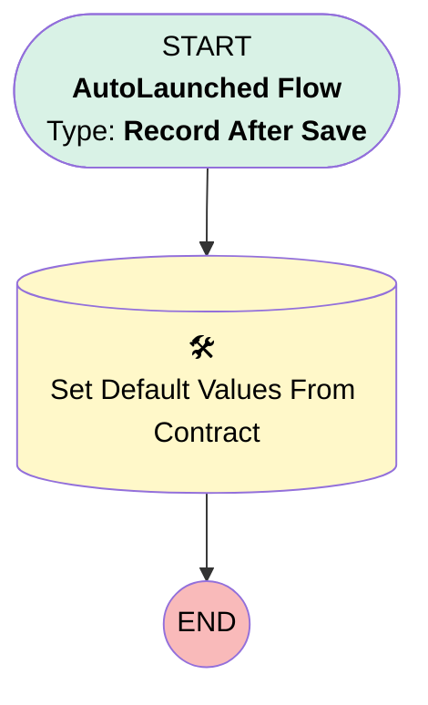

# [ContractLineItem] - [After Save] - Add Default Field Values

## Flow Diagram [(_View History_)](ContractLineItem_After_Save_Add_Default_Field_Values-history.md)

<!-- Flow description -->

## General Information

|<!-- -->|<!-- -->|
|:---|:---|
|Object|ContractLineItem|
|Process Type| Auto Launched Flow|
|Trigger Type| Record After Save|
|Record Trigger Type| Create|
|Label|[ContractLineItem] - [After Save] - Add Default Field Values|
|Status|⚠️ Draft|
|Environments|Default|
|Interview Label|[ContractLineItem] - [After Save] - Add Default Field Values {!$Flow.CurrentDateTime}|
| Builder Type (PM)|LightningFlowBuilder|
| Canvas Mode (PM)|AUTO_LAYOUT_CANVAS|
| Origin Builder Type (PM)|LightningFlowBuilder|
|Connector|[Set_Default_Values_From_Contract](#set_default_values_from_contract)|
|Next Node|[Set_Default_Values_From_Contract](#set_default_values_from_contract)|

## Flow Nodes Details

### Set_Default_Values_From_Contract

|<!-- -->|<!-- -->|
|:---|:---|
|Type|Record Update|
|Label|Set Default Values From Contract|
|Input Reference|$Record|

#### Input Assignments

|Field|Value|
|:-- |:--: |
|Notify_Customer_When_En_Route__c|$Record.ServiceContract.Notify_Customer_When_En_Route__c|
|Signature_Required__c|$Record.ServiceContract.Signature_Required__c|

___

_Documentation generated from branch monitoring_krinkelsgreencare__upeodev_sandbox by [sfdx-hardis](https://sfdx-hardis.cloudity.com), featuring [salesforce-flow-visualiser](https://github.com/toddhalfpenny/salesforce-flow-visualiser)_