# [ContractLineItem] - [After Save] - Add Default Financial Accounts

## Flow Diagram

```mermaid
%% If you read this, your Markdown visualizer does not handle MermaidJS syntax.
%% - If you are in VsCode, install extension `Markdown Preview Mermaid Support` at https://marketplace.visualstudio.com/items?itemName=bierner.markdown-mermaid
%% - If you are using sfdx-hardis, try to define env variable `MERMAID_MODES=cli,docker` ,then run again the command to regenerate markdown with SVG images.
%% - If you are within mkdocs-material, define mermaid plugin in `mkdocs.yml` as described in https://squidfunk.github.io/mkdocs-material/extensions/mermaid/
%% - At last resort, you can copy-paste this MermaidJS code in https://mermaid.live/ to see the Flow Diagram

flowchart TB
START(["START<br/><b>AutoLaunched Flow</b></br>Type: <b> Record After Save</b>"]):::startClass
click START "#general-information" "4150545788"

Add_to_Collection[\"🟰 <em></em><br/>Add to Collection"/]:::assignments
click Add_to_Collection "#add_to_collection" "3691294574"

Set_Contract_Line_Account[\"🟰 <em></em><br/>Set Contract Line Account"/]:::assignments
click Set_Contract_Line_Account "#set_contract_line_account" "2159260578"

Loop_Retrieved_Project_Accounts{{"🔁 <em></em><br/>Loop Retrieved Project Accounts"}}:::loops
click Loop_Retrieved_Project_Accounts "#loop_retrieved_project_accounts" "3682728934"

Create_Records[("➕ <em></em><br/>Create Records")]:::recordCreates
click Create_Records "#create_records" "206360881"

Get_Atak_Financial_Customers[("🔍 <em></em><br/>Get Atak Financial Customers")]:::recordLookups
click Get_Atak_Financial_Customers "#get_atak_financial_customers" "529976426"

Add_to_Collection --> Loop_Retrieved_Project_Accounts
Set_Contract_Line_Account --> Add_to_Collection
Loop_Retrieved_Project_Accounts --> |"For Each"|Set_Contract_Line_Account
Loop_Retrieved_Project_Accounts ---> |"After Last"|Create_Records
Create_Records --> END_Create_Records
Get_Atak_Financial_Customers --> Loop_Retrieved_Project_Accounts
START -->  Get_Atak_Financial_Customers
END_Create_Records(( END )):::endClass


classDef actionCalls fill:#D4E4FC,color:black,max-height:100px
classDef assignments fill:#FBEED7,color:black,max-height:100px
classDef collectionProcessors fill:#F0E3FA,color:black,max-height:100px
classDef customErrors fill:#FFE9E9,color:black,max-height:100px
classDef decisions fill:#FDEAF6,color:black,max-height:100px
classDef loops fill:#FDEAF6,color:black,max-height:100px
classDef recordCreates fill:#FFF8C9,color:black,max-height:100px
classDef recordDeletes fill:#FFF8C9,color:black,max-height:100px
classDef recordLookups fill:#EDEAFF,color:black,max-height:100px
classDef recordUpdates fill:#FFF8C9,color:black,max-height:100px
classDef screens fill:#DFF6FF,color:black,max-height:100px
classDef subflows fill:#D4E4FC,color:black,max-height:100px
classDef startClass fill:#D9F2E6,color:black,max-height:100px
classDef endClass fill:#F9BABA,color:black,max-height:100px


```

## General Information

|<!-- -->|<!-- -->|
|:---|:---|
|Object|ContractLineItem|
|Process Type| Auto Launched Flow|
|Trigger Type| Record After Save|
|Record Trigger Type| Create And Update|
|Label|[ContractLineItem] - [After Save] - Add Default Financial Accounts|
|Status|Active|
|Filter Formula|(ISNEW() && {!$Record.Project_Code__c} != '') || (ISCHANGED({!$Record.Project_Code__c}) && {!$Record.Project_Code__c} != '')|
|Environments|Default|
|Interview Label|[ContractLineItem] - [After Save] - Add Default Financial Accounts {!$Flow.CurrentDateTime}|
| Builder Type (PM)|LightningFlowBuilder|
| Canvas Mode (PM)|AUTO_LAYOUT_CANVAS|
| Origin Builder Type (PM)|LightningFlowBuilder|
|Connector|[Get_Atak_Financial_Customers](#get_atak_financial_customers)|
|Next Node|[Get_Atak_Financial_Customers](#get_atak_financial_customers)|

## Variables

|Name|Data Type|Is Collection|Is Input|Is Output|Object Type|
|:-- |:--:|:--:|:--:|:--:|:--: |
|ContractLineFinancialAccount|SObject|⬜|⬜|⬜|Contract_Line_Financial_Account__c|
|ContractLineFinancialAccountCollection|SObject|✅|⬜|⬜|Contract_Line_Financial_Account__c|

## Flow Nodes Details

### Add_to_Collection

|<!-- -->|<!-- -->|
|:---|:---|
|Type|Assignment|
|Label|Add to Collection|
|Connector|[Loop_Retrieved_Project_Accounts](#loop_retrieved_project_accounts)|

#### Assignments

|Assign To Reference|Operator|Value|
|:-- |:--:|:--: |
|ContractLineFinancialAccountCollection| Add|ContractLineFinancialAccount|

### Set_Contract_Line_Account

|<!-- -->|<!-- -->|
|:---|:---|
|Type|Assignment|
|Label|Set Contract Line Account|
|Connector|[Add_to_Collection](#add_to_collection)|

#### Assignments

|Assign To Reference|Operator|Value|
|:-- |:--:|:--: |
|ContractLineFinancialAccount.Contract_Line_Item__c| Assign|$Record.Id|
|ContractLineFinancialAccount.Financial_Customer__c| Assign|Loop_Retrieved_Project_Accounts.Account__c|
|ContractLineFinancialAccount.Name| Assign|Loop_Retrieved_Project_Accounts.Name|

### Loop_Retrieved_Project_Accounts

|<!-- -->|<!-- -->|
|:---|:---|
|Type|Loop|
|Label|Loop Retrieved Project Accounts|
|Collection Reference|[Get_Atak_Financial_Customers](#get_atak_financial_customers)|
|Iteration Order|Asc|
|Next Value Connector|[Set_Contract_Line_Account](#set_contract_line_account)|
|No More Values Connector|[Create_Records](#create_records)|

### Create_Records

|<!-- -->|<!-- -->|
|:---|:---|
|Type|Record Create|
|Label|Create Records|
|Input Reference|ContractLineFinancialAccountCollection|

### Get_Atak_Financial_Customers

|<!-- -->|<!-- -->|
|:---|:---|
|Type|Record Lookup|
|Object|ATAK_Project_Financial_Account__c|
|Label|Get Atak Financial Customers|
|Assign Null Values If No Records Found|⬜|
|Get First Record Only|⬜|
|Store Output Automatically|✅|
|Connector|[Loop_Retrieved_Project_Accounts](#loop_retrieved_project_accounts)|

#### Filters (logic: **and**)

|Filter Id|Field|Operator|Value|
|:-- |:-- |:--:|:--: |
|1|ATAK_Project_Code__c| Equal To|$Record.Project_Code__c|

___

_Documentation generated from branch monitoring_krinkelsgreencare__upeodev_sandbox by [sfdx-hardis](https://sfdx-hardis.cloudity.com), featuring [salesforce-flow-visualiser](https://github.com/toddhalfpenny/salesforce-flow-visualiser)_