# [Lead][After-Save][Record-Triggered] Populate Client Sector & Industry Type on Account

## Flow Diagram

```mermaid
%% If you read this, your Markdown visualizer does not handle MermaidJS syntax.
%% - If you are in VsCode, install extension `Markdown Preview Mermaid Support` at https://marketplace.visualstudio.com/items?itemName=bierner.markdown-mermaid
%% - If you are using sfdx-hardis, try to define env variable `MERMAID_MODES=cli,docker` ,then run again the command to regenerate markdown with SVG images.
%% - If you are within mkdocs-material, define mermaid plugin in `mkdocs.yml` as described in https://squidfunk.github.io/mkdocs-material/extensions/mermaid/
%% - At last resort, you can copy-paste this MermaidJS code in https://mermaid.live/ to see the Flow Diagram

flowchart TB
START(["START<br/><b>AutoLaunched Flow</b></br>Type: <b> Record After Save</b>"]):::startClass
click START "#general-information" "648770409"

Get_Commercial_Record_Type_Id[("🔍 <em></em><br/>Get Commercial Record Type Id")]:::recordLookups
click Get_Commercial_Record_Type_Id "#get_commercial_record_type_id" "3924753702"

Get_Converted_Account_Id[("🔍 <em></em><br/>Get Converted Account Id")]:::recordLookups
click Get_Converted_Account_Id "#get_converted_account_id" "1374846696"

Update_Related_Account[("🛠️ <em></em><br/>Update Related Account")]:::recordUpdates
click Update_Related_Account "#update_related_account" "1226822149"

Get_Commercial_Record_Type_Id --> Get_Converted_Account_Id
Get_Converted_Account_Id --> Update_Related_Account
Update_Related_Account --> END_Update_Related_Account
START -->  Get_Commercial_Record_Type_Id
END_Update_Related_Account(( END )):::endClass


classDef actionCalls fill:#D4E4FC,color:black,max-height:100px
classDef assignments fill:#FBEED7,color:black,max-height:100px
classDef collectionProcessors fill:#F0E3FA,color:black,max-height:100px
classDef customErrors fill:#FFE9E9,color:black,max-height:100px
classDef decisions fill:#FDEAF6,color:black,max-height:100px
classDef loops fill:#FDEAF6,color:black,max-height:100px
classDef recordCreates fill:#FFF8C9,color:black,max-height:100px
classDef recordDeletes fill:#FFF8C9,color:black,max-height:100px
classDef recordLookups fill:#EDEAFF,color:black,max-height:100px
classDef recordUpdates fill:#FFF8C9,color:black,max-height:100px
classDef screens fill:#DFF6FF,color:black,max-height:100px
classDef subflows fill:#D4E4FC,color:black,max-height:100px
classDef startClass fill:#D9F2E6,color:black,max-height:100px
classDef endClass fill:#F9BABA,color:black,max-height:100px


```

## General Information

|<!-- -->|<!-- -->|
|:---|:---|
|Object|Lead|
|Process Type| Auto Launched Flow|
|Trigger Type| Record After Save|
|Record Trigger Type| Update|
|Label|[Lead][After-Save][Record-Triggered] Populate Client Sector & Industry Type on Account|
|Status|Active|
|Environments|Default|
|Interview Label|[Location Passport][Mobile Flow][Screen flow] View Location Passport Information {!$Flow.CurrentDateTime}|
| Builder Type (PM)|LightningFlowBuilder|
| Canvas Mode (PM)|AUTO_LAYOUT_CANVAS|
| Origin Builder Type (PM)|LightningFlowBuilder|
|Connector|[Get_Commercial_Record_Type_Id](#get_commercial_record_type_id)|
|Next Node|[Get_Commercial_Record_Type_Id](#get_commercial_record_type_id)|

#### Filters (logic: **1 AND (2 OR 3)**)

|Filter Id|Field|Operator|Value|
|:-- |:-- |:--:|:--: |
|1|IsConverted| Equal To|✅|
|2|Client_Sector__c| Is Null|<!-- -->|
|3|Industry_Type__c| Is Null|<!-- -->|

## Flow Nodes Details

### Get_Commercial_Record_Type_Id

|<!-- -->|<!-- -->|
|:---|:---|
|Type|Record Lookup|
|Object|RecordType|
|Label|Get Commercial Record Type Id|
|Assign Null Values If No Records Found|⬜|
|Get First Record Only|✅|
|Store Output Automatically|✅|
|Connector|[Get_Converted_Account_Id](#get_converted_account_id)|

#### Filters (logic: **and**)

|Filter Id|Field|Operator|Value|
|:-- |:-- |:--:|:--: |
|1|Name| Equal To|Commercial_Account|

### Get_Converted_Account_Id

|<!-- -->|<!-- -->|
|:---|:---|
|Type|Record Lookup|
|Object|Account|
|Label|Get Converted Account Id|
|Assign Null Values If No Records Found|⬜|
|Get First Record Only|✅|
|Store Output Automatically|✅|
|Connector|[Update_Related_Account](#update_related_account)|

#### Filters (logic: **and**)

|Filter Id|Field|Operator|Value|
|:-- |:-- |:--:|:--: |
|1|Id| Equal To|$Record.ConvertedAccountId|

### Update_Related_Account

|<!-- -->|<!-- -->|
|:---|:---|
|Type|Record Update|
|Object|Account|
|Label|Update Related Account|

#### Filters (logic: **and**)

|Filter Id|Field|Operator|Value|
|:-- |:-- |:--:|:--: |
|1|Id| Equal To|Get_Converted_Account_Id.Id|

#### Input Assignments

|Field|Value|
|:-- |:--: |
|Industry|$Record.Industry_Type__c|
|Type|$Record.Client_Sector__c|

___

_Documentation generated from branch monitoring_krinkelsgreencare__upeodev_sandbox by [sfdx-hardis](https://sfdx-hardis.cloudity.com), featuring [salesforce-flow-visualiser](https://github.com/toddhalfpenny/salesforce-flow-visualiser)_