# [Location Passport][Mobile Flow][Screen flow] View Location Passport Information

## Flow Diagram [(_View History_)](Location_Passport_Mobile_Flow_Screen_flow_View_Location_Passport_Information-history.md)

```mermaid
%% If you read this, your Markdown visualizer does not handle MermaidJS syntax.
%% - If you are in VsCode, install extension `Markdown Preview Mermaid Support` at https://marketplace.visualstudio.com/items?itemName=bierner.markdown-mermaid
%% - If you are using sfdx-hardis, try to define env variable `MERMAID_MODES=cli,docker` ,then run again the command to regenerate markdown with SVG images.
%% - If you are within mkdocs-material, define mermaid plugin in `mkdocs.yml` as described in https://squidfunk.github.io/mkdocs-material/extensions/mermaid/
%% - At last resort, you can copy-paste this MermaidJS code in https://mermaid.live/ to see the Flow Diagram

flowchart TB
START(["START"]):::startClass
click START "#general-information" "3039137934"

Post_Changes_to_chatter("⚡ <em></em><br/>Post Changes to chatter"):::actionCalls
click Post_Changes_to_chatter "#post_changes_to_chatter" "1944103437"

Add_to_Details_list[\"🟰 <em></em><br/>Add to Details list"/]:::assignments
click Add_to_Details_list "#add_to_details_list" "3781968440"

Loop_Through_Operating_Hours{{"🔁 <em></em><br/>Loop Through Operating Hours"}}:::loops
click Loop_Through_Operating_Hours "#loop_through_operating_hours" "2939973918"

Get_Account_Information[("🔍 <em></em><br/>Get Account Information")]:::recordLookups
click Get_Account_Information "#get_account_information" "2375899122"

Get_Contract_Manager[("🔍 <em></em><br/>Get Contract Manager")]:::recordLookups
click Get_Contract_Manager "#get_contract_manager" "1067364005"

Get_Operating_Hours[("🔍 <em></em><br/>Get Operating Hours")]:::recordLookups
click Get_Operating_Hours "#get_operating_hours" "2178021119"

Get_Service_Territory[("🔍 <em></em><br/>Get Service Territory")]:::recordLookups
click Get_Service_Territory "#get_service_territory" "3197260144"

Get_Work_Order_Info[("🔍 <em></em><br/>Get Work Order Info")]:::recordLookups
click Get_Work_Order_Info "#get_work_order_info" "308662686"

Display_Location_Passport_Information(["💻 <em></em><br/>Display Location Passport Information"]):::screens
click Display_Location_Passport_Information "#display_location_passport_information" "1554028954"

Post_Changes_to_chatter --> END_Post_Changes_to_chatter
Add_to_Details_list --> Loop_Through_Operating_Hours
Loop_Through_Operating_Hours --> |"For Each"|Add_to_Details_list
Loop_Through_Operating_Hours ---> |"After Last"|Display_Location_Passport_Information
Get_Account_Information --> Get_Operating_Hours
Get_Contract_Manager --> Post_Changes_to_chatter
Get_Operating_Hours --> Loop_Through_Operating_Hours
Get_Service_Territory --> Get_Contract_Manager
Get_Work_Order_Info --> Get_Account_Information
Display_Location_Passport_Information --> Get_Service_Territory
START -->  Get_Work_Order_Info
END_Post_Changes_to_chatter(( END )):::endClass


classDef actionCalls fill:#D4E4FC,color:black,max-height:100px
classDef assignments fill:#FBEED7,color:black,max-height:100px
classDef collectionProcessors fill:#F0E3FA,color:black,max-height:100px
classDef customErrors fill:#FFE9E9,color:black,max-height:100px
classDef decisions fill:#FDEAF6,color:black,max-height:100px
classDef loops fill:#FDEAF6,color:black,max-height:100px
classDef recordCreates fill:#FFF8C9,color:black,max-height:100px
classDef recordDeletes fill:#FFF8C9,color:black,max-height:100px
classDef recordLookups fill:#EDEAFF,color:black,max-height:100px
classDef recordUpdates fill:#FFF8C9,color:black,max-height:100px
classDef screens fill:#DFF6FF,color:black,max-height:100px
classDef subflows fill:#D4E4FC,color:black,max-height:100px
classDef startClass fill:#D9F2E6,color:black,max-height:100px
classDef endClass fill:#F9BABA,color:black,max-height:100px


```

## General Information

|<!-- -->|<!-- -->|
|:---|:---|
|Process Type| Field Service Mobile|
|Label|[Location Passport][Mobile Flow][Screen flow] View Location Passport Information|
|Status|⚠️ Draft|
|Environments|Default|
|Interview Label|[Location Passport][Mobile Flow][Screen flow] Get Location Passport Information {!$Flow.CurrentDateTime}|
| Builder Type (PM)|LightningFlowBuilder|
| Canvas Mode (PM)|AUTO_LAYOUT_CANVAS|
| Origin Builder Type (PM)|LightningFlowBuilder|
|Connector|[Get_Work_Order_Info](#get_work_order_info)|
|Next Node|[Get_Work_Order_Info](#get_work_order_info)|

## Variables

|Name|Data Type|Is Collection|Is Input|Is Output|Object Type|
|:-- |:--:|:--:|:--:|:--:|:--: |
|AccountRecord|SObject|⬜|✅|⬜|Account|
|ContentDocumentLinkRecord|SObject|⬜|✅|⬜|ContentDocumentLink|
|ContentDocumentlinks|SObject|✅|⬜|⬜|ContentDocumentLink|
|ContentDocumentRecord|SObject|⬜|✅|⬜|ContentDocument|
|Id|String|⬜|✅|⬜|<!-- -->|
|OperatingHours_TimeSlots|SObject|✅|⬜|⬜|TimeSlot|
|OperatingHoursDetails|String|⬜|⬜|⬜|<!-- -->|
|ServiceTerritoryRecord|SObject|⬜|⬜|⬜|ServiceTerritory|
|TimeSlots|SObject|⬜|⬜|⬜|TimeSlot|
|UserRecord|SObject|⬜|⬜|⬜|User|
|WorkOrderRecord|SObject|⬜|✅|⬜|WorkOrder|

## Flow Nodes Details

### Post_Changes_to_chatter

|<!-- -->|<!-- -->|
|:---|:---|
|Type|Action Call|
|Label|Post Changes to chatter|
|Action Type|Chatter Post|
|Action Name|chatterPost|
|Flow Transaction Model|CurrentTransaction|
|Name Segment|chatterPost|
|Offset|0|
|Version Segment|1|
|Text (input)|templateChatterText|
|Subject Name Or Id (input)|WorkOrderRecord.Id|

### Add_to_Details_list

|<!-- -->|<!-- -->|
|:---|:---|
|Type|Assignment|
|Label|Add to Details list|
|Connector|[Loop_Through_Operating_Hours](#loop_through_operating_hours)|

#### Assignments

|Assign To Reference|Operator|Value|
|:-- |:--:|:--: |
|OperatingHoursDetails| Add|formTimeSlotDetail|

### Loop_Through_Operating_Hours

|<!-- -->|<!-- -->|
|:---|:---|
|Type|Loop|
|Label|Loop Through Operating Hours|
|Assign Next Value To Reference|TimeSlots|
|Collection Reference|OperatingHours_TimeSlots|
|Iteration Order|Asc|
|Next Value Connector|[Add_to_Details_list](#add_to_details_list)|
|No More Values Connector|[Display_Location_Passport_Information](#display_location_passport_information)|

### Get_Account_Information

|<!-- -->|<!-- -->|
|:---|:---|
|Type|Record Lookup|
|Object|Account|
|Label|Get Account Information|
|Assign Null Values If No Records Found|⬜|
|Output Reference|AccountRecord|
|Queried Fields|- Id - Name - Access_Information__c - Attention_points_for_execution__c - Closing_Days__c - OperatingHoursId |
|Connector|[Get_Operating_Hours](#get_operating_hours)|

#### Filters (logic: **and**)

|Filter Id|Field|Operator|Value|
|:-- |:-- |:--:|:--: |
|1|Id| Equal To|WorkOrderRecord.AccountId|

### Get_Contract_Manager

|<!-- -->|<!-- -->|
|:---|:---|
|Type|Record Lookup|
|Object|User|
|Label|Get Contract Manager|
|Assign Null Values If No Records Found|⬜|
|Output Reference|UserRecord|
|Queried Fields|Id|
|Connector|[Post_Changes_to_chatter](#post_changes_to_chatter)|

#### Filters (logic: **and**)

|Filter Id|Field|Operator|Value|
|:-- |:-- |:--:|:--: |
|1|Id| Equal To|ServiceTerritoryRecord.OwnerId|

### Get_Operating_Hours

|<!-- -->|<!-- -->|
|:---|:---|
|Type|Record Lookup|
|Object|TimeSlot|
|Label|Get Operating Hours|
|Assign Null Values If No Records Found|⬜|
|Output Reference|OperatingHours_TimeSlots|
|Queried Fields|- Id - StartTime - EndTime - DayOfWeek - Timeslot_Details__c |
|Connector|[Loop_Through_Operating_Hours](#loop_through_operating_hours)|

#### Filters (logic: **and**)

|Filter Id|Field|Operator|Value|
|:-- |:-- |:--:|:--: |
|1|OperatingHoursId| Equal To|AccountRecord.OperatingHoursId|

### Get_Service_Territory

|<!-- -->|<!-- -->|
|:---|:---|
|Type|Record Lookup|
|Object|ServiceTerritory|
|Label|Get Service Territory|
|Assign Null Values If No Records Found|⬜|
|Output Reference|ServiceTerritoryRecord|
|Queried Fields|- Id - OwnerId |
|Connector|[Get_Contract_Manager](#get_contract_manager)|

#### Filters (logic: **and**)

|Filter Id|Field|Operator|Value|
|:-- |:-- |:--:|:--: |
|1|Id| Equal To|WorkOrderRecord.ServiceTerritoryId|

### Get_Work_Order_Info

|<!-- -->|<!-- -->|
|:---|:---|
|Type|Record Lookup|
|Object|WorkOrder|
|Label|Get Work Order Info|
|Assign Null Values If No Records Found|⬜|
|Output Reference|WorkOrderRecord|
|Queried Fields|- Id - AccountId - ServiceTerritoryId |
|Connector|[Get_Account_Information](#get_account_information)|

#### Filters (logic: **and**)

|Filter Id|Field|Operator|Value|
|:-- |:-- |:--:|:--: |
|1|Id| Equal To|Id|

### Display_Location_Passport_Information

|<!-- -->|<!-- -->|
|:---|:---|
|Type|Screen|
|Label|Display Location Passport Information|
|Allow Back|⬜|
|Allow Finish|✅|
|Allow Pause|⬜|
|Next Or Finish Button Label|Close|
|Show Footer|✅|
|Show Header|⬜|
|Connector|[Get_Service_Territory](#get_service_territory)|

#### Account

|<!-- -->|<!-- -->|
|:---|:---|
|Data Type|String|
|Default Value|AccountRecord.Name|
|Field Text|Account|
|Field Type| Input Field|
|Inputs On Next Nav To Assoc Scrn| Use Stored Values|
|Is Disabled|true|
|Is Read Only|true|
|Is Required|⬜|

#### Access_Information

|<!-- -->|<!-- -->|
|:---|:---|
|Default Value|{!AccountRecord.Access_Information__c}|
|Field Text|Access Information|
|Field Type| Large Text Area|
|Inputs On Next Nav To Assoc Scrn| Use Stored Values|
|Is Disabled|true|
|Is Read Only|true|
|Is Required|⬜|

#### Attention_Points_of_Execution

|<!-- -->|<!-- -->|
|:---|:---|
|Default Value|{!AccountRecord.Attention_points_for_execution__c}|
|Field Text|Attention Points of Execution|
|Field Type| Large Text Area|
|Inputs On Next Nav To Assoc Scrn| Use Stored Values|
|Is Disabled|true|
|Is Read Only|true|
|Is Required|⬜|

#### Opening_Hours

|<!-- -->|<!-- -->|
|:---|:---|
|Default Value|{!OperatingHoursDetails}|
|Field Text|Opening Hours|
|Field Type| Large Text Area|
|Inputs On Next Nav To Assoc Scrn| Use Stored Values|
|Is Disabled|true|
|Is Read Only|true|
|Is Required|⬜|

#### Closing_Days

|<!-- -->|<!-- -->|
|:---|:---|
|Default Value|{!AccountRecord.Closing_Days__c}|
|Field Text|Closing Days|
|Field Type| Large Text Area|
|Inputs On Next Nav To Assoc Scrn| Use Stored Values|
|Is Disabled|true|
|Is Read Only|true|
|Is Required|⬜|

#### Changes_Needed

|<!-- -->|<!-- -->|
|:---|:---|
|Field Text|If any, please indicate here what changes are needed for this Location Passport?|
|Field Type| Large Text Area|
|Inputs On Next Nav To Assoc Scrn| Use Stored Values|
|Is Required|⬜|

#### LocationPassportAttachmentsInfo

|<!-- -->|<!-- -->|
|:---|:---|
|Field Text|
<em>To view attachments, go to the related files linked to the operational account.</em>
|
|Field Type| Display Text|

___

_Documentation generated from branch monitoring_krinkelsgreencare__upeodev_sandbox by [sfdx-hardis](https://sfdx-hardis.cloudity.com), featuring [salesforce-flow-visualiser](https://github.com/toddhalfpenny/salesforce-flow-visualiser)_