# [Location Visit][After-Save][Record-Triggered] Inform visitor when Opportunity visit

## Flow Diagram

```mermaid
%% If you read this, your Markdown visualizer does not handle MermaidJS syntax.
%% - If you are in VsCode, install extension `Markdown Preview Mermaid Support` at https://marketplace.visualstudio.com/items?itemName=bierner.markdown-mermaid
%% - If you are using sfdx-hardis, try to define env variable `MERMAID_MODES=cli,docker` ,then run again the command to regenerate markdown with SVG images.
%% - If you are within mkdocs-material, define mermaid plugin in `mkdocs.yml` as described in https://squidfunk.github.io/mkdocs-material/extensions/mermaid/
%% - At last resort, you can copy-paste this MermaidJS code in https://mermaid.live/ to see the Flow Diagram

flowchart TB
START(["START<br/><b>AutoLaunched Flow</b></br>Type: <b> Record After Save</b>"]):::startClass
click START "#general-information" "2335033166"

New_Location_Visit_Notification("⚡ <em></em><br/>New Location Visit Notification"):::actionCalls
click New_Location_Visit_Notification "#new_location_visit_notification" "233160756"

Planned_Location_Visit_Notification("⚡ <em></em><br/>Planned Location Visit Notification"):::actionCalls
click Planned_Location_Visit_Notification "#planned_location_visit_notification" "1036259048"

Visitor_ID[\"🟰 <em></em><br/>Visitor ID"/]:::assignments
click Visitor_ID "#visitor_id" "406092534"

Location_Visit_Planned{"🔀 <em></em><br/>Location Visit Planned ?"}:::decisions
click Location_Visit_Planned "#location_visit_planned" "622861650"

Visitor_Filled_In{"🔀 <em></em><br/>Visitor Filled In ?"}:::decisions
click Visitor_Filled_In "#visitor_filled_in" "241890594"

Get_Notification[("🔍 <em></em><br/>Get Notification")]:::recordLookups
click Get_Notification "#get_notification" "3148319973"

Update[("🛠️ <em></em><br/>Update")]:::recordUpdates
click Update "#update" "2443626981"

New_Location_Visit_Notification --> Update
Planned_Location_Visit_Notification --> Update
Visitor_ID --> Visitor_Filled_In
Location_Visit_Planned --> |"Yes"| Planned_Location_Visit_Notification
Location_Visit_Planned --> |"No"| New_Location_Visit_Notification
Visitor_Filled_In --> |"Yes"| Get_Notification
Visitor_Filled_In --> |"No"| END_Visitor_Filled_In
Get_Notification --> Location_Visit_Planned
Update --> END_Update
START -->  Visitor_ID
END_Visitor_Filled_In(( END )):::endClass
END_Update(( END )):::endClass


classDef actionCalls fill:#D4E4FC,color:black,max-height:100px
classDef assignments fill:#FBEED7,color:black,max-height:100px
classDef collectionProcessors fill:#F0E3FA,color:black,max-height:100px
classDef customErrors fill:#FFE9E9,color:black,max-height:100px
classDef decisions fill:#FDEAF6,color:black,max-height:100px
classDef loops fill:#FDEAF6,color:black,max-height:100px
classDef recordCreates fill:#FFF8C9,color:black,max-height:100px
classDef recordDeletes fill:#FFF8C9,color:black,max-height:100px
classDef recordLookups fill:#EDEAFF,color:black,max-height:100px
classDef recordUpdates fill:#FFF8C9,color:black,max-height:100px
classDef screens fill:#DFF6FF,color:black,max-height:100px
classDef subflows fill:#D4E4FC,color:black,max-height:100px
classDef startClass fill:#D9F2E6,color:black,max-height:100px
classDef endClass fill:#F9BABA,color:black,max-height:100px


```

## General Information

|<!-- -->|<!-- -->|
|:---|:---|
|Object|Location_Visit__c|
|Process Type| Auto Launched Flow|
|Trigger Type| Record After Save|
|Record Trigger Type| Create And Update|
|Label|[Location Visit][After-Save][Record-Triggered] Inform visitor when Opportunity visit|
|Status|Active|
|Filter Formula|AND(     NOT(ISBLANK({!$Record.Visitor_Internal__c})),     OR(         ISNEW(),         ISCHANGED({!$Record.Visitor_Internal__c})     ) )|
|Description|Send a notification to the expected visitor that they are expected to do a visit|
|Environments|Default|
|Interview Label|[Location Visit][After-Save][Record-Triggered] Inform visitor when Opportunity visit {!$Flow.CurrentDateTime}|
| Builder Type (PM)|LightningFlowBuilder|
| Canvas Mode (PM)|AUTO_LAYOUT_CANVAS|
| Origin Builder Type (PM)|LightningFlowBuilder|
|Connector|[Visitor_ID](#visitor_id)|
|Next Node|[Visitor_ID](#visitor_id)|

## Variables

|Name|Data Type|Is Collection|Is Input|Is Output|Object Type|
|:-- |:--:|:--:|:--:|:--:|:--: |
|CreatorName|String|⬜|✅|⬜|<!-- -->|
|VisitorId|String|✅|✅|⬜|<!-- -->|

## Text Templates

|Name|Text|
|:-- |:--  |
|NewVisitBody|A(n) {!$Record.Location_Visit_Type__c} visit has been assigned to you by {!$Record.CreatedBy.FirstName} {!$Record.CreatedBy.LastName}. Please plan a visit.|
|NewVisitTitle|New Location Visit|
|VisitPlannedBody|A(n) {!$Record.Location_Visit_Type__c} visit has been scheduled for {!$Record.Visit_Date__c} by {!$Record.CreatedBy.FirstName} {!$Record.CreatedBy.LastName}.|
|VisitPlannedTitle|Location Visit Planned|

## Flow Nodes Details

### New_Location_Visit_Notification

|<!-- -->|<!-- -->|
|:---|:---|
|Type|Action Call|
|Label|New Location Visit Notification|
|Action Type|Custom Notification Action|
|Action Name|customNotificationAction|
|Flow Transaction Model|CurrentTransaction|
|Name Segment|customNotificationAction|
|Offset|0|
|Version Segment|1|
|Custom Notif Type Id (input)|Get_Notification.Id|
|Recipient Ids (input)|VisitorId|
|Title (input)|NewVisitTitle|
|Body (input)|NewVisitBody|
|Target Id (input)|$Record.Id|
|Connector|[Update](#update)|

### Planned_Location_Visit_Notification

|<!-- -->|<!-- -->|
|:---|:---|
|Type|Action Call|
|Label|Planned Location Visit Notification|
|Action Type|Custom Notification Action|
|Action Name|customNotificationAction|
|Flow Transaction Model|CurrentTransaction|
|Name Segment|customNotificationAction|
|Offset|0|
|Version Segment|1|
|Custom Notif Type Id (input)|Get_Notification.Id|
|Recipient Ids (input)|VisitorId|
|Title (input)|VisitPlannedTitle|
|Body (input)|VisitPlannedBody|
|Target Id (input)|$Record.Id|
|Connector|[Update](#update)|

### Visitor_ID

|<!-- -->|<!-- -->|
|:---|:---|
|Type|Assignment|
|Label|Visitor ID|
|Connector|[Visitor_Filled_In](#visitor_filled_in)|

#### Assignments

|Assign To Reference|Operator|Value|
|:-- |:--:|:--: |
|VisitorId| Add|$Record.Visitor_Internal__c|

### Location_Visit_Planned

|<!-- -->|<!-- -->|
|:---|:---|
|Type|Decision|
|Label|Location Visit Planned ?|
|Default Connector|[New_Location_Visit_Notification](#new_location_visit_notification)|
|Default Connector Label|No|

#### Rule Yes (Yes)

|<!-- -->|<!-- -->|
|:---|:---|
|Connector|[Planned_Location_Visit_Notification](#planned_location_visit_notification)|
|Condition Logic|and|

|Condition Id|Left Value Reference|Operator|Right Value|
|:-- |:-- |:--:|:--: |
|1|$Record.Fixed_date_Already_planned__c| Equal To|✅|

### Visitor_Filled_In

|<!-- -->|<!-- -->|
|:---|:---|
|Type|Decision|
|Label|Visitor Filled In ?|
|Default Connector Label|No|

#### Rule Yes_Visitor_Filled_In (Yes)

|<!-- -->|<!-- -->|
|:---|:---|
|Connector|[Get_Notification](#get_notification)|
|Condition Logic|and|

|Condition Id|Left Value Reference|Operator|Right Value|
|:-- |:-- |:--:|:--: |
|1|VisitorId| Is Empty|⬜|

### Get_Notification

|<!-- -->|<!-- -->|
|:---|:---|
|Type|Record Lookup|
|Object|CustomNotificationType|
|Label|Get Notification|
|Assign Null Values If No Records Found|⬜|
|Get First Record Only|✅|
|Store Output Automatically|✅|
|Connector|[Location_Visit_Planned](#location_visit_planned)|

#### Filters (logic: **and**)

|Filter Id|Field|Operator|Value|
|:-- |:-- |:--:|:--: |
|1|DeveloperName| Equal To|Standard_Notification|

### Update

|<!-- -->|<!-- -->|
|:---|:---|
|Type|Record Update|
|Label|[Update](#update)|
|Input Reference|$Record|

#### Input Assignments

|Field|Value|
|:-- |:--: |
|OwnerId|$Record.Visitor_Internal__r.Id|

___

_Documentation generated from branch monitoring_krinkelsgreencare__upeodev_sandbox by [sfdx-hardis](https://sfdx-hardis.cloudity.com), featuring [salesforce-flow-visualiser](https://github.com/toddhalfpenny/salesforce-flow-visualiser)_