# [Mileage Entry] - [After-Save] - [Record-Triggered] - Set Work As Travel Time Work Order

## Flow Diagram

```mermaid
%% If you read this, your Markdown visualizer does not handle MermaidJS syntax.
%% - If you are in VsCode, install extension `Markdown Preview Mermaid Support` at https://marketplace.visualstudio.com/items?itemName=bierner.markdown-mermaid
%% - If you are using sfdx-hardis, try to define env variable `MERMAID_MODES=cli,docker` ,then run again the command to regenerate markdown with SVG images.
%% - If you are within mkdocs-material, define mermaid plugin in `mkdocs.yml` as described in https://squidfunk.github.io/mkdocs-material/extensions/mermaid/
%% - At last resort, you can copy-paste this MermaidJS code in https://mermaid.live/ to see the Flow Diagram

flowchart TB
START(["START<br/><b>AutoLaunched Flow</b></br>Type: <b> Record After Save</b>"]):::startClass
click START "#general-information" "1778441147"

Set_Is_KM_Allowance[\"🟰 <em></em><br/>Set Is KM Allowance"/]:::assignments
click Set_Is_KM_Allowance "#set_is_km_allowance" "4172482303"

Loop_Time_Sheet_Entries{{"🔁 <em></em><br/>Loop Time Sheet Entries"}}:::loops
click Loop_Time_Sheet_Entries "#loop_time_sheet_entries" "1552177284"

Get_Travel_Time_Records_for_Work_Order[("🔍 <em></em><br/>Get Travel Time Records for Work Order")]:::recordLookups
click Get_Travel_Time_Records_for_Work_Order "#get_travel_time_records_for_work_order" "419666576"

Update_Parent_Work_Order[("🛠️ <em></em><br/>Update Parent Work Order")]:::recordUpdates
click Update_Parent_Work_Order "#update_parent_work_order" "3266361762"

Update_Timesheet_Entries[("🛠️ <em></em><br/>Update Timesheet Entries")]:::recordUpdates
click Update_Timesheet_Entries "#update_timesheet_entries" "3581369893"

Set_Is_KM_Allowance --> Loop_Time_Sheet_Entries
Loop_Time_Sheet_Entries --> |"For Each"|Set_Is_KM_Allowance
Loop_Time_Sheet_Entries ---> |"After Last"|Update_Timesheet_Entries
Get_Travel_Time_Records_for_Work_Order --> Loop_Time_Sheet_Entries
Update_Parent_Work_Order --> Get_Travel_Time_Records_for_Work_Order
Update_Timesheet_Entries --> END_Update_Timesheet_Entries
START -->  Update_Parent_Work_Order
END_Update_Timesheet_Entries(( END )):::endClass


classDef actionCalls fill:#D4E4FC,color:black,text-decoration:none,max-height:100px
classDef assignments fill:#FBEED7,color:black,text-decoration:none,max-height:100px
classDef collectionProcessors fill:#F0E3FA,color:black,text-decoration:none,max-height:100px
classDef customErrors fill:#FFE9E9,color:black,text-decoration:none,max-height:100px
classDef decisions fill:#FDEAF6,color:black,text-decoration:none,max-height:100px
classDef loops fill:#FDEAF6,color:black,text-decoration:none,max-height:100px
classDef recordCreates fill:#FFF8C9,color:black,text-decoration:none,max-height:100px
classDef recordDeletes fill:#FFF8C9,color:black,text-decoration:none,max-height:100px
classDef recordLookups fill:#EDEAFF,color:black,text-decoration:none,max-height:100px
classDef recordUpdates fill:#FFF8C9,color:black,text-decoration:none,max-height:100px
classDef screens fill:#DFF6FF,color:black,text-decoration:none,max-height:100px
classDef subflows fill:#D4E4FC,color:black,text-decoration:none,max-height:100px
classDef startClass fill:#D9F2E6,color:black,text-decoration:none,max-height:100px
classDef endClass fill:#F9BABA,color:black,text-decoration:none,max-height:100px


```

## General Information

|<!-- -->|<!-- -->|
|:---|:---|
|Object|Mileage_Entry__c|
|Process Type| Auto Launched Flow|
|Trigger Type| Record After Save|
|Record Trigger Type| Update|
|Label|[Mileage Entry] - [After-Save] - [Record-Triggered] - Set Work As Travel Time Work Order|
|Status|Active|
|Environments|Default|
|Interview Label|[Mileage Entry] - [After-Save] - [Record-Triggered] - Set Work As Travel Time Work Order {!$Flow.CurrentDateTime}|
| Builder Type (PM)|LightningFlowBuilder|
| Canvas Mode (PM)|AUTO_LAYOUT_CANVAS|
| Origin Builder Type (PM)|LightningFlowBuilder|
|Connector|[Update_Parent_Work_Order](#update_parent_work_order)|
|Next Node|[Update_Parent_Work_Order](#update_parent_work_order)|

#### Filters (logic: **and**)

|Filter Id|Field|Operator|Value|
|:-- |:-- |:--:|:--: |
|1|Work_Order__c| Is Null|<!-- -->|

## Variables

|Name|Data Type|Is Collection|Is Input|Is Output|Object Type|Description|
|:-- |:--:|:--:|:--:|:--:|:--:|:--  |
|TilmesheetEntriesToUpdate|SObject|✅|⬜|⬜|TimeSheetEntry|<!-- -->|

## Flow Nodes Details

### Set_Is_KM_Allowance

|<!-- -->|<!-- -->|
|:---|:---|
|Type|Assignment|
|Label|Set Is KM Allowance|
|Connector|[Loop_Time_Sheet_Entries](#loop_time_sheet_entries)|

#### Assignments

|Assign To Reference|Operator|Value|
|:-- |:--:|:--: |
|Loop_Time_Sheet_Entries.Is_Kilometer_Allowance_Entry__c| Assign|✅|
|TilmesheetEntriesToUpdate| Add|[Loop_Time_Sheet_Entries](#loop_time_sheet_entries)|

### Loop_Time_Sheet_Entries

|<!-- -->|<!-- -->|
|:---|:---|
|Type|Loop|
|Label|Loop Time Sheet Entries|
|Collection Reference|[Get_Travel_Time_Records_for_Work_Order](#get_travel_time_records_for_work_order)|
|Iteration Order|Asc|
|Next Value Connector|[Set_Is_KM_Allowance](#set_is_km_allowance)|
|No More Values Connector|[Update_Timesheet_Entries](#update_timesheet_entries)|

### Get_Travel_Time_Records_for_Work_Order

|<!-- -->|<!-- -->|
|:---|:---|
|Type|Record Lookup|
|Object|TimeSheetEntry|
|Label|Get Travel Time Records for Work Order|
|Assign Null Values If No Records Found|⬜|
|Get First Record Only|⬜|
|Store Output Automatically|✅|
|Connector|[Loop_Time_Sheet_Entries](#loop_time_sheet_entries)|

#### Filters (logic: **and**)

|Filter Id|Field|Operator|Value|
|:-- |:-- |:--:|:--: |
|1|TimeSheetId| Equal To|$Record.Time_Sheet__c|
|2|WorkOrderId| Equal To|$Record.Work_Order__c|
|3|Type| Equal To|Travel Time|

### Update_Parent_Work_Order

|<!-- -->|<!-- -->|
|:---|:---|
|Type|Record Update|
|Object|WorkOrder|
|Label|Update Parent Work Order|
|Connector|[Get_Travel_Time_Records_for_Work_Order](#get_travel_time_records_for_work_order)|

#### Filters (logic: **and**)

|Filter Id|Field|Operator|Value|
|:-- |:-- |:--:|:--: |
|1|Id| Equal To|$Record.Work_Order__c|

#### Input Assignments

|Field|Value|
|:-- |:--: |
|Has_Kilometers_Booked__c|✅|

### Update_Timesheet_Entries

|<!-- -->|<!-- -->|
|:---|:---|
|Type|Record Update|
|Label|Update Timesheet Entries|
|Input Reference|TilmesheetEntriesToUpdate|

___

_Documentation generated from branch monitoring_krinkelsgreencare__upeodev_sandbox by [sfdx-hardis](https://sfdx-hardis.cloudity.com), featuring [salesforce-flow-visualiser](https://github.com/toddhalfpenny/salesforce-flow-visualiser)_