# [Mileage Entry] - [Before-Save] - [Record-Triggered]

## Flow Diagram [(_View History_)](Mileage_Entry_Before_Save-history.md)

```mermaid
%% If you read this, your Markdown visualizer does not handle MermaidJS syntax.
%% - If you are in VsCode, install extension `Markdown Preview Mermaid Support` at https://marketplace.visualstudio.com/items?itemName=bierner.markdown-mermaid
%% - If you are using sfdx-hardis, try to define env variable `MERMAID_MODES=cli,docker` ,then run again the command to regenerate markdown with SVG images.
%% - If you are within mkdocs-material, define mermaid plugin in `mkdocs.yml` as described in https://squidfunk.github.io/mkdocs-material/extensions/mermaid/
%% - At last resort, you can copy-paste this MermaidJS code in https://mermaid.live/ to see the Flow Diagram

flowchart TB
START(["START<br/><b>AutoLaunched Flow</b></br>Type: <b> Record Before Save</b>"]):::startClass
click START "#general-information" "1335660805"

KMAD[\"🟰 <em></em><br/>KMAD"/]:::assignments
click KMAD "#kmad" "749646201"

KMAP[\"🟰 <em></em><br/>KMAP"/]:::assignments
click KMAP "#kmap" "3869247581"

KMBD[\"🟰 <em></em><br/>KMBD"/]:::assignments
click KMBD "#kmbd" "359415321"

KMBP[\"🟰 <em></em><br/>KMBP"/]:::assignments
click KMBP "#kmbp" "1986592776"

KMEV[\"🟰 <em></em><br/>KMEV"/]:::assignments
click KMEV "#kmev" "1067145581"

Check_Code{"🔀 <em></em><br/>Check Code"}:::decisions
click Check_Code "#check_code" "3784808800"

Code_ATAK{"🔀 <em></em><br/>Code ATAK"}:::decisions
click Code_ATAK "#code_atak" "1397372539"

KMAD --> END_KMAD
KMAP --> END_KMAP
KMBD --> END_KMBD
KMBP --> END_KMBP
KMEV --> END_KMEV
Check_Code --> |"Driver - Start of Day"| KMAD
Check_Code --> |"Driver - End of Day"| KMBP
Check_Code --> |"Passenger - Start of Day"| KMAP
Check_Code --> |"Passenger - End of Day"| KMBD
Check_Code --> |"Own Vehicle"| KMEV
Check_Code --> |"Default Outcome"| END_Check_Code
Code_ATAK --> |"Needs Update"| Check_Code
Code_ATAK --> |"Default Outcome"| END_Code_ATAK
START -->  Code_ATAK
END_KMAD(( END )):::endClass
END_KMAP(( END )):::endClass
END_KMBD(( END )):::endClass
END_KMBP(( END )):::endClass
END_KMEV(( END )):::endClass
END_Check_Code(( END )):::endClass
END_Code_ATAK(( END )):::endClass


classDef actionCalls fill:#D4E4FC,color:black,max-height:100px
classDef assignments fill:#FBEED7,color:black,max-height:100px
classDef collectionProcessors fill:#F0E3FA,color:black,max-height:100px
classDef customErrors fill:#FFE9E9,color:black,max-height:100px
classDef decisions fill:#FDEAF6,color:black,max-height:100px
classDef loops fill:#FDEAF6,color:black,max-height:100px
classDef recordCreates fill:#FFF8C9,color:black,max-height:100px
classDef recordDeletes fill:#FFF8C9,color:black,max-height:100px
classDef recordLookups fill:#EDEAFF,color:black,max-height:100px
classDef recordUpdates fill:#FFF8C9,color:black,max-height:100px
classDef screens fill:#DFF6FF,color:black,max-height:100px
classDef subflows fill:#D4E4FC,color:black,max-height:100px
classDef startClass fill:#D9F2E6,color:black,max-height:100px
classDef endClass fill:#F9BABA,color:black,max-height:100px


```

## General Information

|<!-- -->|<!-- -->|
|:---|:---|
|Object|Mileage_Entry__c|
|Process Type| Auto Launched Flow|
|Trigger Type| Record Before Save|
|Record Trigger Type| Create And Update|
|Label|[Mileage Entry] - [Before-Save] - [Record-Triggered]|
|Status|Active|
|Description|This flow is to update and automatically fill in specific fields|
|Environments|Default|
|Interview Label|Mileage Entry - Before Save {!$Flow.CurrentDateTime}|
| Builder Type (PM)|LightningFlowBuilder|
| Canvas Mode (PM)|AUTO_LAYOUT_CANVAS|
| Origin Builder Type (PM)|LightningFlowBuilder|
|Connector|[Code_ATAK](#code_atak)|
|Next Node|[Code_ATAK](#code_atak)|

## Formulas

|Name|Data Type|Expression|
|:-- |:--:|:--  |
|CalculatedATAKCode|String|IF(TEXT($Record.Allowance_Type__c) = "Own Vehicle", "KMEV",   IF(AND(TEXT($Record.Starting_Location_Type__c) = "Home",            TEXT($Record.Ending_Location_Type__c) = "Customer",            TEXT($Record.Allowance_Type__c) = "Driver (with passenger)"), "KMAD",     IF(AND(TEXT($Record.Starting_Location_Type__c) = "Customer",              TEXT($Record.Ending_Location_Type__c) = "Home",              TEXT($Record.Allowance_Type__c) = "Driver (with passenger)"), "KMBD",       IF(AND(TEXT($Record.Starting_Location_Type__c) = "Home",                TEXT($Record.Ending_Location_Type__c) = "Customer",                TEXT($Record.Allowance_Type__c) = "Driver (no passenger)"), "KMAD",         IF(AND(TEXT($Record.Starting_Location_Type__c) = "Customer",                  TEXT($Record.Ending_Location_Type__c) = "Home",                  TEXT($Record.Allowance_Type__c) = "Driver (no passenger)"), "KMBD",           IF(AND(TEXT($Record.Starting_Location_Type__c) = "Home",                    TEXT($Record.Ending_Location_Type__c) = "Customer",                    TEXT($Record.Allowance_Type__c) = "Passenger"), "KMAP",             IF(AND(TEXT($Record.Starting_Location_Type__c) = "Customer",                      TEXT($Record.Ending_Location_Type__c) = "Home",                      TEXT($Record.Allowance_Type__c) = "Passenger"), "KMBP",               ""             )           )         )       )     )   ) )|
|CalculatedSoccode|String|IF(TEXT($Record.Allowance_Type__c) = "Own Vehicle", "3301",   IF(AND(TEXT($Record.Starting_Location_Type__c) = "Home",            TEXT($Record.Ending_Location_Type__c) = "Customer",            TEXT($Record.Allowance_Type__c) = "Driver (with passenger)"), "3210",     IF(AND(TEXT($Record.Starting_Location_Type__c) = "Customer",              TEXT($Record.Ending_Location_Type__c) = "Home",              TEXT($Record.Allowance_Type__c) = "Driver (with passenger)"), "3210",       IF(AND(TEXT($Record.Starting_Location_Type__c) = "Home",                TEXT($Record.Ending_Location_Type__c) = "Customer",                TEXT($Record.Allowance_Type__c) = "Driver (no passenger)"), "3210",         IF(AND(TEXT($Record.Starting_Location_Type__c) = "Customer",                  TEXT($Record.Ending_Location_Type__c) = "Home",                  TEXT($Record.Allowance_Type__c) = "Driver (no passenger)"), "3210",           IF(AND(TEXT($Record.Starting_Location_Type__c) = "Home",                    TEXT($Record.Ending_Location_Type__c) = "Customer",                    TEXT($Record.Allowance_Type__c) = "Passenger"), "3210",             IF(AND(TEXT($Record.Starting_Location_Type__c) = "Customer",                      TEXT($Record.Ending_Location_Type__c) = "Home",                      TEXT($Record.Allowance_Type__c) = "Passenger"), "3210",               ""             )           )         )       )     )   ) )|

## Flow Nodes Details

### KMAD

|<!-- -->|<!-- -->|
|:---|:---|
|Type|Assignment|
|Label|[KMAD](#kmad)|

#### Assignments

|Assign To Reference|Operator|Value|
|:-- |:--:|:--: |
|$Record.Codes_ATAK_Limbus__c| Assign|[KMAD](#kmad)|

### KMAP

|<!-- -->|<!-- -->|
|:---|:---|
|Type|Assignment|
|Label|[KMAP](#kmap)|

#### Assignments

|Assign To Reference|Operator|Value|
|:-- |:--:|:--: |
|$Record.Codes_ATAK_Limbus__c| Assign|[KMAP](#kmap)|

### KMBD

|<!-- -->|<!-- -->|
|:---|:---|
|Type|Assignment|
|Label|[KMBD](#kmbd)|

#### Assignments

|Assign To Reference|Operator|Value|
|:-- |:--:|:--: |
|$Record.Codes_ATAK_Limbus__c| Assign|[KMBD](#kmbd)|

### KMBP

|<!-- -->|<!-- -->|
|:---|:---|
|Type|Assignment|
|Label|[KMBP](#kmbp)|

#### Assignments

|Assign To Reference|Operator|Value|
|:-- |:--:|:--: |
|$Record.Codes_ATAK_Limbus__c| Assign|[KMBP](#kmbp)|

### KMEV

|<!-- -->|<!-- -->|
|:---|:---|
|Type|Assignment|
|Label|[KMEV](#kmev)|

#### Assignments

|Assign To Reference|Operator|Value|
|:-- |:--:|:--: |
|$Record.Codes_ATAK_Limbus__c| Assign|[KMEV](#kmev)|

### Check_Code

|<!-- -->|<!-- -->|
|:---|:---|
|Type|Decision|
|Label|Check Code|
|Default Connector Label|Default Outcome|

#### Rule Driver_Start_of_Day (Driver - Start of Day)

|<!-- -->|<!-- -->|
|:---|:---|
|Connector|[KMAD](#kmad)|
|Condition Logic|and|

|Condition Id|Left Value Reference|Operator|Right Value|
|:-- |:-- |:--:|:--: |
|1|$Record.Type__c| Equal To|Starting|
|2|$Record.Allowance_Type__c| Starts With|Driver|

#### Rule Driver_End_of_Day (Driver - End of Day)

|<!-- -->|<!-- -->|
|:---|:---|
|Connector|[KMBP](#kmbp)|
|Condition Logic|and|

|Condition Id|Left Value Reference|Operator|Right Value|
|:-- |:-- |:--:|:--: |
|1|$Record.Type__c| Equal To|Ending|
|2|$Record.Allowance_Type__c| Starts With|Driver|

#### Rule Passenger_Start_of_Day (Passenger - Start of Day)

|<!-- -->|<!-- -->|
|:---|:---|
|Connector|[KMAP](#kmap)|
|Condition Logic|and|

|Condition Id|Left Value Reference|Operator|Right Value|
|:-- |:-- |:--:|:--: |
|1|$Record.Type__c| Equal To|Starting|
|2|$Record.Allowance_Type__c| Equal To|Passenger|

#### Rule Passenger_End_of_Day (Passenger - End of Day)

|<!-- -->|<!-- -->|
|:---|:---|
|Connector|[KMBD](#kmbd)|
|Condition Logic|and|

|Condition Id|Left Value Reference|Operator|Right Value|
|:-- |:-- |:--:|:--: |
|1|$Record.Type__c| Equal To|Ending|
|2|$Record.Allowance_Type__c| Equal To|Passenger|

#### Rule Own_Vehicle (Own Vehicle)

|<!-- -->|<!-- -->|
|:---|:---|
|Connector|[KMEV](#kmev)|
|Condition Logic|and|

|Condition Id|Left Value Reference|Operator|Right Value|
|:-- |:-- |:--:|:--: |
|1|$Record.Allowance_Type__c| Equal To|Own Vehicle|

### Code_ATAK

|<!-- -->|<!-- -->|
|:---|:---|
|Type|Decision|
|Label|Code ATAK|
|Default Connector Label|Default Outcome|

#### Rule Needs_Update (Needs Update)

|<!-- -->|<!-- -->|
|:---|:---|
|Connector|[Check_Code](#check_code)|
|Condition Logic|or|

|Condition Id|Left Value Reference|Operator|Right Value|
|:-- |:-- |:--:|:--: |
|1|$Record.Codes_ATAK_Limbus__c| Is Null|✅|
|2|$Record.Starting_Mileage__c| Is Changed|✅|
|3|$Record.Ending_Mileage__c| Is Changed|✅|
|4|$Record.Starting_Location_Type__c| Is Changed|✅|
|5|$Record.Ending_Location_Type__c| Is Changed|✅|
|6|$Record.Id| Equal To|<!-- -->|

___

_Documentation generated from branch monitoring_krinkelsgreencare__upeodev_sandbox by [sfdx-hardis](https://sfdx-hardis.cloudity.com), featuring [salesforce-flow-visualiser](https://github.com/toddhalfpenny/salesforce-flow-visualiser)_