# [Opportunity][Before-Save][Record-Triggered] Naming Convention

## Flow Diagram [(_View History_)](Opportunity_Before_Save_Record_Triggered_Naming_Convention-history.md)

```mermaid
%% If you read this, your Markdown visualizer does not handle MermaidJS syntax.
%% - If you are in VsCode, install extension `Markdown Preview Mermaid Support` at https://marketplace.visualstudio.com/items?itemName=bierner.markdown-mermaid
%% - If you are using sfdx-hardis, try to define env variable `MERMAID_MODES=cli,docker` ,then run again the command to regenerate markdown with SVG images.
%% - If you are within mkdocs-material, define mermaid plugin in `mkdocs.yml` as described in https://squidfunk.github.io/mkdocs-material/extensions/mermaid/
%% - At last resort, you can copy-paste this MermaidJS code in https://mermaid.live/ to see the Flow Diagram

flowchart TB
START(["START<br/><b>AutoLaunched Flow</b></br>Type: <b> Record Before Save</b>"]):::startClass
click START "#general-information" "1890475798"

Get_PRice_Book[("🔍 <em></em><br/>Get Price Book")]:::recordLookups
click Get_PRice_Book "#get_price_book" "4284504428"

Update_Name_with_Naming_Convention[("🛠️ <em></em><br/>Update Name with Naming Convention")]:::recordUpdates
click Update_Name_with_Naming_Convention "#update_name_with_naming_convention" "1917262841"

Get_PRice_Book --> Update_Name_with_Naming_Convention
Update_Name_with_Naming_Convention --> END_Update_Name_with_Naming_Convention
START -->  Get_PRice_Book
END_Update_Name_with_Naming_Convention(( END )):::endClass


classDef actionCalls fill:#D4E4FC,color:black,text-decoration:none,max-height:100px
classDef assignments fill:#FBEED7,color:black,text-decoration:none,max-height:100px
classDef collectionProcessors fill:#F0E3FA,color:black,text-decoration:none,max-height:100px
classDef customErrors fill:#FFE9E9,color:black,text-decoration:none,max-height:100px
classDef decisions fill:#FDEAF6,color:black,text-decoration:none,max-height:100px
classDef loops fill:#FDEAF6,color:black,text-decoration:none,max-height:100px
classDef recordCreates fill:#FFF8C9,color:black,text-decoration:none,max-height:100px
classDef recordDeletes fill:#FFF8C9,color:black,text-decoration:none,max-height:100px
classDef recordLookups fill:#EDEAFF,color:black,text-decoration:none,max-height:100px
classDef recordUpdates fill:#FFF8C9,color:black,text-decoration:none,max-height:100px
classDef screens fill:#DFF6FF,color:black,text-decoration:none,max-height:100px
classDef subflows fill:#D4E4FC,color:black,text-decoration:none,max-height:100px
classDef startClass fill:#D9F2E6,color:black,text-decoration:none,max-height:100px
classDef endClass fill:#F9BABA,color:black,text-decoration:none,max-height:100px


```

<!-- Flow description -->

## General Information

|<!-- -->|<!-- -->|
|:---|:---|
|Object|Opportunity|
|Process Type| Auto Launched Flow|
|Trigger Type| Record Before Save|
|Record Trigger Type| Create|
|Label|[Opportunity][Before-Save][Record-Triggered] Naming Convention|
|Status|Active|
|Environments|Default|
|Interview Label|[Opportunity][Before-Save][Record-Triggered] Naming Convention {!$Flow.CurrentDateTime}|
| Builder Type (PM)|LightningFlowBuilder|
| Canvas Mode (PM)|AUTO_LAYOUT_CANVAS|
| Origin Builder Type (PM)|LightningFlowBuilder|
|Connector|[Get_PRice_Book](#get_price_book)|
|Next Node|[Get_PRice_Book](#get_price_book)|

## Formulas

|Name|Data Type|Expression|Description|
|:-- |:--:|:-- |:--  |
|NamingConvention|String|{!$Record.Account.Name} & " - " & TEXT({!$Flow.CurrentDate})|<!-- -->|

## Flow Nodes Details

### Get_PRice_Book

|<!-- -->|<!-- -->|
|:---|:---|
|Type|Record Lookup|
|Object|Pricebook2|
|Label|Get Price Book|
|Assign Null Values If No Records Found|⬜|
|Get First Record Only|✅|
|Store Output Automatically|✅|
|Connector|[Update_Name_with_Naming_Convention](#update_name_with_naming_convention)|

#### Filters (logic: **and**)

|Filter Id|Field|Operator|Value|
|:-- |:-- |:--:|:--: |
|1|Name| Equal To|Service Package|

### Update_Name_with_Naming_Convention

|<!-- -->|<!-- -->|
|:---|:---|
|Type|Record Update|
|Label|Update Name with Naming Convention|
|Input Reference|$Record|

#### Input Assignments

|Field|Value|
|:-- |:--: |
|Name|NamingConvention|
|Pricebook2Id|Get_PRice_Book.Id|

___

_Documentation generated from branch monitoring_krinkelsgreencare__upeodev_sandbox by [sfdx-hardis](https://sfdx-hardis.cloudity.com), featuring [salesforce-flow-visualiser](https://github.com/toddhalfpenny/salesforce-flow-visualiser)_