# [Opportunity][Screen-Flow] ATAK Project Request

## Flow Diagram

```mermaid
%% If you read this, your Markdown visualizer does not handle MermaidJS syntax.
%% - If you are in VsCode, install extension `Markdown Preview Mermaid Support` at https://marketplace.visualstudio.com/items?itemName=bierner.markdown-mermaid
%% - If you are using sfdx-hardis, try to define env variable `MERMAID_MODES=cli,docker` ,then run again the command to regenerate markdown with SVG images.
%% - If you are within mkdocs-material, define mermaid plugin in `mkdocs.yml` as described in https://squidfunk.github.io/mkdocs-material/extensions/mermaid/
%% - At last resort, you can copy-paste this MermaidJS code in https://mermaid.live/ to see the Flow Diagram

flowchart TB
START(["START<br/><b>Screen Flow</b>"]):::startClass
click START "#general-information" "1827018670"

Update_Opportunity[("🛠️ <em></em><br/>Update Opportunity")]:::recordUpdates
click Update_Opportunity "#update_opportunity" "1027039105"

Pricing_Request(["💻 <em></em><br/>Pricing Request"]):::screens
click Pricing_Request "#pricing_request" "712768456"

Update_Opportunity --> END_Update_Opportunity
Pricing_Request --> Update_Opportunity
START -->  Pricing_Request
END_Update_Opportunity(( END )):::endClass


classDef actionCalls fill:#D4E4FC,color:black,max-height:100px
classDef assignments fill:#FBEED7,color:black,max-height:100px
classDef collectionProcessors fill:#F0E3FA,color:black,max-height:100px
classDef customErrors fill:#FFE9E9,color:black,max-height:100px
classDef decisions fill:#FDEAF6,color:black,max-height:100px
classDef loops fill:#FDEAF6,color:black,max-height:100px
classDef recordCreates fill:#FFF8C9,color:black,max-height:100px
classDef recordDeletes fill:#FFF8C9,color:black,max-height:100px
classDef recordLookups fill:#EDEAFF,color:black,max-height:100px
classDef recordUpdates fill:#FFF8C9,color:black,max-height:100px
classDef screens fill:#DFF6FF,color:black,max-height:100px
classDef subflows fill:#D4E4FC,color:black,max-height:100px
classDef startClass fill:#D9F2E6,color:black,max-height:100px
classDef endClass fill:#F9BABA,color:black,max-height:100px


```

## General Information

|<!-- -->|<!-- -->|
|:---|:---|
|Process Type| Flow|
|Label|[Opportunity][Screen-Flow] ATAK Project Request|
|Status|Active|
|Environments|Default|
|Interview Label|[Opportunity][Screen-Flow] ATAK Project Request {!$Flow.CurrentDateTime}|
| Builder Type (PM)|LightningFlowBuilder|
| Canvas Mode (PM)|AUTO_LAYOUT_CANVAS|
| Origin Builder Type (PM)|LightningFlowBuilder|
|Connector|[Pricing_Request](#pricing_request)|
|Next Node|[Pricing_Request](#pricing_request)|

## Variables

|Name|Data Type|Is Collection|Is Input|Is Output|Object Type|
|:-- |:--:|:--:|:--:|:--:|:--: |
|recordId|String|⬜|✅|⬜|<!-- -->|

## Flow Nodes Details

### Update_Opportunity

|<!-- -->|<!-- -->|
|:---|:---|
|Type|Record Update|
|Object|Opportunity|
|Label|Update Opportunity|

#### Filters (logic: **and**)

|Filter Id|Field|Operator|Value|
|:-- |:-- |:--:|:--: |
|1|Id| Equal To|recordId|

#### Input Assignments

|Field|Value|
|:-- |:--: |
|ATAK_Project_Needed__c|✅|
|ATAK_Project_Request_Comment__c|Request_Comments|
|ATAK_Project_Request_Priority__c|Priority|
|ATAK_Project_Request_Status__c|Requested|

### Pricing_Request

|<!-- -->|<!-- -->|
|:---|:---|
|Type|Screen|
|Label|Pricing Request|
|Allow Back|⬜|
|Allow Finish|✅|
|Allow Pause|⬜|
|Next Or Finish Button Label|Request ATAK Project|
|Show Footer|✅|
|Show Header|⬜|
|Connector|[Update_Opportunity](#update_opportunity)|

#### ATAKProjectTitle

|<!-- -->|<!-- -->|
|:---|:---|
|Field Text|
<strong style="font-size: 16px;">ATAK Project Request</strong>

 

This opportunity will be flagged so that Business Support can create the ATAK project. Please adapt the priority and add any additional comment to your request, if necessary.
|
|Field Type| Display Text|

#### Priority

|<!-- -->|<!-- -->|
|:---|:---|
|Data Type|String|
|Choice References|PricingRequestPriorityChoice|
|Default Value|Medium|
|Field Text|Priority|
|Field Type| Dropdown Box|
|Inputs On Next Nav To Assoc Scrn| Use Stored Values|
|Is Required|✅|

#### Service_Package_Type

|<!-- -->|<!-- -->|
|:---|:---|
|Data Type|String|
|Choice References|ServicePackageType|
|Field Text|Service Package Type|
|Field Type| Dropdown Box|
|Help Text|
Used to generate a suggested project name
|
|Inputs On Next Nav To Assoc Scrn| Use Stored Values|
|Is Required|✅|

#### Request_Comments

|<!-- -->|<!-- -->|
|:---|:---|
|Data Type|String|
|Field Text|Any specific comments for this pricing request?|
|Field Type| Input Field|
|Inputs On Next Nav To Assoc Scrn| Use Stored Values|
|Is Required|⬜|

___

_Documentation generated from branch monitoring_krinkelsgreencare__upeodev_sandbox by [sfdx-hardis](https://sfdx-hardis.cloudity.com), featuring [salesforce-flow-visualiser](https://github.com/toddhalfpenny/salesforce-flow-visualiser)_