# [Quote] - [After-Save] - Create Work Order on Acceptance

## Flow Diagram

```mermaid
%% If you read this, your Markdown visualizer does not handle MermaidJS syntax.
%% - If you are in VsCode, install extension `Markdown Preview Mermaid Support` at https://marketplace.visualstudio.com/items?itemName=bierner.markdown-mermaid
%% - If you are using sfdx-hardis, try to define env variable `MERMAID_MODES=cli,docker` ,then run again the command to regenerate markdown with SVG images.
%% - If you are within mkdocs-material, define mermaid plugin in `mkdocs.yml` as described in https://squidfunk.github.io/mkdocs-material/extensions/mermaid/
%% - At last resort, you can copy-paste this MermaidJS code in https://mermaid.live/ to see the Flow Diagram

flowchart TB
START(["START<br/><b>AutoLaunched Flow</b></br>Type: <b> Record After Save</b>"]):::startClass
click START "#general-information" "643246429"

Set_Work_Order_Initial_Values[\"🟰 <em></em><br/>Set Work Order Initial Values"/]:::assignments
click Set_Work_Order_Initial_Values "#set_work_order_initial_values" "1220509163"

Create_Asset[("➕ <em></em><br/>Create Asset")]:::recordCreates
click Create_Asset "#create_asset" "1954652505"

Create_Work_Order[("➕ <em></em><br/>Create Work Order")]:::recordCreates
click Create_Work_Order "#create_work_order" "814093845"

Create_Work_Order_Line[("➕ <em></em><br/>Create Work Order Line")]:::recordCreates
click Create_Work_Order_Line "#create_work_order_line" "3451497171"

Get_Extra_Work_Product[("🔍 <em></em><br/>Get Extra Work Product")]:::recordLookups
click Get_Extra_Work_Product "#get_extra_work_product" "458901165"

Get_Maintenance_Plan[("🔍 <em></em><br/>Get Maintenance Plan")]:::recordLookups
click Get_Maintenance_Plan "#get_maintenance_plan" "3920850060"

Get_Product_Work_Type[("🔍 <em></em><br/>Get Product Work Type")]:::recordLookups
click Get_Product_Work_Type "#get_product_work_type" "3925412178"

Get_Quote_Line_Items[("🔍 <em></em><br/>Get Quote Line Items")]:::recordLookups
click Get_Quote_Line_Items "#get_quote_line_items" "742878451"

Get_Random_Child_of_Parent_Contract[("🔍 <em></em><br/>Get Random Child of Parent Contract")]:::recordLookups
click Get_Random_Child_of_Parent_Contract "#get_random_child_of_parent_contract" "2631774189"

Set_Work_Order_Initial_Values --> Create_Work_Order
Create_Asset --> Set_Work_Order_Initial_Values
Create_Work_Order --> Get_Quote_Line_Items
Create_Work_Order_Line --> END_Create_Work_Order_Line
Get_Extra_Work_Product --> Create_Asset
Get_Maintenance_Plan --> Get_Extra_Work_Product
Get_Product_Work_Type --> Get_Random_Child_of_Parent_Contract
Get_Quote_Line_Items --> Create_Work_Order_Line
Get_Random_Child_of_Parent_Contract --> Get_Maintenance_Plan
START -->  Get_Product_Work_Type
END_Create_Work_Order_Line(( END )):::endClass


classDef actionCalls fill:#D4E4FC,color:black,max-height:100px
classDef assignments fill:#FBEED7,color:black,max-height:100px
classDef collectionProcessors fill:#F0E3FA,color:black,max-height:100px
classDef customErrors fill:#FFE9E9,color:black,max-height:100px
classDef decisions fill:#FDEAF6,color:black,max-height:100px
classDef loops fill:#FDEAF6,color:black,max-height:100px
classDef recordCreates fill:#FFF8C9,color:black,max-height:100px
classDef recordDeletes fill:#FFF8C9,color:black,max-height:100px
classDef recordLookups fill:#EDEAFF,color:black,max-height:100px
classDef recordUpdates fill:#FFF8C9,color:black,max-height:100px
classDef screens fill:#DFF6FF,color:black,max-height:100px
classDef subflows fill:#D4E4FC,color:black,max-height:100px
classDef startClass fill:#D9F2E6,color:black,max-height:100px
classDef endClass fill:#F9BABA,color:black,max-height:100px


```

## General Information

|<!-- -->|<!-- -->|
|:---|:---|
|Object|Quote|
|Process Type| Auto Launched Flow|
|Trigger Type| Record After Save|
|Record Trigger Type| Update|
|Label|[Quote] - [After-Save] - Create Work Order on Acceptance|
|Status|Active|
|Does Require Record Changed To Meet Criteria|✅|
|Environments|Default|
|Interview Label|[Quote] - [After-Save] - Create Work Order on Acceptance {!$Flow.CurrentDateTime}|
| Builder Type (PM)|LightningFlowBuilder|
| Canvas Mode (PM)|AUTO_LAYOUT_CANVAS|
| Origin Builder Type (PM)|LightningFlowBuilder|
|Connector|[Get_Product_Work_Type](#get_product_work_type)|
|Next Node|[Get_Product_Work_Type](#get_product_work_type)|

#### Filters (logic: **and**)

|Filter Id|Field|Operator|Value|
|:-- |:-- |:--:|:--: |
|1|Status| Equal To|Ready for Execution|

## Variables

|Name|Data Type|Is Collection|Is Input|Is Output|Object Type|
|:-- |:--:|:--:|:--:|:--:|:--: |
|assetId|String|⬜|⬜|⬜|<!-- -->|
|extraLineItem|SObject|⬜|⬜|⬜|WorkOrderLineItem|
|extraWorkOrder|SObject|⬜|⬜|⬜|WorkOrder|

## Flow Nodes Details

### Set_Work_Order_Initial_Values

|<!-- -->|<!-- -->|
|:---|:---|
|Type|Assignment|
|Label|Set Work Order Initial Values|
|Connector|[Create_Work_Order](#create_work_order)|

#### Assignments

|Assign To Reference|Operator|Value|
|:-- |:--:|:--: |
|extraWorkOrder.AccountId| Assign|$Record.QuoteAccountId|
|extraWorkOrder.ServiceContractId| Assign|$Record.Service_Contract__c|
|extraWorkOrder.Subject| Assign|$Record.Name|
|extraWorkOrder.Quote__c| Assign|$Record.Id|
|extraWorkOrder.Priority| Assign|High|
|extraWorkOrder.Street| Assign|$Record.QuoteAccount.ShippingStreet|
|extraWorkOrder.City| Assign|$Record.QuoteAccount.ShippingCity|
|extraWorkOrder.PostalCode| Assign|$Record.QuoteAccount.ShippingPostalCode|
|extraWorkOrder.Country| Assign|$Record.QuoteAccount.ShippingCountry|
|extraWorkOrder.AssetId| Assign|[Create_Asset](#create_asset)|
|extraWorkOrder.Status| Assign|Unscheduled|
|extraWorkOrder.ServiceTerritoryId| Assign|$Record.ATAK_Project__r.Service_Territory__c|
|extraWorkOrder.WorkTypeId| Assign|Get_Product_Work_Type.Id|
|extraWorkOrder.SuggestedMaintenanceDate| Assign|$Record.ExpirationDate|
|extraWorkOrder.MaintenancePlanId| Assign|Get_Maintenance_Plan.Id|

### Create_Asset

|<!-- -->|<!-- -->|
|:---|:---|
|Type|Record Create|
|Object|Asset|
|Label|Create Asset|
|Store Output Automatically|✅|
|Connector|[Set_Work_Order_Initial_Values](#set_work_order_initial_values)|

#### Input Assignments

|Field|Value|
|:-- |:--: |
|ATAK_Project__c|$Record.ATAK_Project__c|
|AccountId|$Record.QuoteAccountId|
|Name|assetName|
|Product2Id|Get_Extra_Work_Product.Id|
|Service_Territory__c|$Record.Opportunity.ATAK_Projectx__r.Service_Territory__c|

### Create_Work_Order

|<!-- -->|<!-- -->|
|:---|:---|
|Type|Record Create|
|Label|Create Work Order|
|Input Reference|extraWorkOrder|
|Connector|[Get_Quote_Line_Items](#get_quote_line_items)|

### Create_Work_Order_Line

|<!-- -->|<!-- -->|
|:---|:---|
|Type|Record Create|
|Object|WorkOrderLineItem|
|Label|Create Work Order Line|
|Store Output Automatically|✅|

#### Input Assignments

|Field|Value|
|:-- |:--: |
|Description|Get_Quote_Line_Items.Description|
|Subject|Get_Quote_Line_Items.Description|
|WorkOrderId|extraWorkOrder.Id|

### Get_Extra_Work_Product

|<!-- -->|<!-- -->|
|:---|:---|
|Type|Record Lookup|
|Object|Product2|
|Label|Get Extra Work Product|
|Assign Null Values If No Records Found|⬜|
|Get First Record Only|✅|
|Store Output Automatically|✅|
|Connector|[Create_Asset](#create_asset)|

#### Filters (logic: **and**)

|Filter Id|Field|Operator|Value|
|:-- |:-- |:--:|:--: |
|1|Name| Equal To|Extra Work|

### Get_Maintenance_Plan

|<!-- -->|<!-- -->|
|:---|:---|
|Type|Record Lookup|
|Object|MaintenancePlan|
|Label|Get Maintenance Plan|
|Assign Null Values If No Records Found|⬜|
|Get First Record Only|✅|
|Store Output Automatically|✅|
|Connector|[Get_Extra_Work_Product](#get_extra_work_product)|

#### Filters (logic: **and**)

|Filter Id|Field|Operator|Value|
|:-- |:-- |:--:|:--: |
|1|ServiceContractId| Equal To|Get_Random_Child_of_Parent_Contract.Id|

### Get_Product_Work_Type

|<!-- -->|<!-- -->|
|:---|:---|
|Type|Record Lookup|
|Object|WorkType|
|Label|Get Product Work Type|
|Assign Null Values If No Records Found|⬜|
|Get First Record Only|✅|
|Store Output Automatically|✅|
|Connector|[Get_Random_Child_of_Parent_Contract](#get_random_child_of_parent_contract)|

#### Filters (logic: **and**)

|Filter Id|Field|Operator|Value|
|:-- |:-- |:--:|:--: |
|1|Name| Equal To|Extra Work|

### Get_Quote_Line_Items

|<!-- -->|<!-- -->|
|:---|:---|
|Type|Record Lookup|
|Object|QuoteLineItem|
|Label|Get Quote Line Items|
|Assign Null Values If No Records Found|⬜|
|Get First Record Only|✅|
|Store Output Automatically|✅|
|Connector|[Create_Work_Order_Line](#create_work_order_line)|

#### Filters (logic: **and**)

|Filter Id|Field|Operator|Value|
|:-- |:-- |:--:|:--: |
|1|QuoteId| Equal To|$Record.Id|

### Get_Random_Child_of_Parent_Contract

|<!-- -->|<!-- -->|
|:---|:---|
|Type|Record Lookup|
|Object|ServiceContract|
|Label|Get Random Child of Parent Contract|
|Assign Null Values If No Records Found|⬜|
|Get First Record Only|✅|
|Store Output Automatically|✅|
|Connector|[Get_Maintenance_Plan](#get_maintenance_plan)|

#### Filters (logic: **and**)

|Filter Id|Field|Operator|Value|
|:-- |:-- |:--:|:--: |
|1|ParentServiceContractId| Equal To|$Record.Service_Contract__c|

___

_Documentation generated from branch monitoring_krinkelsgreencare__upeodev_sandbox by [sfdx-hardis](https://sfdx-hardis.cloudity.com), featuring [salesforce-flow-visualiser](https://github.com/toddhalfpenny/salesforce-flow-visualiser)_