# [Quote][After-Save][Record-Triggered] Sync Amount and stages to Opportunity

## Flow Diagram [(_View History_)](Quote_After_Save_Record_Triggered_Sync_Amount_and_stages_to_Opportunity-history.md)

```mermaid
%% If you read this, your Markdown visualizer does not handle MermaidJS syntax.
%% - If you are in VsCode, install extension `Markdown Preview Mermaid Support` at https://marketplace.visualstudio.com/items?itemName=bierner.markdown-mermaid
%% - If you are using sfdx-hardis, try to define env variable `MERMAID_MODES=cli,docker` ,then run again the command to regenerate markdown with SVG images.
%% - If you are within mkdocs-material, define mermaid plugin in `mkdocs.yml` as described in https://squidfunk.github.io/mkdocs-material/extensions/mermaid/
%% - At last resort, you can copy-paste this MermaidJS code in https://mermaid.live/ to see the Flow Diagram

flowchart TB
START(["START<br/><b>AutoLaunched Flow</b></br>Type: <b> Record After Save</b>"]):::startClass
click START "#general-information" "1176169675"

Contact_on_Opportunity{"🔀 <em></em><br/>Contact on Opportunity?"}:::decisions
click Contact_on_Opportunity "#contact_on_opportunity" "397628955"

Opportunity_Found{"🔀 <em></em><br/>Opportunity Found"}:::decisions
click Opportunity_Found "#opportunity_found" "3508567454"

Status{"🔀 <em></em><br/>Status"}:::decisions
click Status "#status" "1025549720"

Get_linked_Opportunity[("🔍 <em></em><br/>Get linked Opportunity")]:::recordLookups
click Get_linked_Opportunity "#get_linked_opportunity" "2848942797"

Add_Contact_to_Quote[("🛠️ <em></em><br/>Add Contact to Quote")]:::recordUpdates
click Add_Contact_to_Quote "#add_contact_to_quote" "2968093084"

Update_Opportunity[("🛠️ <em></em><br/>Update Opportunity to Quote Send")]:::recordUpdates
click Update_Opportunity "#update_opportunity" "1354659035"

Update_Opportunity_ClsoedLost[("🛠️ <em></em><br/>Update Opportunity ClosedLost")]:::recordUpdates
click Update_Opportunity_ClsoedLost "#update_opportunity_clsoedlost" "2864149144"

Update_Opportunity_OnlyAmount[("🛠️ <em></em><br/>Update Opportunity Only Amount")]:::recordUpdates
click Update_Opportunity_OnlyAmount "#update_opportunity_onlyamount" "3426289215"

Update_Opportunity_to_ClosedWon[("🛠️ <em></em><br/>Update Opportunity to ClosedWon")]:::recordUpdates
click Update_Opportunity_to_ClosedWon "#update_opportunity_to_closedwon" "3641345003"

Contact_on_Opportunity --> |"Yes"| Add_Contact_to_Quote
Contact_on_Opportunity --> |"No"| Status
Opportunity_Found --> |"Yes Opportunity found"| Contact_on_Opportunity
Opportunity_Found --> |"No"| END_Opportunity_Found
Status --> |"To Quote Send"| Update_Opportunity
Status --> |"To Closed Won"| Update_Opportunity_to_ClosedWon
Status --> |"To Closed Lost"| Update_Opportunity_ClsoedLost
Status --> |"Default Outcome"| Update_Opportunity_OnlyAmount
Get_linked_Opportunity --> Opportunity_Found
Add_Contact_to_Quote --> Status
Update_Opportunity --> END_Update_Opportunity
Update_Opportunity_ClsoedLost --> END_Update_Opportunity_ClsoedLost
Update_Opportunity_OnlyAmount --> END_Update_Opportunity_OnlyAmount
Update_Opportunity_to_ClosedWon --> END_Update_Opportunity_to_ClosedWon
START -->  Get_linked_Opportunity
END_Opportunity_Found(( END )):::endClass
END_Update_Opportunity(( END )):::endClass
END_Update_Opportunity_ClsoedLost(( END )):::endClass
END_Update_Opportunity_OnlyAmount(( END )):::endClass
END_Update_Opportunity_to_ClosedWon(( END )):::endClass


classDef actionCalls fill:#D4E4FC,color:black,max-height:100px
classDef assignments fill:#FBEED7,color:black,max-height:100px
classDef collectionProcessors fill:#F0E3FA,color:black,max-height:100px
classDef customErrors fill:#FFE9E9,color:black,max-height:100px
classDef decisions fill:#FDEAF6,color:black,max-height:100px
classDef loops fill:#FDEAF6,color:black,max-height:100px
classDef recordCreates fill:#FFF8C9,color:black,max-height:100px
classDef recordDeletes fill:#FFF8C9,color:black,max-height:100px
classDef recordLookups fill:#EDEAFF,color:black,max-height:100px
classDef recordUpdates fill:#FFF8C9,color:black,max-height:100px
classDef screens fill:#DFF6FF,color:black,max-height:100px
classDef subflows fill:#D4E4FC,color:black,max-height:100px
classDef startClass fill:#D9F2E6,color:black,max-height:100px
classDef endClass fill:#F9BABA,color:black,max-height:100px


```

## General Information

|<!-- -->|<!-- -->|
|:---|:---|
|Object|Quote|
|Process Type| Auto Launched Flow|
|Trigger Type| Record After Save|
|Record Trigger Type| Create And Update|
|Label|[Quote][After-Save][Record-Triggered] Sync Amount and stages to Opportunity|
|Status|Active|
|Filter Formula|{!$Record.IsSyncing} = True && ( ISNEW() || ( ISCHANGED({!$Record.Amount__c}) || ISCHANGED({!$Record.Status}) ||  ISBLANK({!$Record.ContactId}) ) )|
|Description|Keeps opportunity in sync when opportunity amounts are changed|
|Environments|Default|
|Interview Label|[Quote][After-Save][Record-Triggered] Sync Amount and stages to Opportunity {!$Flow.CurrentDateTime}|
| Builder Type (PM)|LightningFlowBuilder|
| Canvas Mode (PM)|AUTO_LAYOUT_CANVAS|
| Origin Builder Type (PM)|LightningFlowBuilder|
|Connector|[Get_linked_Opportunity](#get_linked_opportunity)|
|Next Node|[Get_linked_Opportunity](#get_linked_opportunity)|

## Flow Nodes Details

### Contact_on_Opportunity

|<!-- -->|<!-- -->|
|:---|:---|
|Type|Decision|
|Label|Contact on Opportunity?|
|Default Connector|[Status](#status)|
|Default Connector Label|No|

#### Rule Yes (Yes)

|<!-- -->|<!-- -->|
|:---|:---|
|Connector|[Add_Contact_to_Quote](#add_contact_to_quote)|
|Condition Logic|and|

|Condition Id|Left Value Reference|Operator|Right Value|
|:-- |:-- |:--:|:--: |
|1|Get_linked_Opportunity.Main_Contact__c| Is Null|⬜|

### Opportunity_Found

|<!-- -->|<!-- -->|
|:---|:---|
|Type|Decision|
|Label|Opportunity Found|
|Default Connector Label|No|

#### Rule Yes_Opportunity_found (Yes Opportunity found)

|<!-- -->|<!-- -->|
|:---|:---|
|Connector|[Contact_on_Opportunity](#contact_on_opportunity)|
|Condition Logic|and|

|Condition Id|Left Value Reference|Operator|Right Value|
|:-- |:-- |:--:|:--: |
|1|[Get_linked_Opportunity](#get_linked_opportunity)| Is Null|⬜|

### Status

|<!-- -->|<!-- -->|
|:---|:---|
|Type|Decision|
|Label|[Status](#status)|
|Description|to chich status the oppty must go?|
|Default Connector|[Update_Opportunity_OnlyAmount](#update_opportunity_onlyamount)|
|Default Connector Label|Default Outcome|

#### Rule To_Quote_Send (To Quote Send)

|<!-- -->|<!-- -->|
|:---|:---|
|Connector|[Update_Opportunity](#update_opportunity)|
|Condition Logic|and|

|Condition Id|Left Value Reference|Operator|Right Value|
|:-- |:-- |:--:|:--: |
|1|$Record.Status| Equal To|Presented|

#### Rule To_Closed_Won (To Closed Won)

|<!-- -->|<!-- -->|
|:---|:---|
|Connector|[Update_Opportunity_to_ClosedWon](#update_opportunity_to_closedwon)|
|Condition Logic|and|

|Condition Id|Left Value Reference|Operator|Right Value|
|:-- |:-- |:--:|:--: |
|1|$Record.Status| Equal To|Accepted|

#### Rule To_Closed_Lost (To Closed Lost)

|<!-- -->|<!-- -->|
|:---|:---|
|Connector|[Update_Opportunity_ClsoedLost](#update_opportunity_clsoedlost)|
|Condition Logic|and|

|Condition Id|Left Value Reference|Operator|Right Value|
|:-- |:-- |:--:|:--: |
|1|$Record.Status| Equal To|Denied|

### Get_linked_Opportunity

|<!-- -->|<!-- -->|
|:---|:---|
|Type|Record Lookup|
|Object|Opportunity|
|Label|Get linked Opportunity|
|Assign Null Values If No Records Found|⬜|
|Get First Record Only|✅|
|Store Output Automatically|✅|
|Connector|[Opportunity_Found](#opportunity_found)|

#### Filters (logic: **and**)

|Filter Id|Field|Operator|Value|
|:-- |:-- |:--:|:--: |
|1|Id| Equal To|$Record.OpportunityId|

### Add_Contact_to_Quote

|<!-- -->|<!-- -->|
|:---|:---|
|Type|Record Update|
|Label|Add Contact to Quote|
|Input Reference|$Record|
|Connector|[Status](#status)|

#### Input Assignments

|Field|Value|
|:-- |:--: |
|ContactId|Get_linked_Opportunity.Main_Contact__c|

### Update_Opportunity

|<!-- -->|<!-- -->|
|:---|:---|
|Type|Record Update|
|Object|Opportunity|
|Label|Update Opportunity to Quote Send|

#### Filters (logic: **and**)

|Filter Id|Field|Operator|Value|
|:-- |:-- |:--:|:--: |
|1|Id| Equal To|$Record.OpportunityId|

#### Input Assignments

|Field|Value|
|:-- |:--: |
|Amount__c|$Record.Amount__c|
|StageName|Quote Sent|

### Update_Opportunity_ClsoedLost

|<!-- -->|<!-- -->|
|:---|:---|
|Type|Record Update|
|Object|Opportunity|
|Label|Update Opportunity ClosedLost|

#### Filters (logic: **and**)

|Filter Id|Field|Operator|Value|
|:-- |:-- |:--:|:--: |
|1|Id| Equal To|$Record.OpportunityId|

#### Input Assignments

|Field|Value|
|:-- |:--: |
|Amount__c|$Record.Amount__c|
|StageName|Closed Lost|

### Update_Opportunity_OnlyAmount

|<!-- -->|<!-- -->|
|:---|:---|
|Type|Record Update|
|Object|Opportunity|
|Label|Update Opportunity Only Amount|

#### Filters (logic: **and**)

|Filter Id|Field|Operator|Value|
|:-- |:-- |:--:|:--: |
|1|Id| Equal To|$Record.OpportunityId|

#### Input Assignments

|Field|Value|
|:-- |:--: |
|Amount__c|$Record.Amount__c|

### Update_Opportunity_to_ClosedWon

|<!-- -->|<!-- -->|
|:---|:---|
|Type|Record Update|
|Object|Opportunity|
|Label|Update Opportunity to ClosedWon|

#### Filters (logic: **and**)

|Filter Id|Field|Operator|Value|
|:-- |:-- |:--:|:--: |
|1|Id| Equal To|$Record.OpportunityId|

#### Input Assignments

|Field|Value|
|:-- |:--: |
|Amount__c|$Record.Amount__c|
|StageName|Closed Won|

___

_Documentation generated from branch monitoring_krinkelsgreencare__upeodev_sandbox by [sfdx-hardis](https://sfdx-hardis.cloudity.com), featuring [salesforce-flow-visualiser](https://github.com/toddhalfpenny/salesforce-flow-visualiser)_