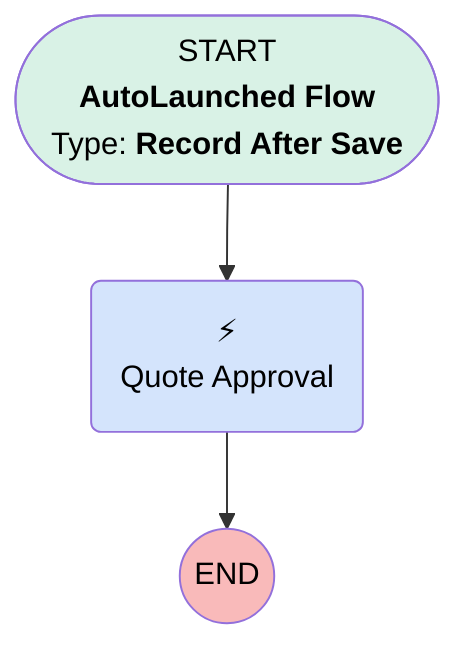

# [Quote][After-Save][Record-Triggered] Trigged Quote Approval Process

## Flow Diagram

## General Information

|<!-- -->|<!-- -->|
|:---|:---|
|Object|Quote|
|Process Type| Auto Launched Flow|
|Trigger Type| Record After Save|
|Record Trigger Type| Create And Update|
|Label|[Quote][After-Save][Record-Triggered] Trigged Quote Approval Process|
|Status|Active|
|Filter Formula|OR(     AND(ISNEW(), TEXT({!$Record.Status}) = "Needs Review"),     AND(ISCHANGED({!$Record.Status}), TEXT({!$Record.Status}) = "Needs Review") )|
|Description|This flow triggers the approval process for the quote over 5000€.|
|Environments|Default|
|Interview Label|[Quote][After-Save][Record-Triggered] Trigged Quote Approval Process {!$Flow.CurrentDateTime}|
| Builder Type (PM)|LightningFlowBuilder|
| Canvas Mode (PM)|AUTO_LAYOUT_CANVAS|
| Origin Builder Type (PM)|LightningFlowBuilder|
|Connector|[Quote_Approval](#quote_approval)|
|Next Node|[Quote_Approval](#quote_approval)|

## Flow Nodes Details

### Quote_Approval

|<!-- -->|<!-- -->|
|:---|:---|
|Type|Action Call|
|Label|Quote Approval|
|Action Type|Submit|
|Action Name|submit|
|Flow Transaction Model|CurrentTransaction|
|Name Segment|submit|
|Offset|0|
|Store Output Automatically|✅|
|Version Segment|1|
|Object Id (input)|$Record.Id|
|Process Definition Name Or Id (input)|04aKF00000056Nb|

___

_Documentation generated from branch monitoring_krinkelsgreencare__upeodev_sandbox by [sfdx-hardis](https://sfdx-hardis.cloudity.com), featuring [salesforce-flow-visualiser](https://github.com/toddhalfpenny/salesforce-flow-visualiser)_