# [Quote] - [Gantt Action] - Clone

## Flow Diagram

```mermaid
%% If you read this, your Markdown visualizer does not handle MermaidJS syntax.
%% - If you are in VsCode, install extension `Markdown Preview Mermaid Support` at https://marketplace.visualstudio.com/items?itemName=bierner.markdown-mermaid
%% - If you are using sfdx-hardis, try to define env variable `MERMAID_MODES=cli,docker` ,then run again the command to regenerate markdown with SVG images.
%% - If you are within mkdocs-material, define mermaid plugin in `mkdocs.yml` as described in https://squidfunk.github.io/mkdocs-material/extensions/mermaid/
%% - At last resort, you can copy-paste this MermaidJS code in https://mermaid.live/ to see the Flow Diagram

flowchart TB
START(["START<br/><b>Screen Flow</b>"]):::startClass
click START "#general-information" "3893586156"

Set_New_Work_Order_Values[\"🟰 <em></em><br/>Set New Work Order Values"/]:::assignments
click Set_New_Work_Order_Values "#set_new_work_order_values" "882684925"

Set_Scheduled_Start_and_End[\"🟰 <em></em><br/>Set Scheduled Start and End"/]:::assignments
click Set_Scheduled_Start_and_End "#set_scheduled_start_and_end" "2744915596"

Create_Assigned_Resource[("➕ <em></em><br/>Create Assigned Resource")]:::recordCreates
click Create_Assigned_Resource "#create_assigned_resource" "4123503810"

Create_Work_Order[("➕ <em></em><br/>Create Work Order")]:::recordCreates
click Create_Work_Order "#create_work_order" "194413013"

Get_Original_Service_Appoinment[("🔍 <em></em><br/>Get Original Service Appoinment")]:::recordLookups
click Get_Original_Service_Appoinment "#get_original_service_appoinment" "818055431"

Get_Service_Appointment_of_New_Work_Order[("🔍 <em></em><br/>Get Service Appointment of New Work Order")]:::recordLookups
click Get_Service_Appointment_of_New_Work_Order "#get_service_appointment_of_new_work_order" "4221989282"

Get_Work_Order[("🔍 <em></em><br/>Get Work Order")]:::recordLookups
click Get_Work_Order "#get_work_order" "3861989089"

Update_New_Service_Appointment[("🛠️ <em></em><br/>Update New Service Appointment")]:::recordUpdates
click Update_New_Service_Appointment "#update_new_service_appointment" "1867985776"

Clone_Work_Order(["💻 <em></em><br/>Clone Work Order"]):::screens
click Clone_Work_Order "#clone_work_order" "1198341145"

Set_New_Work_Order_Values --> Clone_Work_Order
Set_Scheduled_Start_and_End --> Update_New_Service_Appointment
Create_Assigned_Resource --> END_Create_Assigned_Resource
Create_Work_Order --> Get_Service_Appointment_of_New_Work_Order
Get_Original_Service_Appoinment --> Get_Work_Order
Get_Service_Appointment_of_New_Work_Order --> Set_Scheduled_Start_and_End
Get_Work_Order --> Set_New_Work_Order_Values
Update_New_Service_Appointment --> Create_Assigned_Resource
Clone_Work_Order --> Create_Work_Order
START -->  Get_Original_Service_Appoinment
END_Create_Assigned_Resource(( END )):::endClass


classDef actionCalls fill:#D4E4FC,color:black,max-height:100px
classDef assignments fill:#FBEED7,color:black,max-height:100px
classDef collectionProcessors fill:#F0E3FA,color:black,max-height:100px
classDef customErrors fill:#FFE9E9,color:black,max-height:100px
classDef decisions fill:#FDEAF6,color:black,max-height:100px
classDef loops fill:#FDEAF6,color:black,max-height:100px
classDef recordCreates fill:#FFF8C9,color:black,max-height:100px
classDef recordDeletes fill:#FFF8C9,color:black,max-height:100px
classDef recordLookups fill:#EDEAFF,color:black,max-height:100px
classDef recordUpdates fill:#FFF8C9,color:black,max-height:100px
classDef screens fill:#DFF6FF,color:black,max-height:100px
classDef subflows fill:#D4E4FC,color:black,max-height:100px
classDef startClass fill:#D9F2E6,color:black,max-height:100px
classDef endClass fill:#F9BABA,color:black,max-height:100px


```

## General Information

|<!-- -->|<!-- -->|
|:---|:---|
|Process Type| Flow|
|Label|[Quote] - [Gantt Action] - Clone|
|Status|⚠️ Draft|
|Environments|Default|
|Interview Label|[Quote] - [Gantt Action] - Clone {!$Flow.CurrentDateTime}|
| Builder Type (PM)|LightningFlowBuilder|
| Canvas Mode (PM)|AUTO_LAYOUT_CANVAS|
| Origin Builder Type (PM)|LightningFlowBuilder|
|Connector|[Get_Original_Service_Appoinment](#get_original_service_appoinment)|
|Next Node|[Get_Original_Service_Appoinment](#get_original_service_appoinment)|

## Variables

|Name|Data Type|Is Collection|Is Input|Is Output|Object Type|
|:-- |:--:|:--:|:--:|:--:|:--: |
|newWorkOrder|SObject|⬜|⬜|⬜|WorkOrder|
|serviceAppointmentId|String|⬜|✅|⬜|<!-- -->|

## Flow Nodes Details

### Set_New_Work_Order_Values

|<!-- -->|<!-- -->|
|:---|:---|
|Type|Assignment|
|Label|Set New Work Order Values|
|Connector|[Clone_Work_Order](#clone_work_order)|

#### Assignments

|Assign To Reference|Operator|Value|
|:-- |:--:|:--: |
|newWorkOrder.AccountId| Assign|Get_Work_Order.AccountId|
|newWorkOrder.AssetId| Assign|Get_Work_Order.AssetId|
|newWorkOrder.ContactId| Assign|Get_Work_Order.ContactId|
|newWorkOrder.MaintenancePlanId| Assign|Get_Work_Order.MaintenancePlanId|
|newWorkOrder.ServiceTerritoryId| Assign|Get_Work_Order.ServiceTerritoryId|
|newWorkOrder.WorkTypeId| Assign|Get_Work_Order.WorkTypeId|
|newWorkOrder.Street| Assign|Get_Work_Order.Street|
|newWorkOrder.City| Assign|Get_Work_Order.City|
|newWorkOrder.PostalCode| Assign|Get_Work_Order.PostalCode|
|newWorkOrder.Country| Assign|Get_Work_Order.Country|
|newWorkOrder.Subject| Assign|Get_Work_Order.Subject|
|newWorkOrder.SuggestedMaintenanceDate| Assign|Get_Work_Order.SuggestedMaintenanceDate|
|newWorkOrder.ServiceContractId| Assign|Get_Work_Order.ServiceContractId|
|newWorkOrder.LMRA_Type_formula__c| Assign|Get_Work_Order.LMRA_Type_formula__c|
|newWorkOrder.Check_In_At_Work_Required__c| Assign|Get_Work_Order.Check_In_At_Work_Required__c|
|newWorkOrder.Special_Equipment__c| Assign|Get_Work_Order.Special_Equipment__c|
|newWorkOrder.Check_In_At_Work_Reference__c| Assign|Get_Work_Order.Check_In_At_Work_Reference__c|

### Set_Scheduled_Start_and_End

|<!-- -->|<!-- -->|
|:---|:---|
|Type|Assignment|
|Label|Set Scheduled Start and End|
|Connector|[Update_New_Service_Appointment](#update_new_service_appointment)|

#### Assignments

|Assign To Reference|Operator|Value|
|:-- |:--:|:--: |
|Get_Service_Appointment_of_New_Work_Order.SchedStartTime| Assign|Time_to_Schedule|
|Get_Service_Appointment_of_New_Work_Order.SchedEndTime| Assign|End|

### Create_Assigned_Resource

|<!-- -->|<!-- -->|
|:---|:---|
|Type|Record Create|
|Object|AssignedResource|
|Label|Create Assigned Resource|
|Store Output Automatically|✅|

#### Input Assignments

|Field|Value|
|:-- |:--: |
|ServiceAppointmentId|Get_Service_Appointment_of_New_Work_Order.Id|
|ServiceResourceId|Crew.recordId|

### Create_Work_Order

|<!-- -->|<!-- -->|
|:---|:---|
|Type|Record Create|
|Label|Create Work Order|
|Input Reference|newWorkOrder|
|Connector|[Get_Service_Appointment_of_New_Work_Order](#get_service_appointment_of_new_work_order)|

### Get_Original_Service_Appoinment

|<!-- -->|<!-- -->|
|:---|:---|
|Type|Record Lookup|
|Object|ServiceAppointment|
|Label|Get Original Service Appoinment|
|Assign Null Values If No Records Found|⬜|
|Get First Record Only|✅|
|Store Output Automatically|✅|
|Connector|[Get_Work_Order](#get_work_order)|

#### Filters (logic: **and**)

|Filter Id|Field|Operator|Value|
|:-- |:-- |:--:|:--: |
|1|Id| Equal To|serviceAppointmentId|

### Get_Service_Appointment_of_New_Work_Order

|<!-- -->|<!-- -->|
|:---|:---|
|Type|Record Lookup|
|Object|ServiceAppointment|
|Label|Get Service Appointment of New Work Order|
|Assign Null Values If No Records Found|⬜|
|Get First Record Only|✅|
|Store Output Automatically|✅|
|Connector|[Set_Scheduled_Start_and_End](#set_scheduled_start_and_end)|

#### Filters (logic: **and**)

|Filter Id|Field|Operator|Value|
|:-- |:-- |:--:|:--: |
|1|ParentRecordId| Equal To|newWorkOrder.Id|

### Get_Work_Order

|<!-- -->|<!-- -->|
|:---|:---|
|Type|Record Lookup|
|Object|WorkOrder|
|Label|Get Work Order|
|Assign Null Values If No Records Found|⬜|
|Get First Record Only|✅|
|Store Output Automatically|✅|
|Connector|[Set_New_Work_Order_Values](#set_new_work_order_values)|

#### Filters (logic: **and**)

|Filter Id|Field|Operator|Value|
|:-- |:-- |:--:|:--: |
|1|Id| Equal To|Get_Original_Service_Appoinment.ParentRecordId|

### Update_New_Service_Appointment

|<!-- -->|<!-- -->|
|:---|:---|
|Type|Record Update|
|Label|Update New Service Appointment|
|Input Reference|[Get_Service_Appointment_of_New_Work_Order](#get_service_appointment_of_new_work_order)|
|Connector|[Create_Assigned_Resource](#create_assigned_resource)|

### Clone_Work_Order

|<!-- -->|<!-- -->|
|:---|:---|
|Type|Screen|
|Label|Clone Work Order|
|Allow Back|✅|
|Allow Finish|✅|
|Allow Pause|✅|
|Show Footer|✅|
|Show Header|✅|
|Connector|[Create_Work_Order](#create_work_order)|

#### Crew

|<!-- -->|<!-- -->|
|:---|:---|
|Extension Name|flowruntime:lookup|
|Field Type| Component Instance|
|Inputs On Next Nav To Assoc Scrn| Use Stored Values|
|Is Required|✅|
|Store Output Automatically|✅|
|Parent Field|[Clone_Work_Order_Section1_Column1](#clone_work_order_section1_column1)|
|Field Api Name (input)|ServiceResourceId|
|Label (input)|Service Resource|
|Object Api Name (input)|AssignedResource|

#### Time_to_Schedule

|<!-- -->|<!-- -->|
|:---|:---|
|Data Type|DateTime|
|Default Value|Get_Original_Service_Appoinment.SchedStartTime|
|Field Text|Start|
|Field Type| Input Field|
|Inputs On Next Nav To Assoc Scrn| Use Stored Values|
|Is Required|⬜|
|Parent Field|[Clone_Work_Order_Section1_Column1](#clone_work_order_section1_column1)|

#### Clone_Work_Order_Section1_Column1

|<!-- -->|<!-- -->|
|:---|:---|
|Field Type| Region|
|Is Required|⬜|
|Parent Field|[Clone_Work_Order_Section1](#clone_work_order_section1)|
|Width (input)|6|

#### newWorkOrder.Subject

|<!-- -->|<!-- -->|
|:---|:---|
|Field Type| Object Provided|
|Inputs On Next Nav To Assoc Scrn| Use Stored Values|
|Is Required|⬜|
|Object Field Reference|newWorkOrder.Subject|
|Parent Field|[Clone_Work_Order_Section1_Column2](#clone_work_order_section1_column2)|

#### End

|<!-- -->|<!-- -->|
|:---|:---|
|Data Type|DateTime|
|Default Value|Get_Original_Service_Appoinment.SchedEndTime|
|Field Text|End|
|Field Type| Input Field|
|Inputs On Next Nav To Assoc Scrn| Use Stored Values|
|Is Required|⬜|
|Parent Field|[Clone_Work_Order_Section1_Column2](#clone_work_order_section1_column2)|

#### Clone_Work_Order_Section1_Column2

|<!-- -->|<!-- -->|
|:---|:---|
|Field Type| Region|
|Is Required|⬜|
|Parent Field|[Clone_Work_Order_Section1](#clone_work_order_section1)|
|Width (input)|6|

#### Clone_Work_Order_Section1

|<!-- -->|<!-- -->|
|:---|:---|
|Field Type| Region Container|
|Is Required|⬜|
|Region Container Type| Section Without Header|

___

_Documentation generated from branch monitoring_krinkelsgreencare__upeodev_sandbox by [sfdx-hardis](https://sfdx-hardis.cloudity.com), featuring [salesforce-flow-visualiser](https://github.com/toddhalfpenny/salesforce-flow-visualiser)_