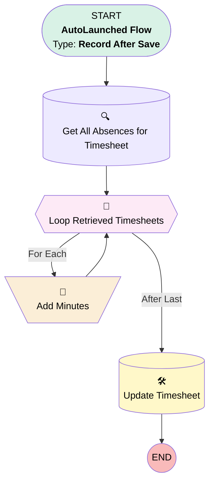

# [ResourceAbsence] - After Save - Set Total Absence Time on TimeSheet

## Flow Diagram [(_View History_)](ResourceAbsence_After_Save_Set_Total_Absence_Time_on_TimeSheet-history.md)

## General Information

|<!-- -->|<!-- -->|
|:---|:---|
|Object|ResourceAbsence|
|Process Type| Auto Launched Flow|
|Trigger Type| Record After Save|
|Record Trigger Type| Create And Update|
|Label|[ResourceAbsence] - After Save - Set Total Absence Time on TimeSheet|
|Status|Active|
|Environments|Default|
|Interview Label|[ResourceAbsence] - After Save - Set Total Absence Time on TimeSheet {!$Flow.CurrentDateTime}|
| Builder Type (PM)|LightningFlowBuilder|
| Canvas Mode (PM)|AUTO_LAYOUT_CANVAS|
| Origin Builder Type (PM)|LightningFlowBuilder|
|Connector|[Get_All_Absences_for_Timesheet](#get_all_absences_for_timesheet)|
|Next Node|[Get_All_Absences_for_Timesheet](#get_all_absences_for_timesheet)|

#### Filters (logic: **and**)

|Filter Id|Field|Operator|Value|
|:-- |:-- |:--:|:--: |
|1|Time_Sheet__c| Is Null|<!-- -->|

## Variables

|Name|Data Type|Is Collection|Is Input|Is Output|Object Type|Description|
|:-- |:--:|:--:|:--:|:--:|:--:|:--  |
|totalDuration|Number|⬜|⬜|⬜|<!-- -->|<!-- -->|

## Formulas

|Name|Data Type|Expression|Description|
|:-- |:--:|:-- |:--  |
|absenceDuration|Number|IF (ISBLANK({!Loop_Retrieved_Timesheets.Start}), 0, ({!Loop_Retrieved_Timesheets.End}- {!Loop_Retrieved_Timesheets.Start})*24*60)|<!-- -->|

## Flow Nodes Details

### Add_Minutes

|<!-- -->|<!-- -->|
|:---|:---|
|Type|Assignment|
|Label|Add Minutes|
|Connector|[Loop_Retrieved_Timesheets](#loop_retrieved_timesheets)|

#### Assignments

|Assign To Reference|Operator|Value|
|:-- |:--:|:--: |
|totalDuration| Add|absenceDuration|

### Loop_Retrieved_Timesheets

|<!-- -->|<!-- -->|
|:---|:---|
|Type|Loop|
|Label|Loop Retrieved Timesheets|
|Collection Reference|[Get_All_Absences_for_Timesheet](#get_all_absences_for_timesheet)|
|Iteration Order|Asc|
|Next Value Connector|[Add_Minutes](#add_minutes)|
|No More Values Connector|[Update_Timesheet](#update_timesheet)|

### Get_All_Absences_for_Timesheet

|<!-- -->|<!-- -->|
|:---|:---|
|Type|Record Lookup|
|Object|ResourceAbsence|
|Label|Get All Absences for Timesheet|
|Assign Null Values If No Records Found|⬜|
|Get First Record Only|⬜|
|Store Output Automatically|✅|
|Connector|[Loop_Retrieved_Timesheets](#loop_retrieved_timesheets)|

#### Filters (logic: **and**)

|Filter Id|Field|Operator|Value|
|:-- |:-- |:--:|:--: |
|1|Time_Sheet__c| Equal To|$Record.Time_Sheet__c|

### Update_Timesheet

|<!-- -->|<!-- -->|
|:---|:---|
|Type|Record Update|
|Object|TimeSheet|
|Label|Update Timesheet|

#### Filters (logic: **and**)

|Filter Id|Field|Operator|Value|
|:-- |:-- |:--:|:--: |
|1|Id| Equal To|$Record.Time_Sheet__c|

#### Input Assignments

|Field|Value|
|:-- |:--: |
|Total_Break_and_Absent_Time_Minutes__c|totalDuration|

___

_Documentation generated from branch monitoring_krinkelsgreencare__upeodev_sandbox by [sfdx-hardis](https://sfdx-hardis.cloudity.com), featuring [salesforce-flow-visualiser](https://github.com/toddhalfpenny/salesforce-flow-visualiser)_