# [ResourceAbsence] - Before Save - Set Timesheet Id

## Flow Diagram

```mermaid
%% If you read this, your Markdown visualizer does not handle MermaidJS syntax.
%% - If you are in VsCode, install extension `Markdown Preview Mermaid Support` at https://marketplace.visualstudio.com/items?itemName=bierner.markdown-mermaid
%% - If you are using sfdx-hardis, try to define env variable `MERMAID_MODES=cli,docker` ,then run again the command to regenerate markdown with SVG images.
%% - If you are within mkdocs-material, define mermaid plugin in `mkdocs.yml` as described in https://squidfunk.github.io/mkdocs-material/extensions/mermaid/
%% - At last resort, you can copy-paste this MermaidJS code in https://mermaid.live/ to see the Flow Diagram

flowchart TB
START(["START<br/><b>AutoLaunched Flow</b></br>Type: <b> Record After Save</b>"]):::startClass
click START "#general-information" "770930340"

Set_Timesheet_Id[\"🟰 <em></em><br/>Set Timesheet Id"/]:::assignments
click Set_Timesheet_Id "#set_timesheet_id" "1372271156"

Resource_Check{"🔀 <em></em><br/>Resource Check"}:::decisions
click Resource_Check "#resource_check" "1443661295"

Get_Service_Resource_Id[("🔍 <em></em><br/>Get Service Resource Id")]:::recordLookups
click Get_Service_Resource_Id "#get_service_resource_id" "4076115363"

Get_Timesheet[("🔍 <em></em><br/>Get Timesheet")]:::recordLookups
click Get_Timesheet "#get_timesheet" "3608309128"

Set_Timesheet_Id --> END_Set_Timesheet_Id
Resource_Check --> |"Found Resource"| Get_Timesheet
Resource_Check --> |"Default Outcome"| END_Resource_Check
Get_Service_Resource_Id --> Resource_Check
Get_Timesheet --> Set_Timesheet_Id
START -->  Get_Service_Resource_Id
END_Set_Timesheet_Id(( END )):::endClass
END_Resource_Check(( END )):::endClass


classDef actionCalls fill:#D4E4FC,color:black,max-height:100px
classDef assignments fill:#FBEED7,color:black,max-height:100px
classDef collectionProcessors fill:#F0E3FA,color:black,max-height:100px
classDef customErrors fill:#FFE9E9,color:black,max-height:100px
classDef decisions fill:#FDEAF6,color:black,max-height:100px
classDef loops fill:#FDEAF6,color:black,max-height:100px
classDef recordCreates fill:#FFF8C9,color:black,max-height:100px
classDef recordDeletes fill:#FFF8C9,color:black,max-height:100px
classDef recordLookups fill:#EDEAFF,color:black,max-height:100px
classDef recordUpdates fill:#FFF8C9,color:black,max-height:100px
classDef screens fill:#DFF6FF,color:black,max-height:100px
classDef subflows fill:#D4E4FC,color:black,max-height:100px
classDef startClass fill:#D9F2E6,color:black,max-height:100px
classDef endClass fill:#F9BABA,color:black,max-height:100px


```

## General Information

|<!-- -->|<!-- -->|
|:---|:---|
|Object|ResourceAbsence|
|Process Type| Auto Launched Flow|
|Trigger Type| Record After Save|
|Record Trigger Type| Create|
|Label|[ResourceAbsence] - Before Save - Set Timesheet Id|
|Status|Obsolete|
|Environments|Default|
|Interview Label|[ResourceAbsence] - Before Save - Set Timesheet Id {!$Flow.CurrentDateTime}|
| Builder Type (PM)|LightningFlowBuilder|
| Canvas Mode (PM)|AUTO_LAYOUT_CANVAS|
| Origin Builder Type (PM)|LightningFlowBuilder|
|Connector|[Get_Service_Resource_Id](#get_service_resource_id)|
|Next Node|[Get_Service_Resource_Id](#get_service_resource_id)|

#### Filters (logic: **and**)

|Filter Id|Field|Operator|Value|
|:-- |:-- |:--:|:--: |
|1|Type| Equal To|Standard|

## Flow Nodes Details

### Set_Timesheet_Id

|<!-- -->|<!-- -->|
|:---|:---|
|Type|Assignment|
|Label|Set Timesheet Id|

#### Assignments

|Assign To Reference|Operator|Value|
|:-- |:--:|:--: |
|$Record.Time_Sheet__c| Assign|Get_Timesheet.Id|

### Resource_Check

|<!-- -->|<!-- -->|
|:---|:---|
|Type|Decision|
|Label|Resource Check|
|Default Connector Label|Default Outcome|

#### Rule Found_Resource (Found Resource)

|<!-- -->|<!-- -->|
|:---|:---|
|Connector|[Get_Timesheet](#get_timesheet)|
|Condition Logic|and|

|Condition Id|Left Value Reference|Operator|Right Value|
|:-- |:-- |:--:|:--: |
|1|[Get_Service_Resource_Id](#get_service_resource_id)| Is Null|⬜|

### Get_Service_Resource_Id

|<!-- -->|<!-- -->|
|:---|:---|
|Type|Record Lookup|
|Object|ServiceResource|
|Label|Get Service Resource Id|
|Assign Null Values If No Records Found|⬜|
|Get First Record Only|✅|
|Store Output Automatically|✅|
|Connector|[Resource_Check](#resource_check)|

#### Filters (logic: **and**)

|Filter Id|Field|Operator|Value|
|:-- |:-- |:--:|:--: |
|1|RelatedRecordId| Equal To|$User.Id|

### Get_Timesheet

|<!-- -->|<!-- -->|
|:---|:---|
|Type|Record Lookup|
|Object|TimeSheet|
|Label|Get Timesheet|
|Assign Null Values If No Records Found|⬜|
|Get First Record Only|✅|
|Store Output Automatically|✅|
|Connector|[Set_Timesheet_Id](#set_timesheet_id)|

#### Filters (logic: **and**)

|Filter Id|Field|Operator|Value|
|:-- |:-- |:--:|:--: |
|1|ServiceResourceId| Equal To|Get_Service_Resource_Id.Id|
|2|StartDate| Equal To|absenceDate|

___

_Documentation generated from branch monitoring_krinkelsgreencare__upeodev_sandbox by [sfdx-hardis](https://sfdx-hardis.cloudity.com), featuring [salesforce-flow-visualiser](https://github.com/toddhalfpenny/salesforce-flow-visualiser)_