# [Service Appointment][After-Save][Record-Triggered] Add Customer Notification Data

## Flow Diagram

```mermaid
%% If you read this, your Markdown visualizer does not handle MermaidJS syntax.
%% - If you are in VsCode, install extension `Markdown Preview Mermaid Support` at https://marketplace.visualstudio.com/items?itemName=bierner.markdown-mermaid
%% - If you are using sfdx-hardis, try to define env variable `MERMAID_MODES=cli,docker` ,then run again the command to regenerate markdown with SVG images.
%% - If you are within mkdocs-material, define mermaid plugin in `mkdocs.yml` as described in https://squidfunk.github.io/mkdocs-material/extensions/mermaid/
%% - At last resort, you can copy-paste this MermaidJS code in https://mermaid.live/ to see the Flow Diagram

flowchart TB
START(["START<br/><b>AutoLaunched Flow</b></br>Type: <b> Record After Save</b>"]):::startClass
click START "#general-information" "1208111889"

Retrigger_notification{"🔀 <em></em><br/>Retrigger notification"}:::decisions
click Retrigger_notification "#retrigger_notification" "1832325384"

Get_Work_Order[("🔍 <em></em><br/>Get Work Order")]:::recordLookups
click Get_Work_Order "#get_work_order" "2302282943"

Retrigger_Notification_Send[("🛠️ <em></em><br/>Retrigger Notification Send")]:::recordUpdates
click Retrigger_Notification_Send "#retrigger_notification_send" "1470581268"

Update_Start_Date_Work_Order[("🛠️ <em></em><br/>Update Start Date Work Order")]:::recordUpdates
click Update_Start_Date_Work_Order "#update_start_date_work_order" "3788572289"

Retrigger_notification --> |"Yes"| Retrigger_Notification_Send
Retrigger_notification --> |"No"| Update_Start_Date_Work_Order
Get_Work_Order --> Retrigger_notification
Retrigger_Notification_Send --> Update_Start_Date_Work_Order
Update_Start_Date_Work_Order --> END_Update_Start_Date_Work_Order
START -->  Get_Work_Order
END_Update_Start_Date_Work_Order(( END )):::endClass


classDef actionCalls fill:#D4E4FC,color:black,max-height:100px
classDef assignments fill:#FBEED7,color:black,max-height:100px
classDef collectionProcessors fill:#F0E3FA,color:black,max-height:100px
classDef customErrors fill:#FFE9E9,color:black,max-height:100px
classDef decisions fill:#FDEAF6,color:black,max-height:100px
classDef loops fill:#FDEAF6,color:black,max-height:100px
classDef recordCreates fill:#FFF8C9,color:black,max-height:100px
classDef recordDeletes fill:#FFF8C9,color:black,max-height:100px
classDef recordLookups fill:#EDEAFF,color:black,max-height:100px
classDef recordUpdates fill:#FFF8C9,color:black,max-height:100px
classDef screens fill:#DFF6FF,color:black,max-height:100px
classDef subflows fill:#D4E4FC,color:black,max-height:100px
classDef startClass fill:#D9F2E6,color:black,max-height:100px
classDef endClass fill:#F9BABA,color:black,max-height:100px


```

## General Information

|<!-- -->|<!-- -->|
|:---|:---|
|Object|ServiceAppointment|
|Process Type| Auto Launched Flow|
|Trigger Type| Record After Save|
|Record Trigger Type| Create And Update|
|Label|[Service Appointment][After-Save][Record-Triggered] Add Customer Notification Data|
|Status|Active|
|Filter Formula|(TEXT({!$Record.Status} )= "Scheduled" && ISCHANGED({!$Record.SchedStartTime})) || (ISCHANGED ({!$Record.Status}) && TEXT({!$Record.Status} )= "Scheduled")|
|Description|Flow that sents field to retrigger the notification to the customer if a SA is rescheduled|
|Environments|Default|
|Interview Label|[Service Appointment][After-Save][Record-Triggered] Add Customer Notification Data {!$Flow.CurrentDateTime}|
| Builder Type (PM)|LightningFlowBuilder|
| Canvas Mode (PM)|AUTO_LAYOUT_CANVAS|
| Origin Builder Type (PM)|LightningFlowBuilder|
|Connector|[Get_Work_Order](#get_work_order)|
|Next Node|[Get_Work_Order](#get_work_order)|

## Flow Nodes Details

### Retrigger_notification

|<!-- -->|<!-- -->|
|:---|:---|
|Type|Decision|
|Label|Retrigger notification|
|Default Connector|[Update_Start_Date_Work_Order](#update_start_date_work_order)|
|Default Connector Label|No|

#### Rule Yes (Yes)

|<!-- -->|<!-- -->|
|:---|:---|
|Connector|[Retrigger_Notification_Send](#retrigger_notification_send)|
|Condition Logic|and|

|Condition Id|Left Value Reference|Operator|Right Value|
|:-- |:-- |:--:|:--: |
|1|$Record.Scheduling_Notification_Send__c| Equal To|Send|

### Get_Work_Order

|<!-- -->|<!-- -->|
|:---|:---|
|Type|Record Lookup|
|Object|WorkOrder|
|Label|Get Work Order|
|Assign Null Values If No Records Found|⬜|
|Get First Record Only|✅|
|Store Output Automatically|✅|
|Connector|[Retrigger_notification](#retrigger_notification)|

#### Filters (logic: **and**)

|Filter Id|Field|Operator|Value|
|:-- |:-- |:--:|:--: |
|1|Id| Equal To|$Record.ParentRecordId|

### Retrigger_Notification_Send

|<!-- -->|<!-- -->|
|:---|:---|
|Type|Record Update|
|Label|Retrigger Notification Send|
|Input Reference|$Record|
|Connector|[Update_Start_Date_Work_Order](#update_start_date_work_order)|

#### Input Assignments

|Field|Value|
|:-- |:--: |
|Scheduling_Notification_Send__c|Resend Needed|

### Update_Start_Date_Work_Order

|<!-- -->|<!-- -->|
|:---|:---|
|Type|Record Update|
|Object|WorkOrder|
|Label|Update Start Date Work Order|

#### Filters (logic: **and**)

|Filter Id|Field|Operator|Value|
|:-- |:-- |:--:|:--: |
|1|Id| Equal To|$Record.ParentRecordId|

#### Input Assignments

|Field|Value|
|:-- |:--: |
|Scheduled_Date__c|ScheduledDate|

___

_Documentation generated from branch monitoring_krinkelsgreencare__upeodev_sandbox by [sfdx-hardis](https://sfdx-hardis.cloudity.com), featuring [salesforce-flow-visualiser](https://github.com/toddhalfpenny/salesforce-flow-visualiser)_