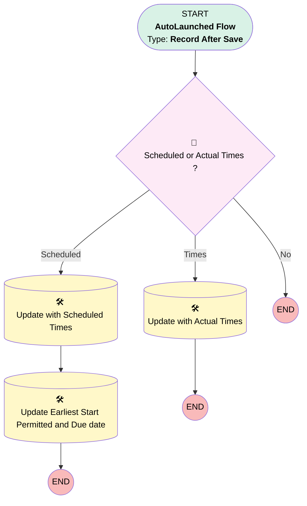

# [Service Appointment][After-Save][Record-Triggered] Populate Start/End Date on WO

## Flow Diagram

## General Information

|<!-- -->|<!-- -->|
|:---|:---|
|Object|ServiceAppointment|
|Process Type| Auto Launched Flow|
|Trigger Type| Record After Save|
|Record Trigger Type| Create And Update|
|Label|[Service Appointment][After-Save][Record-Triggered] Populate Start/End Date on WO|
|Status|Active|
|Description|This flow updates the start date and end date fields on WO, based on the values of scheduled start and scheduled end fields on the related SA.|
|Environments|Default|
|Interview Label|[Service Appointment][After-Save][Record-Triggered] Populate Start/End Date on WO {!$Flow.CurrentDateTime}|
| Builder Type (PM)|LightningFlowBuilder|
| Canvas Mode (PM)|AUTO_LAYOUT_CANVAS|
| Origin Builder Type (PM)|LightningFlowBuilder|
|Connector|[Scheduled_or_Actual_Times](#scheduled_or_actual_times)|
|Next Node|[Scheduled_or_Actual_Times](#scheduled_or_actual_times)|

#### Filters (logic: **(1 AND 2 ) OR (3 AND 4) OR (5 AND 6) OR (7 AND 8)**)

|Filter Id|Field|Operator|Value|
|:-- |:-- |:--:|:--: |
|1|SchedStartTime| Is Changed|✅|
|2|SchedStartTime| Is Null|<!-- -->|
|3|SchedEndTime| Is Changed|✅|
|4|SchedEndTime| Is Null|<!-- -->|
|5|ActualStartTime| Is Changed|✅|
|6|ActualStartTime| Is Null|<!-- -->|
|7|ActualEndTime| Is Changed|✅|
|8|ActualEndTime| Is Null|<!-- -->|

## Formulas

|Name|Data Type|Expression|
|:-- |:--:|:--  |
|NewDueDate|DateTime|DATETIMEVALUE({!$Record.SchedEndTime} + 7)|
|NewEarliestStartPermitted|DateTime|DATETIMEVALUE({!$Record.SchedStartTime} - 7)|

## Flow Nodes Details

### Scheduled_or_Actual_Times

|<!-- -->|<!-- -->|
|:---|:---|
|Type|Decision|
|Label|Scheduled or Actual Times ?|
|Default Connector Label|No|

#### Rule Scheduled (Scheduled)

|<!-- -->|<!-- -->|
|:---|:---|
|Connector|[Update_with_Scheduled_Times](#update_with_scheduled_times)|
|Condition Logic|(1 AND 2) OR (3 AND 4)|

|Condition Id|Left Value Reference|Operator|Right Value|
|:-- |:-- |:--:|:--: |
|1|$Record.SchedStartTime| Is Changed|✅|
|2|$Record.SchedStartTime| Is Null|⬜|
|3|$Record.SchedEndTime| Is Changed|✅|
|4|$Record.SchedEndTime| Is Null|⬜|

#### Rule Times (Times)

|<!-- -->|<!-- -->|
|:---|:---|
|Connector|[Update_with_Actual_Times](#update_with_actual_times)|
|Condition Logic|(1 AND 2) OR (3 AND 4)|

|Condition Id|Left Value Reference|Operator|Right Value|
|:-- |:-- |:--:|:--: |
|1|$Record.ActualStartTime| Is Changed|✅|
|2|$Record.ActualStartTime| Is Null|⬜|
|3|$Record.ActualEndTime| Is Changed|✅|
|4|$Record.ActualEndTime| Is Null|⬜|

### Update_Earliest_Start_Permitted_and_Due_date

|<!-- -->|<!-- -->|
|:---|:---|
|Type|Record Update|
|Label|Update Earliest Start Permitted and Due date|
|Input Reference|$Record|

#### Input Assignments

|Field|Value|
|:-- |:--: |
|DueDate|NewDueDate|
|EarliestStartTime|NewEarliestStartPermitted|

### Update_with_Actual_Times

|<!-- -->|<!-- -->|
|:---|:---|
|Type|Record Update|
|Object|WorkOrder|
|Label|Update with Actual Times|

#### Filters (logic: **and**)

|Filter Id|Field|Operator|Value|
|:-- |:-- |:--:|:--: |
|1|Id| Equal To|$Record.ParentRecordId|

#### Input Assignments

|Field|Value|
|:-- |:--: |
|EndDate|$Record.ActualEndTime|
|StartDate|$Record.ActualStartTime|

### Update_with_Scheduled_Times

|<!-- -->|<!-- -->|
|:---|:---|
|Type|Record Update|
|Object|WorkOrder|
|Label|Update with Scheduled Times|
|Connector|[Update_Earliest_Start_Permitted_and_Due_date](#update_earliest_start_permitted_and_due_date)|

#### Filters (logic: **and**)

|Filter Id|Field|Operator|Value|
|:-- |:-- |:--:|:--: |
|1|Id| Equal To|$Record.ParentRecordId|

#### Input Assignments

|Field|Value|
|:-- |:--: |
|EndDate|$Record.SchedEndTime|
|StartDate|$Record.SchedStartTime|

___

_Documentation generated from branch monitoring_krinkelsgreencare__upeodev_sandbox by [sfdx-hardis](https://sfdx-hardis.cloudity.com), featuring [salesforce-flow-visualiser](https://github.com/toddhalfpenny/salesforce-flow-visualiser)_