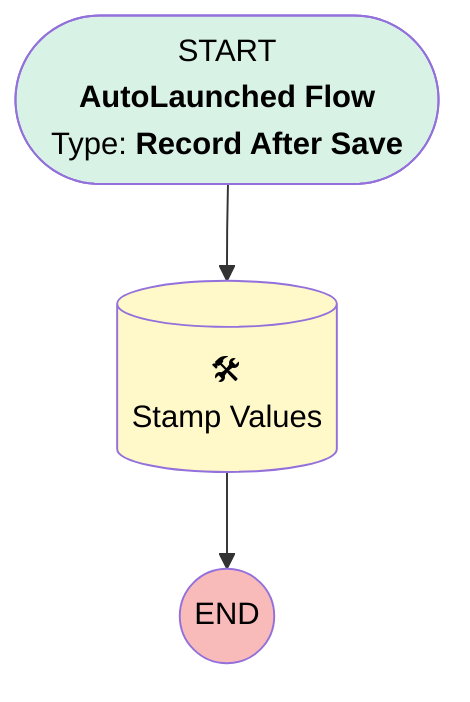

# [Service Appointment][After-Save][Record-Triggered] Stamp Original Planning Window

## Flow Diagram

## General Information

|<!-- -->|<!-- -->|
|:---|:---|
|Object|ServiceAppointment|
|Process Type| Auto Launched Flow|
|Trigger Type| Record After Save|
|Record Trigger Type| Create|
|Label|[Service Appointment][After-Save][Record-Triggered] Stamp Original Planning Window|
|Status|Obsolete|
|Description|This flow stamps the original earliest start permitted and due date. In order for an unscheduled appointment to recover its original values.|
|Environments|Default|
|Interview Label|[Service Appointment][After-Save][Record-Triggered] Stamp Original Planning Window {!$Flow.CurrentDateTime}|
| Builder Type (PM)|LightningFlowBuilder|
| Canvas Mode (PM)|AUTO_LAYOUT_CANVAS|
| Origin Builder Type (PM)|LightningFlowBuilder|
|Connector|[Stamp_Values](#stamp_values)|
|Next Node|[Stamp_Values](#stamp_values)|

## Flow Nodes Details

### Stamp_Values

|<!-- -->|<!-- -->|
|:---|:---|
|Type|Record Update|
|Label|Stamp Values|
|Input Reference|$Record|

#### Input Assignments

|Field|Value|
|:-- |:--: |
|Original_Due_Date__c|$Record.DueDate|
|Original_Earliest_Start_Permitted__c|$Record.EarliestStartTime|

___

_Documentation generated from branch monitoring_krinkelsgreencare__upeodev_sandbox by [sfdx-hardis](https://sfdx-hardis.cloudity.com), featuring [salesforce-flow-visualiser](https://github.com/toddhalfpenny/salesforce-flow-visualiser)_