# [Service Appointment][Before-Save][Record-Triggered] Add Service Document Template

## Flow Diagram

```mermaid
%% If you read this, your Markdown visualizer does not handle MermaidJS syntax.
%% - If you are in VsCode, install extension `Markdown Preview Mermaid Support` at https://marketplace.visualstudio.com/items?itemName=bierner.markdown-mermaid
%% - If you are using sfdx-hardis, try to define env variable `MERMAID_MODES=cli,docker` ,then run again the command to regenerate markdown with SVG images.
%% - If you are within mkdocs-material, define mermaid plugin in `mkdocs.yml` as described in https://squidfunk.github.io/mkdocs-material/extensions/mermaid/
%% - At last resort, you can copy-paste this MermaidJS code in https://mermaid.live/ to see the Flow Diagram

flowchart TB
START(["START<br/><b>AutoLaunched Flow</b></br>Type: <b> Record Before Save</b>"]):::startClass
click START "#general-information" "1919260297"

Signature_Required{"🔀 <em></em><br/>Signature Required"}:::decisions
click Signature_Required "#signature_required" "2394829277"

Get_Ids[("🔍 <em></em><br/>Get Ids")]:::recordLookups
click Get_Ids "#get_ids" "2167383171"

Get_Work_Order[("🔍 <em></em><br/>Get Work Order")]:::recordLookups
click Get_Work_Order "#get_work_order" "278917744"

Update_Service_Document_Template_Without_Signature[("🛠️ <em></em><br/>Update Service Document Template Without Signature")]:::recordUpdates
click Update_Service_Document_Template_Without_Signature "#update_service_document_template_without_signature" "1473899889"

Update_Service_Document_With_Signature[("🛠️ <em></em><br/>Update Service Document Template With Signature")]:::recordUpdates
click Update_Service_Document_With_Signature "#update_service_document_with_signature" "486600817"

Signature_Required --> |"Signature is Required"| Update_Service_Document_With_Signature
Signature_Required --> |"Default Outcome"| Update_Service_Document_Template_Without_Signature
Get_Ids --> Get_Work_Order
Get_Work_Order --> Signature_Required
Update_Service_Document_Template_Without_Signature --> END_Update_Service_Document_Template_Without_Signature
Update_Service_Document_With_Signature --> END_Update_Service_Document_With_Signature
START -->  Get_Ids
END_Update_Service_Document_Template_Without_Signature(( END )):::endClass
END_Update_Service_Document_With_Signature(( END )):::endClass


classDef actionCalls fill:#D4E4FC,color:black,max-height:100px
classDef assignments fill:#FBEED7,color:black,max-height:100px
classDef collectionProcessors fill:#F0E3FA,color:black,max-height:100px
classDef customErrors fill:#FFE9E9,color:black,max-height:100px
classDef decisions fill:#FDEAF6,color:black,max-height:100px
classDef loops fill:#FDEAF6,color:black,max-height:100px
classDef recordCreates fill:#FFF8C9,color:black,max-height:100px
classDef recordDeletes fill:#FFF8C9,color:black,max-height:100px
classDef recordLookups fill:#EDEAFF,color:black,max-height:100px
classDef recordUpdates fill:#FFF8C9,color:black,max-height:100px
classDef screens fill:#DFF6FF,color:black,max-height:100px
classDef subflows fill:#D4E4FC,color:black,max-height:100px
classDef startClass fill:#D9F2E6,color:black,max-height:100px
classDef endClass fill:#F9BABA,color:black,max-height:100px


```

## General Information

|<!-- -->|<!-- -->|
|:---|:---|
|Object|ServiceAppointment|
|Process Type| Auto Launched Flow|
|Trigger Type| Record Before Save|
|Record Trigger Type| Create And Update|
|Label|[Service Appointment][Before-Save][Record-Triggered] Add Service Document Template|
|Status|Active|
|Environments|Default|
|Interview Label|[Service Appointment][Before-Save][Record-Triggered] Add Service Document Template {!$Flow.CurrentDateTime}|
| Builder Type (PM)|LightningFlowBuilder|
| Canvas Mode (PM)|AUTO_LAYOUT_CANVAS|
| Origin Builder Type (PM)|LightningFlowBuilder|
|Connector|[Get_Ids](#get_ids)|
|Next Node|[Get_Ids](#get_ids)|

#### Filters (logic: **and**)

|Filter Id|Field|Operator|Value|
|:-- |:-- |:--:|:--: |
|1|ServiceDocumentTemplate| Is Null|<!-- -->|

## Flow Nodes Details

### Signature_Required

|<!-- -->|<!-- -->|
|:---|:---|
|Type|Decision|
|Label|Signature Required|
|Default Connector|[Update_Service_Document_Template_Without_Signature](#update_service_document_template_without_signature)|
|Default Connector Label|Default Outcome|

#### Rule Signature_is_Required (Signature is Required)

|<!-- -->|<!-- -->|
|:---|:---|
|Connector|[Update_Service_Document_With_Signature](#update_service_document_with_signature)|
|Condition Logic|and|

|Condition Id|Left Value Reference|Operator|Right Value|
|:-- |:-- |:--:|:--: |
|1|Get_Work_Order.Signature_Required__c| Equal To|✅|

### Get_Ids

|<!-- -->|<!-- -->|
|:---|:---|
|Type|Record Lookup|
|Object|Service_Document_Ids__mdt|
|Label|Get Ids|
|Assign Null Values If No Records Found|⬜|
|Get First Record Only|✅|
|Store Output Automatically|✅|
|Connector|[Get_Work_Order](#get_work_order)|

### Get_Work_Order

|<!-- -->|<!-- -->|
|:---|:---|
|Type|Record Lookup|
|Object|WorkOrder|
|Label|Get Work Order|
|Assign Null Values If No Records Found|⬜|
|Get First Record Only|✅|
|Store Output Automatically|✅|
|Connector|[Signature_Required](#signature_required)|

#### Filters (logic: **and**)

|Filter Id|Field|Operator|Value|
|:-- |:-- |:--:|:--: |
|1|Id| Equal To|$Record.ParentRecordId|

### Update_Service_Document_Template_Without_Signature

|<!-- -->|<!-- -->|
|:---|:---|
|Type|Record Update|
|Label|Update Service Document Template Without Signature|
|Input Reference|$Record|

#### Input Assignments

|Field|Value|
|:-- |:--: |
|ServiceDocumentTemplate|Get_Ids.Service_Document_Without_Signature_NL__c|

### Update_Service_Document_With_Signature

|<!-- -->|<!-- -->|
|:---|:---|
|Type|Record Update|
|Label|Update Service Document Template With Signature|
|Input Reference|$Record|

#### Input Assignments

|Field|Value|
|:-- |:--: |
|ServiceDocumentTemplate|Get_Ids.Service_Document_NL__c|

___

_Documentation generated from branch monitoring_krinkelsgreencare__upeodev_sandbox by [sfdx-hardis](https://sfdx-hardis.cloudity.com), featuring [salesforce-flow-visualiser](https://github.com/toddhalfpenny/salesforce-flow-visualiser)_