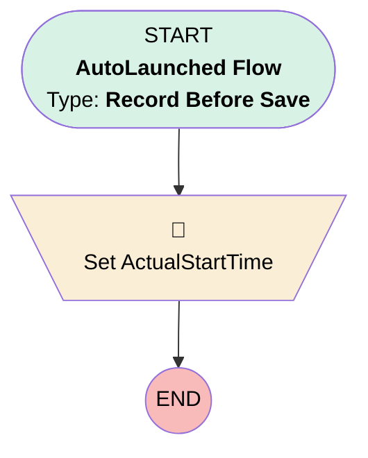

# [Service Appointment] - Before Save - Stamp Actual End on Completed

## Flow Diagram

## General Information

|<!-- -->|<!-- -->|
|:---|:---|
|Object|ServiceAppointment|
|Process Type| Auto Launched Flow|
|Trigger Type| Record Before Save|
|Record Trigger Type| Update|
|Label|[Service Appointment] - Before Save - Stamp Actual End on Completed|
|Status|Active|
|Does Require Record Changed To Meet Criteria|✅|
|Environments|Default|
|Interview Label|[Service Appointment] - Before Save - Stamp Actual End on Completed {!$Flow.CurrentDateTime}|
| Builder Type (PM)|LightningFlowBuilder|
| Canvas Mode (PM)|AUTO_LAYOUT_CANVAS|
| Origin Builder Type (PM)|LightningFlowBuilder|
|Connector|[Set_ActualStartTime](#set_actualstarttime)|
|Next Node|[Set_ActualStartTime](#set_actualstarttime)|

#### Filters (logic: **and**)

|Filter Id|Field|Operator|Value|
|:-- |:-- |:--:|:--: |
|1|Status| Equal To|Completed|

## Flow Nodes Details

### Set_ActualStartTime

|<!-- -->|<!-- -->|
|:---|:---|
|Type|Assignment|
|Label|Set ActualStartTime|

#### Assignments

|Assign To Reference|Operator|Value|
|:-- |:--:|:--: |
|$Record.ActualEndTime| Assign|$Flow.CurrentDateTime|

___

_Documentation generated from branch monitoring_krinkelsgreencare__upeodev_sandbox by [sfdx-hardis](https://sfdx-hardis.cloudity.com), featuring [salesforce-flow-visualiser](https://github.com/toddhalfpenny/salesforce-flow-visualiser)_