# [Service Appointment] [Scheduled] Customer Notification

## Flow Diagram [(_View History_)](Service_Appointment_Scheduled_Customer_Notification-history.md)

```mermaid
%% If you read this, your Markdown visualizer does not handle MermaidJS syntax.
%% - If you are in VsCode, install extension `Markdown Preview Mermaid Support` at https://marketplace.visualstudio.com/items?itemName=bierner.markdown-mermaid
%% - If you are using sfdx-hardis, try to define env variable `MERMAID_MODES=cli,docker` ,then run again the command to regenerate markdown with SVG images.
%% - If you are within mkdocs-material, define mermaid plugin in `mkdocs.yml` as described in https://squidfunk.github.io/mkdocs-material/extensions/mermaid/
%% - At last resort, you can copy-paste this MermaidJS code in https://mermaid.live/ to see the Flow Diagram

flowchart TB
START(["START<br/><b>AutoLaunched Flow</b></br>Type: <b> Scheduled</b>"]):::startClass
click START "#general-information" "1013521487"

REScheduled_WO_Send_ENG_mail("📧 <em></em><br/>REScheduled WO - Send ENG mail"):::actionCalls
click REScheduled_WO_Send_ENG_mail "#rescheduled_wo_send_eng_mail" "1563395032"

REScheduled_WO_Send_ENG_mail_Day("📧 <em></em><br/>REScheduled WO - Send ENG mail Day"):::actionCalls
click REScheduled_WO_Send_ENG_mail_Day "#rescheduled_wo_send_eng_mail_day" "808690215"

REScheduled_WO_Send_FR_mail("📧 <em></em><br/>REScheduled WO - Send FR mail"):::actionCalls
click REScheduled_WO_Send_FR_mail "#rescheduled_wo_send_fr_mail" "4287079472"

REScheduled_WO_Send_FR_mail_Day("📧 <em></em><br/>REScheduled WO - Send FR mail Day"):::actionCalls
click REScheduled_WO_Send_FR_mail_Day "#rescheduled_wo_send_fr_mail_day" "255685198"

REScheduled_WO_Send_NL_mail("📧 <em></em><br/>REScheduled WO - Send NL mail"):::actionCalls
click REScheduled_WO_Send_NL_mail "#rescheduled_wo_send_nl_mail" "1573337660"

REScheduled_WO_Send_NL_mail_Day("📧 <em></em><br/>REScheduled WO - Send NL mail Day"):::actionCalls
click REScheduled_WO_Send_NL_mail_Day "#rescheduled_wo_send_nl_mail_day" "272357784"

Scheduled_WO_Send_ENG_mail("📧 <em></em><br/>Scheduled WO - Send ENG mail"):::actionCalls
click Scheduled_WO_Send_ENG_mail "#scheduled_wo_send_eng_mail" "3536185047"

Scheduled_WO_Send_ENG_mail_Day("📧 <em></em><br/>Scheduled WO - Send ENG mail Day"):::actionCalls
click Scheduled_WO_Send_ENG_mail_Day "#scheduled_wo_send_eng_mail_day" "3169031084"

Scheduled_WO_Send_FR_mail("📧 <em></em><br/>Scheduled WO - Send FR mail"):::actionCalls
click Scheduled_WO_Send_FR_mail "#scheduled_wo_send_fr_mail" "3873809746"

Scheduled_WO_Send_FR_mail_Day("📧 <em></em><br/>Scheduled WO - Send FR mail Day"):::actionCalls
click Scheduled_WO_Send_FR_mail_Day "#scheduled_wo_send_fr_mail_day" "1542042991"

Scheduled_WO_Send_NL_mail("📧 <em></em><br/>Scheduled WO - Send NL mail"):::actionCalls
click Scheduled_WO_Send_NL_mail "#scheduled_wo_send_nl_mail" "1697756540"

Scheduled_WO_Send_NL_mail_Day("📧 <em></em><br/>Scheduled WO - Send NL mail Day"):::actionCalls
click Scheduled_WO_Send_NL_mail_Day "#scheduled_wo_send_nl_mail_day" "4068910866"

Assign_email_Recipients[\"🟰 <em></em><br/>Assign email Recipients"/]:::assignments
click Assign_email_Recipients "#assign_email_recipients" "2562774588"

Contact_Language{"🔀 <em></em><br/>Contact Language"}:::decisions
click Contact_Language "#contact_language" "2831191991"

First_send_or_Resend{"🔀 <em></em><br/>First send or Resend"}:::decisions
click First_send_or_Resend "#first_send_or_resend" "99629469"

First_send_or_Resend_ENG{"🔀 <em></em><br/>First send or Resend ENG"}:::decisions
click First_send_or_Resend_ENG "#first_send_or_resend_eng" "1733880066"

First_send_or_Resend_FR{"🔀 <em></em><br/>First send or Resend FR"}:::decisions
click First_send_or_Resend_FR "#first_send_or_resend_fr" "3516670661"

Week_OR_Exact_Day{"🔀 <em></em><br/>Week OR Exact Day"}:::decisions
click Week_OR_Exact_Day "#week_or_exact_day" "3717360262"

Week_OR_Exact_Day2{"🔀 <em></em><br/>Week OR Exact Day"}:::decisions
click Week_OR_Exact_Day2 "#week_or_exact_day2" "3895424016"

Week_OR_Exact_Day3{"🔀 <em></em><br/>Week OR Exact Day"}:::decisions
click Week_OR_Exact_Day3 "#week_or_exact_day3" "1502737021"

Week_OR_Exact_Day4{"🔀 <em></em><br/>Week OR Exact Day"}:::decisions
click Week_OR_Exact_Day4 "#week_or_exact_day4" "3599736634"

Week_OR_Exact_Day5{"🔀 <em></em><br/>Week OR Exact Day"}:::decisions
click Week_OR_Exact_Day5 "#week_or_exact_day5" "767506239"

Week_OR_Exact_Day6{"🔀 <em></em><br/>Week OR Exact Day"}:::decisions
click Week_OR_Exact_Day6 "#week_or_exact_day6" "3028823591"

Work_Order_Contact_with_Email_Found{"🔀 <em></em><br/>Work Order & Contact with Email Found?"}:::decisions
click Work_Order_Contact_with_Email_Found "#work_order_contact_with_email_found" "3937827058"

Get_Email_Template_ENG_Planned_WO[("🔍 <em></em><br/>Get Email Template ENG Planned WO")]:::recordLookups
click Get_Email_Template_ENG_Planned_WO "#get_email_template_eng_planned_wo" "2513349678"

Get_Email_Template_ENG_Planned_WO_Day[("🔍 <em></em><br/>Get Email Template ENG Planned WO Day")]:::recordLookups
click Get_Email_Template_ENG_Planned_WO_Day "#get_email_template_eng_planned_wo_day" "758035772"

Get_Email_Template_ENG_REPlanned_WO[("🔍 <em></em><br/>Get Email Template ENG REPlanned WO")]:::recordLookups
click Get_Email_Template_ENG_REPlanned_WO "#get_email_template_eng_replanned_wo" "3189420705"

Get_Email_Template_ENG_REPlanned_WO_Day[("🔍 <em></em><br/>Get Email Template ENG REPlanned WO Day")]:::recordLookups
click Get_Email_Template_ENG_REPlanned_WO_Day "#get_email_template_eng_replanned_wo_day" "3255117414"

Get_Email_Template_FR_Planned_WO[("🔍 <em></em><br/>Get Email Template FR Planned WO")]:::recordLookups
click Get_Email_Template_FR_Planned_WO "#get_email_template_fr_planned_wo" "2811645755"

Get_Email_Template_FR_Planned_WO_Day[("🔍 <em></em><br/>Get Email Template FR Planned WO Day")]:::recordLookups
click Get_Email_Template_FR_Planned_WO_Day "#get_email_template_fr_planned_wo_day" "572459346"

Get_Email_Template_FR_REPlanned_WO[("🔍 <em></em><br/>Get Email Template FR REPlanned WO")]:::recordLookups
click Get_Email_Template_FR_REPlanned_WO "#get_email_template_fr_replanned_wo" "1431363291"

Get_Email_Template_FR_REPlanned_WO_Day[("🔍 <em></em><br/>Get Email Template FR REPlanned WO Day")]:::recordLookups
click Get_Email_Template_FR_REPlanned_WO_Day "#get_email_template_fr_replanned_wo_day" "1099289124"

Get_Email_Template_NL_Planned_WO[("🔍 <em></em><br/>Get Email Template NL Planned WO")]:::recordLookups
click Get_Email_Template_NL_Planned_WO "#get_email_template_nl_planned_wo" "1854158430"

Get_Email_Template_NL_Planned_WO_Day[("🔍 <em></em><br/>Get Email Template NL Planned WO Day")]:::recordLookups
click Get_Email_Template_NL_Planned_WO_Day "#get_email_template_nl_planned_wo_day" "2012126435"

Get_Email_Template_NL_REPlanned_WO[("🔍 <em></em><br/>Get Email Template NL REPlanned WO")]:::recordLookups
click Get_Email_Template_NL_REPlanned_WO "#get_email_template_nl_replanned_wo" "992326223"

Get_Email_Template_NL_REPlanned_WO_Day[("🔍 <em></em><br/>Get Email Template NL REPlanned WO Day")]:::recordLookups
click Get_Email_Template_NL_REPlanned_WO_Day "#get_email_template_nl_replanned_wo_day" "4076393078"

Get_WO_Contact[("🔍 <em></em><br/>Get WO Contact")]:::recordLookups
click Get_WO_Contact "#get_wo_contact" "3176914413"

Get_work_Order[("🔍 <em></em><br/>Get Work Order")]:::recordLookups
click Get_work_Order "#get_work_order" "1055462644"

Update_SA[("🛠️ <em></em><br/>Update SA")]:::recordUpdates
click Update_SA "#update_sa" "310899656"

REScheduled_WO_Send_ENG_mail --> Update_SA
REScheduled_WO_Send_ENG_mail_Day --> Update_SA
REScheduled_WO_Send_FR_mail --> Update_SA
REScheduled_WO_Send_FR_mail_Day --> Update_SA
REScheduled_WO_Send_NL_mail --> Update_SA
REScheduled_WO_Send_NL_mail_Day --> Update_SA
Scheduled_WO_Send_ENG_mail --> Update_SA
Scheduled_WO_Send_ENG_mail_Day --> Update_SA
Scheduled_WO_Send_FR_mail --> Update_SA
Scheduled_WO_Send_FR_mail_Day --> Update_SA
Scheduled_WO_Send_NL_mail --> Update_SA
Scheduled_WO_Send_NL_mail_Day --> Update_SA
Assign_email_Recipients --> Work_Order_Contact_with_Email_Found
Contact_Language --> |"FR"| First_send_or_Resend_FR
Contact_Language --> |"ENG"| First_send_or_Resend_ENG
Contact_Language --> |"NL"| First_send_or_Resend
First_send_or_Resend --> |"First Send"| Week_OR_Exact_Day5
First_send_or_Resend --> |"Resend"| Week_OR_Exact_Day6
First_send_or_Resend_ENG --> |"First Send"| Week_OR_Exact_Day3
First_send_or_Resend_ENG --> |"Resend"| Week_OR_Exact_Day4
First_send_or_Resend_FR --> |"First Send"| Week_OR_Exact_Day
First_send_or_Resend_FR --> |"Resend"| Week_OR_Exact_Day2
Week_OR_Exact_Day --> |"Week"| Get_Email_Template_FR_Planned_WO
Week_OR_Exact_Day --> |"Day"| Get_Email_Template_FR_Planned_WO_Day
Week_OR_Exact_Day2 --> |"Week"| Get_Email_Template_FR_REPlanned_WO
Week_OR_Exact_Day2 --> |"Day"| Get_Email_Template_FR_REPlanned_WO_Day
Week_OR_Exact_Day3 --> |"Week"| Get_Email_Template_ENG_Planned_WO
Week_OR_Exact_Day3 --> |"Day"| Get_Email_Template_ENG_Planned_WO_Day
Week_OR_Exact_Day4 --> |"Week"| Get_Email_Template_ENG_REPlanned_WO
Week_OR_Exact_Day4 --> |"Day"| Get_Email_Template_ENG_REPlanned_WO_Day
Week_OR_Exact_Day5 --> |"Week"| Get_Email_Template_NL_Planned_WO
Week_OR_Exact_Day5 --> |"Day"| Get_Email_Template_NL_Planned_WO_Day
Week_OR_Exact_Day6 --> |"Week"| Get_Email_Template_NL_REPlanned_WO
Week_OR_Exact_Day6 --> |"Day"| Get_Email_Template_NL_REPlanned_WO_Day
Work_Order_Contact_with_Email_Found --> |"Yes"| Contact_Language
Work_Order_Contact_with_Email_Found --> |"No"| END_Work_Order_Contact_with_Email_Found
Get_Email_Template_ENG_Planned_WO --> Scheduled_WO_Send_ENG_mail
Get_Email_Template_ENG_Planned_WO_Day --> Scheduled_WO_Send_ENG_mail_Day
Get_Email_Template_ENG_REPlanned_WO --> REScheduled_WO_Send_ENG_mail
Get_Email_Template_ENG_REPlanned_WO_Day --> REScheduled_WO_Send_ENG_mail_Day
Get_Email_Template_FR_Planned_WO --> Scheduled_WO_Send_FR_mail
Get_Email_Template_FR_Planned_WO_Day --> Scheduled_WO_Send_FR_mail_Day
Get_Email_Template_FR_REPlanned_WO --> REScheduled_WO_Send_FR_mail
Get_Email_Template_FR_REPlanned_WO_Day --> REScheduled_WO_Send_FR_mail_Day
Get_Email_Template_NL_Planned_WO --> Scheduled_WO_Send_NL_mail
Get_Email_Template_NL_Planned_WO_Day --> Scheduled_WO_Send_NL_mail_Day
Get_Email_Template_NL_REPlanned_WO --> REScheduled_WO_Send_NL_mail
Get_Email_Template_NL_REPlanned_WO_Day --> REScheduled_WO_Send_NL_mail_Day
Get_WO_Contact --> Assign_email_Recipients
Get_work_Order --> Get_WO_Contact
Update_SA --> END_Update_SA
START -->  Get_work_Order
END_Work_Order_Contact_with_Email_Found(( END )):::endClass
END_Update_SA(( END )):::endClass


classDef actionCalls fill:#D4E4FC,color:black,text-decoration:none,max-height:100px
classDef assignments fill:#FBEED7,color:black,text-decoration:none,max-height:100px
classDef collectionProcessors fill:#F0E3FA,color:black,text-decoration:none,max-height:100px
classDef customErrors fill:#FFE9E9,color:black,text-decoration:none,max-height:100px
classDef decisions fill:#FDEAF6,color:black,text-decoration:none,max-height:100px
classDef loops fill:#FDEAF6,color:black,text-decoration:none,max-height:100px
classDef recordCreates fill:#FFF8C9,color:black,text-decoration:none,max-height:100px
classDef recordDeletes fill:#FFF8C9,color:black,text-decoration:none,max-height:100px
classDef recordLookups fill:#EDEAFF,color:black,text-decoration:none,max-height:100px
classDef recordUpdates fill:#FFF8C9,color:black,text-decoration:none,max-height:100px
classDef screens fill:#DFF6FF,color:black,text-decoration:none,max-height:100px
classDef subflows fill:#D4E4FC,color:black,text-decoration:none,max-height:100px
classDef startClass fill:#D9F2E6,color:black,text-decoration:none,max-height:100px
classDef endClass fill:#F9BABA,color:black,text-decoration:none,max-height:100px


```

<!-- Flow description -->

## General Information

|<!-- -->|<!-- -->|
|:---|:---|
|Object|ServiceAppointment|
|Process Type| Auto Launched Flow|
|Trigger Type| Scheduled|
|Label|[Service Appointment] [Scheduled] Customer Notification|
|Status|Active|
|Description|Flow that sends notification to customer when a service appointment is (re)scheduled|
|Environments|Default|
|Interview Label|[Service Appointment] [Scheduled] Customer Notification {!$Flow.CurrentDateTime}|
| Builder Type (PM)|LightningFlowBuilder|
| Canvas Mode (PM)|AUTO_LAYOUT_CANVAS|
| Origin Builder Type (PM)|LightningFlowBuilder|
|Connector|[Get_work_Order](#get_work_order)|
|Next Node|[Get_work_Order](#get_work_order)|

#### Schedules

|Frequency|Start Date|Start Time|
|:-- |:--:|:--: |
|Daily|Nov 20, 2024|06:00|

#### Filters (logic: **(1 AND 2 AND 3 AND 4) OR (1 AND 3 AND 5)**)

|Filter Id|Field|Operator|Value|
|:-- |:-- |:--:|:--: |
|1|Status| Equal To|Scheduled|
|2|Notification_Day__c| Equal To|✅|
|3|Intervention_Registration__c| Equal To|Yes Mail|
|4|Scheduling_Notification_Send__c| Equal To|Not Send|
|5|Scheduling_Notification_Send__c| Equal To|Resend Needed|

## Variables

|Name|Data Type|Is Collection|Is Input|Is Output|Object Type|Description|
|:-- |:--:|:--:|:--:|:--:|:--:|:--  |
|Recipients|String|✅|⬜|⬜|<!-- -->|<!-- -->|

## Flow Nodes Details

### REScheduled_WO_Send_ENG_mail

|<!-- -->|<!-- -->|
|:---|:---|
|Type|Action Call|
|Label|REScheduled WO - Send ENG mail|
|Action Type|Email Simple|
|Action Name|emailSimple|
|Flow Transaction Model|CurrentTransaction|
|Name Segment|emailSimple|
|Offset|0|
|Version Segment|1|
|Email Addresses Array (input)|Recipients|
|Sender Type (input)|OrgWideEmailAddress|
|Sender Address (input)|info@upeoconsulting.com|
|Related Record Id (input)|Get_work_Order.Id|
|Recipient Id (input)|Get_WO_Contact.Id|
|Log Email On Send (input)|✅|
|Email Template Id (input)|Get_Email_Template_ENG_REPlanned_WO.Id|
|Connector|[Update_SA](#update_sa)|

### REScheduled_WO_Send_ENG_mail_Day

|<!-- -->|<!-- -->|
|:---|:---|
|Type|Action Call|
|Label|REScheduled WO - Send ENG mail Day|
|Action Type|Email Simple|
|Action Name|emailSimple|
|Flow Transaction Model|CurrentTransaction|
|Name Segment|emailSimple|
|Offset|0|
|Version Segment|1|
|Email Addresses Array (input)|Recipients|
|Sender Type (input)|OrgWideEmailAddress|
|Sender Address (input)|info@upeoconsulting.com|
|Related Record Id (input)|Get_work_Order.Id|
|Recipient Id (input)|Get_WO_Contact.Id|
|Log Email On Send (input)|✅|
|Email Template Id (input)|Get_Email_Template_ENG_REPlanned_WO_Day.Id|
|Connector|[Update_SA](#update_sa)|

### REScheduled_WO_Send_FR_mail

|<!-- -->|<!-- -->|
|:---|:---|
|Type|Action Call|
|Label|REScheduled WO - Send FR mail|
|Action Type|Email Simple|
|Action Name|emailSimple|
|Flow Transaction Model|CurrentTransaction|
|Name Segment|emailSimple|
|Offset|0|
|Version Segment|1|
|Email Addresses Array (input)|Recipients|
|Sender Type (input)|OrgWideEmailAddress|
|Sender Address (input)|info@upeoconsulting.com|
|Related Record Id (input)|Get_work_Order.Id|
|Recipient Id (input)|Get_WO_Contact.Id|
|Log Email On Send (input)|✅|
|Email Template Id (input)|Get_Email_Template_FR_REPlanned_WO.Id|
|Connector|[Update_SA](#update_sa)|

### REScheduled_WO_Send_FR_mail_Day

|<!-- -->|<!-- -->|
|:---|:---|
|Type|Action Call|
|Label|REScheduled WO - Send FR mail Day|
|Action Type|Email Simple|
|Action Name|emailSimple|
|Flow Transaction Model|CurrentTransaction|
|Name Segment|emailSimple|
|Offset|0|
|Version Segment|1|
|Email Addresses Array (input)|Recipients|
|Sender Type (input)|OrgWideEmailAddress|
|Sender Address (input)|info@upeoconsulting.com|
|Related Record Id (input)|Get_work_Order.Id|
|Recipient Id (input)|Get_WO_Contact.Id|
|Log Email On Send (input)|✅|
|Email Template Id (input)|Get_Email_Template_FR_REPlanned_WO_Day.Id|
|Connector|[Update_SA](#update_sa)|

### REScheduled_WO_Send_NL_mail

|<!-- -->|<!-- -->|
|:---|:---|
|Type|Action Call|
|Label|REScheduled WO - Send NL mail|
|Action Type|Email Simple|
|Action Name|emailSimple|
|Flow Transaction Model|CurrentTransaction|
|Name Segment|emailSimple|
|Offset|0|
|Version Segment|1|
|Email Addresses Array (input)|Recipients|
|Sender Type (input)|OrgWideEmailAddress|
|Sender Address (input)|info@upeoconsulting.com|
|Related Record Id (input)|Get_work_Order.Id|
|Recipient Id (input)|Get_WO_Contact.Id|
|Log Email On Send (input)|✅|
|Email Template Id (input)|Get_Email_Template_NL_REPlanned_WO.Id|
|Connector|[Update_SA](#update_sa)|

### REScheduled_WO_Send_NL_mail_Day

|<!-- -->|<!-- -->|
|:---|:---|
|Type|Action Call|
|Label|REScheduled WO - Send NL mail Day|
|Action Type|Email Simple|
|Action Name|emailSimple|
|Flow Transaction Model|CurrentTransaction|
|Name Segment|emailSimple|
|Offset|0|
|Version Segment|1|
|Email Addresses Array (input)|Recipients|
|Sender Type (input)|OrgWideEmailAddress|
|Sender Address (input)|info@upeoconsulting.com|
|Related Record Id (input)|Get_work_Order.Id|
|Recipient Id (input)|Get_WO_Contact.Id|
|Log Email On Send (input)|✅|
|Email Template Id (input)|Get_Email_Template_NL_REPlanned_WO_Day.Id|
|Connector|[Update_SA](#update_sa)|

### Scheduled_WO_Send_ENG_mail

|<!-- -->|<!-- -->|
|:---|:---|
|Type|Action Call|
|Label|Scheduled WO - Send ENG mail|
|Action Type|Email Simple|
|Action Name|emailSimple|
|Flow Transaction Model|CurrentTransaction|
|Name Segment|emailSimple|
|Offset|0|
|Version Segment|1|
|Email Addresses Array (input)|Recipients|
|Sender Type (input)|OrgWideEmailAddress|
|Sender Address (input)|info@upeoconsulting.com|
|Related Record Id (input)|Get_work_Order.Id|
|Recipient Id (input)|Get_WO_Contact.Id|
|Log Email On Send (input)|✅|
|Email Template Id (input)|Get_Email_Template_ENG_Planned_WO.Id|
|Connector|[Update_SA](#update_sa)|

### Scheduled_WO_Send_ENG_mail_Day

|<!-- -->|<!-- -->|
|:---|:---|
|Type|Action Call|
|Label|Scheduled WO - Send ENG mail Day|
|Action Type|Email Simple|
|Action Name|emailSimple|
|Flow Transaction Model|CurrentTransaction|
|Name Segment|emailSimple|
|Offset|0|
|Version Segment|1|
|Email Addresses Array (input)|Recipients|
|Sender Type (input)|OrgWideEmailAddress|
|Sender Address (input)|info@upeoconsulting.com|
|Related Record Id (input)|Get_work_Order.Id|
|Recipient Id (input)|Get_WO_Contact.Id|
|Log Email On Send (input)|✅|
|Email Template Id (input)|Get_Email_Template_ENG_Planned_WO_Day.Id|
|Connector|[Update_SA](#update_sa)|

### Scheduled_WO_Send_FR_mail

|<!-- -->|<!-- -->|
|:---|:---|
|Type|Action Call|
|Label|Scheduled WO - Send FR mail|
|Action Type|Email Simple|
|Action Name|emailSimple|
|Flow Transaction Model|CurrentTransaction|
|Name Segment|emailSimple|
|Offset|0|
|Version Segment|1|
|Email Addresses Array (input)|Recipients|
|Sender Type (input)|OrgWideEmailAddress|
|Sender Address (input)|info@upeoconsulting.com|
|Related Record Id (input)|Get_work_Order.Id|
|Recipient Id (input)|Get_WO_Contact.Id|
|Log Email On Send (input)|✅|
|Email Template Id (input)|Get_Email_Template_FR_Planned_WO.Id|
|Connector|[Update_SA](#update_sa)|

### Scheduled_WO_Send_FR_mail_Day

|<!-- -->|<!-- -->|
|:---|:---|
|Type|Action Call|
|Label|Scheduled WO - Send FR mail Day|
|Action Type|Email Simple|
|Action Name|emailSimple|
|Flow Transaction Model|CurrentTransaction|
|Name Segment|emailSimple|
|Offset|0|
|Version Segment|1|
|Email Addresses Array (input)|Recipients|
|Sender Type (input)|OrgWideEmailAddress|
|Sender Address (input)|info@upeoconsulting.com|
|Related Record Id (input)|Get_work_Order.Id|
|Recipient Id (input)|Get_WO_Contact.Id|
|Log Email On Send (input)|✅|
|Email Template Id (input)|Get_Email_Template_FR_Planned_WO_Day.Id|
|Connector|[Update_SA](#update_sa)|

### Scheduled_WO_Send_NL_mail

|<!-- -->|<!-- -->|
|:---|:---|
|Type|Action Call|
|Label|Scheduled WO - Send NL mail|
|Action Type|Email Simple|
|Action Name|emailSimple|
|Flow Transaction Model|CurrentTransaction|
|Name Segment|emailSimple|
|Offset|0|
|Version Segment|1|
|Email Addresses Array (input)|Recipients|
|Sender Type (input)|OrgWideEmailAddress|
|Sender Address (input)|info@upeoconsulting.com|
|Related Record Id (input)|Get_work_Order.Id|
|Recipient Id (input)|Get_WO_Contact.Id|
|Log Email On Send (input)|✅|
|Email Template Id (input)|Get_Email_Template_NL_Planned_WO.Id|
|Connector|[Update_SA](#update_sa)|

### Scheduled_WO_Send_NL_mail_Day

|<!-- -->|<!-- -->|
|:---|:---|
|Type|Action Call|
|Label|Scheduled WO - Send NL mail Day|
|Action Type|Email Simple|
|Action Name|emailSimple|
|Flow Transaction Model|CurrentTransaction|
|Name Segment|emailSimple|
|Offset|0|
|Version Segment|1|
|Email Addresses Array (input)|Recipients|
|Sender Type (input)|OrgWideEmailAddress|
|Sender Address (input)|info@upeoconsulting.com|
|Related Record Id (input)|Get_work_Order.Id|
|Recipient Id (input)|Get_WO_Contact.Id|
|Log Email On Send (input)|✅|
|Email Template Id (input)|Get_Email_Template_NL_Planned_WO_Day.Id|
|Connector|[Update_SA](#update_sa)|

### Assign_email_Recipients

|<!-- -->|<!-- -->|
|:---|:---|
|Type|Assignment|
|Label|Assign email Recipients|
|Connector|[Work_Order_Contact_with_Email_Found](#work_order_contact_with_email_found)|

#### Assignments

|Assign To Reference|Operator|Value|
|:-- |:--:|:--: |
|Recipients| Add|Get_WO_Contact.Email|

### Contact_Language

|<!-- -->|<!-- -->|
|:---|:---|
|Type|Decision|
|Label|Contact Language|
|Default Connector|[First_send_or_Resend](#first_send_or_resend)|
|Default Connector Label|NL|

#### Rule FR (FR)

|<!-- -->|<!-- -->|
|:---|:---|
|Connector|[First_send_or_Resend_FR](#first_send_or_resend_fr)|
|Condition Logic|and|

|Condition Id|Left Value Reference|Operator|Right Value|
|:-- |:-- |:--:|:--: |
|1|Get_WO_Contact.Language__c| Equal To|French|

#### Rule ENG (ENG)

|<!-- -->|<!-- -->|
|:---|:---|
|Connector|[First_send_or_Resend_ENG](#first_send_or_resend_eng)|
|Condition Logic|and|

|Condition Id|Left Value Reference|Operator|Right Value|
|:-- |:-- |:--:|:--: |
|1|Get_WO_Contact.Language__c| Equal To|English|

### First_send_or_Resend

|<!-- -->|<!-- -->|
|:---|:---|
|Type|Decision|
|Label|First send or Resend|
|Default Connector|[Week_OR_Exact_Day6](#week_or_exact_day6)|
|Default Connector Label|Resend|

#### Rule First_Send (First Send)

|<!-- -->|<!-- -->|
|:---|:---|
|Connector|[Week_OR_Exact_Day5](#week_or_exact_day5)|
|Condition Logic|and|

|Condition Id|Left Value Reference|Operator|Right Value|
|:-- |:-- |:--:|:--: |
|1|$Record.Scheduling_Notification_Send__c| Equal To|Not Send|

### First_send_or_Resend_ENG

|<!-- -->|<!-- -->|
|:---|:---|
|Type|Decision|
|Label|First send or Resend ENG|
|Default Connector|[Week_OR_Exact_Day4](#week_or_exact_day4)|
|Default Connector Label|Resend|

#### Rule First_SendENG (First Send)

|<!-- -->|<!-- -->|
|:---|:---|
|Connector|[Week_OR_Exact_Day3](#week_or_exact_day3)|
|Condition Logic|and|

|Condition Id|Left Value Reference|Operator|Right Value|
|:-- |:-- |:--:|:--: |
|1|$Record.Scheduling_Notification_Send__c| Equal To|Not Send|

### First_send_or_Resend_FR

|<!-- -->|<!-- -->|
|:---|:---|
|Type|Decision|
|Label|First send or Resend FR|
|Default Connector|[Week_OR_Exact_Day2](#week_or_exact_day2)|
|Default Connector Label|Resend|

#### Rule First_SendFR (First Send)

|<!-- -->|<!-- -->|
|:---|:---|
|Connector|[Week_OR_Exact_Day](#week_or_exact_day)|
|Condition Logic|and|

|Condition Id|Left Value Reference|Operator|Right Value|
|:-- |:-- |:--:|:--: |
|1|$Record.Scheduling_Notification_Send__c| Equal To|Not Send|

### Week_OR_Exact_Day

|<!-- -->|<!-- -->|
|:---|:---|
|Type|Decision|
|Label|Week OR Exact Day|
|Default Connector|[Get_Email_Template_FR_Planned_WO_Day](#get_email_template_fr_planned_wo_day)|
|Default Connector Label|Day|

#### Rule Week (Week)

|<!-- -->|<!-- -->|
|:---|:---|
|Connector|[Get_Email_Template_FR_Planned_WO](#get_email_template_fr_planned_wo)|
|Condition Logic|and|

|Condition Id|Left Value Reference|Operator|Right Value|
|:-- |:-- |:--:|:--: |
|1|$Record.Account.Intervention_registration_type__c| Equal To|Week of Excecution|

### Week_OR_Exact_Day2

|<!-- -->|<!-- -->|
|:---|:---|
|Type|Decision|
|Label|Week OR Exact Day|
|Default Connector|[Get_Email_Template_FR_REPlanned_WO_Day](#get_email_template_fr_replanned_wo_day)|
|Default Connector Label|Day|

#### Rule Week2 (Week)

|<!-- -->|<!-- -->|
|:---|:---|
|Connector|[Get_Email_Template_FR_REPlanned_WO](#get_email_template_fr_replanned_wo)|
|Condition Logic|and|

|Condition Id|Left Value Reference|Operator|Right Value|
|:-- |:-- |:--:|:--: |
|1|$Record.Account.Intervention_registration_type__c| Equal To|Week of Excecution|

### Week_OR_Exact_Day3

|<!-- -->|<!-- -->|
|:---|:---|
|Type|Decision|
|Label|Week OR Exact Day|
|Default Connector|[Get_Email_Template_ENG_Planned_WO_Day](#get_email_template_eng_planned_wo_day)|
|Default Connector Label|Day|

#### Rule Week3 (Week)

|<!-- -->|<!-- -->|
|:---|:---|
|Connector|[Get_Email_Template_ENG_Planned_WO](#get_email_template_eng_planned_wo)|
|Condition Logic|and|

|Condition Id|Left Value Reference|Operator|Right Value|
|:-- |:-- |:--:|:--: |
|1|$Record.Account.Intervention_registration_type__c| Equal To|Week of Excecution|

### Week_OR_Exact_Day4

|<!-- -->|<!-- -->|
|:---|:---|
|Type|Decision|
|Label|Week OR Exact Day|
|Default Connector|[Get_Email_Template_ENG_REPlanned_WO_Day](#get_email_template_eng_replanned_wo_day)|
|Default Connector Label|Day|

#### Rule Week4 (Week)

|<!-- -->|<!-- -->|
|:---|:---|
|Connector|[Get_Email_Template_ENG_REPlanned_WO](#get_email_template_eng_replanned_wo)|
|Condition Logic|and|

|Condition Id|Left Value Reference|Operator|Right Value|
|:-- |:-- |:--:|:--: |
|1|$Record.Account.Intervention_registration_type__c| Equal To|Week of Excecution|

### Week_OR_Exact_Day5

|<!-- -->|<!-- -->|
|:---|:---|
|Type|Decision|
|Label|Week OR Exact Day|
|Default Connector|[Get_Email_Template_NL_Planned_WO_Day](#get_email_template_nl_planned_wo_day)|
|Default Connector Label|Day|

#### Rule Week5 (Week)

|<!-- -->|<!-- -->|
|:---|:---|
|Connector|[Get_Email_Template_NL_Planned_WO](#get_email_template_nl_planned_wo)|
|Condition Logic|and|

|Condition Id|Left Value Reference|Operator|Right Value|
|:-- |:-- |:--:|:--: |
|1|$Record.Account.Intervention_registration_type__c| Equal To|Week of Excecution|

### Week_OR_Exact_Day6

|<!-- -->|<!-- -->|
|:---|:---|
|Type|Decision|
|Label|Week OR Exact Day|
|Default Connector|[Get_Email_Template_NL_REPlanned_WO_Day](#get_email_template_nl_replanned_wo_day)|
|Default Connector Label|Day|

#### Rule Week6 (Week)

|<!-- -->|<!-- -->|
|:---|:---|
|Connector|[Get_Email_Template_NL_REPlanned_WO](#get_email_template_nl_replanned_wo)|
|Condition Logic|and|

|Condition Id|Left Value Reference|Operator|Right Value|
|:-- |:-- |:--:|:--: |
|1|$Record.Account.Intervention_registration_type__c| Equal To|Week of Excecution|

### Work_Order_Contact_with_Email_Found

|<!-- -->|<!-- -->|
|:---|:---|
|Type|Decision|
|Label|Work Order & Contact with Email Found?|
|Default Connector Label|No|

#### Rule Yes (Yes)

|<!-- -->|<!-- -->|
|:---|:---|
|Connector|[Contact_Language](#contact_language)|
|Condition Logic|and|

|Condition Id|Left Value Reference|Operator|Right Value|
|:-- |:-- |:--:|:--: |
|1|[Get_work_Order](#get_work_order)| Is Null|⬜|
|2|[Get_WO_Contact](#get_wo_contact)| Is Null|⬜|

### Get_Email_Template_ENG_Planned_WO

|<!-- -->|<!-- -->|
|:---|:---|
|Type|Record Lookup|
|Object|EmailTemplate|
|Label|Get Email Template ENG Planned WO|
|Assign Null Values If No Records Found|⬜|
|Get First Record Only|✅|
|Store Output Automatically|✅|
|Connector|[Scheduled_WO_Send_ENG_mail](#scheduled_wo_send_eng_mail)|

#### Filters (logic: **and**)

|Filter Id|Field|Operator|Value|
|:-- |:-- |:--:|:--: |
|1|DeveloperName| Equal To|Notification_Scheduled_WO_ENG_1732012994513|

### Get_Email_Template_ENG_Planned_WO_Day

|<!-- -->|<!-- -->|
|:---|:---|
|Type|Record Lookup|
|Object|EmailTemplate|
|Label|Get Email Template ENG Planned WO Day|
|Assign Null Values If No Records Found|⬜|
|Get First Record Only|✅|
|Store Output Automatically|✅|
|Connector|[Scheduled_WO_Send_ENG_mail_Day](#scheduled_wo_send_eng_mail_day)|

#### Filters (logic: **and**)

|Filter Id|Field|Operator|Value|
|:-- |:-- |:--:|:--: |
|1|DeveloperName| Equal To|Notification_Scheduled_WO_Day_ENG_1736149425060|

### Get_Email_Template_ENG_REPlanned_WO

|<!-- -->|<!-- -->|
|:---|:---|
|Type|Record Lookup|
|Object|EmailTemplate|
|Label|Get Email Template ENG REPlanned WO|
|Assign Null Values If No Records Found|⬜|
|Get First Record Only|✅|
|Store Output Automatically|✅|
|Connector|[REScheduled_WO_Send_ENG_mail](#rescheduled_wo_send_eng_mail)|

#### Filters (logic: **and**)

|Filter Id|Field|Operator|Value|
|:-- |:-- |:--:|:--: |
|1|DeveloperName| Equal To|Notification_REScheduled_WO_ENG_1732012846597|

### Get_Email_Template_ENG_REPlanned_WO_Day

|<!-- -->|<!-- -->|
|:---|:---|
|Type|Record Lookup|
|Object|EmailTemplate|
|Label|Get Email Template ENG REPlanned WO Day|
|Assign Null Values If No Records Found|⬜|
|Get First Record Only|✅|
|Store Output Automatically|✅|
|Connector|[REScheduled_WO_Send_ENG_mail_Day](#rescheduled_wo_send_eng_mail_day)|

#### Filters (logic: **and**)

|Filter Id|Field|Operator|Value|
|:-- |:-- |:--:|:--: |
|1|DeveloperName| Equal To|Notification_REScheduled_WO_Day_ENG_1736149508891|

### Get_Email_Template_FR_Planned_WO

|<!-- -->|<!-- -->|
|:---|:---|
|Type|Record Lookup|
|Object|EmailTemplate|
|Label|Get Email Template FR Planned WO|
|Assign Null Values If No Records Found|⬜|
|Get First Record Only|✅|
|Store Output Automatically|✅|
|Connector|[Scheduled_WO_Send_FR_mail](#scheduled_wo_send_fr_mail)|

#### Filters (logic: **and**)

|Filter Id|Field|Operator|Value|
|:-- |:-- |:--:|:--: |
|1|DeveloperName| Equal To|Notification_Scheduled_WO_FR_1732000418709|

### Get_Email_Template_FR_Planned_WO_Day

|<!-- -->|<!-- -->|
|:---|:---|
|Type|Record Lookup|
|Object|EmailTemplate|
|Label|Get Email Template FR Planned WO Day|
|Assign Null Values If No Records Found|⬜|
|Get First Record Only|✅|
|Store Output Automatically|✅|
|Connector|[Scheduled_WO_Send_FR_mail_Day](#scheduled_wo_send_fr_mail_day)|

#### Filters (logic: **and**)

|Filter Id|Field|Operator|Value|
|:-- |:-- |:--:|:--: |
|1|DeveloperName| Equal To|Notification_Scheduled_WO_Day_FR_1736149406556|

### Get_Email_Template_FR_REPlanned_WO

|<!-- -->|<!-- -->|
|:---|:---|
|Type|Record Lookup|
|Object|EmailTemplate|
|Label|Get Email Template FR REPlanned WO|
|Assign Null Values If No Records Found|⬜|
|Get First Record Only|✅|
|Store Output Automatically|✅|
|Connector|[REScheduled_WO_Send_FR_mail](#rescheduled_wo_send_fr_mail)|

#### Filters (logic: **and**)

|Filter Id|Field|Operator|Value|
|:-- |:-- |:--:|:--: |
|1|DeveloperName| Equal To|Notification_REScheduled_WO_FR_1732001152863|

### Get_Email_Template_FR_REPlanned_WO_Day

|<!-- -->|<!-- -->|
|:---|:---|
|Type|Record Lookup|
|Object|EmailTemplate|
|Label|Get Email Template FR REPlanned WO Day|
|Assign Null Values If No Records Found|⬜|
|Get First Record Only|✅|
|Store Output Automatically|✅|
|Connector|[REScheduled_WO_Send_FR_mail_Day](#rescheduled_wo_send_fr_mail_day)|

#### Filters (logic: **and**)

|Filter Id|Field|Operator|Value|
|:-- |:-- |:--:|:--: |
|1|DeveloperName| Equal To|Notification_REScheduled_WO_Day_FR_1736149468755|

### Get_Email_Template_NL_Planned_WO

|<!-- -->|<!-- -->|
|:---|:---|
|Type|Record Lookup|
|Object|EmailTemplate|
|Label|Get Email Template NL Planned WO|
|Assign Null Values If No Records Found|⬜|
|Get First Record Only|✅|
|Store Output Automatically|✅|
|Connector|[Scheduled_WO_Send_NL_mail](#scheduled_wo_send_nl_mail)|

#### Filters (logic: **and**)

|Filter Id|Field|Operator|Value|
|:-- |:-- |:--:|:--: |
|1|DeveloperName| Equal To|Notification_Planned_WO_NL_1731941363446|

### Get_Email_Template_NL_Planned_WO_Day

|<!-- -->|<!-- -->|
|:---|:---|
|Type|Record Lookup|
|Object|EmailTemplate|
|Label|Get Email Template NL Planned WO Day|
|Assign Null Values If No Records Found|⬜|
|Get First Record Only|✅|
|Store Output Automatically|✅|
|Connector|[Scheduled_WO_Send_NL_mail_Day](#scheduled_wo_send_nl_mail_day)|

#### Filters (logic: **and**)

|Filter Id|Field|Operator|Value|
|:-- |:-- |:--:|:--: |
|1|DeveloperName| Equal To|Notification_Scheduled_WO_Day_NL_1736149375605|

### Get_Email_Template_NL_REPlanned_WO

|<!-- -->|<!-- -->|
|:---|:---|
|Type|Record Lookup|
|Object|EmailTemplate|
|Label|Get Email Template NL REPlanned WO|
|Assign Null Values If No Records Found|⬜|
|Get First Record Only|✅|
|Store Output Automatically|✅|
|Connector|[REScheduled_WO_Send_NL_mail](#rescheduled_wo_send_nl_mail)|

#### Filters (logic: **and**)

|Filter Id|Field|Operator|Value|
|:-- |:-- |:--:|:--: |
|1|DeveloperName| Equal To|Notification_REScheduled_WO_NL_1732001423106|

### Get_Email_Template_NL_REPlanned_WO_Day

|<!-- -->|<!-- -->|
|:---|:---|
|Type|Record Lookup|
|Object|EmailTemplate|
|Label|Get Email Template NL REPlanned WO Day|
|Assign Null Values If No Records Found|⬜|
|Get First Record Only|✅|
|Store Output Automatically|✅|
|Connector|[REScheduled_WO_Send_NL_mail_Day](#rescheduled_wo_send_nl_mail_day)|

#### Filters (logic: **and**)

|Filter Id|Field|Operator|Value|
|:-- |:-- |:--:|:--: |
|1|DeveloperName| Equal To|Notification_REScheduled_WO_Day_NL_1736149449990|

### Get_WO_Contact

|<!-- -->|<!-- -->|
|:---|:---|
|Type|Record Lookup|
|Object|Contact|
|Label|Get WO Contact|
|Assign Null Values If No Records Found|⬜|
|Get First Record Only|✅|
|Store Output Automatically|✅|
|Connector|[Assign_email_Recipients](#assign_email_recipients)|

#### Filters (logic: **and**)

|Filter Id|Field|Operator|Value|
|:-- |:-- |:--:|:--: |
|1|Id| Equal To|Get_work_Order.ContactId|

### Get_work_Order

|<!-- -->|<!-- -->|
|:---|:---|
|Type|Record Lookup|
|Object|WorkOrder|
|Label|Get Work Order|
|Assign Null Values If No Records Found|⬜|
|Get First Record Only|✅|
|Store Output Automatically|✅|
|Connector|[Get_WO_Contact](#get_wo_contact)|

#### Filters (logic: **and**)

|Filter Id|Field|Operator|Value|
|:-- |:-- |:--:|:--: |
|1|Id| Equal To|$Record.ParentRecordId|

### Update_SA

|<!-- -->|<!-- -->|
|:---|:---|
|Type|Record Update|
|Label|Update SA|
|Input Reference|$Record|

#### Input Assignments

|Field|Value|
|:-- |:--: |
|Scheduling_Notification_Send__c|Send|

___

_Documentation generated from branch monitoring_krinkelsgreencare__upeodev_sandbox by [sfdx-hardis](https://sfdx-hardis.cloudity.com), featuring [salesforce-flow-visualiser](https://github.com/toddhalfpenny/salesforce-flow-visualiser)_