# [Service Appointment] [Scheduled] High Prio Work Order Overdue

## Flow Diagram

```mermaid
%% If you read this, your Markdown visualizer does not handle MermaidJS syntax.
%% - If you are in VsCode, install extension `Markdown Preview Mermaid Support` at https://marketplace.visualstudio.com/items?itemName=bierner.markdown-mermaid
%% - If you are using sfdx-hardis, try to define env variable `MERMAID_MODES=cli,docker` ,then run again the command to regenerate markdown with SVG images.
%% - If you are within mkdocs-material, define mermaid plugin in `mkdocs.yml` as described in https://squidfunk.github.io/mkdocs-material/extensions/mermaid/
%% - At last resort, you can copy-paste this MermaidJS code in https://mermaid.live/ to see the Flow Diagram

flowchart TB
START(["START<br/><b>AutoLaunched Flow</b></br>Type: <b> Scheduled</b>"]):::startClass
click START "#general-information" "1170684062"

Send_Delay_Notification_to_Contract_Manager("⚡ <em></em><br/>Send Delay Notification to Contract Manager"):::actionCalls
click Send_Delay_Notification_to_Contract_Manager "#send_delay_notification_to_contract_manager" "3251200823"

Assign_Recipient_ID[\"🟰 <em></em><br/>Assign Recipient ID"/]:::assignments
click Assign_Recipient_ID "#assign_recipient_id" "2163312426"

Contract_Manager_Found{"🔀 <em></em><br/>Contract Manager Found"}:::decisions
click Contract_Manager_Found "#contract_manager_found" "389672017"

Get_Contract_Manager[("🔍 <em></em><br/>Get Contract Manager")]:::recordLookups
click Get_Contract_Manager "#get_contract_manager" "1599379453"

Get_Custom_Notification[("🔍 <em></em><br/>Get Custom Notification")]:::recordLookups
click Get_Custom_Notification "#get_custom_notification" "780256630"

Set_Reminder_send_checkbox_to_True[("🛠️ <em></em><br/>Set Reminder send checkbox to True")]:::recordUpdates
click Set_Reminder_send_checkbox_to_True "#set_reminder_send_checkbox_to_true" "1277794440"

Send_Delay_Notification_to_Contract_Manager --> Set_Reminder_send_checkbox_to_True
Assign_Recipient_ID --> Get_Custom_Notification
Contract_Manager_Found --> |"Yes"| Assign_Recipient_ID
Get_Contract_Manager --> Contract_Manager_Found
Get_Custom_Notification --> Send_Delay_Notification_to_Contract_Manager
Set_Reminder_send_checkbox_to_True --> END_Set_Reminder_send_checkbox_to_True
START -->  Get_Contract_Manager
END_Set_Reminder_send_checkbox_to_True(( END )):::endClass


classDef actionCalls fill:#D4E4FC,color:black,max-height:100px
classDef assignments fill:#FBEED7,color:black,max-height:100px
classDef collectionProcessors fill:#F0E3FA,color:black,max-height:100px
classDef customErrors fill:#FFE9E9,color:black,max-height:100px
classDef decisions fill:#FDEAF6,color:black,max-height:100px
classDef loops fill:#FDEAF6,color:black,max-height:100px
classDef recordCreates fill:#FFF8C9,color:black,max-height:100px
classDef recordDeletes fill:#FFF8C9,color:black,max-height:100px
classDef recordLookups fill:#EDEAFF,color:black,max-height:100px
classDef recordUpdates fill:#FFF8C9,color:black,max-height:100px
classDef screens fill:#DFF6FF,color:black,max-height:100px
classDef subflows fill:#D4E4FC,color:black,max-height:100px
classDef startClass fill:#D9F2E6,color:black,max-height:100px
classDef endClass fill:#F9BABA,color:black,max-height:100px


```

## General Information

|<!-- -->|<!-- -->|
|:---|:---|
|Object|ServiceAppointment|
|Process Type| Auto Launched Flow|
|Trigger Type| Scheduled|
|Label|[Service Appointment] [Scheduled] High Prio Work Order Overdue|
|Status|Active|
|Description|sends notification to Contract Manager when a high prio work order is overdue|
|Environments|Default|
|Interview Label|[Service Appointment] [Scheduled] High Prio Work Order Overdue {!$Flow.CurrentDateTime}|
| Builder Type (PM)|LightningFlowBuilder|
| Canvas Mode (PM)|AUTO_LAYOUT_CANVAS|
| Origin Builder Type (PM)|LightningFlowBuilder|
|Connector|[Get_Contract_Manager](#get_contract_manager)|
|Next Node|[Get_Contract_Manager](#get_contract_manager)|

#### Schedules

|Frequency|Start Date|Start Time|
|:-- |:--:|:--: |
|Daily|Oct 28, 2024|05:30|

#### Filters (logic: **and**)

|Filter Id|Field|Operator|Value|
|:-- |:-- |:--:|:--: |
|1|Status| Equal To|Unscheduled|
|2|Due_Date_in_the_Past__c| Equal To|✅|
|3|Overdue_Reminder_Send__c| Equal To|⬜|

## Variables

|Name|Data Type|Is Collection|Is Input|Is Output|Object Type|
|:-- |:--:|:--:|:--:|:--:|:--: |
|varRecipientIDs|String|✅|⬜|⬜|<!-- -->|

## Text Templates

|Name|Text|
|:-- |:--  |
|NotificationBody|The High Priority Service Appointment "{!$Record.AppointmentNumber}" for Customer {!$Record.Account.Name} is overdue!|
|NotificationTitle|Service Appointment "{!$Record.AppointmentNumber}" is overdue|

## Flow Nodes Details

### Send_Delay_Notification_to_Contract_Manager

|<!-- -->|<!-- -->|
|:---|:---|
|Type|Action Call|
|Label|Send Delay Notification to Contract Manager|
|Action Type|Custom Notification Action|
|Action Name|customNotificationAction|
|Description|Sends the notification to the CM|
|Flow Transaction Model|CurrentTransaction|
|Name Segment|customNotificationAction|
|Offset|0|
|Version Segment|1|
|Custom Notif Type Id (input)|{!Get_Custom_Notification.Id}|
|Recipient Ids (input)|varRecipientIDs|
|Title (input)|NotificationTitle|
|Body (input)|NotificationBody|
|Target Id (input)|$Record.Id|
|Connector|[Set_Reminder_send_checkbox_to_True](#set_reminder_send_checkbox_to_true)|

### Assign_Recipient_ID

|<!-- -->|<!-- -->|
|:---|:---|
|Type|Assignment|
|Label|Assign Recipient ID|
|Description|Assign the contract manager to the recipient list|
|Connector|[Get_Custom_Notification](#get_custom_notification)|

#### Assignments

|Assign To Reference|Operator|Value|
|:-- |:--:|:--: |
|varRecipientIDs| Add|{!Get_Contract_Manager.Id}|

### Contract_Manager_Found

|<!-- -->|<!-- -->|
|:---|:---|
|Type|Decision|
|Label|Contract Manager Found|
|Default Connector|[Assign_Recipient_ID](#assign_recipient_id)|
|Default Connector Label|Yes|

#### Rule No (No)

|<!-- -->|<!-- -->|
|:---|:---|
|Condition Logic|and|

|Condition Id|Left Value Reference|Operator|Right Value|
|:-- |:-- |:--:|:--: |
|1|[Get_Contract_Manager](#get_contract_manager)| Is Null|✅|

### Get_Contract_Manager

|<!-- -->|<!-- -->|
|:---|:---|
|Type|Record Lookup|
|Object|User|
|Label|Get Contract Manager|
|Description|Get the correct person to notify|
|Assign Null Values If No Records Found|⬜|
|Get First Record Only|✅|
|Store Output Automatically|✅|
|Connector|[Contract_Manager_Found](#contract_manager_found)|

#### Filters (logic: **and**)

|Filter Id|Field|Operator|Value|
|:-- |:-- |:--:|:--: |
|1|Id| Equal To|$Record.ServiceTerritory.OwnerId|

### Get_Custom_Notification

|<!-- -->|<!-- -->|
|:---|:---|
|Type|Record Lookup|
|Object|CustomNotificationType|
|Label|Get Custom Notification|
|Description|Get the notification to be able to send it out|
|Assign Null Values If No Records Found|⬜|
|Get First Record Only|✅|
|Store Output Automatically|✅|
|Connector|[Send_Delay_Notification_to_Contract_Manager](#send_delay_notification_to_contract_manager)|

#### Filters (logic: **and**)

|Filter Id|Field|Operator|Value|
|:-- |:-- |:--:|:--: |
|1|DeveloperName| Equal To|Standard_Notification|

### Set_Reminder_send_checkbox_to_True

|<!-- -->|<!-- -->|
|:---|:---|
|Type|Record Update|
|Label|Set Reminder send checkbox to True|
|Description|Checkbox used to avoid duplicate notifications|
|Input Reference|$Record|

#### Input Assignments

|Field|Value|
|:-- |:--: |
|Overdue_Reminder_Send__c|✅|

___

_Documentation generated from branch monitoring_krinkelsgreencare__upeodev_sandbox by [sfdx-hardis](https://sfdx-hardis.cloudity.com), featuring [salesforce-flow-visualiser](https://github.com/toddhalfpenny/salesforce-flow-visualiser)_