# [Service Contract][Before-Save][Record-Triggered] Set Pricebook2Id

## Flow Diagram

```mermaid
%% If you read this, your Markdown visualizer does not handle MermaidJS syntax.
%% - If you are in VsCode, install extension `Markdown Preview Mermaid Support` at https://marketplace.visualstudio.com/items?itemName=bierner.markdown-mermaid
%% - If you are using sfdx-hardis, try to define env variable `MERMAID_MODES=cli,docker` ,then run again the command to regenerate markdown with SVG images.
%% - If you are within mkdocs-material, define mermaid plugin in `mkdocs.yml` as described in https://squidfunk.github.io/mkdocs-material/extensions/mermaid/
%% - At last resort, you can copy-paste this MermaidJS code in https://mermaid.live/ to see the Flow Diagram

flowchart TB
START(["START<br/><b>AutoLaunched Flow</b></br>Type: <b> Record After Save</b>"]):::startClass
click START "#general-information" "3063154955"

Get_Standard_Pricebook[("🔍 <em></em><br/>Get_Standard_Pricebook")]:::recordLookups
click Get_Standard_Pricebook "#get_standard_pricebook" "2070571480"

Update_Pricebook2Id_on_ServiceContract[("🛠️ <em></em><br/>Update Pricebook2Id on ServiceContract")]:::recordUpdates
click Update_Pricebook2Id_on_ServiceContract "#update_pricebook2id_on_servicecontract" "1132304589"

Get_Standard_Pricebook --> Update_Pricebook2Id_on_ServiceContract
Update_Pricebook2Id_on_ServiceContract --> END_Update_Pricebook2Id_on_ServiceContract
START -->  Get_Standard_Pricebook
END_Update_Pricebook2Id_on_ServiceContract(( END )):::endClass


classDef actionCalls fill:#D4E4FC,color:black,max-height:100px
classDef assignments fill:#FBEED7,color:black,max-height:100px
classDef collectionProcessors fill:#F0E3FA,color:black,max-height:100px
classDef customErrors fill:#FFE9E9,color:black,max-height:100px
classDef decisions fill:#FDEAF6,color:black,max-height:100px
classDef loops fill:#FDEAF6,color:black,max-height:100px
classDef recordCreates fill:#FFF8C9,color:black,max-height:100px
classDef recordDeletes fill:#FFF8C9,color:black,max-height:100px
classDef recordLookups fill:#EDEAFF,color:black,max-height:100px
classDef recordUpdates fill:#FFF8C9,color:black,max-height:100px
classDef screens fill:#DFF6FF,color:black,max-height:100px
classDef subflows fill:#D4E4FC,color:black,max-height:100px
classDef startClass fill:#D9F2E6,color:black,max-height:100px
classDef endClass fill:#F9BABA,color:black,max-height:100px


```

## General Information

|<!-- -->|<!-- -->|
|:---|:---|
|Object|ServiceContract|
|Process Type| Auto Launched Flow|
|Trigger Type| Record After Save|
|Record Trigger Type| Create|
|Label|[Service Contract][Before-Save][Record-Triggered] Set Pricebook2Id|
|Status|Active|
|Environments|Default|
|Interview Label|[Service Contract][After-Save][Record-Triggered] Set Service Territory {!$Flow.CurrentDateTime}|
| Builder Type (PM)|LightningFlowBuilder|
| Canvas Mode (PM)|AUTO_LAYOUT_CANVAS|
| Origin Builder Type (PM)|LightningFlowBuilder|
|Connector|[Get_Standard_Pricebook](#get_standard_pricebook)|
|Next Node|[Get_Standard_Pricebook](#get_standard_pricebook)|

## Flow Nodes Details

### Get_Standard_Pricebook

|<!-- -->|<!-- -->|
|:---|:---|
|Type|Record Lookup|
|Object|Pricebook2|
|Label|[Get_Standard_Pricebook](#get_standard_pricebook)|
|Assign Null Values If No Records Found|⬜|
|Get First Record Only|✅|
|Store Output Automatically|✅|
|Connector|[Update_Pricebook2Id_on_ServiceContract](#update_pricebook2id_on_servicecontract)|

#### Filters (logic: **and**)

|Filter Id|Field|Operator|Value|
|:-- |:-- |:--:|:--: |
|1|IsStandard| Equal To|✅|

### Update_Pricebook2Id_on_ServiceContract

|<!-- -->|<!-- -->|
|:---|:---|
|Type|Record Update|
|Label|Update Pricebook2Id on ServiceContract|
|Input Reference|$Record|

#### Input Assignments

|Field|Value|
|:-- |:--: |
|Pricebook2Id|Get_Standard_Pricebook.Id|

___

_Documentation generated from branch monitoring_krinkelsgreencare__upeodev_sandbox by [sfdx-hardis](https://sfdx-hardis.cloudity.com), featuring [salesforce-flow-visualiser](https://github.com/toddhalfpenny/salesforce-flow-visualiser)_