# [Sign Request] - [After-Save] - Update quote signing info

## Flow Diagram [(_View History_)](Sign_Request_After_Save_Update_quote_signing_info-history.md)

```mermaid
%% If you read this, your Markdown visualizer does not handle MermaidJS syntax.
%% - If you are in VsCode, install extension `Markdown Preview Mermaid Support` at https://marketplace.visualstudio.com/items?itemName=bierner.markdown-mermaid
%% - If you are using sfdx-hardis, try to define env variable `MERMAID_MODES=cli,docker` ,then run again the command to regenerate markdown with SVG images.
%% - If you are within mkdocs-material, define mermaid plugin in `mkdocs.yml` as described in https://squidfunk.github.io/mkdocs-material/extensions/mermaid/
%% - At last resort, you can copy-paste this MermaidJS code in https://mermaid.live/ to see the Flow Diagram

flowchart TB
START(["START<br/><b>AutoLaunched Flow</b></br>Type: <b> Record After Save</b>"]):::startClass
click START "#general-information" "3853522949"

Sign_request_status{"🔀 <em></em><br/>Sign request status"}:::decisions
click Sign_request_status "#sign_request_status" "2735226178"

Status_to_accepted{"🔀 <em></em><br/>Status to accepted?"}:::decisions
click Status_to_accepted "#status_to_accepted" "2259709897"

Copy_4_of_Update_quote_pending[("🛠️ <em></em><br/>Copy 4 of Update quote pending")]:::recordUpdates
click Copy_4_of_Update_quote_pending "#copy_4_of_update_quote_pending" "1195713927"

Update_quote_accepted[("🛠️ <em></em><br/>Update quote accepted")]:::recordUpdates
click Update_quote_accepted "#update_quote_accepted" "3011734886"

Update_quote_expired[("🛠️ <em></em><br/>Update quote expired")]:::recordUpdates
click Update_quote_expired "#update_quote_expired" "3282122541"

Update_quote_finished[("🛠️ <em></em><br/>Update quote finished")]:::recordUpdates
click Update_quote_finished "#update_quote_finished" "1347433751"

Update_quote_pending[("🛠️ <em></em><br/>Update quote pending")]:::recordUpdates
click Update_quote_pending "#update_quote_pending" "3849840324"

Update_quote_rejected[("🛠️ <em></em><br/>Update quote rejected")]:::recordUpdates
click Update_quote_rejected "#update_quote_rejected" "4013240892"

Sign_request_status --> |"Pending"| Update_quote_pending
Sign_request_status --> |"Finished"| Update_quote_finished
Sign_request_status --> |"Rejected"| Update_quote_rejected
Sign_request_status --> |"Expired"| Update_quote_expired
Sign_request_status --> |"Default Outcome"| Copy_4_of_Update_quote_pending
Status_to_accepted --> |"Yes to accepted"| Update_quote_accepted
Status_to_accepted --> |"Default Outcome"| END_Status_to_accepted
Copy_4_of_Update_quote_pending --> END_Copy_4_of_Update_quote_pending
Update_quote_accepted --> END_Update_quote_accepted
Update_quote_expired --> END_Update_quote_expired
Update_quote_finished --> Status_to_accepted
Update_quote_pending --> END_Update_quote_pending
Update_quote_rejected --> END_Update_quote_rejected
START -->  Sign_request_status
END_Status_to_accepted(( END )):::endClass
END_Copy_4_of_Update_quote_pending(( END )):::endClass
END_Update_quote_accepted(( END )):::endClass
END_Update_quote_expired(( END )):::endClass
END_Update_quote_pending(( END )):::endClass
END_Update_quote_rejected(( END )):::endClass


classDef actionCalls fill:#D4E4FC,color:black,max-height:100px
classDef assignments fill:#FBEED7,color:black,max-height:100px
classDef collectionProcessors fill:#F0E3FA,color:black,max-height:100px
classDef customErrors fill:#FFE9E9,color:black,max-height:100px
classDef decisions fill:#FDEAF6,color:black,max-height:100px
classDef loops fill:#FDEAF6,color:black,max-height:100px
classDef recordCreates fill:#FFF8C9,color:black,max-height:100px
classDef recordDeletes fill:#FFF8C9,color:black,max-height:100px
classDef recordLookups fill:#EDEAFF,color:black,max-height:100px
classDef recordUpdates fill:#FFF8C9,color:black,max-height:100px
classDef screens fill:#DFF6FF,color:black,max-height:100px
classDef subflows fill:#D4E4FC,color:black,max-height:100px
classDef startClass fill:#D9F2E6,color:black,max-height:100px
classDef endClass fill:#F9BABA,color:black,max-height:100px


```

## General Information

|<!-- -->|<!-- -->|
|:---|:---|
|Object|cadmus_sign2__Sign_request__c|
|Process Type| Auto Launched Flow|
|Trigger Type| Record After Save|
|Record Trigger Type| Create And Update|
|Label|[Sign Request] - [After-Save] - Update quote signing info|
|Status|Active|
|Description|Update quotes based on the sign request status|
|Environments|Default|
|Interview Label|[Sign Request] - [After-Save] - Update quote signing info {!$Flow.CurrentDateTime}|
| Builder Type (PM)|LightningFlowBuilder|
| Canvas Mode (PM)|AUTO_LAYOUT_CANVAS|
| Origin Builder Type (PM)|LightningFlowBuilder|
|Connector|[Sign_request_status](#sign_request_status)|
|Next Node|[Sign_request_status](#sign_request_status)|

## Flow Nodes Details

### Sign_request_status

|<!-- -->|<!-- -->|
|:---|:---|
|Type|Decision|
|Label|Sign request status|
|Default Connector|[Copy_4_of_Update_quote_pending](#copy_4_of_update_quote_pending)|
|Default Connector Label|Default Outcome|

#### Rule Pending (Pending)

|<!-- -->|<!-- -->|
|:---|:---|
|Connector|[Update_quote_pending](#update_quote_pending)|
|Condition Logic|and|

|Condition Id|Left Value Reference|Operator|Right Value|
|:-- |:-- |:--:|:--: |
|1|$Record.cadmus_sign2__Status__c| Equal To|Pending|

#### Rule Finished (Finished)

|<!-- -->|<!-- -->|
|:---|:---|
|Connector|[Update_quote_finished](#update_quote_finished)|
|Condition Logic|and|

|Condition Id|Left Value Reference|Operator|Right Value|
|:-- |:-- |:--:|:--: |
|1|$Record.cadmus_sign2__Status__c| Equal To|Finished|

#### Rule Rejected (Rejected)

|<!-- -->|<!-- -->|
|:---|:---|
|Connector|[Update_quote_rejected](#update_quote_rejected)|
|Condition Logic|and|

|Condition Id|Left Value Reference|Operator|Right Value|
|:-- |:-- |:--:|:--: |
|1|$Record.cadmus_sign2__Status__c| Equal To|Rejected|

#### Rule Expired (Expired)

|<!-- -->|<!-- -->|
|:---|:---|
|Connector|[Update_quote_expired](#update_quote_expired)|
|Condition Logic|and|

|Condition Id|Left Value Reference|Operator|Right Value|
|:-- |:-- |:--:|:--: |
|1|$Record.cadmus_sign2__Status__c| Equal To|Expired|

### Status_to_accepted

|<!-- -->|<!-- -->|
|:---|:---|
|Type|Decision|
|Label|Status to accepted?|
|Description|If the quote is not in accepted or ready for work yet|
|Default Connector Label|Default Outcome|

#### Rule Yes_to_accepted (Yes to accepted)

|<!-- -->|<!-- -->|
|:---|:---|
|Connector|[Update_quote_accepted](#update_quote_accepted)|
|Condition Logic|and|

|Condition Id|Left Value Reference|Operator|Right Value|
|:-- |:-- |:--:|:--: |
|1|$Record.Quote__r.Status| Not Equal To|Accepted|
|2|$Record.Quote__r.Status| Not Equal To|Ready for Execution|

### Copy_4_of_Update_quote_pending

|<!-- -->|<!-- -->|
|:---|:---|
|Type|Record Update|
|Label|Copy 4 of Update quote pending|
|Input Reference|$Record.Quote__r|

#### Input Assignments

|Field|Value|
|:-- |:--: |
|Signing_Status__c|Request send|

### Update_quote_accepted

|<!-- -->|<!-- -->|
|:---|:---|
|Type|Record Update|
|Label|Update quote accepted|
|Input Reference|$Record.Quote__r|

#### Input Assignments

|Field|Value|
|:-- |:--: |
|Status|Accepted|

### Update_quote_expired

|<!-- -->|<!-- -->|
|:---|:---|
|Type|Record Update|
|Label|Update quote expired|
|Input Reference|$Record.Quote__r|

#### Input Assignments

|Field|Value|
|:-- |:--: |
|Signing_Status__c|Expired|

### Update_quote_finished

|<!-- -->|<!-- -->|
|:---|:---|
|Type|Record Update|
|Label|Update quote finished|
|Input Reference|$Record.Quote__r|
|Connector|[Status_to_accepted](#status_to_accepted)|

#### Input Assignments

|Field|Value|
|:-- |:--: |
|Signing_Status__c|Signed|

### Update_quote_pending

|<!-- -->|<!-- -->|
|:---|:---|
|Type|Record Update|
|Label|Update quote pending|
|Input Reference|$Record.Quote__r|

#### Input Assignments

|Field|Value|
|:-- |:--: |
|Signing_Status__c|Request send|

### Update_quote_rejected

|<!-- -->|<!-- -->|
|:---|:---|
|Type|Record Update|
|Label|Update quote rejected|
|Input Reference|$Record.Quote__r|

#### Input Assignments

|Field|Value|
|:-- |:--: |
|Signing_Status__c|Rejected|

___

_Documentation generated from branch monitoring_krinkelsgreencare__upeodev_sandbox by [sfdx-hardis](https://sfdx-hardis.cloudity.com), featuring [salesforce-flow-visualiser](https://github.com/toddhalfpenny/salesforce-flow-visualiser)_