# [TimeSheet] - Record Trigger - Set Contract Hours

## Flow Diagram

```mermaid
%% If you read this, your Markdown visualizer does not handle MermaidJS syntax.
%% - If you are in VsCode, install extension `Markdown Preview Mermaid Support` at https://marketplace.visualstudio.com/items?itemName=bierner.markdown-mermaid
%% - If you are using sfdx-hardis, try to define env variable `MERMAID_MODES=cli,docker` ,then run again the command to regenerate markdown with SVG images.
%% - If you are within mkdocs-material, define mermaid plugin in `mkdocs.yml` as described in https://squidfunk.github.io/mkdocs-material/extensions/mermaid/
%% - At last resort, you can copy-paste this MermaidJS code in https://mermaid.live/ to see the Flow Diagram

flowchart TB
START(["START<br/><b>AutoLaunched Flow</b></br>Type: <b> Record After Save</b>"]):::startClass
click START "#general-information" "2001370967"

Set_Working_Hours_in_Contract[\"🟰 <em></em><br/>Set Working Hours in Contract"/]:::assignments
click Set_Working_Hours_in_Contract "#set_working_hours_in_contract" "960416105"

Get_Working_Schedule_Day[("🔍 <em></em><br/>Get Working Schedule Day")]:::recordLookups
click Get_Working_Schedule_Day "#get_working_schedule_day" "2649716131"

Set_Working_Hours_in_Contract --> END_Set_Working_Hours_in_Contract
Get_Working_Schedule_Day --> Set_Working_Hours_in_Contract
START -->  Get_Working_Schedule_Day
END_Set_Working_Hours_in_Contract(( END )):::endClass


classDef actionCalls fill:#D4E4FC,color:black,max-height:100px
classDef assignments fill:#FBEED7,color:black,max-height:100px
classDef collectionProcessors fill:#F0E3FA,color:black,max-height:100px
classDef customErrors fill:#FFE9E9,color:black,max-height:100px
classDef decisions fill:#FDEAF6,color:black,max-height:100px
classDef loops fill:#FDEAF6,color:black,max-height:100px
classDef recordCreates fill:#FFF8C9,color:black,max-height:100px
classDef recordDeletes fill:#FFF8C9,color:black,max-height:100px
classDef recordLookups fill:#EDEAFF,color:black,max-height:100px
classDef recordUpdates fill:#FFF8C9,color:black,max-height:100px
classDef screens fill:#DFF6FF,color:black,max-height:100px
classDef subflows fill:#D4E4FC,color:black,max-height:100px
classDef startClass fill:#D9F2E6,color:black,max-height:100px
classDef endClass fill:#F9BABA,color:black,max-height:100px


```

## General Information

|<!-- -->|<!-- -->|
|:---|:---|
|Object|TimeSheet|
|Process Type| Auto Launched Flow|
|Trigger Type| Record After Save|
|Record Trigger Type| Create|
|Label|[TimeSheet] - Record Trigger - Set Contract Hours|
|Status|Obsolete|
|Environments|Default|
|Interview Label|[TimeSheet] - Record Trigger - Set Contract Hours {!$Flow.CurrentDateTime}|
| Builder Type (PM)|LightningFlowBuilder|
| Canvas Mode (PM)|AUTO_LAYOUT_CANVAS|
| Origin Builder Type (PM)|LightningFlowBuilder|
|Connector|[Get_Working_Schedule_Day](#get_working_schedule_day)|
|Next Node|[Get_Working_Schedule_Day](#get_working_schedule_day)|

## Flow Nodes Details

### Set_Working_Hours_in_Contract

|<!-- -->|<!-- -->|
|:---|:---|
|Type|Assignment|
|Label|Set Working Hours in Contract|

#### Assignments

|Assign To Reference|Operator|Value|
|:-- |:--:|:--: |
|$Record.Working_Hours_in_Contract__c| Assign|Get_Working_Schedule_Day.Hours__c|

### Get_Working_Schedule_Day

|<!-- -->|<!-- -->|
|:---|:---|
|Type|Record Lookup|
|Object|Work_Schedule_Day__c|
|Label|Get Working Schedule Day|
|Assign Null Values If No Records Found|⬜|
|Get First Record Only|✅|
|Store Output Automatically|✅|
|Connector|[Set_Working_Hours_in_Contract](#set_working_hours_in_contract)|

#### Filters (logic: **and**)

|Filter Id|Field|Operator|Value|
|:-- |:-- |:--:|:--: |
|1|Day_of_Week__c| Equal To|timeSheetDayOfWeek|
|2|Work_Schedule__c| Equal To|$Record.ServiceResource.Work_Schedule__c|

___

_Documentation generated from branch monitoring_krinkelsgreencare__upeodev_sandbox by [sfdx-hardis](https://sfdx-hardis.cloudity.com), featuring [salesforce-flow-visualiser](https://github.com/toddhalfpenny/salesforce-flow-visualiser)_