# [Time Sheet Entry] - [Before-Save] - [Record-Triggered]

## Flow Diagram [(_View History_)](Time_Sheet_Entry_Before_Save-history.md)

```mermaid
%% If you read this, your Markdown visualizer does not handle MermaidJS syntax.
%% - If you are in VsCode, install extension `Markdown Preview Mermaid Support` at https://marketplace.visualstudio.com/items?itemName=bierner.markdown-mermaid
%% - If you are using sfdx-hardis, try to define env variable `MERMAID_MODES=cli,docker` ,then run again the command to regenerate markdown with SVG images.
%% - If you are within mkdocs-material, define mermaid plugin in `mkdocs.yml` as described in https://squidfunk.github.io/mkdocs-material/extensions/mermaid/
%% - At last resort, you can copy-paste this MermaidJS code in https://mermaid.live/ to see the Flow Diagram

flowchart TB
START(["START<br/><b>AutoLaunched Flow</b></br>Type: <b> Record Before Save</b>"]):::startClass
click START "#general-information" "2143815732"

Change_by_CM_or_BS{"🔀 <em></em><br/>Change by CM or BS"}:::decisions
click Change_by_CM_or_BS "#change_by_cm_or_bs" "463927690"

Code_ATAK{"🔀 <em></em><br/>Code ATAK"}:::decisions
click Code_ATAK "#code_atak" "4117200828"

Correction{"🔀 <em></em><br/>Correction?"}:::decisions
click Correction "#correction" "3123589101"

Is_there_a_Break{"🔀 <em></em><br/>Is there a Break?"}:::decisions
click Is_there_a_Break "#is_there_a_break" "3434070419"

Get_Break[("🔍 <em></em><br/>Get Break")]:::recordLookups
click Get_Break "#get_break" "2682123174"

Get_Break_Record_Type_ID[("🔍 <em></em><br/>Get Break Record Type ID")]:::recordLookups
click Get_Break_Record_Type_ID "#get_break_record_type_id" "3724942779"

Get_Profile_Current_User[("🔍 <em></em><br/>Get Profile Current User")]:::recordLookups
click Get_Profile_Current_User "#get_profile_current_user" "3315820586"

Set_Corrected_to_True[("🛠️ <em></em><br/>Set Corrected to True")]:::recordUpdates
click Set_Corrected_to_True "#set_corrected_to_true" "3858117658"

Update_ATAK_Code[("🛠️ <em></em><br/>Update ATAK Code")]:::recordUpdates
click Update_ATAK_Code "#update_atak_code" "1766681701"

Update_Time_Sheet_Entry_with_Break[("🛠️ <em></em><br/>Update Time Sheet Entry with Break")]:::recordUpdates
click Update_Time_Sheet_Entry_with_Break "#update_time_sheet_entry_with_break" "712582584"

Change_by_CM_or_BS --> |"Yes"| Correction
Change_by_CM_or_BS --> |"Default Outcome"| END_Change_by_CM_or_BS
Code_ATAK --> |"Is Empty or Changed"| Update_ATAK_Code
Code_ATAK --> |"Default Outcome"| Get_Break_Record_Type_ID
Correction --> |"Yes Correction"| Set_Corrected_to_True
Correction --> |"Default Outcome"| END_Correction
Is_there_a_Break --> |"Yes"| Update_Time_Sheet_Entry_with_Break
Is_there_a_Break --> |"Default Outcome"| Get_Profile_Current_User
Get_Break --> Is_there_a_Break
Get_Break_Record_Type_ID --> Get_Break
Get_Profile_Current_User --> Change_by_CM_or_BS
Set_Corrected_to_True --> END_Set_Corrected_to_True
Update_ATAK_Code --> Get_Break_Record_Type_ID
Update_Time_Sheet_Entry_with_Break --> Get_Profile_Current_User
START -->  Code_ATAK
END_Change_by_CM_or_BS(( END )):::endClass
END_Correction(( END )):::endClass
END_Set_Corrected_to_True(( END )):::endClass


classDef actionCalls fill:#D4E4FC,color:black,text-decoration:none,max-height:100px
classDef assignments fill:#FBEED7,color:black,text-decoration:none,max-height:100px
classDef collectionProcessors fill:#F0E3FA,color:black,text-decoration:none,max-height:100px
classDef customErrors fill:#FFE9E9,color:black,text-decoration:none,max-height:100px
classDef decisions fill:#FDEAF6,color:black,text-decoration:none,max-height:100px
classDef loops fill:#FDEAF6,color:black,text-decoration:none,max-height:100px
classDef recordCreates fill:#FFF8C9,color:black,text-decoration:none,max-height:100px
classDef recordDeletes fill:#FFF8C9,color:black,text-decoration:none,max-height:100px
classDef recordLookups fill:#EDEAFF,color:black,text-decoration:none,max-height:100px
classDef recordUpdates fill:#FFF8C9,color:black,text-decoration:none,max-height:100px
classDef screens fill:#DFF6FF,color:black,text-decoration:none,max-height:100px
classDef subflows fill:#D4E4FC,color:black,text-decoration:none,max-height:100px
classDef startClass fill:#D9F2E6,color:black,text-decoration:none,max-height:100px
classDef endClass fill:#F9BABA,color:black,text-decoration:none,max-height:100px


```

## General Information

|<!-- -->|<!-- -->|
|:---|:---|
|Object|TimeSheetEntry|
|Process Type| Auto Launched Flow|
|Trigger Type| Record Before Save|
|Record Trigger Type| Create And Update|
|Label|[Time Sheet Entry] - [Before-Save] - [Record-Triggered]|
|Status|Active|
|Description|This flow is configured to update and fill in some data automatically on Time Sheet Entries|
|Environments|Default|
|Interview Label|Time Sheet Entry - Before Save {!$Flow.CurrentDateTime}|
| Builder Type (PM)|LightningFlowBuilder|
| Canvas Mode (PM)|AUTO_LAYOUT_CANVAS|
| Origin Builder Type (PM)|LightningFlowBuilder|
|Connector|[Code_ATAK](#code_atak)|
|Next Node|[Code_ATAK](#code_atak)|

## Formulas

|Name|Data Type|Expression|Description|
|:-- |:--:|:-- |:--  |
|CalculateATAKCode|String|IF($Record.Urgent_Intervention__c, "HR",    CASE($Record.Type,      "Normal Hours", "HR",      "Travel Time", "RT",     "Night Work", "NW",     "Machines", "MU",     "Frost Delay", "VV",      "Industrial Accident", "A",     "Illness",  "Z",     "Recup Overtime", "SP-",     "Absent Hours", "AF",     "HR"   ) )|<!-- -->|
|CalculatedSoccode|String|IF($Record.Urgent_Intervention__c, "",    CASE($Record.Type,      "Normal Hours", "1010",      "Travel Time", "1010",     "Night Work", "1706",     "Machines", "",     "Frost Delay", "9720",      "Industrial Accident", "",     "Illness",  "",     "Recup Overtime", "4025",     "Absent Hours", "",     ""   ) )|<!-- -->|

## Flow Nodes Details

### Change_by_CM_or_BS

|<!-- -->|<!-- -->|
|:---|:---|
|Type|Decision|
|Label|Change by CM or BS|
|Description|is the current change made by BS or CM (Not for New TSE)|
|Default Connector Label|Default Outcome|

#### Rule YesBS_CM (Yes)

|<!-- -->|<!-- -->|
|:---|:---|
|Connector|[Correction](#correction)|
|Condition Logic|or|

|Condition Id|Left Value Reference|Operator|Right Value|
|:-- |:-- |:--:|:--: |
|1|Get_Profile_Current_User.Name| Contains|Contract Manager|
|2|Get_Profile_Current_User.Name| Contains|Business|
|3|$Record__Prior.Id| Is Null|✅|

### Code_ATAK

|<!-- -->|<!-- -->|
|:---|:---|
|Type|Decision|
|Label|Code ATAK|
|Default Connector|[Get_Break_Record_Type_ID](#get_break_record_type_id)|
|Default Connector Label|Default Outcome|

#### Rule Is_Empty_or_Changed (Is Empty or Changed)

|<!-- -->|<!-- -->|
|:---|:---|
|Connector|[Update_ATAK_Code](#update_atak_code)|
|Condition Logic|or|

|Condition Id|Left Value Reference|Operator|Right Value|
|:-- |:-- |:--:|:--: |
|1|$Record.Code_ATAK_Limbus__c| Is Null|✅|
|2|$Record.Type| Is Changed|✅|
|3|$Record.Starting_Allowance_Winter_Service__c| Equal To|✅|
|4|$Record.Urgent_Intervention__c| Equal To|✅|

### Correction

|<!-- -->|<!-- -->|
|:---|:---|
|Type|Decision|
|Label|Correction?|
|Description|TS = Submitted + change impacts type or duraction|
|Default Connector Label|Default Outcome|

#### Rule Yes_Correction (Yes Correction)

|<!-- -->|<!-- -->|
|:---|:---|
|Connector|[Set_Corrected_to_True](#set_corrected_to_true)|
|Condition Logic|1 AND ( 2 OR 3 OR 4 OR 5 OR 6 OR 7)|

|Condition Id|Left Value Reference|Operator|Right Value|
|:-- |:-- |:--:|:--: |
|1|$Record.TimeSheet.Status| Equal To|Submitted|
|2|$Record.StartTime| Is Changed|✅|
|3|$Record.EndTime| Is Changed|✅|
|4|$Record.Type| Is Changed|✅|
|5|$Record.Working_Time__c| Is Changed|✅|
|6|$Record.Pause_Duration__c| Is Changed|✅|
|7|$Record.Break_Duration__c| Is Changed|✅|

### Is_there_a_Break

|<!-- -->|<!-- -->|
|:---|:---|
|Type|Decision|
|Label|Is there a Break?|
|Default Connector|[Get_Profile_Current_User](#get_profile_current_user)|
|Default Connector Label|Default Outcome|

#### Rule Yes (Yes)

|<!-- -->|<!-- -->|
|:---|:---|
|Connector|[Update_Time_Sheet_Entry_with_Break](#update_time_sheet_entry_with_break)|
|Condition Logic|and|

|Condition Id|Left Value Reference|Operator|Right Value|
|:-- |:-- |:--:|:--: |
|1|Get_Break.Id| Is Null|⬜|

### Get_Break

|<!-- -->|<!-- -->|
|:---|:---|
|Type|Record Lookup|
|Object|ResourceAbsence|
|Label|Get Break|
|Assign Null Values If No Records Found|⬜|
|Get First Record Only|✅|
|Store Output Automatically|✅|
|Connector|[Is_there_a_Break](#is_there_a_break)|

#### Filters (logic: **and**)

|Filter Id|Field|Operator|Value|
|:-- |:-- |:--:|:--: |
|1|ResourceId| Equal To|$Record.TimeSheet.ServiceResourceId|
|2|RecordTypeId| Equal To|Get_Break_Record_Type_ID.Id|
|3|Start| Greater Than Or Equal To|$Record.StartTime|
|4|End| Less Than Or Equal To|$Record.EndTime|

### Get_Break_Record_Type_ID

|<!-- -->|<!-- -->|
|:---|:---|
|Type|Record Lookup|
|Object|RecordType|
|Label|Get Break Record Type ID|
|Assign Null Values If No Records Found|⬜|
|Get First Record Only|✅|
|Store Output Automatically|✅|
|Connector|[Get_Break](#get_break)|

#### Filters (logic: **and**)

|Filter Id|Field|Operator|Value|
|:-- |:-- |:--:|:--: |
|1|DeveloperName| Equal To|Break|

### Get_Profile_Current_User

|<!-- -->|<!-- -->|
|:---|:---|
|Type|Record Lookup|
|Object|Profile|
|Label|Get Profile Current User|
|Assign Null Values If No Records Found|⬜|
|Get First Record Only|✅|
|Store Output Automatically|✅|
|Connector|[Change_by_CM_or_BS](#change_by_cm_or_bs)|

#### Filters (logic: **and**)

|Filter Id|Field|Operator|Value|
|:-- |:-- |:--:|:--: |
|1|Id| Equal To|$User.ProfileId|

### Set_Corrected_to_True

|<!-- -->|<!-- -->|
|:---|:---|
|Type|Record Update|
|Label|Set Corrected to True|
|Input Reference|$Record|

#### Input Assignments

|Field|Value|
|:-- |:--: |
|Corrected__c|✅|

### Update_ATAK_Code

|<!-- -->|<!-- -->|
|:---|:---|
|Type|Record Update|
|Label|Update ATAK Code|
|Input Reference|$Record|
|Connector|[Get_Break_Record_Type_ID](#get_break_record_type_id)|

#### Input Assignments

|Field|Value|
|:-- |:--: |
|Code_ATAK_Limbus__c|CalculateATAKCode|
|Soccode__c|CalculatedSoccode|

### Update_Time_Sheet_Entry_with_Break

|<!-- -->|<!-- -->|
|:---|:---|
|Type|Record Update|
|Label|Update Time Sheet Entry with Break|
|Input Reference|$Record|
|Connector|[Get_Profile_Current_User](#get_profile_current_user)|

#### Input Assignments

|Field|Value|
|:-- |:--: |
|Resource_Absence__c|Get_Break.Id|

___

_Documentation generated from branch monitoring_krinkelsgreencare__upeodev_sandbox by [sfdx-hardis](https://sfdx-hardis.cloudity.com), featuring [salesforce-flow-visualiser](https://github.com/toddhalfpenny/salesforce-flow-visualiser)_