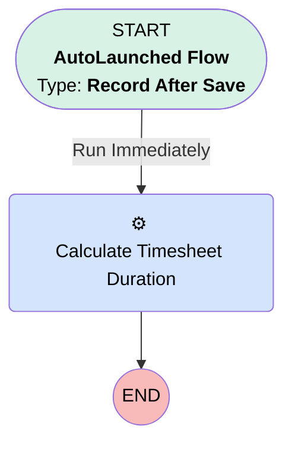

# [TimesheetEntry] - After Save - Break Time

## Flow Diagram

## General Information

|<!-- -->|<!-- -->|
|:---|:---|
|Object|TimeSheetEntry|
|Process Type| Auto Launched Flow|
|Trigger Type| Record After Save|
|Record Trigger Type| Create And Update|
|Label|[TimesheetEntry] - After Save - Break Time|
|Status|Obsolete|
|Does Require Record Changed To Meet Criteria|✅|
|Filter Formula|ISCHANGED({!$Record.StartTime}) ||  ISCHANGED({!$Record.EndTime})|
|Environments|Default|
|Interview Label|[TimesheetEntry] - After Save - Break Time {!$Flow.CurrentDateTime}|
| Builder Type (PM)|LightningFlowBuilder|
| Canvas Mode (PM)|AUTO_LAYOUT_CANVAS|
| Origin Builder Type (PM)|LightningFlowBuilder|

#### Scheduled Paths

|Label|Name|Offset Number|Offset Unit|Record Field|Time Source|Connector|
|:-- |:-- |:-- |:-- |:-- |:-- |:--  |
|<!-- -->|<!-- -->|<!-- -->|<!-- -->|<!-- -->|<!-- -->|[Calculate_Timesheet_Duration](#calculate_timesheet_duration)|

## Flow Nodes Details

### Calculate_Timesheet_Duration

|<!-- -->|<!-- -->|
|:---|:---|
|Type|Action Call|
|Label|Calculate Timesheet Duration|
|Action Type|Apex|
|Action Name|TimeSheetCalculationInvocable|
|Flow Transaction Model|CurrentTransaction|
|Name Segment|TimeSheetCalculationInvocable|
|Offset|0|
|Version Segment|1|
|Record Id (input)|$Record.Id|
|Record Type (input)|TimeSheetEntry|

___

_Documentation generated from branch monitoring_krinkelsgreencare__upeodev_sandbox by [sfdx-hardis](https://sfdx-hardis.cloudity.com), featuring [salesforce-flow-visualiser](https://github.com/toddhalfpenny/salesforce-flow-visualiser)_