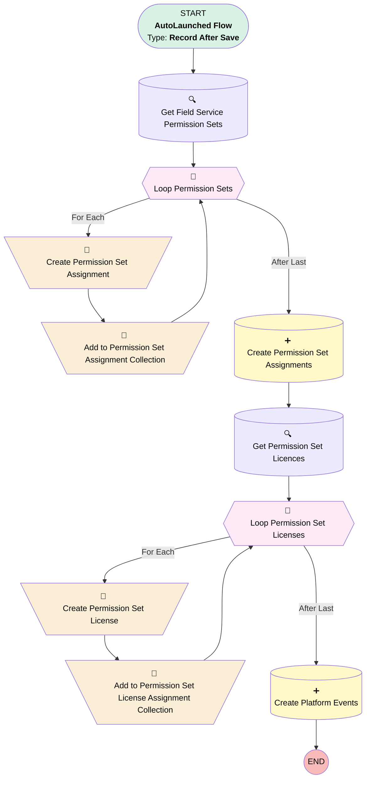

# [User] [After Update] [RecordTrigered] Create Service Resource

## Flow Diagram

## General Information

|<!-- -->|<!-- -->|
|:---|:---|
|Object|User|
|Process Type| Auto Launched Flow|
|Trigger Type| Record After Save|
|Record Trigger Type| Update|
|Label|[User] [After Update] [RecordTrigered] Create Service Resource|
|Status|Obsolete|
|Environments|Default|
|Interview Label|[User] [After Update] [RecordTrigered] Create Service Resource {!$Flow.CurrentDateTime}|
| Builder Type (PM)|LightningFlowBuilder|
| Canvas Mode (PM)|AUTO_LAYOUT_CANVAS|
| Origin Builder Type (PM)|LightningFlowBuilder|
|Connector|[Get_Field_Service_Permission_Sets](#get_field_service_permission_sets)|
|Next Node|[Get_Field_Service_Permission_Sets](#get_field_service_permission_sets)|

#### Filters (logic: **and**)

|Filter Id|Field|Operator|Value|
|:-- |:-- |:--:|:--: |
|1|Create_Field_Service_Resource__c| Equal To|✅|
|2|Create_Field_Service_Resource__c| Is Changed|✅|

## Variables

|Name|Data Type|Is Collection|Is Input|Is Output|Object Type|
|:-- |:--:|:--:|:--:|:--:|:--: |
|PermissionSetAssignment|SObject|⬜|⬜|⬜|PermissionSetAssignment|
|PermissionSetAssignmentCollection|SObject|✅|⬜|⬜|PermissionSetAssignment|
|PermissionSetLicense|SObject|⬜|⬜|⬜|PermissionSetLicenseAssign|
|PermissionSetLicenseAssignmentCollection|SObject|✅|⬜|⬜|PermissionSetLicenseAssign|

## Flow Nodes Details

### Add_to_Permission_Set_Assignment_Collection

|<!-- -->|<!-- -->|
|:---|:---|
|Type|Assignment|
|Label|Add to Permission Set Assignment Collection|
|Connector|[Loop_Permission_Sets](#loop_permission_sets)|

#### Assignments

|Assign To Reference|Operator|Value|
|:-- |:--:|:--: |
|PermissionSetAssignmentCollection| Add|PermissionSetAssignment|

### Add_to_Permission_Set_License_Assignment_Collection

|<!-- -->|<!-- -->|
|:---|:---|
|Type|Assignment|
|Label|Add to Permission Set License Assignment Collection|
|Connector|[Loop_Permission_Set_Licenses](#loop_permission_set_licenses)|

#### Assignments

|Assign To Reference|Operator|Value|
|:-- |:--:|:--: |
|PermissionSetLicenseAssignmentCollection| Add|PermissionSetLicense|

### Create_Permission_Set_Assignment

|<!-- -->|<!-- -->|
|:---|:---|
|Type|Assignment|
|Label|Create Permission Set Assignment|
|Connector|[Add_to_Permission_Set_Assignment_Collection](#add_to_permission_set_assignment_collection)|

#### Assignments

|Assign To Reference|Operator|Value|
|:-- |:--:|:--: |
|PermissionSetAssignment.IsActive| Assign|✅|
|PermissionSetAssignment.AssigneeId| Assign|$Record.Id|
|PermissionSetAssignment.PermissionSetId| Assign|Loop_Permission_Sets.Id|

### Create_Permission_Set_License

|<!-- -->|<!-- -->|
|:---|:---|
|Type|Assignment|
|Label|Create Permission Set License|
|Connector|[Add_to_Permission_Set_License_Assignment_Collection](#add_to_permission_set_license_assignment_collection)|

#### Assignments

|Assign To Reference|Operator|Value|
|:-- |:--:|:--: |
|PermissionSetLicense.AssigneeId| Assign|$Record.Id|
|PermissionSetLicense.PermissionSetLicenseId| Assign|Loop_Permission_Set_Licenses.Id|

### Loop_Permission_Set_Licenses

|<!-- -->|<!-- -->|
|:---|:---|
|Type|Loop|
|Label|Loop Permission Set Licenses|
|Collection Reference|[Get_Permission_Set_Licences](#get_permission_set_licences)|
|Iteration Order|Asc|
|Next Value Connector|[Create_Permission_Set_License](#create_permission_set_license)|
|No More Values Connector|[Create_Platform_Events](#create_platform_events)|

### Loop_Permission_Sets

|<!-- -->|<!-- -->|
|:---|:---|
|Type|Loop|
|Label|Loop Permission Sets|
|Collection Reference|[Get_Field_Service_Permission_Sets](#get_field_service_permission_sets)|
|Iteration Order|Asc|
|Next Value Connector|[Create_Permission_Set_Assignment](#create_permission_set_assignment)|
|No More Values Connector|[Create_Permission_Set_Assignments](#create_permission_set_assignments)|

### Create_Permission_Set_Assignments

|<!-- -->|<!-- -->|
|:---|:---|
|Type|Record Create|
|Label|Create Permission Set Assignments|
|Input Reference|PermissionSetAssignmentCollection|
|Connector|[Get_Permission_Set_Licences](#get_permission_set_licences)|

### Create_Platform_Events

|<!-- -->|<!-- -->|
|:---|:---|
|Type|Record Create|
|Object|Operator_Created_Event__e|
|Label|Create Platform Events|
|Store Output Automatically|✅|

#### Input Assignments

|Field|Value|
|:-- |:--: |
|User_Id__c|$Record.Id|

### Get_Field_Service_Permission_Sets

|<!-- -->|<!-- -->|
|:---|:---|
|Type|Record Lookup|
|Object|PermissionSet|
|Label|Get Field Service Permission Sets|
|Assign Null Values If No Records Found|⬜|
|Get First Record Only|⬜|
|Store Output Automatically|✅|
|Connector|[Loop_Permission_Sets](#loop_permission_sets)|

#### Filters (logic: **or**)

|Filter Id|Field|Operator|Value|
|:-- |:-- |:--:|:--: |
|1|Label| Equal To|Field Service Mobile License|
|2|Label| Equal To|Field Service Resource License|
|3|Label| Equal To|Field Service Resource Permissions|

### Get_Permission_Set_Licences

|<!-- -->|<!-- -->|
|:---|:---|
|Type|Record Lookup|
|Object|PermissionSetLicense|
|Label|Get Permission Set Licences|
|Assign Null Values If No Records Found|⬜|
|Get First Record Only|⬜|
|Store Output Automatically|✅|
|Connector|[Loop_Permission_Set_Licenses](#loop_permission_set_licenses)|

#### Filters (logic: **or**)

|Filter Id|Field|Operator|Value|
|:-- |:-- |:--:|:--: |
|1|MasterLabel| Equal To|Field Service Mobile|
|2|MasterLabel| Equal To|Field Service Scheduling|

___

_Documentation generated from branch monitoring_krinkelsgreencare__upeodev_sandbox by [sfdx-hardis](https://sfdx-hardis.cloudity.com), featuring [salesforce-flow-visualiser](https://github.com/toddhalfpenny/salesforce-flow-visualiser)_