# [Van][After-Save][Record-Triggered] Assign Van to Lead Crew Member

## Flow Diagram

```mermaid
%% If you read this, your Markdown visualizer does not handle MermaidJS syntax.
%% - If you are in VsCode, install extension `Markdown Preview Mermaid Support` at https://marketplace.visualstudio.com/items?itemName=bierner.markdown-mermaid
%% - If you are using sfdx-hardis, try to define env variable `MERMAID_MODES=cli,docker` ,then run again the command to regenerate markdown with SVG images.
%% - If you are within mkdocs-material, define mermaid plugin in `mkdocs.yml` as described in https://squidfunk.github.io/mkdocs-material/extensions/mermaid/
%% - At last resort, you can copy-paste this MermaidJS code in https://mermaid.live/ to see the Flow Diagram

flowchart TB
START(["START<br/><b>AutoLaunched Flow</b></br>Type: <b> Record After Save</b>"]):::startClass
click START "#general-information" "905902752"

Lead_Van_Crew_Member_Found{"🔀 <em></em><br/>Lead Van Crew Member  Found ?"}:::decisions
click Lead_Van_Crew_Member_Found "#lead_van_crew_member_found" "4034658958"

Get_Related_Lead_Van_Crew_Member[("🔍 <em></em><br/>Get Related Lead Van Crew Member")]:::recordLookups
click Get_Related_Lead_Van_Crew_Member "#get_related_lead_van_crew_member" "2484839211"

Update_Van_Field_on_Related_Service_Resource[("🛠️ <em></em><br/>Update Van Field on Related Service Resource")]:::recordUpdates
click Update_Van_Field_on_Related_Service_Resource "#update_van_field_on_related_service_resource" "770266133"

Lead_Van_Crew_Member_Found --> |"Yes"| Update_Van_Field_on_Related_Service_Resource
Lead_Van_Crew_Member_Found --> |"Default Outcome"| END_Lead_Van_Crew_Member_Found
Get_Related_Lead_Van_Crew_Member --> Lead_Van_Crew_Member_Found
Update_Van_Field_on_Related_Service_Resource --> END_Update_Van_Field_on_Related_Service_Resource
START -->  Get_Related_Lead_Van_Crew_Member
END_Lead_Van_Crew_Member_Found(( END )):::endClass
END_Update_Van_Field_on_Related_Service_Resource(( END )):::endClass


classDef actionCalls fill:#D4E4FC,color:black,max-height:100px
classDef assignments fill:#FBEED7,color:black,max-height:100px
classDef collectionProcessors fill:#F0E3FA,color:black,max-height:100px
classDef customErrors fill:#FFE9E9,color:black,max-height:100px
classDef decisions fill:#FDEAF6,color:black,max-height:100px
classDef loops fill:#FDEAF6,color:black,max-height:100px
classDef recordCreates fill:#FFF8C9,color:black,max-height:100px
classDef recordDeletes fill:#FFF8C9,color:black,max-height:100px
classDef recordLookups fill:#EDEAFF,color:black,max-height:100px
classDef recordUpdates fill:#FFF8C9,color:black,max-height:100px
classDef screens fill:#DFF6FF,color:black,max-height:100px
classDef subflows fill:#D4E4FC,color:black,max-height:100px
classDef startClass fill:#D9F2E6,color:black,max-height:100px
classDef endClass fill:#F9BABA,color:black,max-height:100px


```

## General Information

|<!-- -->|<!-- -->|
|:---|:---|
|Object|Location|
|Process Type| Auto Launched Flow|
|Trigger Type| Record After Save|
|Record Trigger Type| Create And Update|
|Label|[Van][After-Save][Record-Triggered] Assign Van to Lead Crew Member|
|Status|Active|
|Description|This flow populates the Van field on the service resource record of the lead van crew member, allowing him to log the products consumed.|
|Environments|Default|
|Interview Label|[Van][After-Save][Record-Triggered] Assign Van to Lead Crew Member {!$Flow.CurrentDateTime}|
| Builder Type (PM)|LightningFlowBuilder|
| Canvas Mode (PM)|AUTO_LAYOUT_CANVAS|
| Origin Builder Type (PM)|LightningFlowBuilder|
|Connector|[Get_Related_Lead_Van_Crew_Member](#get_related_lead_van_crew_member)|
|Next Node|[Get_Related_Lead_Van_Crew_Member](#get_related_lead_van_crew_member)|

#### Filters (logic: **and**)

|Filter Id|Field|Operator|Value|
|:-- |:-- |:--:|:--: |
|1|Van_Crew__c| Is Null|<!-- -->|

## Flow Nodes Details

### Lead_Van_Crew_Member_Found

|<!-- -->|<!-- -->|
|:---|:---|
|Type|Decision|
|Label|Lead Van Crew Member  Found ?|
|Default Connector Label|Default Outcome|

#### Rule Yes (Yes)

|<!-- -->|<!-- -->|
|:---|:---|
|Connector|[Update_Van_Field_on_Related_Service_Resource](#update_van_field_on_related_service_resource)|
|Condition Logic|and|

|Condition Id|Left Value Reference|Operator|Right Value|
|:-- |:-- |:--:|:--: |
|1|[Get_Related_Lead_Van_Crew_Member](#get_related_lead_van_crew_member)| Is Null|⬜|

### Get_Related_Lead_Van_Crew_Member

|<!-- -->|<!-- -->|
|:---|:---|
|Type|Record Lookup|
|Object|ServiceCrewMember|
|Label|Get Related Lead Van Crew Member|
|Assign Null Values If No Records Found|⬜|
|Get First Record Only|✅|
|Store Output Automatically|✅|
|Connector|[Lead_Van_Crew_Member_Found](#lead_van_crew_member_found)|

#### Filters (logic: **and**)

|Filter Id|Field|Operator|Value|
|:-- |:-- |:--:|:--: |
|1|ServiceCrewId| Equal To|$Record.Van_Crew__c|
|2|IsLeader| Equal To|✅|

### Update_Van_Field_on_Related_Service_Resource

|<!-- -->|<!-- -->|
|:---|:---|
|Type|Record Update|
|Object|ServiceResource|
|Label|Update Van Field on Related Service Resource|

#### Filters (logic: **and**)

|Filter Id|Field|Operator|Value|
|:-- |:-- |:--:|:--: |
|1|Id| Equal To|Get_Related_Lead_Van_Crew_Member.ServiceResourceId|

#### Input Assignments

|Field|Value|
|:-- |:--: |
|LocationId|$Record.Id|

___

_Documentation generated from branch monitoring_krinkelsgreencare__upeodev_sandbox by [sfdx-hardis](https://sfdx-hardis.cloudity.com), featuring [salesforce-flow-visualiser](https://github.com/toddhalfpenny/salesforce-flow-visualiser)_