# [Work Order][After-Save][Record-Triggered] Add WOL As Work Steps

## Flow Diagram

```mermaid
%% If you read this, your Markdown visualizer does not handle MermaidJS syntax.
%% - If you are in VsCode, install extension `Markdown Preview Mermaid Support` at https://marketplace.visualstudio.com/items?itemName=bierner.markdown-mermaid
%% - If you are using sfdx-hardis, try to define env variable `MERMAID_MODES=cli,docker` ,then run again the command to regenerate markdown with SVG images.
%% - If you are within mkdocs-material, define mermaid plugin in `mkdocs.yml` as described in https://squidfunk.github.io/mkdocs-material/extensions/mermaid/
%% - At last resort, you can copy-paste this MermaidJS code in https://mermaid.live/ to see the Flow Diagram

flowchart TB
START(["START<br/><b>AutoLaunched Flow</b></br>Type: <b> Record After Save</b>"]):::startClass
click START "#general-information" "4252839996"

Increment_Order[\"🟰 <em></em><br/>Increment Order"/]:::assignments
click Increment_Order "#increment_order" "2242132951"

Set_beforeExecutions[\"🟰 <em></em><br/>Set beforeExecutions"/]:::assignments
click Set_beforeExecutions "#set_beforeexecutions" "1601222617"

Set_Values_for_Work_Steps[\"🟰 <em></em><br/>Set Values for Work Steps"/]:::assignments
click Set_Values_for_Work_Steps "#set_values_for_work_steps" "4058244898"

Check_beforeExectionsOrder{"🔀 <em></em><br/>Check beforeExectionsOrder"}:::decisions
click Check_beforeExectionsOrder "#check_beforeexectionsorder" "3664902101"

WOL_presents{"🔀 <em></em><br/>WOL presents ?"}:::decisions
click WOL_presents "#wol_presents" "2033851454"

Work_Plan_Present{"🔀 <em></em><br/>Work Plan Present  ?"}:::decisions
click Work_Plan_Present "#work_plan_present" "1562172295"

Loop_Through_WOL{{"🔁 <em></em><br/>Loop Through WOL"}}:::loops
click Loop_Through_WOL "#loop_through_wol" "2757755997"

Create_New_Work_Steps[("➕ <em></em><br/>Create New Work Steps")]:::recordCreates
click Create_New_Work_Steps "#create_new_work_steps" "3617022635"

Create_Platform_Event_to_Reorder_Last_Steps[("➕ <em></em><br/>Create Platform Event to Reorder Last Steps")]:::recordCreates
click Create_Platform_Event_to_Reorder_Last_Steps "#create_platform_event_to_reorder_last_steps" "657826964"

Get_Before_Work_Photos_Step_Information[("🔍 <em></em><br/>Get Before Work Photos Step Information")]:::recordLookups
click Get_Before_Work_Photos_Step_Information "#get_before_work_photos_step_information" "4165026208"

Get_WOL[("🔍 <em></em><br/>Get WOL")]:::recordLookups
click Get_WOL "#get_wol" "3672556536"

Get_Work_Plan_Information[("🔍 <em></em><br/>Get Work Plan Information")]:::recordLookups
click Get_Work_Plan_Information "#get_work_plan_information" "824162745"

Increment_Order --> Loop_Through_WOL
Set_beforeExecutions --> Get_WOL
Set_Values_for_Work_Steps --> Increment_Order
Check_beforeExectionsOrder --> |"Is Null"| Set_beforeExecutions
Check_beforeExectionsOrder --> |"Default Outcome"| Get_WOL
WOL_presents --> |"Yes"| Loop_Through_WOL
WOL_presents --> |"No"| END_WOL_presents
Work_Plan_Present --> |"Yes"| Get_Before_Work_Photos_Step_Information
Work_Plan_Present --> |"No"| END_Work_Plan_Present
Loop_Through_WOL --> |"For Each"|Set_Values_for_Work_Steps
Loop_Through_WOL ---> |"After Last"|Create_New_Work_Steps
Create_New_Work_Steps --> Create_Platform_Event_to_Reorder_Last_Steps
Create_Platform_Event_to_Reorder_Last_Steps --> END_Create_Platform_Event_to_Reorder_Last_Steps
Get_Before_Work_Photos_Step_Information --> Check_beforeExectionsOrder
Get_WOL --> WOL_presents
Get_Work_Plan_Information --> Work_Plan_Present
START -->  Get_Work_Plan_Information
END_WOL_presents(( END )):::endClass
END_Work_Plan_Present(( END )):::endClass
END_Create_Platform_Event_to_Reorder_Last_Steps(( END )):::endClass


classDef actionCalls fill:#D4E4FC,color:black,max-height:100px
classDef assignments fill:#FBEED7,color:black,max-height:100px
classDef collectionProcessors fill:#F0E3FA,color:black,max-height:100px
classDef customErrors fill:#FFE9E9,color:black,max-height:100px
classDef decisions fill:#FDEAF6,color:black,max-height:100px
classDef loops fill:#FDEAF6,color:black,max-height:100px
classDef recordCreates fill:#FFF8C9,color:black,max-height:100px
classDef recordDeletes fill:#FFF8C9,color:black,max-height:100px
classDef recordLookups fill:#EDEAFF,color:black,max-height:100px
classDef recordUpdates fill:#FFF8C9,color:black,max-height:100px
classDef screens fill:#DFF6FF,color:black,max-height:100px
classDef subflows fill:#D4E4FC,color:black,max-height:100px
classDef startClass fill:#D9F2E6,color:black,max-height:100px
classDef endClass fill:#F9BABA,color:black,max-height:100px


```

## General Information

|<!-- -->|<!-- -->|
|:---|:---|
|Object|WorkOrder|
|Process Type| Auto Launched Flow|
|Trigger Type| Record After Save|
|Record Trigger Type| Create And Update|
|Label|[Work Order][After-Save][Record-Triggered] Add WOL As Work Steps|
|Status|Active|
|Environments|Default|
|Interview Label|[Work Order][After-Save][Record-Triggered] Add WOL As Work Steps {!$Flow.CurrentDateTime}|
| Builder Type (PM)|LightningFlowBuilder|
| Canvas Mode (PM)|AUTO_LAYOUT_CANVAS|
| Origin Builder Type (PM)|LightningFlowBuilder|
|Connector|[Get_Work_Plan_Information](#get_work_plan_information)|
|Next Node|[Get_Work_Plan_Information](#get_work_plan_information)|

#### Filters (logic: **and**)

|Filter Id|Field|Operator|Value|
|:-- |:-- |:--:|:--: |
|1|Status| Is Changed|✅|
|2|Status| Equal To|Dispatched|

## Variables

|Name|Data Type|Is Collection|Is Input|Is Output|Object Type|
|:-- |:--:|:--:|:--:|:--:|:--: |
|BeforePhotosOrder|Number|⬜|✅|⬜|<!-- -->|
|IncrementOrder|Number|⬜|✅|⬜|<!-- -->|
|WorkStepCollection|SObject|✅|✅|⬜|WorkStep|
|WorkStepRecord|SObject|⬜|✅|⬜|WorkStep|

## Flow Nodes Details

### Increment_Order

|<!-- -->|<!-- -->|
|:---|:---|
|Type|Assignment|
|Label|Increment Order|
|Connector|[Loop_Through_WOL](#loop_through_wol)|

#### Assignments

|Assign To Reference|Operator|Value|
|:-- |:--:|:--: |
|IncrementOrder| Add|1|

### Set_beforeExecutions

|<!-- -->|<!-- -->|
|:---|:---|
|Type|Assignment|
|Label|Set beforeExecutions|
|Connector|[Get_WOL](#get_wol)|

#### Assignments

|Assign To Reference|Operator|Value|
|:-- |:--:|:--: |
|BeforePhotosOrder| Assign|1|

### Set_Values_for_Work_Steps

|<!-- -->|<!-- -->|
|:---|:---|
|Type|Assignment|
|Label|Set Values for Work Steps|
|Connector|[Increment_Order](#increment_order)|

#### Assignments

|Assign To Reference|Operator|Value|
|:-- |:--:|:--: |
|WorkStepRecord.WorkOrderId| Assign|$Record.Id|
|WorkStepRecord.Name| Assign|Loop_Through_WOL.Description|
|WorkStepRecord.WorkPlanId| Assign|Get_Work_Plan_Information.Id|
|WorkStepRecord.Work_Order_Line_Item__c| Assign|Loop_Through_WOL.Id|
|WorkStepRecord.ExecutionOrder| Assign|NextNumber|
|WorkStepCollection| Add|WorkStepRecord|

### Check_beforeExectionsOrder

|<!-- -->|<!-- -->|
|:---|:---|
|Type|Decision|
|Label|Check beforeExectionsOrder|
|Default Connector|[Get_WOL](#get_wol)|
|Default Connector Label|Default Outcome|

#### Rule Is_Null (Is Null)

|<!-- -->|<!-- -->|
|:---|:---|
|Connector|[Set_beforeExecutions](#set_beforeexecutions)|
|Condition Logic|and|

|Condition Id|Left Value Reference|Operator|Right Value|
|:-- |:-- |:--:|:--: |
|1|BeforePhotosOrder| Is Null|✅|

### WOL_presents

|<!-- -->|<!-- -->|
|:---|:---|
|Type|Decision|
|Label|WOL presents ?|
|Default Connector Label|No|

#### Rule Yes_WOL_presents (Yes)

|<!-- -->|<!-- -->|
|:---|:---|
|Connector|[Loop_Through_WOL](#loop_through_wol)|
|Condition Logic|and|

|Condition Id|Left Value Reference|Operator|Right Value|
|:-- |:-- |:--:|:--: |
|1|[Get_WOL](#get_wol)| Is Empty|⬜|

### Work_Plan_Present

|<!-- -->|<!-- -->|
|:---|:---|
|Type|Decision|
|Label|Work Plan Present  ?|
|Default Connector Label|No|

#### Rule Yes_Work_Plan_Present (Yes)

|<!-- -->|<!-- -->|
|:---|:---|
|Connector|[Get_Before_Work_Photos_Step_Information](#get_before_work_photos_step_information)|
|Condition Logic|and|

|Condition Id|Left Value Reference|Operator|Right Value|
|:-- |:-- |:--:|:--: |
|1|Get_Work_Plan_Information.Id| Is Null|⬜|

### Loop_Through_WOL

|<!-- -->|<!-- -->|
|:---|:---|
|Type|Loop|
|Label|Loop Through WOL|
|Collection Reference|[Get_WOL](#get_wol)|
|Iteration Order|Asc|
|Next Value Connector|[Set_Values_for_Work_Steps](#set_values_for_work_steps)|
|No More Values Connector|[Create_New_Work_Steps](#create_new_work_steps)|

### Create_New_Work_Steps

|<!-- -->|<!-- -->|
|:---|:---|
|Type|Record Create|
|Label|Create New Work Steps|
|Input Reference|WorkStepCollection|
|Connector|[Create_Platform_Event_to_Reorder_Last_Steps](#create_platform_event_to_reorder_last_steps)|

### Create_Platform_Event_to_Reorder_Last_Steps

|<!-- -->|<!-- -->|
|:---|:---|
|Type|Record Create|
|Object|Reorder_Work_Step__e|
|Label|Create Platform Event to Reorder Last Steps|
|Store Output Automatically|✅|

#### Input Assignments

|Field|Value|
|:-- |:--: |
|Next_Number__c|NextNumber|
|Work_Order_Id__c|$Record.Id|

### Get_Before_Work_Photos_Step_Information

|<!-- -->|<!-- -->|
|:---|:---|
|Type|Record Lookup|
|Object|WorkStep|
|Label|Get Before Work Photos Step Information|
|Assign Null Values If No Records Found|⬜|
|Output Assignments|assignToReference: BeforePhotosOrder field: ExecutionOrder |
|Connector|[Check_beforeExectionsOrder](#check_beforeexectionsorder)|

#### Filters (logic: **and**)

|Filter Id|Field|Operator|Value|
|:-- |:-- |:--:|:--: |
|1|WorkOrderId| Equal To|$Record.Id|
|2|Name| Equal To|Take Before Work Photos|

### Get_WOL

|<!-- -->|<!-- -->|
|:---|:---|
|Type|Record Lookup|
|Object|WorkOrderLineItem|
|Label|Get WOL|
|Assign Null Values If No Records Found|⬜|
|Get First Record Only|⬜|
|Store Output Automatically|✅|
|Connector|[WOL_presents](#wol_presents)|

#### Filters (logic: **and**)

|Filter Id|Field|Operator|Value|
|:-- |:-- |:--:|:--: |
|1|WorkOrderId| Equal To|$Record.Id|

### Get_Work_Plan_Information

|<!-- -->|<!-- -->|
|:---|:---|
|Type|Record Lookup|
|Object|WorkPlan|
|Label|Get Work Plan Information|
|Assign Null Values If No Records Found|⬜|
|Get First Record Only|✅|
|Store Output Automatically|✅|
|Connector|[Work_Plan_Present](#work_plan_present)|

#### Filters (logic: **and**)

|Filter Id|Field|Operator|Value|
|:-- |:-- |:--:|:--: |
|1|WorkOrderId| Equal To|$Record.Id|

___

_Documentation generated from branch monitoring_krinkelsgreencare__upeodev_sandbox by [sfdx-hardis](https://sfdx-hardis.cloudity.com), featuring [salesforce-flow-visualiser](https://github.com/toddhalfpenny/salesforce-flow-visualiser)_