# [Work Order][After-Save][Record-Triggered] Assign Products Consumed

## Flow Diagram

```mermaid
%% If you read this, your Markdown visualizer does not handle MermaidJS syntax.
%% - If you are in VsCode, install extension `Markdown Preview Mermaid Support` at https://marketplace.visualstudio.com/items?itemName=bierner.markdown-mermaid
%% - If you are using sfdx-hardis, try to define env variable `MERMAID_MODES=cli,docker` ,then run again the command to regenerate markdown with SVG images.
%% - If you are within mkdocs-material, define mermaid plugin in `mkdocs.yml` as described in https://squidfunk.github.io/mkdocs-material/extensions/mermaid/
%% - At last resort, you can copy-paste this MermaidJS code in https://mermaid.live/ to see the Flow Diagram

flowchart TB
START(["START<br/><b>AutoLaunched Flow</b></br>Type: <b> Record After Save</b>"]):::startClass
click START "#general-information" "1878252856"

Add_to_Collection[\"🟰 <em></em><br/>Add to Collection"/]:::assignments
click Add_to_Collection "#add_to_collection" "349013536"

Set_ProductConsumed[\"🟰 <em></em><br/>Set ProductConsumed"/]:::assignments
click Set_ProductConsumed "#set_productconsumed" "2512355329"

Loop_Material_Items{{"🔁 <em></em><br/>Loop Material Items"}}:::loops
click Loop_Material_Items "#loop_material_items" "2738472502"

Create_Products_Consumed[("➕ <em></em><br/>Create Products Consumed")]:::recordCreates
click Create_Products_Consumed "#create_products_consumed" "497010901"

Get_Assigned_Crew_Resource[("🔍 <em></em><br/>Get Assigned Crew Resource")]:::recordLookups
click Get_Assigned_Crew_Resource "#get_assigned_crew_resource" "3905967631"

Get_Material_Items[("🔍 <em></em><br/>Get Material Items")]:::recordLookups
click Get_Material_Items "#get_material_items" "4243110491"

Get_Service_Appointment[("🔍 <em></em><br/>Get Service Appointment")]:::recordLookups
click Get_Service_Appointment "#get_service_appointment" "892165293"

Add_to_Collection --> Loop_Material_Items
Set_ProductConsumed --> Add_to_Collection
Loop_Material_Items --> |"For Each"|Set_ProductConsumed
Loop_Material_Items ---> |"After Last"|Create_Products_Consumed
Create_Products_Consumed --> END_Create_Products_Consumed
Get_Assigned_Crew_Resource --> Get_Material_Items
Get_Material_Items --> Loop_Material_Items
Get_Service_Appointment --> Get_Assigned_Crew_Resource
START -->  Get_Service_Appointment
END_Create_Products_Consumed(( END )):::endClass


classDef actionCalls fill:#D4E4FC,color:black,max-height:100px
classDef assignments fill:#FBEED7,color:black,max-height:100px
classDef collectionProcessors fill:#F0E3FA,color:black,max-height:100px
classDef customErrors fill:#FFE9E9,color:black,max-height:100px
classDef decisions fill:#FDEAF6,color:black,max-height:100px
classDef loops fill:#FDEAF6,color:black,max-height:100px
classDef recordCreates fill:#FFF8C9,color:black,max-height:100px
classDef recordDeletes fill:#FFF8C9,color:black,max-height:100px
classDef recordLookups fill:#EDEAFF,color:black,max-height:100px
classDef recordUpdates fill:#FFF8C9,color:black,max-height:100px
classDef screens fill:#DFF6FF,color:black,max-height:100px
classDef subflows fill:#D4E4FC,color:black,max-height:100px
classDef startClass fill:#D9F2E6,color:black,max-height:100px
classDef endClass fill:#F9BABA,color:black,max-height:100px


```

## General Information

|<!-- -->|<!-- -->|
|:---|:---|
|Object|WorkOrder|
|Process Type| Auto Launched Flow|
|Trigger Type| Record After Save|
|Record Trigger Type| Update|
|Label|[Work Order][After-Save][Record-Triggered] Assign Products Consumed|
|Status|Active|
|Environments|Default|
|Interview Label|[Work Order][After-Save][Record-Triggered] Assign Products Consumed {!$Flow.CurrentDateTime}|
| Builder Type (PM)|LightningFlowBuilder|
| Canvas Mode (PM)|AUTO_LAYOUT_CANVAS|
| Origin Builder Type (PM)|LightningFlowBuilder|
|Connector|[Get_Service_Appointment](#get_service_appointment)|
|Next Node|[Get_Service_Appointment](#get_service_appointment)|

#### Filters (logic: **and**)

|Filter Id|Field|Operator|Value|
|:-- |:-- |:--:|:--: |
|1|Status| Is Changed|✅|
|2|Status| Equal To|Scheduled|
|3|Production_Work__c| Equal To|✅|

## Variables

|Name|Data Type|Is Collection|Is Input|Is Output|Object Type|
|:-- |:--:|:--:|:--:|:--:|:--: |
|productConsumed|SObject|⬜|⬜|⬜|ProductConsumed|
|productConsumedCollection|SObject|✅|⬜|⬜|ProductConsumed|

## Flow Nodes Details

### Add_to_Collection

|<!-- -->|<!-- -->|
|:---|:---|
|Type|Assignment|
|Label|Add to Collection|
|Connector|[Loop_Material_Items](#loop_material_items)|

#### Assignments

|Assign To Reference|Operator|Value|
|:-- |:--:|:--: |
|productConsumedCollection| Add|productConsumed|

### Set_ProductConsumed

|<!-- -->|<!-- -->|
|:---|:---|
|Type|Assignment|
|Label|Set ProductConsumed|
|Connector|[Add_to_Collection](#add_to_collection)|

#### Assignments

|Assign To Reference|Operator|Value|
|:-- |:--:|:--: |
|productConsumed.WorkOrderId| Assign|$Record.Id|
|productConsumed.ProductItemId| Assign|Loop_Material_Items.Id|
|productConsumed.QuantityConsumed| Assign|1|

### Loop_Material_Items

|<!-- -->|<!-- -->|
|:---|:---|
|Type|Loop|
|Label|Loop Material Items|
|Collection Reference|[Get_Material_Items](#get_material_items)|
|Iteration Order|Asc|
|Next Value Connector|[Set_ProductConsumed](#set_productconsumed)|
|No More Values Connector|[Create_Products_Consumed](#create_products_consumed)|

### Create_Products_Consumed

|<!-- -->|<!-- -->|
|:---|:---|
|Type|Record Create|
|Label|Create Products Consumed|
|Input Reference|productConsumedCollection|

### Get_Assigned_Crew_Resource

|<!-- -->|<!-- -->|
|:---|:---|
|Type|Record Lookup|
|Object|AssignedResource|
|Label|Get Assigned Crew Resource|
|Assign Null Values If No Records Found|⬜|
|Get First Record Only|✅|
|Store Output Automatically|✅|
|Connector|[Get_Material_Items](#get_material_items)|

#### Filters (logic: **and**)

|Filter Id|Field|Operator|Value|
|:-- |:-- |:--:|:--: |
|1|ServiceAppointmentId| Equal To|Get_Service_Appointment.Id|
|2|Resource_Is_A_Person__c| Equal To|⬜|

### Get_Material_Items

|<!-- -->|<!-- -->|
|:---|:---|
|Type|Record Lookup|
|Object|ProductItem|
|Label|Get Material Items|
|Assign Null Values If No Records Found|⬜|
|Get First Record Only|⬜|
|Store Output Automatically|✅|
|Connector|[Loop_Material_Items](#loop_material_items)|

#### Filters (logic: **and**)

|Filter Id|Field|Operator|Value|
|:-- |:-- |:--:|:--: |
|1|LocationId| Equal To|Get_Assigned_Crew_Resource.ServiceResource.LocationId|
|2|Is_Temporary__c| Equal To|⬜|

### Get_Service_Appointment

|<!-- -->|<!-- -->|
|:---|:---|
|Type|Record Lookup|
|Object|ServiceAppointment|
|Label|Get Service Appointment|
|Assign Null Values If No Records Found|⬜|
|Get First Record Only|✅|
|Store Output Automatically|✅|
|Connector|[Get_Assigned_Crew_Resource](#get_assigned_crew_resource)|

#### Filters (logic: **and**)

|Filter Id|Field|Operator|Value|
|:-- |:-- |:--:|:--: |
|1|ParentRecordId| Equal To|$Record.Id|

___

_Documentation generated from branch monitoring_krinkelsgreencare__upeodev_sandbox by [sfdx-hardis](https://sfdx-hardis.cloudity.com), featuring [salesforce-flow-visualiser](https://github.com/toddhalfpenny/salesforce-flow-visualiser)_