# [Work Order][After-Save][Record-Triggered] Populate Contact on WO and SA

## Flow Diagram

```mermaid
%% If you read this, your Markdown visualizer does not handle MermaidJS syntax.
%% - If you are in VsCode, install extension `Markdown Preview Mermaid Support` at https://marketplace.visualstudio.com/items?itemName=bierner.markdown-mermaid
%% - If you are using sfdx-hardis, try to define env variable `MERMAID_MODES=cli,docker` ,then run again the command to regenerate markdown with SVG images.
%% - If you are within mkdocs-material, define mermaid plugin in `mkdocs.yml` as described in https://squidfunk.github.io/mkdocs-material/extensions/mermaid/
%% - At last resort, you can copy-paste this MermaidJS code in https://mermaid.live/ to see the Flow Diagram

flowchart TB
START(["START<br/><b>AutoLaunched Flow</b></br>Type: <b> Record After Save</b>"]):::startClass
click START "#general-information" "346636380"

Filter_Out_Operating{{"🔽 <em>Collection Filter</em><br/>Filter Out Operating"}}:::collectionProcessors
click Filter_Out_Operating "#filter_out_operating" "2577911783"

Contact_Found{"🔀 <em></em><br/>Contact Found ?"}:::decisions
click Contact_Found "#contact_found" "58119269"

Get_Operational_Contact[("🔍 <em></em><br/>Get Operational Contact")]:::recordLookups
click Get_Operational_Contact "#get_operational_contact" "447239799"

Update_Contact_Field_on_SA[("🛠️ <em></em><br/>Update Contact Field on SA")]:::recordUpdates
click Update_Contact_Field_on_SA "#update_contact_field_on_sa" "1668573287"

Update_Contact_Field_on_WO[("🛠️ <em></em><br/>Update Contact Field on WO")]:::recordUpdates
click Update_Contact_Field_on_WO "#update_contact_field_on_wo" "694167732"

Filter_Out_Operating --> Contact_Found
Contact_Found --> |"Yes"| Update_Contact_Field_on_WO
Contact_Found --> |"No"| END_Contact_Found
Get_Operational_Contact --> Filter_Out_Operating
Update_Contact_Field_on_SA --> END_Update_Contact_Field_on_SA
Update_Contact_Field_on_WO --> Update_Contact_Field_on_SA
START -->  Get_Operational_Contact
END_Contact_Found(( END )):::endClass
END_Update_Contact_Field_on_SA(( END )):::endClass


classDef actionCalls fill:#D4E4FC,color:black,text-decoration:none,max-height:100px
classDef assignments fill:#FBEED7,color:black,text-decoration:none,max-height:100px
classDef collectionProcessors fill:#F0E3FA,color:black,text-decoration:none,max-height:100px
classDef customErrors fill:#FFE9E9,color:black,text-decoration:none,max-height:100px
classDef decisions fill:#FDEAF6,color:black,text-decoration:none,max-height:100px
classDef loops fill:#FDEAF6,color:black,text-decoration:none,max-height:100px
classDef recordCreates fill:#FFF8C9,color:black,text-decoration:none,max-height:100px
classDef recordDeletes fill:#FFF8C9,color:black,text-decoration:none,max-height:100px
classDef recordLookups fill:#EDEAFF,color:black,text-decoration:none,max-height:100px
classDef recordUpdates fill:#FFF8C9,color:black,text-decoration:none,max-height:100px
classDef screens fill:#DFF6FF,color:black,text-decoration:none,max-height:100px
classDef subflows fill:#D4E4FC,color:black,text-decoration:none,max-height:100px
classDef startClass fill:#D9F2E6,color:black,text-decoration:none,max-height:100px
classDef endClass fill:#F9BABA,color:black,text-decoration:none,max-height:100px


```

## General Information

|<!-- -->|<!-- -->|
|:---|:---|
|Object|WorkOrder|
|Process Type| Auto Launched Flow|
|Trigger Type| Record After Save|
|Record Trigger Type| Update|
|Label|[Work Order][After-Save][Record-Triggered] Populate Contact on WO and SA|
|Status|Active|
|Description|This flow populates the contact field on a work order and its related service appointment on creation. It takes an operational contact of the related operational account.|
|Environments|Default|
|Interview Label|[Work Order][After-Save][Record-Triggered] Populate Contact on WO and SA {!$Flow.CurrentDateTime}|
| Builder Type (PM)|LightningFlowBuilder|
| Canvas Mode (PM)|AUTO_LAYOUT_CANVAS|
| Origin Builder Type (PM)|LightningFlowBuilder|
|Connector|[Get_Operational_Contact](#get_operational_contact)|
|Next Node|[Get_Operational_Contact](#get_operational_contact)|

#### Filters (logic: **and**)

|Filter Id|Field|Operator|Value|
|:-- |:-- |:--:|:--: |
|1|ContactId| Is Null|<!-- -->|
|2|AccountId| Is Null|<!-- -->|
|3|Status| Is Changed|✅|
|4|Status| Equal To|Scheduled|

## Variables

|Name|Data Type|Is Collection|Is Input|Is Output|Object Type|Description|
|:-- |:--:|:--:|:--:|:--:|:--:|:--  |
|currentItem_Filter_Out_Operating|SObject|⬜|⬜|⬜|AccountContactRelation|<!-- -->|

## Flow Nodes Details

### Filter_Out_Operating

|<!-- -->|<!-- -->|
|:---|:---|
|Type|Collection Processor|
|Label|Filter Out Operating|
|Element Subtype|FilterCollectionProcessor|
|Assign Next Value To Reference|currentItem_Filter_Out_Operating|
|Collection Processor Type|FilterCollectionProcessor|
|Collection Reference|[Get_Operational_Contact](#get_operational_contact)|
|Connector|[Contact_Found](#contact_found)|
|Condition Logic|and|

|Condition Id|Left Value Reference|Operator|Right Value|
|:-- |:-- |:--:|:--: |
|1|currentItem_Filter_Out_Operating.Roles| Contains|Operational|

### Contact_Found

|<!-- -->|<!-- -->|
|:---|:---|
|Type|Decision|
|Label|Contact Found ?|
|Default Connector Label|No|

#### Rule Yes (Yes)

|<!-- -->|<!-- -->|
|:---|:---|
|Connector|[Update_Contact_Field_on_WO](#update_contact_field_on_wo)|
|Condition Logic|and|

|Condition Id|Left Value Reference|Operator|Right Value|
|:-- |:-- |:--:|:--: |
|1|[Filter_Out_Operating](#filter_out_operating)| Is Null|⬜|

### Get_Operational_Contact

|<!-- -->|<!-- -->|
|:---|:---|
|Type|Record Lookup|
|Object|AccountContactRelation|
|Label|Get Operational Contact|
|Assign Null Values If No Records Found|⬜|
|Get First Record Only|⬜|
|Store Output Automatically|✅|
|Connector|[Filter_Out_Operating](#filter_out_operating)|

#### Filters (logic: **and**)

|Filter Id|Field|Operator|Value|
|:-- |:-- |:--:|:--: |
|1|AccountId| Equal To|$Record.AccountId|

### Update_Contact_Field_on_SA

|<!-- -->|<!-- -->|
|:---|:---|
|Type|Record Update|
|Object|ServiceAppointment|
|Label|Update Contact Field on SA|

#### Filters (logic: **and**)

|Filter Id|Field|Operator|Value|
|:-- |:-- |:--:|:--: |
|1|ParentRecordId| Equal To|$Record.Id|

#### Input Assignments

|Field|Value|
|:-- |:--: |
|ContactId|currentItem_Filter_Out_Operating.ContactId|

### Update_Contact_Field_on_WO

|<!-- -->|<!-- -->|
|:---|:---|
|Type|Record Update|
|Label|Update Contact Field on WO|
|Input Reference|$Record|
|Connector|[Update_Contact_Field_on_SA](#update_contact_field_on_sa)|

#### Input Assignments

|Field|Value|
|:-- |:--: |
|ContactId|currentItem_Filter_Out_Operating.ContactId|

___

_Documentation generated from branch monitoring_krinkelsgreencare__upeodev_sandbox by [sfdx-hardis](https://sfdx-hardis.cloudity.com), featuring [salesforce-flow-visualiser](https://github.com/toddhalfpenny/salesforce-flow-visualiser)_