# [Work Order][After-Save][Record-Triggered] Unassign Products Consumed

## Flow Diagram

```mermaid
%% If you read this, your Markdown visualizer does not handle MermaidJS syntax.
%% - If you are in VsCode, install extension `Markdown Preview Mermaid Support` at https://marketplace.visualstudio.com/items?itemName=bierner.markdown-mermaid
%% - If you are using sfdx-hardis, try to define env variable `MERMAID_MODES=cli,docker` ,then run again the command to regenerate markdown with SVG images.
%% - If you are within mkdocs-material, define mermaid plugin in `mkdocs.yml` as described in https://squidfunk.github.io/mkdocs-material/extensions/mermaid/
%% - At last resort, you can copy-paste this MermaidJS code in https://mermaid.live/ to see the Flow Diagram

flowchart TB
START(["START<br/><b>AutoLaunched Flow</b></br>Type: <b> Record After Save</b>"]):::startClass
click START "#general-information" "916884261"

Check_Result{"🔀 <em></em><br/>Check Result"}:::decisions
click Check_Result "#check_result" "174962616"

Delete_Products_Consumed[("🗑️ <em></em><br/>Delete Products Consumed")]:::recordDeletes
click Delete_Products_Consumed "#delete_products_consumed" "1380717316"

Get_Products_Consumed[("🔍 <em></em><br/>Get Products Consumed")]:::recordLookups
click Get_Products_Consumed "#get_products_consumed" "4022855514"

Check_Result --> |"Products Consumed Found"| Delete_Products_Consumed
Check_Result --> |"Default Outcome"| END_Check_Result
Delete_Products_Consumed --> END_Delete_Products_Consumed
Get_Products_Consumed --> Check_Result
START -->  Get_Products_Consumed
END_Check_Result(( END )):::endClass
END_Delete_Products_Consumed(( END )):::endClass


classDef actionCalls fill:#D4E4FC,color:black,text-decoration:none,max-height:100px
classDef assignments fill:#FBEED7,color:black,text-decoration:none,max-height:100px
classDef collectionProcessors fill:#F0E3FA,color:black,text-decoration:none,max-height:100px
classDef customErrors fill:#FFE9E9,color:black,text-decoration:none,max-height:100px
classDef decisions fill:#FDEAF6,color:black,text-decoration:none,max-height:100px
classDef loops fill:#FDEAF6,color:black,text-decoration:none,max-height:100px
classDef recordCreates fill:#FFF8C9,color:black,text-decoration:none,max-height:100px
classDef recordDeletes fill:#FFF8C9,color:black,text-decoration:none,max-height:100px
classDef recordLookups fill:#EDEAFF,color:black,text-decoration:none,max-height:100px
classDef recordUpdates fill:#FFF8C9,color:black,text-decoration:none,max-height:100px
classDef screens fill:#DFF6FF,color:black,text-decoration:none,max-height:100px
classDef subflows fill:#D4E4FC,color:black,text-decoration:none,max-height:100px
classDef startClass fill:#D9F2E6,color:black,text-decoration:none,max-height:100px
classDef endClass fill:#F9BABA,color:black,text-decoration:none,max-height:100px


```

## General Information

|<!-- -->|<!-- -->|
|:---|:---|
|Object|WorkOrder|
|Process Type| Auto Launched Flow|
|Trigger Type| Record After Save|
|Record Trigger Type| Update|
|Label|[Work Order][After-Save][Record-Triggered] Unassign Products Consumed|
|Status|Active|
|Filter Formula|(TEXT({!$Record__Prior.Status}) = 'Scheduled' && TEXT({!$Record.Status}) = 'Unscheduled') || (TEXT({!$Record__Prior.Status}) = 'Dispatched' && TEXT({!$Record.Status}) = 'Unscheduled') || (TEXT({!$Record__Prior.Status}) = 'Dispatched' && TEXT({!$Record.Status}) = 'Scheduled')|
|Environments|Default|
|Interview Label|[Work Order][After-Save][Record-Triggered] Unassign Products Consumed {!$Flow.CurrentDateTime}|
| Builder Type (PM)|LightningFlowBuilder|
| Canvas Mode (PM)|AUTO_LAYOUT_CANVAS|
| Origin Builder Type (PM)|LightningFlowBuilder|
|Connector|[Get_Products_Consumed](#get_products_consumed)|
|Next Node|[Get_Products_Consumed](#get_products_consumed)|

## Flow Nodes Details

### Check_Result

|<!-- -->|<!-- -->|
|:---|:---|
|Type|Decision|
|Label|Check Result|
|Default Connector Label|Default Outcome|

#### Rule Products_Consumed_Found (Products Consumed Found)

|<!-- -->|<!-- -->|
|:---|:---|
|Connector|[Delete_Products_Consumed](#delete_products_consumed)|
|Condition Logic|and|

|Condition Id|Left Value Reference|Operator|Right Value|
|:-- |:-- |:--:|:--: |
|1|[Get_Products_Consumed](#get_products_consumed)| Is Null|⬜|

### Delete_Products_Consumed

|<!-- -->|<!-- -->|
|:---|:---|
|Type|Record Delete|
|Label|Delete Products Consumed|
|Input Reference|[Get_Products_Consumed](#get_products_consumed)|

### Get_Products_Consumed

|<!-- -->|<!-- -->|
|:---|:---|
|Type|Record Lookup|
|Object|ProductConsumed|
|Label|Get Products Consumed|
|Assign Null Values If No Records Found|⬜|
|Get First Record Only|⬜|
|Store Output Automatically|✅|
|Connector|[Check_Result](#check_result)|

#### Filters (logic: **and**)

|Filter Id|Field|Operator|Value|
|:-- |:-- |:--:|:--: |
|1|WorkOrderId| Equal To|$Record.Id|

___

_Documentation generated from branch monitoring_krinkelsgreencare__upeodev_sandbox by [sfdx-hardis](https://sfdx-hardis.cloudity.com), featuring [salesforce-flow-visualiser](https://github.com/toddhalfpenny/salesforce-flow-visualiser)_