# [Work Order][After-Save][Record-Triggered] Update Related SA Status

## Flow Diagram

```mermaid
%% If you read this, your Markdown visualizer does not handle MermaidJS syntax.
%% - If you are in VsCode, install extension `Markdown Preview Mermaid Support` at https://marketplace.visualstudio.com/items?itemName=bierner.markdown-mermaid
%% - If you are using sfdx-hardis, try to define env variable `MERMAID_MODES=cli,docker` ,then run again the command to regenerate markdown with SVG images.
%% - If you are within mkdocs-material, define mermaid plugin in `mkdocs.yml` as described in https://squidfunk.github.io/mkdocs-material/extensions/mermaid/
%% - At last resort, you can copy-paste this MermaidJS code in https://mermaid.live/ to see the Flow Diagram

flowchart TB
START(["START<br/><b>AutoLaunched Flow</b></br>Type: <b> Record After Save</b>"]):::startClass
click START "#general-information" "1158192316"

Update_Related_Work_Order_Status[("🛠️ <em></em><br/>Update Related Work Order Status")]:::recordUpdates
click Update_Related_Work_Order_Status "#update_related_work_order_status" "987986875"

Update_Related_Work_Order_Status --> END_Update_Related_Work_Order_Status
START -->  Update_Related_Work_Order_Status
END_Update_Related_Work_Order_Status(( END )):::endClass


classDef actionCalls fill:#D4E4FC,color:black,max-height:100px
classDef assignments fill:#FBEED7,color:black,max-height:100px
classDef collectionProcessors fill:#F0E3FA,color:black,max-height:100px
classDef customErrors fill:#FFE9E9,color:black,max-height:100px
classDef decisions fill:#FDEAF6,color:black,max-height:100px
classDef loops fill:#FDEAF6,color:black,max-height:100px
classDef recordCreates fill:#FFF8C9,color:black,max-height:100px
classDef recordDeletes fill:#FFF8C9,color:black,max-height:100px
classDef recordLookups fill:#EDEAFF,color:black,max-height:100px
classDef recordUpdates fill:#FFF8C9,color:black,max-height:100px
classDef screens fill:#DFF6FF,color:black,max-height:100px
classDef subflows fill:#D4E4FC,color:black,max-height:100px
classDef startClass fill:#D9F2E6,color:black,max-height:100px
classDef endClass fill:#F9BABA,color:black,max-height:100px


```

## General Information

|<!-- -->|<!-- -->|
|:---|:---|
|Object|WorkOrder|
|Process Type| Auto Launched Flow|
|Trigger Type| Record After Save|
|Record Trigger Type| Create And Update|
|Label|[Work Order][After-Save][Record-Triggered] Update Related SA Status|
|Status|Obsolete|
|Description|This flow updates the status of the related service appointment so that it is aligned and has the same status.|
|Environments|Default|
|Interview Label|[Work Order][After-Save][Record-Triggered] Update Related SA Status {!$Flow.CurrentDateTime}|
| Builder Type (PM)|LightningFlowBuilder|
| Canvas Mode (PM)|AUTO_LAYOUT_CANVAS|
| Origin Builder Type (PM)|LightningFlowBuilder|
|Connector|[Update_Related_Work_Order_Status](#update_related_work_order_status)|
|Next Node|[Update_Related_Work_Order_Status](#update_related_work_order_status)|

#### Filters (logic: **and**)

|Filter Id|Field|Operator|Value|
|:-- |:-- |:--:|:--: |
|1|Status| Is Changed|✅|

## Flow Nodes Details

### Update_Related_Work_Order_Status

|<!-- -->|<!-- -->|
|:---|:---|
|Type|Record Update|
|Object|ServiceAppointment|
|Label|Update Related Work Order Status|

#### Filters (logic: **and**)

|Filter Id|Field|Operator|Value|
|:-- |:-- |:--:|:--: |
|1|ParentRecordId| Equal To|$Record.Id|

#### Input Assignments

|Field|Value|
|:-- |:--: |
|Status|$Record.Status|

___

_Documentation generated from branch monitoring_krinkelsgreencare__upeodev_sandbox by [sfdx-hardis](https://sfdx-hardis.cloudity.com), featuring [salesforce-flow-visualiser](https://github.com/toddhalfpenny/salesforce-flow-visualiser)_