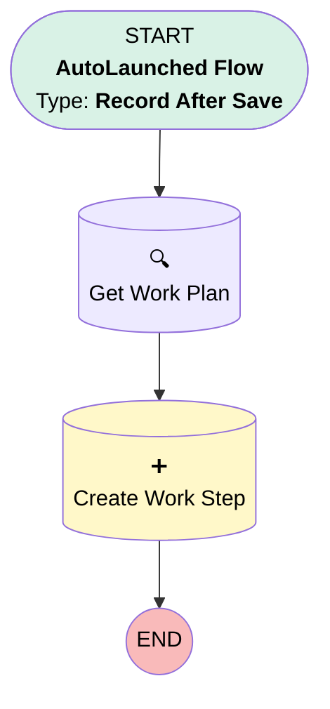

# [Work Order] - [After Update] - Add Log KM

## Flow Diagram

## General Information

|<!-- -->|<!-- -->|
|:---|:---|
|Object|WorkOrder|
|Process Type| Auto Launched Flow|
|Trigger Type| Record After Save|
|Record Trigger Type| Update|
|Label|[Work Order] - [After Update] - Add Log KM|
|Status|Active|
|Environments|Default|
|Interview Label|[Work Order] - After Update - Add Log KM {!$Flow.CurrentDateTime}|
| Builder Type (PM)|LightningFlowBuilder|
| Canvas Mode (PM)|AUTO_LAYOUT_CANVAS|
| Origin Builder Type (PM)|LightningFlowBuilder|
|Connector|[Get_Work_Plan](#get_work_plan)|
|Next Node|[Get_Work_Plan](#get_work_plan)|

#### Filters (logic: **and**)

|Filter Id|Field|Operator|Value|
|:-- |:-- |:--:|:--: |
|1|Is_First_of_Day__c| Equal To|✅|
|2|Is_First_of_Day__c| Is Changed|✅|

## Flow Nodes Details

### Create_Work_Step

|<!-- -->|<!-- -->|
|:---|:---|
|Type|Record Create|
|Object|WorkStep|
|Label|Create Work Step|
|Store Output Automatically|✅|

#### Input Assignments

|Field|Value|
|:-- |:--: |
|ActionDefinition|Work_Order_Mobile_Flow_Screen_Flow_Log_Mileage|
|ExecutionOrder|2|
|Name|Log KM|
|WorkPlanId|Get_Work_Plan.Id|

### Get_Work_Plan

|<!-- -->|<!-- -->|
|:---|:---|
|Type|Record Lookup|
|Object|WorkPlan|
|Label|Get Work Plan|
|Assign Null Values If No Records Found|⬜|
|Get First Record Only|✅|
|Store Output Automatically|✅|
|Connector|[Create_Work_Step](#create_work_step)|

#### Filters (logic: **and**)

|Filter Id|Field|Operator|Value|
|:-- |:-- |:--:|:--: |
|1|ParentRecordId| Equal To|$Record.Id|

___

_Documentation generated from branch monitoring_krinkelsgreencare__upeodev_sandbox by [sfdx-hardis](https://sfdx-hardis.cloudity.com), featuring [salesforce-flow-visualiser](https://github.com/toddhalfpenny/salesforce-flow-visualiser)_