# [Work Order][Before-Save][Record-Triggered] Goodwill Task Check

## Flow Diagram

```mermaid
%% If you read this, your Markdown visualizer does not handle MermaidJS syntax.
%% - If you are in VsCode, install extension `Markdown Preview Mermaid Support` at https://marketplace.visualstudio.com/items?itemName=bierner.markdown-mermaid
%% - If you are using sfdx-hardis, try to define env variable `MERMAID_MODES=cli,docker` ,then run again the command to regenerate markdown with SVG images.
%% - If you are within mkdocs-material, define mermaid plugin in `mkdocs.yml` as described in https://squidfunk.github.io/mkdocs-material/extensions/mermaid/
%% - At last resort, you can copy-paste this MermaidJS code in https://mermaid.live/ to see the Flow Diagram

flowchart TB
START(["START<br/><b>AutoLaunched Flow</b></br>Type: <b> Record Before Save</b>"]):::startClass
click START "#general-information" "3029773064"

Check_WO_with_Goodwill_Tasks_field_on_WO[\"🟰 <em></em><br/>Check WO with Goodwill Tasks field on WO"/]:::assignments
click Check_WO_with_Goodwill_Tasks_field_on_WO "#check_wo_with_goodwill_tasks_field_on_wo" "672533458"

Check_WO_with_Goodwill_Tasks_field_on_WO --> END_Check_WO_with_Goodwill_Tasks_field_on_WO
START -->  Check_WO_with_Goodwill_Tasks_field_on_WO
END_Check_WO_with_Goodwill_Tasks_field_on_WO(( END )):::endClass


classDef actionCalls fill:#D4E4FC,color:black,max-height:100px
classDef assignments fill:#FBEED7,color:black,max-height:100px
classDef collectionProcessors fill:#F0E3FA,color:black,max-height:100px
classDef customErrors fill:#FFE9E9,color:black,max-height:100px
classDef decisions fill:#FDEAF6,color:black,max-height:100px
classDef loops fill:#FDEAF6,color:black,max-height:100px
classDef recordCreates fill:#FFF8C9,color:black,max-height:100px
classDef recordDeletes fill:#FFF8C9,color:black,max-height:100px
classDef recordLookups fill:#EDEAFF,color:black,max-height:100px
classDef recordUpdates fill:#FFF8C9,color:black,max-height:100px
classDef screens fill:#DFF6FF,color:black,max-height:100px
classDef subflows fill:#D4E4FC,color:black,max-height:100px
classDef startClass fill:#D9F2E6,color:black,max-height:100px
classDef endClass fill:#F9BABA,color:black,max-height:100px


```

## General Information

|<!-- -->|<!-- -->|
|:---|:---|
|Object|WorkOrder|
|Process Type| Auto Launched Flow|
|Trigger Type| Record Before Save|
|Record Trigger Type| Update|
|Label|[Work Order][Before-Save][Record-Triggered] Goodwill Task Check|
|Status|Active|
|Description|For reporting purposes, this flow will tick the 'WO with Goodwill Tasks' checkbox to identify work orders where goodwill tasks have been performed.|
|Environments|Default|
|Interview Label|[Work Order][Before-Save][Record-Triggered] Relink After Work Photos to WO {!$Flow.CurrentDateTime}|
| Builder Type (PM)|LightningFlowBuilder|
| Canvas Mode (PM)|AUTO_LAYOUT_CANVAS|
| Origin Builder Type (PM)|LightningFlowBuilder|
|Connector|[Check_WO_with_Goodwill_Tasks_field_on_WO](#check_wo_with_goodwill_tasks_field_on_wo)|
|Next Node|[Check_WO_with_Goodwill_Tasks_field_on_WO](#check_wo_with_goodwill_tasks_field_on_wo)|

#### Filters (logic: **and**)

|Filter Id|Field|Operator|Value|
|:-- |:-- |:--:|:--: |
|1|Goodwill_Tasks__c| Is Null|<!-- -->|
|2|Goodwill_Tasks__c| Is Changed|✅|

## Flow Nodes Details

### Check_WO_with_Goodwill_Tasks_field_on_WO

|<!-- -->|<!-- -->|
|:---|:---|
|Type|Assignment|
|Label|Check WO with Goodwill Tasks field on WO|
|Description|Fo reporting purpose|

#### Assignments

|Assign To Reference|Operator|Value|
|:-- |:--:|:--: |
|$Record.WO_with_Goodwill_Tasks__c| Assign|✅|

___

_Documentation generated from branch monitoring_krinkelsgreencare__upeodev_sandbox by [sfdx-hardis](https://sfdx-hardis.cloudity.com), featuring [salesforce-flow-visualiser](https://github.com/toddhalfpenny/salesforce-flow-visualiser)_