# [Work Order][Mobile Flow] Check Out

## Flow Diagram

```mermaid
%% If you read this, your Markdown visualizer does not handle MermaidJS syntax.
%% - If you are in VsCode, install extension `Markdown Preview Mermaid Support` at https://marketplace.visualstudio.com/items?itemName=bierner.markdown-mermaid
%% - If you are using sfdx-hardis, try to define env variable `MERMAID_MODES=cli,docker` ,then run again the command to regenerate markdown with SVG images.
%% - If you are within mkdocs-material, define mermaid plugin in `mkdocs.yml` as described in https://squidfunk.github.io/mkdocs-material/extensions/mermaid/
%% - At last resort, you can copy-paste this MermaidJS code in https://mermaid.live/ to see the Flow Diagram

flowchart TB
START(["START"]):::startClass
click START "#general-information" "422881515"

LMRA_Done{"🔀 <em></em><br/>LMRA Done ?"}:::decisions
click LMRA_Done "#lmra_done" "2020599569"

Work_Order_Tasks_Completed{"🔀 <em></em><br/>Work Order Tasks Completed ?"}:::decisions
click Work_Order_Tasks_Completed "#work_order_tasks_completed" "2166549268"

Get_LMRA_Work_Step_Information[("🔍 <em></em><br/>Get LMRA Work Step Information")]:::recordLookups
click Get_LMRA_Work_Step_Information "#get_lmra_work_step_information" "1781930665"

Get_WO_Order_Information[("🔍 <em></em><br/>Get WO Order Information")]:::recordLookups
click Get_WO_Order_Information "#get_wo_order_information" "3272715510"

Get_Work_Order_Tasks_Completed_Step_Information[("🔍 <em></em><br/>Get Work Order Tasks Completed Step Information")]:::recordLookups
click Get_Work_Order_Tasks_Completed_Step_Information "#get_work_order_tasks_completed_step_information" "3098385536"

Get_Work_Step_Information[("🔍 <em></em><br/>Get Work Step Information")]:::recordLookups
click Get_Work_Step_Information "#get_work_step_information" "3727188450"

Update_Status_of_Service_Appointment[("🛠️ <em></em><br/>Update Status of Service Appointment")]:::recordUpdates
click Update_Status_of_Service_Appointment "#update_status_of_service_appointment" "2008591544"

Update_Status_of_Work_Order[("🛠️ <em></em><br/>Update Status of Work Order")]:::recordUpdates
click Update_Status_of_Work_Order "#update_status_of_work_order" "3878701233"

Update_Work_Step_to_New[("🛠️ <em></em><br/>Update Work Step to New")]:::recordUpdates
click Update_Work_Step_to_New "#update_work_step_to_new" "2179782203"

Complete_LMRA_Message(["💻 <em></em><br/>Complete LMRA Message"]):::screens
click Complete_LMRA_Message "#complete_lmra_message" "3411231437"

WO_Tasks_to_Complete_Message(["💻 <em></em><br/>WO Tasks to Complete Message"]):::screens
click WO_Tasks_to_Complete_Message "#wo_tasks_to_complete_message" "3310705615"

LMRA_Done --> |"No"| Complete_LMRA_Message
LMRA_Done --> |"Yes"| Update_Status_of_Work_Order
Work_Order_Tasks_Completed --> |"No"| WO_Tasks_to_Complete_Message
Work_Order_Tasks_Completed --> |"Yes"| Get_LMRA_Work_Step_Information
Get_LMRA_Work_Step_Information --> LMRA_Done
Get_WO_Order_Information --> Get_Work_Order_Tasks_Completed_Step_Information
Get_Work_Order_Tasks_Completed_Step_Information --> Work_Order_Tasks_Completed
Get_Work_Step_Information --> Get_WO_Order_Information
Update_Status_of_Service_Appointment --> END_Update_Status_of_Service_Appointment
Update_Status_of_Work_Order --> Update_Status_of_Service_Appointment
Update_Work_Step_to_New --> END_Update_Work_Step_to_New
Complete_LMRA_Message --> Update_Work_Step_to_New
WO_Tasks_to_Complete_Message --> END_WO_Tasks_to_Complete_Message
START -->  Get_Work_Step_Information
END_Update_Status_of_Service_Appointment(( END )):::endClass
END_Update_Work_Step_to_New(( END )):::endClass
END_WO_Tasks_to_Complete_Message(( END )):::endClass


classDef actionCalls fill:#D4E4FC,color:black,max-height:100px
classDef assignments fill:#FBEED7,color:black,max-height:100px
classDef collectionProcessors fill:#F0E3FA,color:black,max-height:100px
classDef customErrors fill:#FFE9E9,color:black,max-height:100px
classDef decisions fill:#FDEAF6,color:black,max-height:100px
classDef loops fill:#FDEAF6,color:black,max-height:100px
classDef recordCreates fill:#FFF8C9,color:black,max-height:100px
classDef recordDeletes fill:#FFF8C9,color:black,max-height:100px
classDef recordLookups fill:#EDEAFF,color:black,max-height:100px
classDef recordUpdates fill:#FFF8C9,color:black,max-height:100px
classDef screens fill:#DFF6FF,color:black,max-height:100px
classDef subflows fill:#D4E4FC,color:black,max-height:100px
classDef startClass fill:#D9F2E6,color:black,max-height:100px
classDef endClass fill:#F9BABA,color:black,max-height:100px


```

## General Information

|<!-- -->|<!-- -->|
|:---|:---|
|Process Type| Field Service Mobile|
|Label|[Work Order][Mobile Flow] Check Out|
|Status|Active|
|Description|This flow updates the status of the work order and the related service appointment to ‘In Progress’.|
|Environments|Default|
|Interview Label|[Work Order][Mobile Flow] Check Out {!$Flow.CurrentDateTime}|
| Builder Type (PM)|LightningFlowBuilder|
| Canvas Mode (PM)|AUTO_LAYOUT_CANVAS|
| Origin Builder Type (PM)|LightningFlowBuilder|
|Connector|[Get_Work_Step_Information](#get_work_step_information)|
|Next Node|[Get_Work_Step_Information](#get_work_step_information)|

## Variables

|Name|Data Type|Is Collection|Is Input|Is Output|Object Type|
|:-- |:--:|:--:|:--:|:--:|:--: |
|Id|String|⬜|✅|✅|<!-- -->|
|LMRAWorkStepRecord|SObject|⬜|✅|⬜|WorkStep|
|WorkOrderRecord|SObject|⬜|✅|⬜|WorkOrder|
|WorkStepRecord|SObject|⬜|✅|⬜|WorkStep|
|WOTaskStepRecord|SObject|⬜|✅|⬜|WorkStep|

## Flow Nodes Details

### LMRA_Done

|<!-- -->|<!-- -->|
|:---|:---|
|Type|Decision|
|Label|LMRA Done ?|
|Default Connector|[Update_Status_of_Work_Order](#update_status_of_work_order)|
|Default Connector Label|Yes|

#### Rule No (No)

|<!-- -->|<!-- -->|
|:---|:---|
|Connector|[Complete_LMRA_Message](#complete_lmra_message)|
|Condition Logic|and|

|Condition Id|Left Value Reference|Operator|Right Value|
|:-- |:-- |:--:|:--: |
|1|LMRAWorkStepRecord.Status| Not Equal To|Completed|

### Work_Order_Tasks_Completed

|<!-- -->|<!-- -->|
|:---|:---|
|Type|Decision|
|Label|Work Order Tasks Completed ?|
|Default Connector|[Get_LMRA_Work_Step_Information](#get_lmra_work_step_information)|
|Default Connector Label|Yes|

#### Rule No_Work_Order_Tasks_Completed (No)

|<!-- -->|<!-- -->|
|:---|:---|
|Connector|[WO_Tasks_to_Complete_Message](#wo_tasks_to_complete_message)|
|Condition Logic|and|

|Condition Id|Left Value Reference|Operator|Right Value|
|:-- |:-- |:--:|:--: |
|1|WOTaskStepRecord.Status| Not Equal To|Completed|
|2|WOTaskStepRecord.Status| Not Equal To|Not Applicable|

### Get_LMRA_Work_Step_Information

|<!-- -->|<!-- -->|
|:---|:---|
|Type|Record Lookup|
|Object|WorkStep|
|Label|Get LMRA Work Step Information|
|Assign Null Values If No Records Found|⬜|
|Output Reference|LMRAWorkStepRecord|
|Queried Fields|- Id - Status |
|Connector|[LMRA_Done](#lmra_done)|

#### Filters (logic: **and**)

|Filter Id|Field|Operator|Value|
|:-- |:-- |:--:|:--: |
|1|Name| Equal To|LMRA|
|2|WorkOrderId| Equal To|WorkOrderRecord.Id|

### Get_WO_Order_Information

|<!-- -->|<!-- -->|
|:---|:---|
|Type|Record Lookup|
|Object|WorkOrder|
|Label|Get WO Order Information|
|Assign Null Values If No Records Found|⬜|
|Output Reference|WorkOrderRecord|
|Queried Fields|- Id - LMRA_Done__c |
|Connector|[Get_Work_Order_Tasks_Completed_Step_Information](#get_work_order_tasks_completed_step_information)|

#### Filters (logic: **and**)

|Filter Id|Field|Operator|Value|
|:-- |:-- |:--:|:--: |
|1|Id| Equal To|WorkStepRecord.WorkOrderId|

### Get_Work_Order_Tasks_Completed_Step_Information

|<!-- -->|<!-- -->|
|:---|:---|
|Type|Record Lookup|
|Object|WorkStep|
|Label|Get Work Order Tasks Completed Step Information|
|Assign Null Values If No Records Found|⬜|
|Output Reference|WOTaskStepRecord|
|Queried Fields|Id|
|Connector|[Work_Order_Tasks_Completed](#work_order_tasks_completed)|

#### Filters (logic: **and**)

|Filter Id|Field|Operator|Value|
|:-- |:-- |:--:|:--: |
|1|Name| Equal To|Work Order Tasks Completed|
|2|WorkOrderId| Equal To|WorkOrderRecord.Id|

### Get_Work_Step_Information

|<!-- -->|<!-- -->|
|:---|:---|
|Type|Record Lookup|
|Object|WorkStep|
|Label|Get Work Step Information|
|Assign Null Values If No Records Found|⬜|
|Output Reference|WorkStepRecord|
|Queried Fields|- Id - WorkOrderId |
|Connector|[Get_WO_Order_Information](#get_wo_order_information)|

#### Filters (logic: **and**)

|Filter Id|Field|Operator|Value|
|:-- |:-- |:--:|:--: |
|1|Id| Equal To|Id|

### Update_Status_of_Service_Appointment

|<!-- -->|<!-- -->|
|:---|:---|
|Type|Record Update|
|Object|ServiceAppointment|
|Label|Update Status of Service Appointment|

#### Filters (logic: **and**)

|Filter Id|Field|Operator|Value|
|:-- |:-- |:--:|:--: |
|1|ParentRecordId| Equal To|WorkOrderRecord.Id|

#### Input Assignments

|Field|Value|
|:-- |:--: |
|ActualEndTime|Now|
|Status|Completed|

### Update_Status_of_Work_Order

|<!-- -->|<!-- -->|
|:---|:---|
|Type|Record Update|
|Object|WorkOrder|
|Label|Update Status of Work Order|
|Connector|[Update_Status_of_Service_Appointment](#update_status_of_service_appointment)|

#### Filters (logic: **and**)

|Filter Id|Field|Operator|Value|
|:-- |:-- |:--:|:--: |
|1|Id| Equal To|WorkOrderRecord.Id|

#### Input Assignments

|Field|Value|
|:-- |:--: |
|Status|Completed|

### Update_Work_Step_to_New

|<!-- -->|<!-- -->|
|:---|:---|
|Type|Record Update|
|Object|WorkStep|
|Label|Update Work Step to New|

#### Filters (logic: **and**)

|Filter Id|Field|Operator|Value|
|:-- |:-- |:--:|:--: |
|1|Id| Equal To|Id|

#### Input Assignments

|Field|Value|
|:-- |:--: |
|Status|New|

### Complete_LMRA_Message

|<!-- -->|<!-- -->|
|:---|:---|
|Type|Screen|
|Label|Complete LMRA Message|
|Allow Back|⬜|
|Allow Finish|✅|
|Allow Pause|⬜|
|Show Footer|✅|
|Show Header|⬜|
|Connector|[Update_Work_Step_to_New](#update_work_step_to_new)|

#### MessageToCompleteLMRA

|<!-- -->|<!-- -->|
|:---|:---|
|Field Text|
Please complete the <strong><em>LMRA</em></strong> step before closing your work order.

Once completed, click <strong><em>Check Out</em></strong> again to close your work order.&nbsp;
|
|Field Type| Display Text|

### WO_Tasks_to_Complete_Message

|<!-- -->|<!-- -->|
|:---|:---|
|Type|Screen|
|Label|WO Tasks to Complete Message|
|Allow Back|⬜|
|Allow Finish|✅|
|Allow Pause|⬜|
|Show Footer|✅|
|Show Header|⬜|

#### TaskToCompleteMessage

|<!-- -->|<!-- -->|
|:---|:---|
|Field Text|
Make sure to complete all your tasks for this work order and tick the related work step.
|
|Field Type| Display Text|

___

_Documentation generated from branch monitoring_krinkelsgreencare__upeodev_sandbox by [sfdx-hardis](https://sfdx-hardis.cloudity.com), featuring [salesforce-flow-visualiser](https://github.com/toddhalfpenny/salesforce-flow-visualiser)_