# [Work Order][Mobile Flow] Log Waste Depot Visit

## Flow Diagram

```mermaid
%% If you read this, your Markdown visualizer does not handle MermaidJS syntax.
%% - If you are in VsCode, install extension `Markdown Preview Mermaid Support` at https://marketplace.visualstudio.com/items?itemName=bierner.markdown-mermaid
%% - If you are using sfdx-hardis, try to define env variable `MERMAID_MODES=cli,docker` ,then run again the command to regenerate markdown with SVG images.
%% - If you are within mkdocs-material, define mermaid plugin in `mkdocs.yml` as described in https://squidfunk.github.io/mkdocs-material/extensions/mermaid/
%% - At last resort, you can copy-paste this MermaidJS code in https://mermaid.live/ to see the Flow Diagram

flowchart TB
START(["START"]):::startClass
click START "#general-information" "233366232"

Set_WorkStep_Status[\"🟰 <em></em><br/>Set WorkStep Status"/]:::assignments
click Set_WorkStep_Status "#set_workstep_status" "157142891"

Get_Work_Order_Information[("🔍 <em></em><br/>Get Work Order Information")]:::recordLookups
click Get_Work_Order_Information "#get_work_order_information" "1656706463"

Get_Work_Step_Information[("🔍 <em></em><br/>Get Work Step Information")]:::recordLookups
click Get_Work_Step_Information "#get_work_step_information" "2718793161"

Marked_Waste_Depot_Visit_as_Done[("🛠️ <em></em><br/>Marked Waste Depot Visit as Done")]:::recordUpdates
click Marked_Waste_Depot_Visit_as_Done "#marked_waste_depot_visit_as_done" "1580016462"

Update_Work_Step[("🛠️ <em></em><br/>Update Work Step")]:::recordUpdates
click Update_Work_Step "#update_work_step" "566050632"

Attach_receipt(["💻 <em></em><br/>Attach receipt"]):::screens
click Attach_receipt "#attach_receipt" "3169912830"

Set_WorkStep_Status --> Update_Work_Step
Get_Work_Order_Information --> Attach_receipt
Get_Work_Step_Information --> Get_Work_Order_Information
Marked_Waste_Depot_Visit_as_Done --> Set_WorkStep_Status
Update_Work_Step --> END_Update_Work_Step
Attach_receipt --> Marked_Waste_Depot_Visit_as_Done
START -->  Get_Work_Step_Information
END_Update_Work_Step(( END )):::endClass


classDef actionCalls fill:#D4E4FC,color:black,max-height:100px
classDef assignments fill:#FBEED7,color:black,max-height:100px
classDef collectionProcessors fill:#F0E3FA,color:black,max-height:100px
classDef customErrors fill:#FFE9E9,color:black,max-height:100px
classDef decisions fill:#FDEAF6,color:black,max-height:100px
classDef loops fill:#FDEAF6,color:black,max-height:100px
classDef recordCreates fill:#FFF8C9,color:black,max-height:100px
classDef recordDeletes fill:#FFF8C9,color:black,max-height:100px
classDef recordLookups fill:#EDEAFF,color:black,max-height:100px
classDef recordUpdates fill:#FFF8C9,color:black,max-height:100px
classDef screens fill:#DFF6FF,color:black,max-height:100px
classDef subflows fill:#D4E4FC,color:black,max-height:100px
classDef startClass fill:#D9F2E6,color:black,max-height:100px
classDef endClass fill:#F9BABA,color:black,max-height:100px


```

## General Information

|<!-- -->|<!-- -->|
|:---|:---|
|Process Type| Field Service Mobile|
|Label|[Work Order][Mobile Flow] Log Waste Depot Visit|
|Status|Active|
|Description|This flow allows the operator to log a waste depot visit|
|Environments|Default|
|Interview Label|[Work Order][Mobile Flow] Log Waste Depot Visit {!$Flow.CurrentDateTime}|
| Builder Type (PM)|LightningFlowBuilder|
| Canvas Mode (PM)|AUTO_LAYOUT_CANVAS|
| Origin Builder Type (PM)|LightningFlowBuilder|
|Connector|[Get_Work_Step_Information](#get_work_step_information)|
|Next Node|[Get_Work_Step_Information](#get_work_step_information)|

## Variables

|Name|Data Type|Is Collection|Is Input|Is Output|Object Type|
|:-- |:--:|:--:|:--:|:--:|:--: |
|Id|String|⬜|✅|⬜|<!-- -->|
|WorkOrderRecord|SObject|⬜|✅|⬜|WorkOrder|
|WorkStepRecord|SObject|⬜|✅|⬜|WorkStep|

## Flow Nodes Details

### Set_WorkStep_Status

|<!-- -->|<!-- -->|
|:---|:---|
|Type|Assignment|
|Label|Set WorkStep Status|
|Connector|[Update_Work_Step](#update_work_step)|

#### Assignments

|Assign To Reference|Operator|Value|
|:-- |:--:|:--: |
|WorkStepRecord.Status| Assign|Completed|

### Get_Work_Order_Information

|<!-- -->|<!-- -->|
|:---|:---|
|Type|Record Lookup|
|Object|WorkOrder|
|Label|Get Work Order Information|
|Assign Null Values If No Records Found|⬜|
|Output Reference|WorkOrderRecord|
|Queried Fields|Id|
|Connector|[Attach_receipt](#attach_receipt)|

#### Filters (logic: **and**)

|Filter Id|Field|Operator|Value|
|:-- |:-- |:--:|:--: |
|1|Id| Equal To|WorkStepRecord.WorkOrderId|

### Get_Work_Step_Information

|<!-- -->|<!-- -->|
|:---|:---|
|Type|Record Lookup|
|Object|WorkStep|
|Label|Get Work Step Information|
|Assign Null Values If No Records Found|⬜|
|Output Reference|WorkStepRecord|
|Queried Fields|- Id - WorkOrderId |
|Connector|[Get_Work_Order_Information](#get_work_order_information)|

#### Filters (logic: **and**)

|Filter Id|Field|Operator|Value|
|:-- |:-- |:--:|:--: |
|1|Id| Equal To|Id|

### Marked_Waste_Depot_Visit_as_Done

|<!-- -->|<!-- -->|
|:---|:---|
|Type|Record Update|
|Object|WorkOrder|
|Label|Marked Waste Depot Visit as Done|
|Connector|[Set_WorkStep_Status](#set_workstep_status)|

#### Filters (logic: **and**)

|Filter Id|Field|Operator|Value|
|:-- |:-- |:--:|:--: |
|1|Id| Equal To|WorkOrderRecord.Id|

#### Input Assignments

|Field|Value|
|:-- |:--: |
|Waste_Visit_Done__c|✅|

### Update_Work_Step

|<!-- -->|<!-- -->|
|:---|:---|
|Type|Record Update|
|Label|Update Work Step|
|Input Reference|WorkStepRecord|

### Attach_receipt

|<!-- -->|<!-- -->|
|:---|:---|
|Type|Screen|
|Label|Attach receipt|
|Allow Back|⬜|
|Allow Finish|✅|
|Allow Pause|⬜|
|Show Footer|✅|
|Show Header|⬜|
|Connector|[Marked_Waste_Depot_Visit_as_Done](#marked_waste_depot_visit_as_done)|

#### FileUpload

|<!-- -->|<!-- -->|
|:---|:---|
|Extension Name|forceContent:fileUpload|
|Field Type| Component Instance|
|Inputs On Next Nav To Assoc Scrn| Use Stored Values|
|Is Required|✅|
|Label (input)|If necessary, attach a receipt.|
|Multiple (input)|✅|
|Record Id (input)|WorkOrderRecord.Id|

___

_Documentation generated from branch monitoring_krinkelsgreencare__upeodev_sandbox by [sfdx-hardis](https://sfdx-hardis.cloudity.com), featuring [salesforce-flow-visualiser](https://github.com/toddhalfpenny/salesforce-flow-visualiser)_