# [Work Order][Mobile Flow][Screen-Flow] Depot Visit

## Flow Diagram

```mermaid
%% If you read this, your Markdown visualizer does not handle MermaidJS syntax.
%% - If you are in VsCode, install extension `Markdown Preview Mermaid Support` at https://marketplace.visualstudio.com/items?itemName=bierner.markdown-mermaid
%% - If you are using sfdx-hardis, try to define env variable `MERMAID_MODES=cli,docker` ,then run again the command to regenerate markdown with SVG images.
%% - If you are within mkdocs-material, define mermaid plugin in `mkdocs.yml` as described in https://squidfunk.github.io/mkdocs-material/extensions/mermaid/
%% - At last resort, you can copy-paste this MermaidJS code in https://mermaid.live/ to see the Flow Diagram

flowchart TB
START(["START"]):::startClass
click START "#general-information" "3608237699"

Post_Remarks_to_Chatter("⚡ <em></em><br/>Post Remarks to Chatter"):::actionCalls
click Post_Remarks_to_Chatter "#post_remarks_to_chatter" "831181927"

Set_Work_Step_Status[\"🟰 <em></em><br/>Set Work Step Status"/]:::assignments
click Set_Work_Step_Status "#set_work_step_status" "2966177962"

Remarks_Logged{"🔀 <em></em><br/>Remarks Logged ?"}:::decisions
click Remarks_Logged "#remarks_logged" "3612894717"

Get_Account_Information[("🔍 <em></em><br/>Get Account Information")]:::recordLookups
click Get_Account_Information "#get_account_information" "3350078102"

Get_Work_Order_Information[("🔍 <em></em><br/>Get Work Order Information")]:::recordLookups
click Get_Work_Order_Information "#get_work_order_information" "1816854772"

Get_Work_Step_Information[("🔍 <em></em><br/>Get Work Step Information")]:::recordLookups
click Get_Work_Step_Information "#get_work_step_information" "3714220184"

Update_Work_Step[("🛠️ <em></em><br/>Update Work Step")]:::recordUpdates
click Update_Work_Step "#update_work_step" "4205817010"

Depot_Visit_Information(["💻 <em></em><br/>Depot Visit Information"]):::screens
click Depot_Visit_Information "#depot_visit_information" "1368258094"

Post_Remarks_to_Chatter --> END_Post_Remarks_to_Chatter
Set_Work_Step_Status --> Get_Work_Order_Information
Remarks_Logged --> |"Yes"| Post_Remarks_to_Chatter
Remarks_Logged --> |"No"| END_Remarks_Logged
Get_Account_Information --> Depot_Visit_Information
Get_Work_Order_Information --> Get_Account_Information
Get_Work_Step_Information --> Set_Work_Step_Status
Update_Work_Step --> Remarks_Logged
Depot_Visit_Information --> Update_Work_Step
START -->  Get_Work_Step_Information
END_Post_Remarks_to_Chatter(( END )):::endClass
END_Remarks_Logged(( END )):::endClass


classDef actionCalls fill:#D4E4FC,color:black,max-height:100px
classDef assignments fill:#FBEED7,color:black,max-height:100px
classDef collectionProcessors fill:#F0E3FA,color:black,max-height:100px
classDef customErrors fill:#FFE9E9,color:black,max-height:100px
classDef decisions fill:#FDEAF6,color:black,max-height:100px
classDef loops fill:#FDEAF6,color:black,max-height:100px
classDef recordCreates fill:#FFF8C9,color:black,max-height:100px
classDef recordDeletes fill:#FFF8C9,color:black,max-height:100px
classDef recordLookups fill:#EDEAFF,color:black,max-height:100px
classDef recordUpdates fill:#FFF8C9,color:black,max-height:100px
classDef screens fill:#DFF6FF,color:black,max-height:100px
classDef subflows fill:#D4E4FC,color:black,max-height:100px
classDef startClass fill:#D9F2E6,color:black,max-height:100px
classDef endClass fill:#F9BABA,color:black,max-height:100px


```

## General Information

|<!-- -->|<!-- -->|
|:---|:---|
|Process Type| Field Service Mobile|
|Label|[Work Order][Mobile Flow][Screen-Flow] Depot Visit|
|Status|Active|
|Description|This flow allows an operator to execute a depot visit.|
|Environments|Default|
|Interview Label|[Work Order][Mobile Flow][Screen-Flow] Depot Visit {!$Flow.CurrentDateTime}|
| Builder Type (PM)|LightningFlowBuilder|
| Canvas Mode (PM)|AUTO_LAYOUT_CANVAS|
| Origin Builder Type (PM)|LightningFlowBuilder|
|Connector|[Get_Work_Step_Information](#get_work_step_information)|
|Next Node|[Get_Work_Step_Information](#get_work_step_information)|

## Variables

|Name|Data Type|Is Collection|Is Input|Is Output|Object Type|
|:-- |:--:|:--:|:--:|:--:|:--: |
|AccountRecord|SObject|⬜|✅|⬜|Account|
|ContractManagerUserRecord|SObject|⬜|✅|⬜|User|
|Id|String|⬜|✅|⬜|<!-- -->|
|ServiceTerritoryRecord|SObject|⬜|✅|⬜|ServiceTerritory|
|WorkOrderRecord|SObject|⬜|✅|⬜|WorkOrder|
|WorkStepRecord|SObject|⬜|✅|⬜|WorkStep|

## Flow Nodes Details

### Post_Remarks_to_Chatter

|<!-- -->|<!-- -->|
|:---|:---|
|Type|Action Call|
|Label|Post Remarks to Chatter|
|Action Type|Chatter Post|
|Action Name|chatterPost|
|Flow Transaction Model|CurrentTransaction|
|Name Segment|chatterPost|
|Offset|0|
|Version Segment|1|
|Text (input)|TemplateChatter|
|Subject Name Or Id (input)|WorkOrderRecord.Id|

### Set_Work_Step_Status

|<!-- -->|<!-- -->|
|:---|:---|
|Type|Assignment|
|Label|Set Work Step Status|
|Connector|[Get_Work_Order_Information](#get_work_order_information)|

#### Assignments

|Assign To Reference|Operator|Value|
|:-- |:--:|:--: |
|WorkStepRecord.Status| Assign|Completed|

### Remarks_Logged

|<!-- -->|<!-- -->|
|:---|:---|
|Type|Decision|
|Label|Remarks Logged ?|
|Default Connector Label|No|

#### Rule Yes (Yes)

|<!-- -->|<!-- -->|
|:---|:---|
|Connector|[Post_Remarks_to_Chatter](#post_remarks_to_chatter)|
|Condition Logic|and|

|Condition Id|Left Value Reference|Operator|Right Value|
|:-- |:-- |:--:|:--: |
|1|Feedback_for_Contract_Manager| Is Null|⬜|

### Get_Account_Information

|<!-- -->|<!-- -->|
|:---|:---|
|Type|Record Lookup|
|Object|Account|
|Label|Get Account Information|
|Assign Null Values If No Records Found|⬜|
|Output Reference|AccountRecord|
|Queried Fields|- Id - Name - Phone |
|Connector|[Depot_Visit_Information](#depot_visit_information)|

#### Filters (logic: **and**)

|Filter Id|Field|Operator|Value|
|:-- |:-- |:--:|:--: |
|1|Id| Equal To|WorkOrderRecord.AccountId|

### Get_Work_Order_Information

|<!-- -->|<!-- -->|
|:---|:---|
|Type|Record Lookup|
|Object|WorkOrder|
|Label|Get Work Order Information|
|Assign Null Values If No Records Found|⬜|
|Output Reference|WorkOrderRecord|
|Queried Fields|- Id - Drop_Off_Items__c - Pick_Up_Items__c - Depot_Visit_Comments__c - AccountId - Contract_Manager__c |
|Connector|[Get_Account_Information](#get_account_information)|

#### Filters (logic: **and**)

|Filter Id|Field|Operator|Value|
|:-- |:-- |:--:|:--: |
|1|Id| Equal To|WorkStepRecord.WorkOrderId|

### Get_Work_Step_Information

|<!-- -->|<!-- -->|
|:---|:---|
|Type|Record Lookup|
|Object|WorkStep|
|Label|Get Work Step Information|
|Assign Null Values If No Records Found|⬜|
|Output Reference|WorkStepRecord|
|Queried Fields|- Id - WorkOrderId |
|Connector|[Set_Work_Step_Status](#set_work_step_status)|

#### Filters (logic: **and**)

|Filter Id|Field|Operator|Value|
|:-- |:-- |:--:|:--: |
|1|Id| Equal To|Id|

### Update_Work_Step

|<!-- -->|<!-- -->|
|:---|:---|
|Type|Record Update|
|Label|Update Work Step|
|Input Reference|WorkStepRecord|
|Connector|[Remarks_Logged](#remarks_logged)|

### Depot_Visit_Information

|<!-- -->|<!-- -->|
|:---|:---|
|Type|Screen|
|Label|Depot Visit Information|
|Allow Back|⬜|
|Allow Finish|✅|
|Allow Pause|⬜|
|Show Footer|✅|
|Show Header|⬜|
|Connector|[Update_Work_Step](#update_work_step)|

#### Depot_KCG

|<!-- -->|<!-- -->|
|:---|:---|
|Data Type|String|
|Default Value|AccountRecord.Name|
|Field Text|Depot KCG|
|Field Type| Input Field|
|Inputs On Next Nav To Assoc Scrn| Use Stored Values|
|Is Disabled|true|
|Is Read Only|true|
|Is Required|⬜|

#### Phone_Depot

|<!-- -->|<!-- -->|
|:---|:---|
|Data Type|String|
|Default Value|AccountRecord.Phone|
|Field Text|Phone Depot|
|Field Type| Input Field|
|Inputs On Next Nav To Assoc Scrn| Use Stored Values|
|Is Disabled|true|
|Is Read Only|true|
|Is Required|⬜|

#### Drop_Off_Items

|<!-- -->|<!-- -->|
|:---|:---|
|Default Value|{!WorkOrderRecord.Drop_Off_Items__c}|
|Field Text|Drop Off Items|
|Field Type| Large Text Area|
|Inputs On Next Nav To Assoc Scrn| Use Stored Values|
|Is Disabled|true|
|Is Read Only|true|
|Is Required|⬜|

#### Pick_Up_Items

|<!-- -->|<!-- -->|
|:---|:---|
|Default Value|{!WorkOrderRecord.Pick_Up_Items__c}|
|Field Text|Pick Up Items|
|Field Type| Large Text Area|
|Inputs On Next Nav To Assoc Scrn| Use Stored Values|
|Is Disabled|true|
|Is Read Only|true|
|Is Required|⬜|

#### Depot_Visit_Comments

|<!-- -->|<!-- -->|
|:---|:---|
|Default Value|{!WorkOrderRecord.Depot_Visit_Comments__c}|
|Field Text|Depot Visit Comments|
|Field Type| Large Text Area|
|Inputs On Next Nav To Assoc Scrn| Use Stored Values|
|Is Disabled|true|
|Is Read Only|true|
|Is Required|⬜|

#### Feedback_for_Contract_Manager

|<!-- -->|<!-- -->|
|:---|:---|
|Field Text|Feedback for Contract Manager|
|Field Type| Large Text Area|
|Inputs On Next Nav To Assoc Scrn| Use Stored Values|
|Is Required|⬜|

#### FileUpload

|<!-- -->|<!-- -->|
|:---|:---|
|Extension Name|forceContent:fileUpload|
|Field Type| Component Instance|
|Inputs On Next Nav To Assoc Scrn| Use Stored Values|
|Is Required|✅|
|Label (input)|Attach Photos|
|Multiple (input)|✅|
|Record Id (input)|WorkOrderRecord.Id|

___

_Documentation generated from branch monitoring_krinkelsgreencare__upeodev_sandbox by [sfdx-hardis](https://sfdx-hardis.cloudity.com), featuring [salesforce-flow-visualiser](https://github.com/toddhalfpenny/salesforce-flow-visualiser)_