# [Work Order][Mobile Flow][Screen-Flow] Enter Shop Visit Information

## Flow Diagram [(_View History_)](Work_Order_Mobile_Flow_Screen_Flow_Enter_Shop_Visit_Information-history.md)

```mermaid
%% If you read this, your Markdown visualizer does not handle MermaidJS syntax.
%% - If you are in VsCode, install extension `Markdown Preview Mermaid Support` at https://marketplace.visualstudio.com/items?itemName=bierner.markdown-mermaid
%% - If you are using sfdx-hardis, try to define env variable `MERMAID_MODES=cli,docker` ,then run again the command to regenerate markdown with SVG images.
%% - If you are within mkdocs-material, define mermaid plugin in `mkdocs.yml` as described in https://squidfunk.github.io/mkdocs-material/extensions/mermaid/
%% - At last resort, you can copy-paste this MermaidJS code in https://mermaid.live/ to see the Flow Diagram

flowchart TB
START(["START"]):::startClass
click START "#general-information" "4232521589"

Get_Work_Order_Information[("🔍 <em></em><br/>Get Work Order Information")]:::recordLookups
click Get_Work_Order_Information "#get_work_order_information" "2677918915"

Update_Work_Order_Information[("🛠️ <em></em><br/>Update Work Order Information")]:::recordUpdates
click Update_Work_Order_Information "#update_work_order_information" "4203336991"

Collected_Items_Information(["💻 <em></em><br/>Collected Items Information"]):::screens
click Collected_Items_Information "#collected_items_information" "4281700232"

Shop_Visit_Information(["💻 <em></em><br/>Shop Visit Information"]):::screens
click Shop_Visit_Information "#shop_visit_information" "1635880700"

Get_Work_Order_Information --> Shop_Visit_Information
Update_Work_Order_Information --> END_Update_Work_Order_Information
Collected_Items_Information --> Update_Work_Order_Information
Shop_Visit_Information --> Collected_Items_Information
START -->  Get_Work_Order_Information
END_Update_Work_Order_Information(( END )):::endClass


classDef actionCalls fill:#D4E4FC,color:black,text-decoration:none,max-height:100px
classDef assignments fill:#FBEED7,color:black,text-decoration:none,max-height:100px
classDef collectionProcessors fill:#F0E3FA,color:black,text-decoration:none,max-height:100px
classDef customErrors fill:#FFE9E9,color:black,text-decoration:none,max-height:100px
classDef decisions fill:#FDEAF6,color:black,text-decoration:none,max-height:100px
classDef loops fill:#FDEAF6,color:black,text-decoration:none,max-height:100px
classDef recordCreates fill:#FFF8C9,color:black,text-decoration:none,max-height:100px
classDef recordDeletes fill:#FFF8C9,color:black,text-decoration:none,max-height:100px
classDef recordLookups fill:#EDEAFF,color:black,text-decoration:none,max-height:100px
classDef recordUpdates fill:#FFF8C9,color:black,text-decoration:none,max-height:100px
classDef screens fill:#DFF6FF,color:black,text-decoration:none,max-height:100px
classDef subflows fill:#D4E4FC,color:black,text-decoration:none,max-height:100px
classDef startClass fill:#D9F2E6,color:black,text-decoration:none,max-height:100px
classDef endClass fill:#F9BABA,color:black,text-decoration:none,max-height:100px


```

<!-- Flow description -->

## General Information

|<!-- -->|<!-- -->|
|:---|:---|
|Process Type| Field Service Mobile|
|Label|[Work Order][Mobile Flow][Screen-Flow] Enter Shop Visit Information|
|Status|Active|
|Description|This flow allows an operator to enter the necessary information when collecting items from a shop.|
|Environments|Default|
|Interview Label|[Work Order] {!$Flow.CurrentDateTime}|
| Builder Type (PM)|LightningFlowBuilder|
| Canvas Mode (PM)|AUTO_LAYOUT_CANVAS|
| Origin Builder Type (PM)|LightningFlowBuilder|
|Connector|[Get_Work_Order_Information](#get_work_order_information)|
|Next Node|[Get_Work_Order_Information](#get_work_order_information)|

## Variables

|Name|Data Type|Is Collection|Is Input|Is Output|Object Type|Description|
|:-- |:--:|:--:|:--:|:--:|:--:|:--  |
|errorMessage|String|⬜|✅|⬜|<!-- -->|<!-- -->|
|Id|String|⬜|✅|⬜|<!-- -->|<!-- -->|
|workOrderRecord|SObject|⬜|✅|⬜|WorkOrder|<!-- -->|

## Formulas

|Name|Data Type|Expression|Description|
|:-- |:--:|:-- |:--  |
|visitDate|Date|DATEVALUE({!Shop_Visit_Start_Time})|<!-- -->|

## Flow Nodes Details

### Get_Work_Order_Information

|<!-- -->|<!-- -->|
|:---|:---|
|Type|Record Lookup|
|Object|WorkOrder|
|Label|Get Work Order Information|
|Assign Null Values If No Records Found|⬜|
|Output Reference|workOrderRecord|
|Queried Fields|Id|
|Connector|[Shop_Visit_Information](#shop_visit_information)|

#### Filters (logic: **and**)

|Filter Id|Field|Operator|Value|
|:-- |:-- |:--:|:--: |
|1|Id| Equal To|Id|

### Update_Work_Order_Information

|<!-- -->|<!-- -->|
|:---|:---|
|Type|Record Update|
|Object|WorkOrder|
|Label|Update Work Order Information|

#### Filters (logic: **and**)

|Filter Id|Field|Operator|Value|
|:-- |:-- |:--:|:--: |
|1|Id| Equal To|workOrderRecord.Id|

#### Input Assignments

|Field|Value|
|:-- |:--: |
|Collected_Items__c|Collected_Items|
|Shop_Name__c|Shop_Name|
|Shop_Visit_Amount__c|Amount|
|Shop_Visit_Date__c|visitDate|
|Shop_Visit_Done__c|✅|
|Shop_Visit_End_Time__c|Shop_Visit_End_Time|
|Shop_Visit_Start_Time__c|Shop_Visit_Start_Time|

### Collected_Items_Information

|<!-- -->|<!-- -->|
|:---|:---|
|Type|Screen|
|Label|Collected Items Information|
|Allow Back|⬜|
|Allow Finish|✅|
|Allow Pause|⬜|
|Show Footer|✅|
|Show Header|⬜|
|Connector|[Update_Work_Order_Information](#update_work_order_information)|

#### Collected_Items

|<!-- -->|<!-- -->|
|:---|:---|
|Field Text|Collected Items|
|Field Type| Large Text Area|
|Inputs On Next Nav To Assoc Scrn| Use Stored Values|
|Is Required|✅|

#### FileUpload

|<!-- -->|<!-- -->|
|:---|:---|
|Extension Name|forceContent:fileUpload|
|Field Type| Component Instance|
|Inputs On Next Nav To Assoc Scrn| Use Stored Values|
|Is Required|✅|
|Label (input)|Attach Receipt|
|Record Id (input)|workOrderRecord.Id|

### Shop_Visit_Information

|<!-- -->|<!-- -->|
|:---|:---|
|Type|Screen|
|Label|Shop Visit Information|
|Allow Back|⬜|
|Allow Finish|✅|
|Allow Pause|⬜|
|Show Footer|✅|
|Show Header|⬜|
|Connector|[Collected_Items_Information](#collected_items_information)|

#### Shop_Name

|<!-- -->|<!-- -->|
|:---|:---|
|Data Type|String|
|Field Text|Shop Name|
|Field Type| Input Field|
|Inputs On Next Nav To Assoc Scrn| Use Stored Values|
|Is Required|✅|

#### Amount

|<!-- -->|<!-- -->|
|:---|:---|
|Data Type|Currency|
|Field Text|Amount|
|Field Type| Input Field|
|Inputs On Next Nav To Assoc Scrn| Use Stored Values|
|Is Required|✅|
|Scale|2|

#### Shop_Visit_Start_Time

|<!-- -->|<!-- -->|
|:---|:---|
|Data Type|DateTime|
|Field Text|Shop Visit Start Time|
|Field Type| Input Field|
|Inputs On Next Nav To Assoc Scrn| Use Stored Values|
|Is Required|✅|

#### Shop_Visit_End_Time

|<!-- -->|<!-- -->|
|:---|:---|
|Data Type|DateTime|
|Field Text|Shop Visit End Time|
|Field Type| Input Field|
|Inputs On Next Nav To Assoc Scrn| Use Stored Values|
|Is Required|✅|

___

_Documentation generated from branch monitoring_krinkelsgreencare__upeodev_sandbox by [sfdx-hardis](https://sfdx-hardis.cloudity.com), featuring [salesforce-flow-visualiser](https://github.com/toddhalfpenny/salesforce-flow-visualiser)_