# [Work Order][Mobile Flow][Screen-Flow] Enter Waste Visit Information

## Flow Diagram

```mermaid
%% If you read this, your Markdown visualizer does not handle MermaidJS syntax.
%% - If you are in VsCode, install extension `Markdown Preview Mermaid Support` at https://marketplace.visualstudio.com/items?itemName=bierner.markdown-mermaid
%% - If you are using sfdx-hardis, try to define env variable `MERMAID_MODES=cli,docker` ,then run again the command to regenerate markdown with SVG images.
%% - If you are within mkdocs-material, define mermaid plugin in `mkdocs.yml` as described in https://squidfunk.github.io/mkdocs-material/extensions/mermaid/
%% - At last resort, you can copy-paste this MermaidJS code in https://mermaid.live/ to see the Flow Diagram

flowchart TB
START(["START"]):::startClass
click START "#general-information" "951057295"

Get_Work_Order[("🔍 <em></em><br/>Get Work Order")]:::recordLookups
click Get_Work_Order "#get_work_order" "3874133641"

Get_Work_Step_Information[("🔍 <em></em><br/>Get Work Step Information")]:::recordLookups
click Get_Work_Step_Information "#get_work_step_information" "1816934209"

Update_Work_Order[("🛠️ <em></em><br/>Update Work Order")]:::recordUpdates
click Update_Work_Order "#update_work_order" "4166984894"

Update_Work_Step[("🛠️ <em></em><br/>Update Work Step")]:::recordUpdates
click Update_Work_Step "#update_work_step" "2915730698"

Enter_Waste_Quantity(["💻 <em></em><br/>Enter Waste Quantity"]):::screens
click Enter_Waste_Quantity "#enter_waste_quantity" "278048861"

Get_Work_Order --> Enter_Waste_Quantity
Get_Work_Step_Information --> Get_Work_Order
Update_Work_Order --> Update_Work_Step
Update_Work_Step --> END_Update_Work_Step
Enter_Waste_Quantity --> Update_Work_Order
START -->  Get_Work_Step_Information
END_Update_Work_Step(( END )):::endClass


classDef actionCalls fill:#D4E4FC,color:black,text-decoration:none,max-height:100px
classDef assignments fill:#FBEED7,color:black,text-decoration:none,max-height:100px
classDef collectionProcessors fill:#F0E3FA,color:black,text-decoration:none,max-height:100px
classDef customErrors fill:#FFE9E9,color:black,text-decoration:none,max-height:100px
classDef decisions fill:#FDEAF6,color:black,text-decoration:none,max-height:100px
classDef loops fill:#FDEAF6,color:black,text-decoration:none,max-height:100px
classDef recordCreates fill:#FFF8C9,color:black,text-decoration:none,max-height:100px
classDef recordDeletes fill:#FFF8C9,color:black,text-decoration:none,max-height:100px
classDef recordLookups fill:#EDEAFF,color:black,text-decoration:none,max-height:100px
classDef recordUpdates fill:#FFF8C9,color:black,text-decoration:none,max-height:100px
classDef screens fill:#DFF6FF,color:black,text-decoration:none,max-height:100px
classDef subflows fill:#D4E4FC,color:black,text-decoration:none,max-height:100px
classDef startClass fill:#D9F2E6,color:black,text-decoration:none,max-height:100px
classDef endClass fill:#F9BABA,color:black,text-decoration:none,max-height:100px


```

<!-- Flow description -->

## General Information

|<!-- -->|<!-- -->|
|:---|:---|
|Process Type| Field Service Mobile|
|Label|[Work Order][Mobile Flow][Screen-Flow] Enter Waste Visit Information|
|Status|Active|
|Environments|Default|
|Interview Label|[Work Order][Mobile Flow][Screen-Flow] Enter Waste Visit Information {!$Flow.CurrentDateTime}|
| Builder Type (PM)|LightningFlowBuilder|
| Canvas Mode (PM)|AUTO_LAYOUT_CANVAS|
| Origin Builder Type (PM)|LightningFlowBuilder|
|Connector|[Get_Work_Step_Information](#get_work_step_information)|
|Next Node|[Get_Work_Step_Information](#get_work_step_information)|

## Variables

|Name|Data Type|Is Collection|Is Input|Is Output|Object Type|Description|
|:-- |:--:|:--:|:--:|:--:|:--:|:--  |
|Id|String|⬜|✅|✅|<!-- -->|<!-- -->|
|workOrderRecord|SObject|⬜|⬜|⬜|WorkOrder|<!-- -->|
|WorkStepRecord|SObject|⬜|✅|⬜|WorkStep|<!-- -->|

## Formulas

|Name|Data Type|Expression|Description|
|:-- |:--:|:-- |:--  |
|Now|DateTime|NOW()|<!-- -->|

## Flow Nodes Details

### Get_Work_Order

|<!-- -->|<!-- -->|
|:---|:---|
|Type|Record Lookup|
|Object|WorkOrder|
|Label|Get Work Order|
|Assign Null Values If No Records Found|⬜|
|Output Reference|workOrderRecord|
|Queried Fields|- Id - Waste_Quantity__c - Waste_Unit_of_Measure__c |
|Connector|[Enter_Waste_Quantity](#enter_waste_quantity)|

#### Filters (logic: **and**)

|Filter Id|Field|Operator|Value|
|:-- |:-- |:--:|:--: |
|1|Id| Equal To|WorkStepRecord.WorkOrderId|

### Get_Work_Step_Information

|<!-- -->|<!-- -->|
|:---|:---|
|Type|Record Lookup|
|Object|WorkStep|
|Label|Get Work Step Information|
|Assign Null Values If No Records Found|⬜|
|Output Reference|WorkStepRecord|
|Queried Fields|- Id - WorkOrderId |
|Connector|[Get_Work_Order](#get_work_order)|

#### Filters (logic: **and**)

|Filter Id|Field|Operator|Value|
|:-- |:-- |:--:|:--: |
|1|Id| Equal To|Id|

### Update_Work_Order

|<!-- -->|<!-- -->|
|:---|:---|
|Type|Record Update|
|Object|WorkOrder|
|Label|Update Work Order|
|Connector|[Update_Work_Step](#update_work_step)|

#### Filters (logic: **and**)

|Filter Id|Field|Operator|Value|
|:-- |:-- |:--:|:--: |
|1|Id| Equal To|workOrderRecord.Id|

#### Input Assignments

|Field|Value|
|:-- |:--: |
|Waste_Quantity__c|Quantity|
|Waste_Unit_of_Measure__c|Unit_of_Measure|

### Update_Work_Step

|<!-- -->|<!-- -->|
|:---|:---|
|Type|Record Update|
|Object|WorkStep|
|Label|Update Work Step|

#### Filters (logic: **and**)

|Filter Id|Field|Operator|Value|
|:-- |:-- |:--:|:--: |
|1|Id| Equal To|WorkStepRecord.Id|

#### Input Assignments

|Field|Value|
|:-- |:--: |
|Status|Completed|

### Enter_Waste_Quantity

|<!-- -->|<!-- -->|
|:---|:---|
|Type|Screen|
|Label|Enter Waste Quantity|
|Allow Back|✅|
|Allow Finish|✅|
|Allow Pause|✅|
|Show Footer|✅|
|Show Header|✅|
|Connector|[Update_Work_Order](#update_work_order)|

#### Quantity

|<!-- -->|<!-- -->|
|:---|:---|
|Data Type|Number|
|Field Text|Quantity|
|Field Type| Input Field|
|Inputs On Next Nav To Assoc Scrn| Use Stored Values|
|Is Required|✅|
|Scale|0|

#### Unit_of_Measure

|<!-- -->|<!-- -->|
|:---|:---|
|Data Type|String|
|Choice References|unitsOfMeasure|
|Field Text|Unit of Measure|
|Field Type| Dropdown Box|
|Inputs On Next Nav To Assoc Scrn| Use Stored Values|
|Is Required|⬜|

___

_Documentation generated from branch monitoring_krinkelsgreencare__upeodev_sandbox by [sfdx-hardis](https://sfdx-hardis.cloudity.com), featuring [salesforce-flow-visualiser](https://github.com/toddhalfpenny/salesforce-flow-visualiser)_