# [Work Order][Mobile Flow][Screen-Flow] Log LMRA Information

## Flow Diagram [(_View History_)](Work_Order_Mobile_Flow_Screen_Flow_Log_LMRA_Information-history.md)

```mermaid
%% If you read this, your Markdown visualizer does not handle MermaidJS syntax.
%% - If you are in VsCode, install extension `Markdown Preview Mermaid Support` at https://marketplace.visualstudio.com/items?itemName=bierner.markdown-mermaid
%% - If you are using sfdx-hardis, try to define env variable `MERMAID_MODES=cli,docker` ,then run again the command to regenerate markdown with SVG images.
%% - If you are within mkdocs-material, define mermaid plugin in `mkdocs.yml` as described in https://squidfunk.github.io/mkdocs-material/extensions/mermaid/
%% - At last resort, you can copy-paste this MermaidJS code in https://mermaid.live/ to see the Flow Diagram

flowchart TB
START(["START"]):::startClass
click START "#general-information" "459049158"

Set_Tasks_Of_Day_Value[\"🟰 <em></em><br/>Set Tasks Of Day Value"/]:::assignments
click Set_Tasks_Of_Day_Value "#set_tasks_of_day_value" "3916738752"

Full_or_Limited_LMRA{"🔀 <em></em><br/>Full or Limited LMRA ?"}:::decisions
click Full_or_Limited_LMRA "#full_or_limited_lmra" "2088660188"

Limited_LMRA_Confirmed{"🔀 <em></em><br/>Limited LMRA Confirmed ?"}:::decisions
click Limited_LMRA_Confirmed "#limited_lmra_confirmed" "2857364459"

LMRA_Already_Done{"🔀 <em></em><br/>LMRA Already Done ?"}:::decisions
click LMRA_Already_Done "#lmra_already_done" "2884183025"

Loop_Lines{{"🔁 <em></em><br/>Loop Lines"}}:::loops
click Loop_Lines "#loop_lines" "1034807019"

Create_Full_LMRA[("➕ <em></em><br/>Create Full LMRA")]:::recordCreates
click Create_Full_LMRA "#create_full_lmra" "3999568703"

Create_Limited_LMRA[("➕ <em></em><br/>Create Limited LMRA")]:::recordCreates
click Create_Limited_LMRA "#create_limited_lmra" "2204160202"

Get_Related_Operational_Account[("🔍 <em></em><br/>Get Related Operational Account")]:::recordLookups
click Get_Related_Operational_Account "#get_related_operational_account" "3839606916"

Get_Related_Work_Order[("🔍 <em></em><br/>Get Related Work Order")]:::recordLookups
click Get_Related_Work_Order "#get_related_work_order" "514490499"

Get_Work_Lines[("🔍 <em></em><br/>Get Work Lines")]:::recordLookups
click Get_Work_Lines "#get_work_lines" "2948152931"

Get_Work_Step_Information[("🔍 <em></em><br/>Get Work Step Information")]:::recordLookups
click Get_Work_Step_Information "#get_work_step_information" "968707648"

Confirmed_LMRA_Done_at_WO_level[("🛠️ <em></em><br/>Confirmed LMRA Done at WO level")]:::recordUpdates
click Confirmed_LMRA_Done_at_WO_level "#confirmed_lmra_done_at_wo_level" "3771151378"

Update_Work_Step_Status_to_Complete[("🛠️ <em></em><br/>Update Work Step Status to Complete")]:::recordUpdates
click Update_Work_Step_Status_to_Complete "#update_work_step_status_to_complete" "1882464419"

Update_Work_Step_Status_to_Complete_After[("🛠️ <em></em><br/>Update Work Step Status to Complete After")]:::recordUpdates
click Update_Work_Step_Status_to_Complete_After "#update_work_step_status_to_complete_after" "247084983"

Full_LMRA_Information(["💻 <em></em><br/>Full LMRA Information"]):::screens
click Full_LMRA_Information "#full_lmra_information" "793521090"

Limited_LMRA_Information(["💻 <em></em><br/>Limited LMRA Information"]):::screens
click Limited_LMRA_Information "#limited_lmra_information" "3519037032"

LMRA_Done_Message(["💻 <em></em><br/>LMRA Done Message"]):::screens
click LMRA_Done_Message "#lmra_done_message" "581062939"

Set_Tasks_Of_Day_Value --> Loop_Lines
Full_or_Limited_LMRA --> |"Full"| Full_LMRA_Information
Full_or_Limited_LMRA --> |"Limited"| Limited_LMRA_Information
Limited_LMRA_Confirmed --> |"Yes"| Create_Limited_LMRA
Limited_LMRA_Confirmed --> |"No"| Limited_LMRA_Information
LMRA_Already_Done --> |"No"| Full_or_Limited_LMRA
LMRA_Already_Done --> |"Yes"| LMRA_Done_Message
Loop_Lines --> |"For Each"|Set_Tasks_Of_Day_Value
Loop_Lines ---> |"After Last"|LMRA_Already_Done
Create_Full_LMRA --> Update_Work_Step_Status_to_Complete_After
Create_Limited_LMRA --> Update_Work_Step_Status_to_Complete_After
Get_Related_Operational_Account --> Loop_Lines
Get_Related_Work_Order --> Get_Work_Lines
Get_Work_Lines --> Get_Related_Operational_Account
Get_Work_Step_Information --> Get_Related_Work_Order
Confirmed_LMRA_Done_at_WO_level --> END_Confirmed_LMRA_Done_at_WO_level
Update_Work_Step_Status_to_Complete --> END_Update_Work_Step_Status_to_Complete
Update_Work_Step_Status_to_Complete_After --> Confirmed_LMRA_Done_at_WO_level
Full_LMRA_Information --> Create_Full_LMRA
Limited_LMRA_Information --> Limited_LMRA_Confirmed
LMRA_Done_Message --> Update_Work_Step_Status_to_Complete
START -->  Get_Work_Step_Information
END_Confirmed_LMRA_Done_at_WO_level(( END )):::endClass
END_Update_Work_Step_Status_to_Complete(( END )):::endClass


classDef actionCalls fill:#D4E4FC,color:black,text-decoration:none,max-height:100px
classDef assignments fill:#FBEED7,color:black,text-decoration:none,max-height:100px
classDef collectionProcessors fill:#F0E3FA,color:black,text-decoration:none,max-height:100px
classDef customErrors fill:#FFE9E9,color:black,text-decoration:none,max-height:100px
classDef decisions fill:#FDEAF6,color:black,text-decoration:none,max-height:100px
classDef loops fill:#FDEAF6,color:black,text-decoration:none,max-height:100px
classDef recordCreates fill:#FFF8C9,color:black,text-decoration:none,max-height:100px
classDef recordDeletes fill:#FFF8C9,color:black,text-decoration:none,max-height:100px
classDef recordLookups fill:#EDEAFF,color:black,text-decoration:none,max-height:100px
classDef recordUpdates fill:#FFF8C9,color:black,text-decoration:none,max-height:100px
classDef screens fill:#DFF6FF,color:black,text-decoration:none,max-height:100px
classDef subflows fill:#D4E4FC,color:black,text-decoration:none,max-height:100px
classDef startClass fill:#D9F2E6,color:black,text-decoration:none,max-height:100px
classDef endClass fill:#F9BABA,color:black,text-decoration:none,max-height:100px


```

## General Information

|<!-- -->|<!-- -->|
|:---|:---|
|Process Type| Field Service Mobile|
|Label|[Work Order][Mobile Flow][Screen-Flow] Log LMRA Information|
|Status|Active|
|Environments|Default|
|Interview Label|[Work Order][Mobile Flow][Screen-Flow] Log LMRA Information {!$Flow.CurrentDateTime}|
| Builder Type (PM)|LightningFlowBuilder|
| Canvas Mode (PM)|AUTO_LAYOUT_CANVAS|
| Origin Builder Type (PM)|LightningFlowBuilder|
|Connector|[Get_Work_Step_Information](#get_work_step_information)|
|Next Node|[Get_Work_Step_Information](#get_work_step_information)|

## Variables

|Name|Data Type|Is Collection|Is Input|Is Output|Object Type|Description|
|:-- |:--:|:--:|:--:|:--:|:--:|:--  |
|Id|String|⬜|✅|⬜|<!-- -->|<!-- -->|
|RelatedAccount|SObject|⬜|⬜|⬜|Account|<!-- -->|
|tasksOfDay|String|⬜|⬜|⬜|<!-- -->|<!-- -->|
|workLineLoopVar|SObject|⬜|⬜|⬜|WorkOrderLineItem|<!-- -->|
|workOrderLines|SObject|✅|⬜|⬜|WorkOrderLineItem|<!-- -->|
|workOrderRecord|SObject|⬜|✅|⬜|WorkOrder|<!-- -->|
|WorkStepRecord|SObject|⬜|✅|⬜|WorkStep|<!-- -->|

## Flow Nodes Details

### Set_Tasks_Of_Day_Value

|<!-- -->|<!-- -->|
|:---|:---|
|Type|Assignment|
|Label|Set Tasks Of Day Value|
|Connector|[Loop_Lines](#loop_lines)|

#### Assignments

|Assign To Reference|Operator|Value|
|:-- |:--:|:--: |
|tasksOfDay| Add|{!workLineLoopVar.Description},|

### Full_or_Limited_LMRA

|<!-- -->|<!-- -->|
|:---|:---|
|Type|Decision|
|Label|Full or Limited LMRA ?|
|Default Connector|[Limited_LMRA_Information](#limited_lmra_information)|
|Default Connector Label|Limited|

#### Rule Full_Full_or_Limited_LMRA (Full)

|<!-- -->|<!-- -->|
|:---|:---|
|Connector|[Full_LMRA_Information](#full_lmra_information)|
|Condition Logic|and|

|Condition Id|Left Value Reference|Operator|Right Value|
|:-- |:-- |:--:|:--: |
|1|RelatedAccount.LMRA_Type__c| Equal To|Full|

### Limited_LMRA_Confirmed

|<!-- -->|<!-- -->|
|:---|:---|
|Type|Decision|
|Label|Limited LMRA Confirmed ?|
|Default Connector|isGoTo: true targetReference: Limited_LMRA_Information |
|Default Connector Label|No|

#### Rule Yes (Yes)

|<!-- -->|<!-- -->|
|:---|:---|
|Connector|[Create_Limited_LMRA](#create_limited_lmra)|
|Condition Logic|and|

|Condition Id|Left Value Reference|Operator|Right Value|
|:-- |:-- |:--:|:--: |
|1|Limited_LMRA_Done| Equal To|✅|

### LMRA_Already_Done

|<!-- -->|<!-- -->|
|:---|:---|
|Type|Decision|
|Label|LMRA Already Done ?|
|Default Connector|[LMRA_Done_Message](#lmra_done_message)|
|Default Connector Label|Yes|

#### Rule No (No)

|<!-- -->|<!-- -->|
|:---|:---|
|Connector|[Full_or_Limited_LMRA](#full_or_limited_lmra)|
|Condition Logic|and|

|Condition Id|Left Value Reference|Operator|Right Value|
|:-- |:-- |:--:|:--: |
|1|workOrderRecord.LMRA_Done__c| Equal To|⬜|

### Loop_Lines

|<!-- -->|<!-- -->|
|:---|:---|
|Type|Loop|
|Label|Loop Lines|
|Assign Next Value To Reference|workLineLoopVar|
|Collection Reference|workOrderLines|
|Iteration Order|Asc|
|Next Value Connector|[Set_Tasks_Of_Day_Value](#set_tasks_of_day_value)|
|No More Values Connector|[LMRA_Already_Done](#lmra_already_done)|

### Create_Full_LMRA

|<!-- -->|<!-- -->|
|:---|:---|
|Type|Record Create|
|Object|LMRA__c|
|Label|Create Full LMRA|
|Connector|[Update_Work_Step_Status_to_Complete_After](#update_work_step_status_to_complete_after)|

#### Input Assignments

|Field|Value|
|:-- |:--: |
|Corrective_Measures__c|Corrective_Measures_1|
|EPC_EPI_CBM_PBM__c|EPC_EPI_CBM_PBM_1|
|LMRA_Type__c|Full|
|Project_Lead__c|Project_Lead_Full|
|Surrounding_Risks__c|Surrounding_Risks_1|
|Tasks_of_the_Day__c|Tasks_of_the_Day_1|
|Work_Order__c|workOrderRecord.Id|

### Create_Limited_LMRA

|<!-- -->|<!-- -->|
|:---|:---|
|Type|Record Create|
|Object|LMRA__c|
|Label|Create Limited LMRA|
|Connector|[Update_Work_Step_Status_to_Complete_After](#update_work_step_status_to_complete_after)|

#### Input Assignments

|Field|Value|
|:-- |:--: |
|LMRA_Type__c|Limited|
|Limited_LMRA_Done__c|Limited_LMRA_Done|
|Work_Order__c|workOrderRecord.Id|

### Get_Related_Operational_Account

|<!-- -->|<!-- -->|
|:---|:---|
|Type|Record Lookup|
|Object|Account|
|Label|Get Related Operational Account|
|Assign Null Values If No Records Found|⬜|
|Output Reference|RelatedAccount|
|Queried Fields|- Id - LMRA_Type__c |
|Connector|[Loop_Lines](#loop_lines)|

#### Filters (logic: **and**)

|Filter Id|Field|Operator|Value|
|:-- |:-- |:--:|:--: |
|1|Id| Equal To|workOrderRecord.AccountId|

### Get_Related_Work_Order

|<!-- -->|<!-- -->|
|:---|:---|
|Type|Record Lookup|
|Object|WorkOrder|
|Label|Get Related Work Order|
|Assign Null Values If No Records Found|⬜|
|Output Reference|workOrderRecord|
|Queried Fields|- Id - WorkOrderNumber - LMRA__c - LMRA_Done__c - AccountId |
|Connector|[Get_Work_Lines](#get_work_lines)|

#### Filters (logic: **and**)

|Filter Id|Field|Operator|Value|
|:-- |:-- |:--:|:--: |
|1|Id| Equal To|WorkStepRecord.WorkOrderId|

### Get_Work_Lines

|<!-- -->|<!-- -->|
|:---|:---|
|Type|Record Lookup|
|Object|WorkOrderLineItem|
|Label|Get Work Lines|
|Assign Null Values If No Records Found|⬜|
|Output Reference|workOrderLines|
|Queried Fields|- Id - Description |
|Connector|[Get_Related_Operational_Account](#get_related_operational_account)|

#### Filters (logic: **and**)

|Filter Id|Field|Operator|Value|
|:-- |:-- |:--:|:--: |
|1|WorkOrderId| Equal To|workOrderRecord.Id|

### Get_Work_Step_Information

|<!-- -->|<!-- -->|
|:---|:---|
|Type|Record Lookup|
|Object|WorkStep|
|Label|Get Work Step Information|
|Assign Null Values If No Records Found|⬜|
|Output Reference|WorkStepRecord|
|Queried Fields|- Id - WorkOrderId - Status |
|Connector|[Get_Related_Work_Order](#get_related_work_order)|

#### Filters (logic: **and**)

|Filter Id|Field|Operator|Value|
|:-- |:-- |:--:|:--: |
|1|Id| Equal To|Id|

### Confirmed_LMRA_Done_at_WO_level

|<!-- -->|<!-- -->|
|:---|:---|
|Type|Record Update|
|Object|WorkOrder|
|Label|Confirmed LMRA Done at WO level|

#### Filters (logic: **and**)

|Filter Id|Field|Operator|Value|
|:-- |:-- |:--:|:--: |
|1|Id| Equal To|workOrderRecord.Id|

#### Input Assignments

|Field|Value|
|:-- |:--: |
|LMRA_Done__c|✅|

### Update_Work_Step_Status_to_Complete

|<!-- -->|<!-- -->|
|:---|:---|
|Type|Record Update|
|Object|WorkStep|
|Label|Update Work Step Status to Complete|

#### Filters (logic: **and**)

|Filter Id|Field|Operator|Value|
|:-- |:-- |:--:|:--: |
|1|Id| Equal To|WorkStepRecord.Id|

#### Input Assignments

|Field|Value|
|:-- |:--: |
|Status|Completed|

### Update_Work_Step_Status_to_Complete_After

|<!-- -->|<!-- -->|
|:---|:---|
|Type|Record Update|
|Object|WorkStep|
|Label|Update Work Step Status to Complete After|
|Connector|[Confirmed_LMRA_Done_at_WO_level](#confirmed_lmra_done_at_wo_level)|

#### Filters (logic: **and**)

|Filter Id|Field|Operator|Value|
|:-- |:-- |:--:|:--: |
|1|Id| Equal To|WorkStepRecord.Id|

#### Input Assignments

|Field|Value|
|:-- |:--: |
|Status|Completed|

### Full_LMRA_Information

|<!-- -->|<!-- -->|
|:---|:---|
|Type|Screen|
|Label|Full LMRA Information|
|Allow Back|⬜|
|Allow Finish|✅|
|Allow Pause|⬜|
|Show Footer|✅|
|Show Header|⬜|
|Connector|[Create_Full_LMRA](#create_full_lmra)|

#### Header

|<!-- -->|<!-- -->|
|:---|:---|
|Field Text|

|
|Field Type| Display Text|

#### Work_Order_Full

|<!-- -->|<!-- -->|
|:---|:---|
|Data Type|String|
|Default Value|workOrderRecord.WorkOrderNumber|
|Field Text|Work Order|
|Field Type| Input Field|
|Inputs On Next Nav To Assoc Scrn| Use Stored Values|
|Is Disabled|true|
|Is Read Only|true|
|Is Required|⬜|

#### Project_Lead_Full

|<!-- -->|<!-- -->|
|:---|:---|
|Data Type|String|
|Field Text|Project Lead|
|Field Type| Input Field|
|Inputs On Next Nav To Assoc Scrn| Use Stored Values|
|Is Required|✅|

#### Do_you_have_to_use_a_thermal_burner_because_there_is_no_alternative

|<!-- -->|<!-- -->|
|:---|:---|
|Data Type|Boolean|
|Choice References|- Choice_Yes - Choice_No |
|Field Text|Do you have to use a thermal burner (because there is no alternative?)|
|Field Type| Dropdown Box|
|Inputs On Next Nav To Assoc Scrn| Use Stored Values|
|Is Required|⬜|

#### Tasks_of_the_Day_1

|<!-- -->|<!-- -->|
|:---|:---|
|Default Value|{!tasksOfDay}|
|Field Text|Tasks of the Day|
|Field Type| Large Text Area|
|Inputs On Next Nav To Assoc Scrn| Use Stored Values|
|Is Required|✅|

#### Surrounding_Risks_1

|<!-- -->|<!-- -->|
|:---|:---|
|Field Text|Surrounding Risks|
|Field Type| Large Text Area|
|Inputs On Next Nav To Assoc Scrn| Use Stored Values|
|Is Required|✅|

#### Corrective_Measures_1

|<!-- -->|<!-- -->|
|:---|:---|
|Field Text|Corrective Measures|
|Field Type| Large Text Area|
|Inputs On Next Nav To Assoc Scrn| Use Stored Values|
|Is Required|✅|

#### EPC_EPI_CBM_PBM_1

|<!-- -->|<!-- -->|
|:---|:---|
|Field Text|EPC - EPI/CBM - PBM|
|Field Type| Large Text Area|
|Inputs On Next Nav To Assoc Scrn| Use Stored Values|
|Is Required|✅|

#### FileUpload

|<!-- -->|<!-- -->|
|:---|:---|
|Extension Name|forceContent:fileUpload|
|Field Type| Component Instance|
|Inputs On Next Nav To Assoc Scrn| Use Stored Values|
|Is Required|✅|
|Label (input)|Attach Photos|
|Multiple (input)|✅|
|Record Id (input)|WorkStepRecord.Id|

### Limited_LMRA_Information

|<!-- -->|<!-- -->|
|:---|:---|
|Type|Screen|
|Label|Limited LMRA Information|
|Allow Back|⬜|
|Allow Finish|✅|
|Allow Pause|⬜|
|Show Footer|✅|
|Show Header|⬜|
|Connector|[Limited_LMRA_Confirmed](#limited_lmra_confirmed)|

#### LmitedLMRAMessage

|<!-- -->|<!-- -->|
|:---|:---|
|Field Text|
<strong style="font-size: 14px; color: rgb(11, 11, 11);">Don't forget your LMRA, avoid accidents!</strong>
|
|Field Type| Display Text|

#### Limited_LMRA_Done

|<!-- -->|<!-- -->|
|:---|:---|
|Data Type|Boolean|
|Field Text|Limited LMRA Done|
|Field Type| Input Field|
|Inputs On Next Nav To Assoc Scrn| Use Stored Values|
|Is Required|✅|

#### confirmedLMRA

|<!-- -->|<!-- -->|
|:---|:---|
|Field Text|
<em>To confirm that a limited LMRA has been done, please tick the box.</em>
|
|Field Type| Display Text|

### LMRA_Done_Message

|<!-- -->|<!-- -->|
|:---|:---|
|Type|Screen|
|Label|LMRA Done Message|
|Allow Back|⬜|
|Allow Finish|✅|
|Allow Pause|⬜|
|Next Or Finish Button Label|Close|
|Show Footer|✅|
|Show Header|⬜|
|Connector|[Update_Work_Step_Status_to_Complete](#update_work_step_status_to_complete)|

#### LMRADoneMessage

|<!-- -->|<!-- -->|
|:---|:---|
|Field Text|
LMRA already done for this work order at this location. You can continue with your tasks.&nbsp;
|
|Field Type| Display Text|

___

_Documentation generated from branch monitoring_krinkelsgreencare__upeodev_sandbox by [sfdx-hardis](https://sfdx-hardis.cloudity.com), featuring [salesforce-flow-visualiser](https://github.com/toddhalfpenny/salesforce-flow-visualiser)_