# [Work Order][Record-Triggered-Flow] Set PDF Status for Extra Work

## Flow Diagram

```mermaid
%% If you read this, your Markdown visualizer does not handle MermaidJS syntax.
%% - If you are in VsCode, install extension `Markdown Preview Mermaid Support` at https://marketplace.visualstudio.com/items?itemName=bierner.markdown-mermaid
%% - If you are using sfdx-hardis, try to define env variable `MERMAID_MODES=cli,docker` ,then run again the command to regenerate markdown with SVG images.
%% - If you are within mkdocs-material, define mermaid plugin in `mkdocs.yml` as described in https://squidfunk.github.io/mkdocs-material/extensions/mermaid/
%% - At last resort, you can copy-paste this MermaidJS code in https://mermaid.live/ to see the Flow Diagram

flowchart TB
START(["START<br/><b>AutoLaunched Flow</b></br>Type: <b> Record After Save</b>"]):::startClass
click START "#general-information" "721939825"

Work_Type_Definition{"🔀 <em></em><br/>Work Type Definition"}:::decisions
click Work_Type_Definition "#work_type_definition" "1020363001"

Set_PDF_Status_Field[("🛠️ <em></em><br/>Set PDF Status Field")]:::recordUpdates
click Set_PDF_Status_Field "#set_pdf_status_field" "13347129"

Work_Type_Definition --> |"Extra Work or Small Work"| Set_PDF_Status_Field
Work_Type_Definition --> |"Default Outcome"| END_Work_Type_Definition
Set_PDF_Status_Field --> END_Set_PDF_Status_Field
START -->  Work_Type_Definition
END_Work_Type_Definition(( END )):::endClass
END_Set_PDF_Status_Field(( END )):::endClass


classDef actionCalls fill:#D4E4FC,color:black,text-decoration:none,max-height:100px
classDef assignments fill:#FBEED7,color:black,text-decoration:none,max-height:100px
classDef collectionProcessors fill:#F0E3FA,color:black,text-decoration:none,max-height:100px
classDef customErrors fill:#FFE9E9,color:black,text-decoration:none,max-height:100px
classDef decisions fill:#FDEAF6,color:black,text-decoration:none,max-height:100px
classDef loops fill:#FDEAF6,color:black,text-decoration:none,max-height:100px
classDef recordCreates fill:#FFF8C9,color:black,text-decoration:none,max-height:100px
classDef recordDeletes fill:#FFF8C9,color:black,text-decoration:none,max-height:100px
classDef recordLookups fill:#EDEAFF,color:black,text-decoration:none,max-height:100px
classDef recordUpdates fill:#FFF8C9,color:black,text-decoration:none,max-height:100px
classDef screens fill:#DFF6FF,color:black,text-decoration:none,max-height:100px
classDef subflows fill:#D4E4FC,color:black,text-decoration:none,max-height:100px
classDef startClass fill:#D9F2E6,color:black,text-decoration:none,max-height:100px
classDef endClass fill:#F9BABA,color:black,text-decoration:none,max-height:100px


```

## General Information

|<!-- -->|<!-- -->|
|:---|:---|
|Object|WorkOrder|
|Process Type| Auto Launched Flow|
|Trigger Type| Record After Save|
|Record Trigger Type| Create And Update|
|Label|[Work Order][Record-Triggered-Flow] Set PDF Status for Extra Work|
|Status|Active|
|Description|Sets the PDF Status for Extra Work and Small Works|
|Environments|Default|
|Interview Label|[Work Order][Record-Triggered-Flow] Set PDF Status for Extra Work {!$Flow.CurrentDateTime}|
| Builder Type (PM)|LightningFlowBuilder|
| Canvas Mode (PM)|AUTO_LAYOUT_CANVAS|
| Origin Builder Type (PM)|LightningFlowBuilder|
|Connector|[Work_Type_Definition](#work_type_definition)|
|Next Node|[Work_Type_Definition](#work_type_definition)|

#### Filters (logic: **(1 OR 2) AND 3**)

|Filter Id|Field|Operator|Value|
|:-- |:-- |:--:|:--: |
|1|PDF_Status__c| Is Null|<!-- -->|
|2|PDF_Status__c| Equal To|Ready to be Generated|
|3|Reviewed_for_Service_Report__c| Equal To|⬜|

## Flow Nodes Details

### Work_Type_Definition

|<!-- -->|<!-- -->|
|:---|:---|
|Type|Decision|
|Label|Work Type Definition|
|Default Connector Label|Default Outcome|

#### Rule Extra_Work_or_Small_Work (Extra Work or Small Work)

|<!-- -->|<!-- -->|
|:---|:---|
|Connector|[Set_PDF_Status_Field](#set_pdf_status_field)|
|Condition Logic|or|

|Condition Id|Left Value Reference|Operator|Right Value|
|:-- |:-- |:--:|:--: |
|1|$Record.WorkType.Name| Equal To|Extra Work|
|2|$Record.WorkType.Name| Equal To|Small Works|

### Set_PDF_Status_Field

|<!-- -->|<!-- -->|
|:---|:---|
|Type|Record Update|
|Label|Set PDF Status Field|
|Input Reference|$Record|

#### Input Assignments

|Field|Value|
|:-- |:--: |
|PDF_Status__c|Review Needed|

___

_Documentation generated from branch monitoring_krinkelsgreencare__upeodev_sandbox by [sfdx-hardis](https://sfdx-hardis.cloudity.com), featuring [salesforce-flow-visualiser](https://github.com/toddhalfpenny/salesforce-flow-visualiser)_