# [Work Order][Screen-Flow] Create Depot Visit

## Flow Diagram

```mermaid
%% If you read this, your Markdown visualizer does not handle MermaidJS syntax.
%% - If you are in VsCode, install extension `Markdown Preview Mermaid Support` at https://marketplace.visualstudio.com/items?itemName=bierner.markdown-mermaid
%% - If you are using sfdx-hardis, try to define env variable `MERMAID_MODES=cli,docker` ,then run again the command to regenerate markdown with SVG images.
%% - If you are within mkdocs-material, define mermaid plugin in `mkdocs.yml` as described in https://squidfunk.github.io/mkdocs-material/extensions/mermaid/
%% - At last resort, you can copy-paste this MermaidJS code in https://mermaid.live/ to see the Flow Diagram

flowchart TB
START(["START<br/><b>Screen Flow</b>"]):::startClass
click START "#general-information" "3004317471"

Success_Message("⚡ <em></em><br/>Success Message"):::actionCalls
click Success_Message "#success_message" "4280292596"

Create_Depot_WO[("➕ <em></em><br/>Create Depot WO")]:::recordCreates
click Create_Depot_WO "#create_depot_wo" "74871230"

Get_All_Depot_KGC[("🔍 <em></em><br/>Get All Depot KGC")]:::recordLookups
click Get_All_Depot_KGC "#get_all_depot_kgc" "2547957405"

Get_Work_Order_Information[("🔍 <em></em><br/>Get Work Order Information")]:::recordLookups
click Get_Work_Order_Information "#get_work_order_information" "733745528"

Get_Work_Type[("🔍 <em></em><br/>Get Work Type")]:::recordLookups
click Get_Work_Type "#get_work_type" "3782726287"

Depot_Visit_Information(["💻 <em></em><br/>Depot Visit Information"]):::screens
click Depot_Visit_Information "#depot_visit_information" "3610550648"

Success_Message --> END_Success_Message
Create_Depot_WO --> Success_Message
Get_All_Depot_KGC --> Get_Work_Type
Get_Work_Order_Information --> Get_All_Depot_KGC
Get_Work_Type --> Depot_Visit_Information
Depot_Visit_Information --> Create_Depot_WO
START -->  Get_Work_Order_Information
END_Success_Message(( END )):::endClass


classDef actionCalls fill:#D4E4FC,color:black,max-height:100px
classDef assignments fill:#FBEED7,color:black,max-height:100px
classDef collectionProcessors fill:#F0E3FA,color:black,max-height:100px
classDef customErrors fill:#FFE9E9,color:black,max-height:100px
classDef decisions fill:#FDEAF6,color:black,max-height:100px
classDef loops fill:#FDEAF6,color:black,max-height:100px
classDef recordCreates fill:#FFF8C9,color:black,max-height:100px
classDef recordDeletes fill:#FFF8C9,color:black,max-height:100px
classDef recordLookups fill:#EDEAFF,color:black,max-height:100px
classDef recordUpdates fill:#FFF8C9,color:black,max-height:100px
classDef screens fill:#DFF6FF,color:black,max-height:100px
classDef subflows fill:#D4E4FC,color:black,max-height:100px
classDef startClass fill:#D9F2E6,color:black,max-height:100px
classDef endClass fill:#F9BABA,color:black,max-height:100px


```

## General Information

|<!-- -->|<!-- -->|
|:---|:---|
|Process Type| Flow|
|Label|[Work Order][Screen-Flow] Create Depot Visit|
|Status|Active|
|Environments|Default|
|Interview Label|[Work Order][Screen flow] {!$Flow.CurrentDateTime}|
| Builder Type (PM)|LightningFlowBuilder|
| Canvas Mode (PM)|AUTO_LAYOUT_CANVAS|
| Origin Builder Type (PM)|LightningFlowBuilder|
|Connector|[Get_Work_Order_Information](#get_work_order_information)|
|Next Node|[Get_Work_Order_Information](#get_work_order_information)|

## Variables

|Name|Data Type|Is Collection|Is Input|Is Output|Object Type|
|:-- |:--:|:--:|:--:|:--:|:--: |
|ContentDocumentIdsCollection|String|✅|✅|⬜|<!-- -->|
|ContentDocumentLinkCollection|SObject|✅|✅|⬜|ContentDocumentLink|
|ContentDocumentLinkRecord|SObject|⬜|✅|⬜|ContentDocumentLink|
|ContentDocumentRecord|SObject|⬜|✅|⬜|ContentDocument|
|DepotVisitId|String|⬜|✅|⬜|<!-- -->|
|recordId|String|⬜|✅|⬜|<!-- -->|
|SelectedDepotId|String|⬜|✅|⬜|<!-- -->|

## Formulas

|Name|Data Type|Expression|
|:-- |:--:|:--  |
|DepotVisitURL|String|LEFT({!$Api.Partner_Server_URL_340},FIND("/services", {!$Api.Partner_Server_URL_340})) & {!DepotVisitId}|
|today|Date|TODAY()|

## Flow Nodes Details

### Success_Message

|<!-- -->|<!-- -->|
|:---|:---|
|Type|Action Call|
|Label|Success Message|
|Action Type|Component|
|Action Name|c:showToast|
|Flow Transaction Model|CurrentTransaction|
|Name Segment|c:showToast|
|Offset|0|
|Store Output Automatically|✅|
|Version Segment|1|
|Type (input)|Succes|
|Message (input)|{url} was created.|
|Mode (input)|dismissible|
|Duration (input)|5|
|Url Link (input)|DepotVisitURL|
|Url Label (input)|Depot Visit|

### Create_Depot_WO

|<!-- -->|<!-- -->|
|:---|:---|
|Type|Record Create|
|Object|WorkOrder|
|Label|Create Depot WO|
|Assign Record Id To Reference|DepotVisitId|
|Connector|[Success_Message](#success_message)|

#### Input Assignments

|Field|Value|
|:-- |:--: |
|AccountId|Depot_KGC.selectedChoiceValues|
|AssetId|Get_Work_Order_Information.AssetId|
|Depot_Visit_Planned__c|✅|
|Drop_Off_Items__c|Drop_Off_Items|
|MaintenancePlanId|Get_Work_Order_Information.MaintenancePlanId|
|ParentWorkOrderId|Get_Work_Order_Information.Id|
|Pick_Up_Items__c|Pick_Up_Items|
|ServiceContractId|Get_Work_Order_Information.ServiceContractId|
|ServiceTerritoryId|Get_Work_Order_Information.ServiceTerritoryId|
|Subject|Subject|
|SuggestedMaintenanceDate|today|
|WorkTypeId|Get_Work_Type.Id|

### Get_All_Depot_KGC

|<!-- -->|<!-- -->|
|:---|:---|
|Type|Record Lookup|
|Object|Account|
|Label|Get All Depot KGC|
|Assign Null Values If No Records Found|⬜|
|Get First Record Only|⬜|
|Store Output Automatically|✅|
|Connector|[Get_Work_Type](#get_work_type)|

#### Filters (logic: **and**)

|Filter Id|Field|Operator|Value|
|:-- |:-- |:--:|:--: |
|1|Sub_Type__c| Equal To|Depot KGC|

### Get_Work_Order_Information

|<!-- -->|<!-- -->|
|:---|:---|
|Type|Record Lookup|
|Object|WorkOrder|
|Label|Get Work Order Information|
|Assign Null Values If No Records Found|⬜|
|Get First Record Only|✅|
|Store Output Automatically|✅|
|Connector|[Get_All_Depot_KGC](#get_all_depot_kgc)|

#### Filters (logic: **and**)

|Filter Id|Field|Operator|Value|
|:-- |:-- |:--:|:--: |
|1|Id| Equal To|recordId|

### Get_Work_Type

|<!-- -->|<!-- -->|
|:---|:---|
|Type|Record Lookup|
|Object|WorkType|
|Label|Get Work Type|
|Assign Null Values If No Records Found|⬜|
|Get First Record Only|✅|
|Store Output Automatically|✅|
|Connector|[Depot_Visit_Information](#depot_visit_information)|

#### Filters (logic: **and**)

|Filter Id|Field|Operator|Value|
|:-- |:-- |:--:|:--: |
|1|Name| Equal To|Internal Depot|

### Depot_Visit_Information

|<!-- -->|<!-- -->|
|:---|:---|
|Type|Screen|
|Label|Depot Visit Information|
|Allow Back|⬜|
|Allow Finish|✅|
|Allow Pause|⬜|
|Next Or Finish Button Label|Create|
|Show Footer|✅|
|Show Header|⬜|
|Connector|[Create_Depot_WO](#create_depot_wo)|

#### Subject

|<!-- -->|<!-- -->|
|:---|:---|
|Data Type|String|
|Default Value|Internal Work Order|
|Field Text|Subject|
|Field Type| Input Field|
|Inputs On Next Nav To Assoc Scrn| Use Stored Values|
|Is Required|⬜|

#### Depot_KGC

|<!-- -->|<!-- -->|
|:---|:---|
|Choice References|DepotCollection|
|Extension Name|flowruntime:choiceLookup|
|Field Text|Depot KGC|
|Field Type| Component Choice|
|Inputs On Next Nav To Assoc Scrn| Use Stored Values|
|Is Required|✅|
|Store Output Automatically|✅|

#### Drop_Off_Items

|<!-- -->|<!-- -->|
|:---|:---|
|Field Text|Drop Off Items|
|Field Type| Large Text Area|
|Inputs On Next Nav To Assoc Scrn| Use Stored Values|
|Is Required|⬜|

#### Pick_Up_Items

|<!-- -->|<!-- -->|
|:---|:---|
|Field Text|Pick Up Items|
|Field Type| Large Text Area|
|Inputs On Next Nav To Assoc Scrn| Use Stored Values|
|Is Required|⬜|

___

_Documentation generated from branch monitoring_krinkelsgreencare__upeodev_sandbox by [sfdx-hardis](https://sfdx-hardis.cloudity.com), featuring [salesforce-flow-visualiser](https://github.com/toddhalfpenny/salesforce-flow-visualiser)_