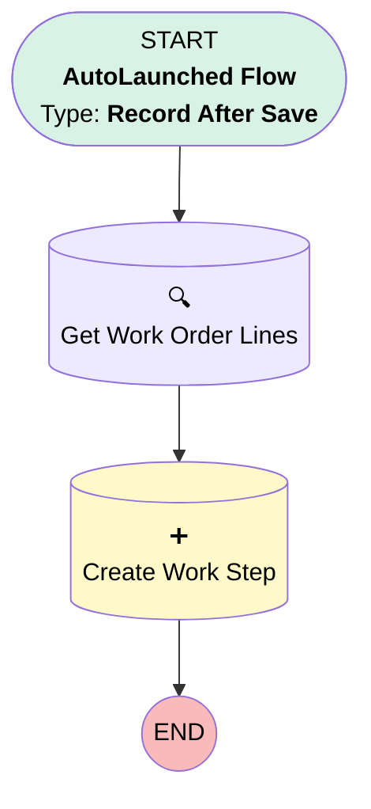

# [Work Plan] - Extra Work Steps

## Flow Diagram

## General Information

|<!-- -->|<!-- -->|
|:---|:---|
|Object|WorkPlan|
|Process Type| Auto Launched Flow|
|Trigger Type| Record After Save|
|Record Trigger Type| Create|
|Label|[Work Plan] - Extra Work Steps|
|Status|Active|
|Filter Formula|{!$Record.WorkPlanTemplate.Name} = 'Extra Work'|
|Environments|Default|
|Interview Label|[Work Plan] - Extra Work Steps {!$Flow.CurrentDateTime}|
| Builder Type (PM)|LightningFlowBuilder|
| Canvas Mode (PM)|AUTO_LAYOUT_CANVAS|
| Origin Builder Type (PM)|LightningFlowBuilder|
|Connector|[Get_Work_Order_Lines](#get_work_order_lines)|
|Next Node|[Get_Work_Order_Lines](#get_work_order_lines)|

## Flow Nodes Details

### Create_Work_Step

|<!-- -->|<!-- -->|
|:---|:---|
|Type|Record Create|
|Object|WorkStep|
|Label|Create Work Step|
|Store Output Automatically|✅|

#### Input Assignments

|Field|Value|
|:-- |:--: |
|Added_from_WOL__c|✅|
|ExecutionOrder|10|
|Name|Get_Work_Order_Lines.Description|
|Status|New|
|WorkPlanId|$Record.Id|
|Work_Order_Line_Item__c|Get_Work_Order_Lines.Id|

### Get_Work_Order_Lines

|<!-- -->|<!-- -->|
|:---|:---|
|Type|Record Lookup|
|Object|WorkOrderLineItem|
|Label|Get Work Order Lines|
|Assign Null Values If No Records Found|⬜|
|Get First Record Only|✅|
|Store Output Automatically|✅|
|Connector|[Create_Work_Step](#create_work_step)|

#### Filters (logic: **and**)

|Filter Id|Field|Operator|Value|
|:-- |:-- |:--:|:--: |
|1|WorkOrderId| Equal To|$Record.WorkOrderId|

___

_Documentation generated from branch monitoring_krinkelsgreencare__upeodev_sandbox by [sfdx-hardis](https://sfdx-hardis.cloudity.com), featuring [salesforce-flow-visualiser](https://github.com/toddhalfpenny/salesforce-flow-visualiser)_